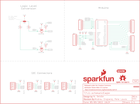

Contents
========

* [PRS14352 > Sparkfun](#prs14352--sparkfun)
	* [Schematic](#schematic)
	* [Interactive BOM](#interactive-bom)
	* [OOMP Parts](#oomp-parts)
	* [Images](#images)
	* [Tags](#tags)
  
![][im]
# PRS14352 > Sparkfun

- ID: PROJ-SPAR-14352-STAN-01
- Hex ID: PRS14352
- Name: Sparkfun
- Description: Sparkfun
- Long Link: [http://oom.lt/PROJ-SPAR-14352-STAN-01](http://oom.lt/PROJ-SPAR-14352-STAN-01)
- Short Link: [http://oom.lt/PRS14352](http://oom.lt/PRS14352)

## Schematic
  

## Interactive BOM

- Interactive BOM page: [ibom.html](https://htmlpreview.github.io/?https://github.com/oomlout/oomlout_OOMP_projects/blob/main/PROJ-SPAR-14352-STAN-01/kicad/bom/ibom.html)

## OOMP Parts
  

|OOMP Parts|
| :---: |
|I2C,UNMATCHED-UNMATCHED-X-UNMATCHED-01,FD1,FIDUCIAL1X2,FIDUCIAL1X2,FIDUCIAL-1X2,Fiducial Alignment Points,,,|
|J1,UNMATCHED-UNMATCHED-X-UNMATCHED-01,FD2,FIDUCIAL1X2,FIDUCIAL1X2,FIDUCIAL-1X2,Fiducial Alignment Points,,,|
|J2,UNMATCHED-UNMATCHED-X-UNMATCHED-01,FD3,FIDUCIAL1X2,FIDUCIAL1X2,FIDUCIAL-1X2,Fiducial Alignment Points,,,|
|J3,UNMATCHED-UNMATCHED-X-UNMATCHED-01,FD4,FIDUCIAL1X2,FIDUCIAL1X2,FIDUCIAL-1X2,Fiducial Alignment Points,,,|
|J4,UNMATCHED-UNMATCHED-X-UNMATCHED-01,FRAME1,FRAME-LETTER,FRAME-LETTER,CREATIVE_COMMONS,Schematic Frame - Letter,,,|
|J6,UNMATCHED-UNMATCHED-X-UNMATCHED-01,I2C,,JUMPER-SMT_3_2-NC_TRACE_SILK,SMT-JUMPER_3_2-NC_TRACE_SILK,Normally closed trace jumper (2 of 2 connections),,,|
|J8,UNMATCHED-UNMATCHED-X-UNMATCHED-01,J1,Qwiic Right Angle,I2C_STANDARDQWIIC,1X04_1MM_RA,SparkFun I2C Standard Pinout Header,CONN-13694,Qwiic Right Angle,|
|J9,UNMATCHED-UNMATCHED-X-UNMATCHED-01,J2,,CONN_08NO_SILK_FEMALE_PTH,1X08_NO_SILK,Multi connection point. Often used as Generic Header-pin footprint for 0.1 inch spaced/style header connections,CONN-08438,,|
|J10,UNMATCHED-UNMATCHED-X-UNMATCHED-01,J3,,CONN_10NO_SILK_PTH_FEMALE,1X10_NO_SILK,Multi connection point. Often used as Generic Header-pin footprint for 0.1 inch spaced/style header connections,CONN-11563,,|
|LOGO2,UNMATCHED-UNMATCHED-X-UNMATCHED-01,J4,,CONN_06NO_SILK_FEMALE_PTH,1X06_NO_SILK,Multi connection point. Often used as Generic Header-pin footprint for 0.1 inch spaced/style header connections,CONN-08437,,|
|Q1,UNMATCHED-SO23-X-KBSS138-01,J6,,CONN_07NO_SILK,1X07_NO_SILK,Multi connection point. Often used as Generic Header-pin footprint for 0.1 inch spaced/style header connections,,,|
|Q2,UNMATCHED-SO23-X-KBSS138-01,J8,Qwiic Right Angle,I2C_STANDARDQWIIC,1X04_1MM_RA,SparkFun I2C Standard Pinout Header,CONN-13694,Qwiic Right Angle,|
|R1,RESE-0603-X-UNMATCHED-01,J9,Qwiic Right Angle,I2C_STANDARDQWIIC,1X04_1MM_RA,SparkFun I2C Standard Pinout Header,CONN-13694,Qwiic Right Angle,|
|R2,RESE-0603-X-UNMATCHED-01,J10,Qwiic Right Angle,I2C_STANDARDQWIIC,1X04_1MM_RA,SparkFun I2C Standard Pinout Header,CONN-13694,Qwiic Right Angle,|
|R3,RESE-0603-X-O472-01,LOGO1,OSHW-LOGOMINI,OSHW-LOGOMINI,OSHW-LOGO-MINI,Open-Source Hardware (OSHW) Logo,,,|
|R4,RESE-0603-X-O472-01,LOGO2,REVISION,REVISION,REVISION,Revision By Text,,,|
|U$3,UNMATCHED-UNMATCHED-X-UNMATCHED-01,LOGO3,QWIIC_LOGO_6MM,QWIIC_LOGO_6MM,QWIIC_6MM,Qwiic Logos for placement on schematic and PCB. The 5.5mm silk logo is best for placing next to Qwiic connector.,,,|
|U1,UNMATCHED-UNMATCHED-X-UNMATCHED-01,Q1,BSS138,MOSFET-NCHANNELBSS138,SOT23-3,Common NMOSFET Parts,TRANS-00830,200mA/50V,|

## Images
  
  

|kicadPcb3d|kicadPcb3dFront|kicadPcb3dBack|eagleImage|eagleSchemImage|
| :---: | :---: | :---: | :---: | :---: |
||||||

## Tags

- hexID: PRS14352
- oompType: PROJ
- oompSize: SPAR
- oompColor: 14352
- oompDesc: STAN
- oompIndex: 01
- oompName: Qwiic Shield for Arduino
- sources: All source files from https://github.com/sparkfun/Qwiic_Shield_for_Arduino (source licence details in srcLicense.md)
- linkBuyPage: https://www.sparkfun.com/products/14352
- oompID: PROJ-SPAR-14352-STAN-01
- oompParts: I2C,UNMATCHED-UNMATCHED-X-UNMATCHED-01
- oompParts: J1,UNMATCHED-UNMATCHED-X-UNMATCHED-01
- oompParts: J2,UNMATCHED-UNMATCHED-X-UNMATCHED-01
- oompParts: J3,UNMATCHED-UNMATCHED-X-UNMATCHED-01
- oompParts: J4,UNMATCHED-UNMATCHED-X-UNMATCHED-01
- oompParts: J6,UNMATCHED-UNMATCHED-X-UNMATCHED-01
- oompParts: J8,UNMATCHED-UNMATCHED-X-UNMATCHED-01
- oompParts: J9,UNMATCHED-UNMATCHED-X-UNMATCHED-01
- oompParts: J10,UNMATCHED-UNMATCHED-X-UNMATCHED-01
- oompParts: LOGO2,UNMATCHED-UNMATCHED-X-UNMATCHED-01
- oompParts: Q1,UNMATCHED-SO23-X-KBSS138-01
- oompParts: Q2,UNMATCHED-SO23-X-KBSS138-01
- oompParts: R1,RESE-0603-X-UNMATCHED-01
- oompParts: R2,RESE-0603-X-UNMATCHED-01
- oompParts: R3,RESE-0603-X-O472-01
- oompParts: R4,RESE-0603-X-O472-01
- oompParts: U$3,UNMATCHED-UNMATCHED-X-UNMATCHED-01
- oompParts: U1,UNMATCHED-UNMATCHED-X-UNMATCHED-01
- rawParts: FD1,FIDUCIAL1X2,FIDUCIAL1X2,FIDUCIAL-1X2,Fiducial Alignment Points,,,
- rawParts: FD2,FIDUCIAL1X2,FIDUCIAL1X2,FIDUCIAL-1X2,Fiducial Alignment Points,,,
- rawParts: FD3,FIDUCIAL1X2,FIDUCIAL1X2,FIDUCIAL-1X2,Fiducial Alignment Points,,,
- rawParts: FD4,FIDUCIAL1X2,FIDUCIAL1X2,FIDUCIAL-1X2,Fiducial Alignment Points,,,
- rawParts: FRAME1,FRAME-LETTER,FRAME-LETTER,CREATIVE_COMMONS,Schematic Frame - Letter,,,
- rawParts: I2C,,JUMPER-SMT_3_2-NC_TRACE_SILK,SMT-JUMPER_3_2-NC_TRACE_SILK,Normally closed trace jumper (2 of 2 connections),,,
- rawParts: J1,Qwiic Right Angle,I2C_STANDARDQWIIC,1X04_1MM_RA,SparkFun I2C Standard Pinout Header,CONN-13694,Qwiic Right Angle,
- rawParts: J2,,CONN_08NO_SILK_FEMALE_PTH,1X08_NO_SILK,Multi connection point. Often used as Generic Header-pin footprint for 0.1 inch spaced/style header connections,CONN-08438,,
- rawParts: J3,,CONN_10NO_SILK_PTH_FEMALE,1X10_NO_SILK,Multi connection point. Often used as Generic Header-pin footprint for 0.1 inch spaced/style header connections,CONN-11563,,
- rawParts: J4,,CONN_06NO_SILK_FEMALE_PTH,1X06_NO_SILK,Multi connection point. Often used as Generic Header-pin footprint for 0.1 inch spaced/style header connections,CONN-08437,,
- rawParts: J6,,CONN_07NO_SILK,1X07_NO_SILK,Multi connection point. Often used as Generic Header-pin footprint for 0.1 inch spaced/style header connections,,,
- rawParts: J8,Qwiic Right Angle,I2C_STANDARDQWIIC,1X04_1MM_RA,SparkFun I2C Standard Pinout Header,CONN-13694,Qwiic Right Angle,
- rawParts: J9,Qwiic Right Angle,I2C_STANDARDQWIIC,1X04_1MM_RA,SparkFun I2C Standard Pinout Header,CONN-13694,Qwiic Right Angle,
- rawParts: J10,Qwiic Right Angle,I2C_STANDARDQWIIC,1X04_1MM_RA,SparkFun I2C Standard Pinout Header,CONN-13694,Qwiic Right Angle,
- rawParts: LOGO1,OSHW-LOGOMINI,OSHW-LOGOMINI,OSHW-LOGO-MINI,Open-Source Hardware (OSHW) Logo,,,
- rawParts: LOGO2,REVISION,REVISION,REVISION,Revision By Text,,,
- rawParts: LOGO3,QWIIC_LOGO_6MM,QWIIC_LOGO_6MM,QWIIC_6MM,Qwiic Logos for placement on schematic and PCB. The 5.5mm silk logo is best for placing next to Qwiic connector.,,,
- rawParts: Q1,BSS138,MOSFET-NCHANNELBSS138,SOT23-3,Common NMOSFET Parts,TRANS-00830,200mA/50V,
- rawParts: Q2,BSS138,MOSFET-NCHANNELBSS138,SOT23-3,Common NMOSFET Parts,TRANS-00830,200mA/50V,
- rawParts: R1,4.7k,4.7KOHM-0603-1/10W-1%,0603,4.7kΩ resistor,RES-07857,4.7k,
- rawParts: R2,4.7k,4.7KOHM-0603-1/10W-1%,0603,4.7kΩ resistor,RES-07857,4.7k,
- rawParts: R3,4.7K,4.7KOHM-1/10W-1%(0603),0603-RES,RES-07857,RES-07857,4.7K,
- rawParts: R4,4.7K,4.7KOHM-1/10W-1%(0603),0603-RES,RES-07857,RES-07857,4.7K,
- rawParts: U$2,SFE_LOGO_NAME_FLAME.1_INCH,SFE_LOGO_NAME_FLAME.1_INCH,SFE_LOGO_NAME_FLAME_.1,SparkFun Font Logo w/ Flame,,,
- rawParts: U$3,QWIIC_BOARD_OUTLINEH,QWIIC_BOARD_OUTLINEH,QWIIC_BOARD_MOUNT_HOLES,Standard Outline of a Qwiic Board. Good for defining a spot on shields and board areas in which to mount a Qwiic Board.,,,
- rawParts: U1,ARDUINO UNO,ARDUINO_R3_SHIELDNOLABELS,UNO_R3_SHIELD_NOLABELS,Shield form compatible with the Arduino Uno R3.,,,

[im]: kicadPcb3d_450.png
