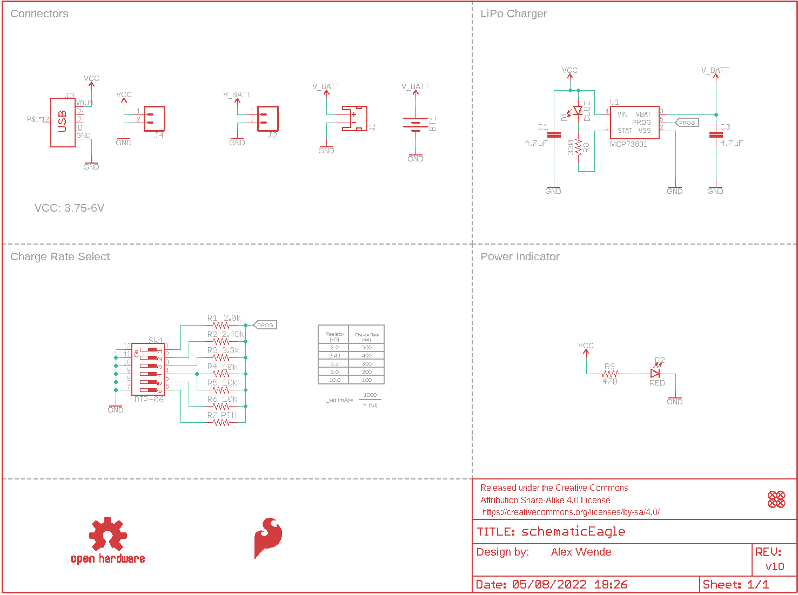
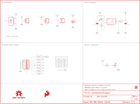

Contents
========

* [PRS14380 > Sparkfun](#prs14380--sparkfun)
	* [Schematic](#schematic)
	* [Interactive BOM](#interactive-bom)
	* [OOMP Parts](#oomp-parts)
	* [Images](#images)
	* [Tags](#tags)
  
![][im]
# PRS14380 > Sparkfun

- ID: PROJ-SPAR-14380-STAN-01
- Hex ID: PRS14380
- Name: Sparkfun
- Description: Sparkfun
- Long Link: [http://oom.lt/PROJ-SPAR-14380-STAN-01](http://oom.lt/PROJ-SPAR-14380-STAN-01)
- Short Link: [http://oom.lt/PRS14380](http://oom.lt/PRS14380)

## Schematic
  

## Interactive BOM

- Interactive BOM page: [ibom.html](https://htmlpreview.github.io/?https://github.com/oomlout/oomlout_OOMP_projects/blob/main/PROJ-SPAR-14380-STAN-01/kicad/bom/ibom.html)

## OOMP Parts
  

|OOMP Parts|
| :---: |
|BT1,UNMATCHED-UNMATCHED-X-UNMATCHED-01,BT1,,BATTERY-24.5MM_SMD,BATTCON_24.5MM_SMD,Battery - Single Cell,PRT-13755,,,|
|C1,CAPC-0603-X-UNMATCHED-01,C1,4.7uF,4.7UF0603,0603,4.7µF ceramic capacitors,CAP-08280,,4.7uF,|
|C3,CAPC-0603-X-UNMATCHED-01,C3,4.7uF,4.7UF0603,0603,4.7µF ceramic capacitors,CAP-08280,,4.7uF,|
|D1,LEDS-0603-G-STAN-01,D1,BLUE,LED-BLUE0603,LED-0603,Blue SMD LED,DIO-08575,,BLUE,|
|D2,LEDS-0603-G-STAN-01,D2,RED,LED-RED0603,LED-0603,Red SMD LED,DIO-00819,,RED,|
|J1,UNMATCHED-UNMATCHED-X-UNMATCHED-01,FD1,FIDUCIALUFIDUCIAL,FIDUCIALUFIDUCIAL,FIDUCIAL-MICRO,Fiducial Alignment Points,,,,|
|J2,UNMATCHED-UNMATCHED-X-UNMATCHED-01,FD2,FIDUCIALUFIDUCIAL,FIDUCIALUFIDUCIAL,FIDUCIAL-MICRO,Fiducial Alignment Points,,,,|
|J3,UNMATCHED-UNMATCHED-X-UNMATCHED-01,FD3,FIDUCIALUFIDUCIAL,FIDUCIALUFIDUCIAL,FIDUCIAL-MICRO,Fiducial Alignment Points,,,,|
|J4,UNMATCHED-UNMATCHED-X-UNMATCHED-01,FD4,FIDUCIALUFIDUCIAL,FIDUCIALUFIDUCIAL,FIDUCIAL-MICRO,Fiducial Alignment Points,,,,|
|R1,RESE-0603-X-UNMATCHED-01,FRAME1,FRAME-LETTER,FRAME-LETTER,CREATIVE_COMMONS,Schematic Frame - Letter,,,,|
|R2,RESE-0603-X-UNMATCHED-01,J1,,JST_2MM_MALE,JST-2-SMD,JST 2MM MALE RA CONNECTOR,CONN-11443,PRT-08612,,|
|R3,RESE-0603-X-UNMATCHED-01,J2,,CONN_021X02_NO_SILK,1X02_NO_SILK,Multi connection point. Often used as Generic Header-pin footprint for 0.1 inch spaced/style header connections,,,,|
|R4,RESE-0603-X-O103-01,J3,,USB_MICRO-B_HALF_PTH,USB-MICROB-PTH,USB Type Micro-B Connector,CONN-13711,,AMP FCI 10103594-0001LF,|
|R5,RESE-0603-X-O103-01,J4,,CONN_021X02_NO_SILK,1X02_NO_SILK,Multi connection point. Often used as Generic Header-pin footprint for 0.1 inch spaced/style header connections,,,,|
|R6,RESE-0603-X-O103-01,LOGO1,SFE_LOGO_FLAME.1_INCH,SFE_LOGO_FLAME.1_INCH,SFE_LOGO_FLAME_.1,SparkFun Flame Logo,,,,|
|R7,RESE-UNMATCHED-X-UNMATCHED-01,LOGO2,OSHW-LOGOS,OSHW-LOGOS,OSHW-LOGO-S,Open-Source Hardware (OSHW) Logo,,,,|
|R8,RESE-0603-X-O331-01,R1,2.0k,2.0KOHM-0603-1/10W-5%,0603,2kΩ resistor,RES-08296,,2.0k,|
|R9,RESE-0603-X-O471-01,R2,2.49k,2.49KOHM-0603-1/10W-1%,0603,2.49kΩ resistor,RES-09568,,2.49k,|
|SW1,UNMATCHED-UNMATCHED-X-UNMATCHED-01,R3,3.3k,3.3KOHM-0603-1/10W-1%,0603,3.3kΩ resistor,RES-07851,,3.3k,|
|U1,UNMATCHED-SO235-X-UNMATCHED-01,R4,10k,10KOHM-0603-1/10W-1%,0603,10kΩ resistor,RES-00824,,10k,|

## Images
  
  

|kicadPcb3d|kicadPcb3dFront|kicadPcb3dBack|eagleImage|eagleSchemImage|
| :---: | :---: | :---: | :---: | :---: |
||||||

## Tags

- hexID: PRS14380
- oompType: PROJ
- oompSize: SPAR
- oompColor: 14380
- oompDesc: STAN
- oompIndex: 01
- oompName: Adjustable Lipo Charger
- sources: All source files from https://github.com/sparkfun/Adjustable_Lipo_Charger (source licence details in srcLicense.md)
- linkBuyPage: https://www.sparkfun.com/products/14380
- oompID: PROJ-SPAR-14380-STAN-01
- oompParts: BT1,UNMATCHED-UNMATCHED-X-UNMATCHED-01
- oompParts: C1,CAPC-0603-X-UNMATCHED-01
- oompParts: C3,CAPC-0603-X-UNMATCHED-01
- oompParts: D1,LEDS-0603-G-STAN-01
- oompParts: D2,LEDS-0603-G-STAN-01
- oompParts: J1,UNMATCHED-UNMATCHED-X-UNMATCHED-01
- oompParts: J2,UNMATCHED-UNMATCHED-X-UNMATCHED-01
- oompParts: J3,UNMATCHED-UNMATCHED-X-UNMATCHED-01
- oompParts: J4,UNMATCHED-UNMATCHED-X-UNMATCHED-01
- oompParts: R1,RESE-0603-X-UNMATCHED-01
- oompParts: R2,RESE-0603-X-UNMATCHED-01
- oompParts: R3,RESE-0603-X-UNMATCHED-01
- oompParts: R4,RESE-0603-X-O103-01
- oompParts: R5,RESE-0603-X-O103-01
- oompParts: R6,RESE-0603-X-O103-01
- oompParts: R7,RESE-UNMATCHED-X-UNMATCHED-01
- oompParts: R8,RESE-0603-X-O331-01
- oompParts: R9,RESE-0603-X-O471-01
- oompParts: SW1,UNMATCHED-UNMATCHED-X-UNMATCHED-01
- oompParts: U1,UNMATCHED-SO235-X-UNMATCHED-01
- rawParts: BT1,,BATTERY-24.5MM_SMD,BATTCON_24.5MM_SMD,Battery - Single Cell,PRT-13755,,,
- rawParts: C1,4.7uF,4.7UF0603,0603,4.7µF ceramic capacitors,CAP-08280,,4.7uF,
- rawParts: C3,4.7uF,4.7UF0603,0603,4.7µF ceramic capacitors,CAP-08280,,4.7uF,
- rawParts: D1,BLUE,LED-BLUE0603,LED-0603,Blue SMD LED,DIO-08575,,BLUE,
- rawParts: D2,RED,LED-RED0603,LED-0603,Red SMD LED,DIO-00819,,RED,
- rawParts: FD1,FIDUCIALUFIDUCIAL,FIDUCIALUFIDUCIAL,FIDUCIAL-MICRO,Fiducial Alignment Points,,,,
- rawParts: FD2,FIDUCIALUFIDUCIAL,FIDUCIALUFIDUCIAL,FIDUCIAL-MICRO,Fiducial Alignment Points,,,,
- rawParts: FD3,FIDUCIALUFIDUCIAL,FIDUCIALUFIDUCIAL,FIDUCIAL-MICRO,Fiducial Alignment Points,,,,
- rawParts: FD4,FIDUCIALUFIDUCIAL,FIDUCIALUFIDUCIAL,FIDUCIAL-MICRO,Fiducial Alignment Points,,,,
- rawParts: FRAME1,FRAME-LETTER,FRAME-LETTER,CREATIVE_COMMONS,Schematic Frame - Letter,,,,
- rawParts: J1,,JST_2MM_MALE,JST-2-SMD,JST 2MM MALE RA CONNECTOR,CONN-11443,PRT-08612,,
- rawParts: J2,,CONN_021X02_NO_SILK,1X02_NO_SILK,Multi connection point. Often used as Generic Header-pin footprint for 0.1 inch spaced/style header connections,,,,
- rawParts: J3,,USB_MICRO-B_HALF_PTH,USB-MICROB-PTH,USB Type Micro-B Connector,CONN-13711,,AMP FCI 10103594-0001LF,
- rawParts: J4,,CONN_021X02_NO_SILK,1X02_NO_SILK,Multi connection point. Often used as Generic Header-pin footprint for 0.1 inch spaced/style header connections,,,,
- rawParts: LOGO1,SFE_LOGO_FLAME.1_INCH,SFE_LOGO_FLAME.1_INCH,SFE_LOGO_FLAME_.1,SparkFun Flame Logo,,,,
- rawParts: LOGO2,OSHW-LOGOS,OSHW-LOGOS,OSHW-LOGO-S,Open-Source Hardware (OSHW) Logo,,,,
- rawParts: R1,2.0k,2.0KOHM-0603-1/10W-5%,0603,2kΩ resistor,RES-08296,,2.0k,
- rawParts: R2,2.49k,2.49KOHM-0603-1/10W-1%,0603,2.49kΩ resistor,RES-09568,,2.49k,
- rawParts: R3,3.3k,3.3KOHM-0603-1/10W-1%,0603,3.3kΩ resistor,RES-07851,,3.3k,
- rawParts: R4,10k,10KOHM-0603-1/10W-1%,0603,10kΩ resistor,RES-00824,,10k,
- rawParts: R5,10k,10KOHM-0603-1/10W-1%,0603,10kΩ resistor,RES-00824,,10k,
- rawParts: R6,10k,10KOHM-0603-1/10W-1%,0603,10kΩ resistor,RES-00824,,10k,
- rawParts: R7,PTH,RESISTORAXIAL-0.3,AXIAL-0.3,Generic Resistor Package, ,, ,
- rawParts: R8,330,330OHM-0603-1/10W-1%,0603,330Ω resistor,RES-00818,,330,
- rawParts: R9,470,470OHM-0603-1/10W-1%,0603,470Ω resistor,RES-07869,,470,
- rawParts: SW1,DIP-06,DIP-06,DIPSWITCH-06-SMD,,SWCH-13756,,,
- rawParts: U1,MCP73831,MCP73831,SOT23-5,MCP73831T Li-Ion, Li-Pol Controller,IC-09995,,,

[im]: kicadPcb3d_450.png
