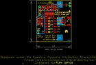
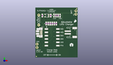
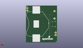
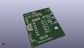

Contents
========

* [PROJ-SPAR-14380-STAN-01>Adjustable Lipo Charger](#proj-spar-14380-stan-01adjustable-lipo-charger)
	* [Images](#images)
	* [Interactive BOM](#interactive-bom)
	* [OOMP Parts](#oomp-parts)
	* [Tags](#tags)
  
![][im]
# PROJ-SPAR-14380-STAN-01>Adjustable Lipo Charger

- ID: PROJ-SPAR-14380-STAN-01
- Hex ID: PRS14380
- Name: Adjustable Lipo Charger
- Description: 

## Images
  
  

|eagleImage|kicadPcb3dFront|kicadPcb3dBack|kicadPcb3d|
| :---: | :---: | :---: | :---: |
|||||

## Interactive BOM

- Interactive BOM page: [ibom.html](kicad/bom/ibom.html)

## OOMP Parts
  

|OOMP Parts|
| :---: |
|UNMATCHED-UNMATCHED-X-UNMATCHED-01, BT1, 21.209, 19.049999999999997, M90,BT1, BATTCON_24.5MM_SMD, SparkFun-Batteries, (0.835, 0.75), MR90|
|CAPC-0603-X-UNMATCHED-01, C1, 5.206999999999999, 32.004, 270,C1, 4.7uF, 0603, SparkFun-Capacitors, (0.205, 1.26), R270|
|CAPC-0603-X-UNMATCHED-01, C3, 11.557, 32.004, 270,C3, 4.7uF, 0603, SparkFun-Capacitors, (0.455, 1.26), R270|
|UNMATCHED-0603-X-UNMATCHED-01, D1, 13.97, 32.004, S90,D1, BLUE, LED-0603, SparkFun-LED, (0.55, 1.26), SR90|
|UNMATCHED-0603-X-UNMATCHED-01, D2, 18.541999999999998, 32.004, 270,D2, RED, LED-0603, SparkFun-LED, (0.73, 1.26), R270|
|UNMATCHED-UNMATCHED-X-UNMATCHED-01, J1, 28.066999999999997, 19.049999999999997, 270,J1, JST-2-SMD, SparkFun-Connectors, (1.105, 0.75), R270|
|UNMATCHED-UNMATCHED-X-UNMATCHED-01, J2, 30.479999999999997, 33.019999999999996, 90,J2, 1X02_NO_SILK, SparkFun-Connectors, (1.2, 1.3), R90|
|UNMATCHED-UNMATCHED-X-UNMATCHED-01, J3, 3.0479999999999996, 19.049999999999997, 270,J3, USB-MICROB-PTH, SparkFun-Connectors, (0.12, 0.75), R270|
|UNMATCHED-UNMATCHED-X-UNMATCHED-01, J4, 1.27, 7.619999999999999, 90,J4, 1X02_NO_SILK, SparkFun-Connectors, (0.05, 0.3), R90|
|RESE-0603-X-UNMATCHED-01, R1, 8.128, 25.907999999999998, 90,R1, 2.0k, 0603, SparkFun-Resistors, (0.32, 1.02), R90|
|RESE-0603-X-UNMATCHED-01, R2, 9.652, 25.907999999999998, 90,R2, 2.49k, 0603, SparkFun-Resistors, (0.38, 1.02), R90|
|RESE-0603-X-UNMATCHED-01, R3, 11.176, 25.907999999999998, 90,R3, 3.3k, 0603, SparkFun-Resistors, (0.44, 1.02), R90|
|<table><tr><td></td><td> R4</td><td>[RESE-0603-X-O103-01 SMD (0603) 10k Ohm Resistor](https://github.com/oomlout/oomlout_OOMP_parts/tree/main/RESE-0603-X-O103-01/)</td><td>[R6103](https://github.com/oomlout/oomlout_OOMP_parts/tree/main/RESE-0603-X-O103-01/)</td></tr></table>|
|<table><tr><td></td><td> R5</td><td>[RESE-0603-X-O103-01 SMD (0603) 10k Ohm Resistor](https://github.com/oomlout/oomlout_OOMP_parts/tree/main/RESE-0603-X-O103-01/)</td><td>[R6103](https://github.com/oomlout/oomlout_OOMP_parts/tree/main/RESE-0603-X-O103-01/)</td></tr></table>|
|<table><tr><td></td><td> R6</td><td>[RESE-0603-X-O103-01 SMD (0603) 10k Ohm Resistor](https://github.com/oomlout/oomlout_OOMP_parts/tree/main/RESE-0603-X-O103-01/)</td><td>[R6103](https://github.com/oomlout/oomlout_OOMP_parts/tree/main/RESE-0603-X-O103-01/)</td></tr></table>|
|RESE-UNMATCHED-X-UNMATCHED-01, R7, 2.54, 28.575, 90,R7, PTH, AXIAL-0.3, SparkFun-Resistors, (0.1, 1.125), R90|
|<table><tr><td></td><td> R8</td><td>[RESE-0603-X-O331-01 SMD (0603) 330 Ohm Resistor](https://github.com/oomlout/oomlout_OOMP_parts/tree/main/RESE-0603-X-O331-01/)</td><td>[R6331](https://github.com/oomlout/oomlout_OOMP_parts/tree/main/RESE-0603-X-O331-01/)</td></tr></table>|
|RESE-0603-X-UNMATCHED-01, R9, 17.018, 32.004, 270,R9, 470, 0603, SparkFun-Resistors, (0.67, 1.26), R270|
|UNMATCHED-UNMATCHED-X-UNMATCHED-01, SW1, 12.572999999999999, 15.366999999999999, 270,SW1, DIP-06, DIPSWITCH-06-SMD, SparkFun-Switches, (0.495, 0.605), R270|
|UNMATCHED-UNMATCHED-X-UNMATCHED-01, U1, 8.636000000000001, 32.004, 90,U1, MCP73831, SOT23-5, SparkFun-IC-Power, (0.34, 1.26), R90|

## Tags

- hexID: PRS14380
- oompType: PROJ
- oompSize: SPAR
- oompColor: 14380
- oompDesc: STAN
- oompIndex: 01
- oompName: Adjustable Lipo Charger
- sources: All source files from https://github.com/sparkfun/Adjustable_Lipo_Charger (source licence details in srcLicense.md)
- linkBuyPage: https://www.sparkfun.com/products/14380
- oompPart: UNMATCHED-UNMATCHED-X-UNMATCHED-01, BT1, 21.209, 19.049999999999997, M90
- oompPart: CAPC-0603-X-UNMATCHED-01, C1, 5.206999999999999, 32.004, 270
- oompPart: CAPC-0603-X-UNMATCHED-01, C3, 11.557, 32.004, 270
- oompPart: UNMATCHED-0603-X-UNMATCHED-01, D1, 13.97, 32.004, S90
- oompPart: UNMATCHED-0603-X-UNMATCHED-01, D2, 18.541999999999998, 32.004, 270
- oompPart: SKIP-UNMATCHED-X-UNMATCHED-01, FD1, 30.987999999999996, 37.337999999999994, 0
- oompPart: SKIP-UNMATCHED-X-UNMATCHED-01, FD2, 0.7619999999999999, 0.7619999999999999, 0
- oompPart: SKIP-UNMATCHED-X-UNMATCHED-01, FD3, 0.7619999999999999, 0.7619999999999999, M0
- oompPart: SKIP-UNMATCHED-X-UNMATCHED-01, FD4, 30.987999999999996, 37.337999999999994, M0
- oompPart: UNMATCHED-UNMATCHED-X-UNMATCHED-01, J1, 28.066999999999997, 19.049999999999997, 270
- oompPart: UNMATCHED-UNMATCHED-X-UNMATCHED-01, J2, 30.479999999999997, 33.019999999999996, 90
- oompPart: UNMATCHED-UNMATCHED-X-UNMATCHED-01, J3, 3.0479999999999996, 19.049999999999997, 270
- oompPart: UNMATCHED-UNMATCHED-X-UNMATCHED-01, J4, 1.27, 7.619999999999999, 90
- oompPart: RESE-0603-X-UNMATCHED-01, R1, 8.128, 25.907999999999998, 90
- oompPart: RESE-0603-X-UNMATCHED-01, R2, 9.652, 25.907999999999998, 90
- oompPart: RESE-0603-X-UNMATCHED-01, R3, 11.176, 25.907999999999998, 90
- oompPart: RESE-0603-X-O103-01, R4, 12.7, 25.907999999999998, 90
- oompPart: RESE-0603-X-O103-01, R5, 14.224, 25.907999999999998, 90
- oompPart: RESE-0603-X-O103-01, R6, 15.748, 25.907999999999998, 90
- oompPart: RESE-UNMATCHED-X-UNMATCHED-01, R7, 2.54, 28.575, 90
- oompPart: RESE-0603-X-O331-01, R8, 15.493999999999998, 32.004, 90
- oompPart: RESE-0603-X-UNMATCHED-01, R9, 17.018, 32.004, 270
- oompPart: UNMATCHED-UNMATCHED-X-UNMATCHED-01, SW1, 12.572999999999999, 15.366999999999999, 270
- oompPart: UNMATCHED-UNMATCHED-X-UNMATCHED-01, U1, 8.636000000000001, 32.004, 90
- rawPart: BT1, BATTCON_24.5MM_SMD, SparkFun-Batteries, (0.835, 0.75), MR90
- rawPart: C1, 4.7uF, 0603, SparkFun-Capacitors, (0.205, 1.26), R270
- rawPart: C3, 4.7uF, 0603, SparkFun-Capacitors, (0.455, 1.26), R270
- rawPart: D1, BLUE, LED-0603, SparkFun-LED, (0.55, 1.26), SR90
- rawPart: D2, RED, LED-0603, SparkFun-LED, (0.73, 1.26), R270
- rawPart: FD1, FIDUCIALUFIDUCIAL, FIDUCIAL-MICRO, SparkFun-Aesthetics, (1.22, 1.47), R0
- rawPart: FD2, FIDUCIALUFIDUCIAL, FIDUCIAL-MICRO, SparkFun-Aesthetics, (0.03, 0.03), R0
- rawPart: FD3, FIDUCIALUFIDUCIAL, FIDUCIAL-MICRO, SparkFun-Aesthetics, (0.03, 0.03), MR0
- rawPart: FD4, FIDUCIALUFIDUCIAL, FIDUCIAL-MICRO, SparkFun-Aesthetics, (1.22, 1.47), MR0
- rawPart: J1, JST-2-SMD, SparkFun-Connectors, (1.105, 0.75), R270
- rawPart: J2, 1X02_NO_SILK, SparkFun-Connectors, (1.2, 1.3), R90
- rawPart: J3, USB-MICROB-PTH, SparkFun-Connectors, (0.12, 0.75), R270
- rawPart: J4, 1X02_NO_SILK, SparkFun-Connectors, (0.05, 0.3), R90
- rawPart: R1, 2.0k, 0603, SparkFun-Resistors, (0.32, 1.02), R90
- rawPart: R2, 2.49k, 0603, SparkFun-Resistors, (0.38, 1.02), R90
- rawPart: R3, 3.3k, 0603, SparkFun-Resistors, (0.44, 1.02), R90
- rawPart: R4, 10k, 0603, SparkFun-Resistors, (0.5, 1.02), R90
- rawPart: R5, 10k, 0603, SparkFun-Resistors, (0.56, 1.02), R90
- rawPart: R6, 10k, 0603, SparkFun-Resistors, (0.62, 1.02), R90
- rawPart: R7, PTH, AXIAL-0.3, SparkFun-Resistors, (0.1, 1.125), R90
- rawPart: R8, 330, 0603, SparkFun-Resistors, (0.61, 1.26), R90
- rawPart: R9, 470, 0603, SparkFun-Resistors, (0.67, 1.26), R270
- rawPart: SW1, DIP-06, DIPSWITCH-06-SMD, SparkFun-Switches, (0.495, 0.605), R270
- rawPart: U1, MCP73831, SOT23-5, SparkFun-IC-Power, (0.34, 1.26), R90
- oompID: PROJ-SPAR-14380-STAN-01

[im]: kicadPcb3d_450.png
