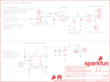
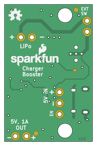

Contents
========

* [PRS14411 > LiPo Charger Booster 5V 1A](#prs14411--lipo-charger-booster-5v-1a)
	* [Schematic](#schematic)
	* [PCB](#pcb)
	* [Interactive BOM](#interactive-bom)
	* [OOMP Parts](#oomp-parts)
	* [Images](#images)
	* [Tags](#tags)
  
![][im]
# PRS14411 > LiPo Charger Booster 5V 1A

- ID: PROJ-SPAR-14411-STAN-01
- Hex ID: PRS14411
- Name: Sparkfun
- Description: Sparkfun
- Long Link: [http://oom.lt/PROJ-SPAR-14411-STAN-01](http://oom.lt/PROJ-SPAR-14411-STAN-01)
- Short Link: [http://oom.lt/PRS14411](http://oom.lt/PRS14411)

## Schematic
  

## PCB
  

## Interactive BOM

- Interactive BOM page: [ibom.html](https://htmlpreview.github.io/?https://github.com/oomlout/oomlout_OOMP_projects/blob/main/PROJ-SPAR-14411-STAN-01/kicad/bom/ibom.html)

## OOMP Parts
  

|OOMP ID|Name|Identifier|
| :---: | :---: | :---: |
|[CAPC-0805-X-UF22-V63D](https://github.com/oomlout/oomlout_OOMP_parts/tree/main/CAPC-0805-X-UF22-V63D/)|[SMD (0805) 22 uF Capacitor (Ceramic) 6.3v](https://github.com/oomlout/oomlout_OOMP_parts/tree/main/CAPC-0805-X-UF22-V63D/)|[C1, C2, C3](https://github.com/oomlout/oomlout_OOMP_parts/tree/main/CAPC-0805-X-UF22-V63D/)|
|[CAPC-0603-X-UF47D-V10](https://github.com/oomlout/oomlout_OOMP_parts/tree/main/CAPC-0603-X-UF47D-V10/)|[SMD (0603) 4.7 uF Capacitor (Ceramic) 10v](https://github.com/oomlout/oomlout_OOMP_parts/tree/main/CAPC-0603-X-UF47D-V10/)|[C9, C10](https://github.com/oomlout/oomlout_OOMP_parts/tree/main/CAPC-0603-X-UF47D-V10/)|
|DIOD-UNMATCHED-X-UNMATCHED-01||D1, D2|
|[LEDS-0603-R-STAN-01](https://github.com/oomlout/oomlout_OOMP_parts/tree/main/LEDS-0603-R-STAN-01/)|[SMD (0603) Red LED](https://github.com/oomlout/oomlout_OOMP_parts/tree/main/LEDS-0603-R-STAN-01/)|[D3](https://github.com/oomlout/oomlout_OOMP_parts/tree/main/LEDS-0603-R-STAN-01/)|
|[LEDS-0603-L-STAN-01](https://github.com/oomlout/oomlout_OOMP_parts/tree/main/LEDS-0603-L-STAN-01/)|[SMD (0603) Blue LED](https://github.com/oomlout/oomlout_OOMP_parts/tree/main/LEDS-0603-L-STAN-01/)|[D4](https://github.com/oomlout/oomlout_OOMP_parts/tree/main/LEDS-0603-L-STAN-01/)|
|UNMATCHED-UNMATCHED-X-UNMATCHED-01||J1, L1, S2, U2|
|[HEAD-I01-X-PI02-01](https://github.com/oomlout/oomlout_OOMP_parts/tree/main/HEAD-I01-X-PI02-01/)|[2.54 mm 2 Pin Header](https://github.com/oomlout/oomlout_OOMP_parts/tree/main/HEAD-I01-X-PI02-01/)|[J2, J3, J5, J7](https://github.com/oomlout/oomlout_OOMP_parts/tree/main/HEAD-I01-X-PI02-01/)|
|HEAD-I01-X-UNMATCHED-01||J4|
|HEAD-I01-X-PI01-01||J6|
|RESE-0603-X-O1003-01||R1|
|RESE-0603-X-O7503-01||R2, R4|
|RESE-0603-X-UNMATCHED-01||R3|
|[RESE-0603-X-O472-01](https://github.com/oomlout/oomlout_OOMP_parts/tree/main/RESE-0603-X-O472-01/)|[SMD (0603) 4.7k Ohm Resistor](https://github.com/oomlout/oomlout_OOMP_parts/tree/main/RESE-0603-X-O472-01/)|[R6](https://github.com/oomlout/oomlout_OOMP_parts/tree/main/RESE-0603-X-O472-01/)|
|[RESE-0603-X-O102-01](https://github.com/oomlout/oomlout_OOMP_parts/tree/main/RESE-0603-X-O102-01/)|[SMD (0603) 1k Ohm Resistor](https://github.com/oomlout/oomlout_OOMP_parts/tree/main/RESE-0603-X-O102-01/)|[R9](https://github.com/oomlout/oomlout_OOMP_parts/tree/main/RESE-0603-X-O102-01/)|
|UNMATCHED-0603-X-UNMATCHED-01||RPROG|
|UNMATCHED-SO235-X-UNMATCHED-01||U1|

## Images
  
  

|bominteractivefront|bominteractiveback|kicadPcb3d|kicadPcb3dFront|kicadPcb3dBack|eagleImage|eagleSchemImage|pcbdraw|pcbdrawback|
| :---: | :---: | :---: | :---: | :---: | :---: | :---: | :---: | :---: |
||||||||||

## Tags

- hexID: PRS14411
- oompType: PROJ
- oompSize: SPAR
- oompColor: 14411
- oompDesc: STAN
- oompIndex: 01
- oompName: LiPo Charger Booster 5V 1A
- sources: All source files from https://github.com/sparkfun/LiPo_Charger_Booster_5V_1A (source licence details in srcLicense.md)
- linkBuyPage: https://www.sparkfun.com/products/14411
- oompID: PROJ-SPAR-14411-STAN-01
- oompParts: C1,CAPC-0805-X-UF22-V63D
- oompParts: C2,CAPC-0805-X-UF22-V63D
- oompParts: C3,CAPC-0805-X-UF22-V63D
- oompParts: C9,CAPC-0603-X-UF47D-V10
- oompParts: C10,CAPC-0603-X-UF47D-V10
- oompParts: D1,DIOD-UNMATCHED-X-UNMATCHED-01
- oompParts: D2,DIOD-UNMATCHED-X-UNMATCHED-01
- oompParts: D3,LEDS-0603-R-STAN-01
- oompParts: D4,LEDS-0603-L-STAN-01
- oompParts: J1,UNMATCHED-UNMATCHED-X-UNMATCHED-01
- oompParts: J2,HEAD-I01-X-PI02-01
- oompParts: J3,HEAD-I01-X-PI02-01
- oompParts: J4,HEAD-I01-X-UNMATCHED-01
- oompParts: J5,HEAD-I01-X-PI02-01
- oompParts: J6,HEAD-I01-X-PI01-01
- oompParts: J7,HEAD-I01-X-PI02-01
- oompParts: L1,UNMATCHED-UNMATCHED-X-UNMATCHED-01
- oompParts: R1,RESE-0603-X-O1003-01
- oompParts: R2,RESE-0603-X-O7503-01
- oompParts: R3,RESE-0603-X-UNMATCHED-01
- oompParts: R4,RESE-0603-X-O7503-01
- oompParts: R6,RESE-0603-X-O472-01
- oompParts: R9,RESE-0603-X-O102-01
- oompParts: RPROG,UNMATCHED-0603-X-UNMATCHED-01
- oompParts: S2,UNMATCHED-UNMATCHED-X-UNMATCHED-01
- oompParts: U1,UNMATCHED-SO235-X-UNMATCHED-01
- oompParts: U2,UNMATCHED-UNMATCHED-X-UNMATCHED-01
- rawParts: C1,22uF,22UF-0805-6.3V-20%,0805,22µF ceramic capacitors,CAP-08402,,22uF,
- rawParts: C2,22uF,22UF-0805-6.3V-20%,0805,22µF ceramic capacitors,CAP-08402,,22uF,
- rawParts: C3,22uF,22UF-0805-6.3V-20%,0805,22µF ceramic capacitors,CAP-08402,,22uF,
- rawParts: C9,4.7uF,4.7UF0603,0603,4.7µF ceramic capacitors,CAP-08280,,4.7uF,
- rawParts: C10,4.7uF,4.7UF0603,0603,4.7µF ceramic capacitors,CAP-08280,,4.7uF,
- rawParts: D1,3A/40V/500mV,DIODE-SCHOTTKY-B340A,SMA-DIODE,Schottky diode,DIO-09886,,3A/40V/500mV,
- rawParts: D2,3A/40V/500mV,DIODE-SCHOTTKY-B340A,SMA-DIODE,Schottky diode,DIO-09886,,3A/40V/500mV,
- rawParts: D3,RED,LED-RED0603,LED-0603,Red SMD LED,DIO-00819,,RED,
- rawParts: D4,BLUE,LED-BLUE0603,LED-0603,Blue SMD LED,DIO-08575,,BLUE,
- rawParts: FRAME1,FRAME-LETTER,FRAME-LETTER,CREATIVE_COMMONS,Schematic Frame - Letter,,,,
- rawParts: J1,AMP FCI 10103594-0001LF,USB_MICRO-B_HALF_PTH,USB-MICROB-PTH,USB Type Micro-B Connector,CONN-13711,,AMP FCI 10103594-0001LF,
- rawParts: J2,PTH,CONN_02,1X02,Multi connection point. Often used as Generic Header-pin footprint for 0.1 inch spaced/style header connections,,,,
- rawParts: J3,PTH,CONN_02,1X02,Multi connection point. Often used as Generic Header-pin footprint for 0.1 inch spaced/style header connections,,,,
- rawParts: J4,JST,CONN_02-JST-2MM-SMT,JST-2-SMD,Multi connection point. Often used as Generic Header-pin footprint for 0.1 inch spaced/style header connections,CONN-11443,,,
- rawParts: J5,,CONN_02,1X02,Multi connection point. Often used as Generic Header-pin footprint for 0.1 inch spaced/style header connections,,,,
- rawParts: J6,,CONN_01,1X01,Single connection point. Often used as Generic Header-pin footprint for 0.1 inch spaced/style header connections,,,,
- rawParts: J7,PTH,CONN_02,1X02,Multi connection point. Often used as Generic Header-pin footprint for 0.1 inch spaced/style header connections,,,,
- rawParts: JP1,FIDUCIAL1X2,FIDUCIAL1X2,FIDUCIAL-1X2,Fiducial Alignment Points,,,,
- rawParts: JP2,FIDUCIAL1X2,FIDUCIAL1X2,FIDUCIAL-1X2,Fiducial Alignment Points,,,,
- rawParts: JP3,SFE_LOGO_NAME_FLAME.1_INCH,SFE_LOGO_NAME_FLAME.1_INCH,SFE_LOGO_NAME_FLAME_.1,SparkFun Font Logo w/ Flame,,,,
- rawParts: JP4,FIDUCIAL1X2,FIDUCIAL1X2,FIDUCIAL-1X2,Fiducial Alignment Points,,,,
- rawParts: JP6,STAND-OFF,STAND-OFF,STAND-OFF,Stand Off,,,,
- rawParts: JP7,STAND-OFF,STAND-OFF,STAND-OFF,Stand Off,,,,
- rawParts: JP16,FIDUCIAL1X2,FIDUCIAL1X2,FIDUCIAL-1X2,Fiducial Alignment Points,,,,
- rawParts: L1,2.2UH3A,INDUCTOR-IFSC1515AHER2R2M01,INDUCTOR_4X4MM,Inductors,NDUC-13770,,2.2UH3A,
- rawParts: LOGO1,SFE_LOGO_FLAME.1_INCH,SFE_LOGO_FLAME.1_INCH,SFE_LOGO_FLAME_.1,SparkFun Flame Logo,,,,
- rawParts: R1,100k,100KOHM-0603-1/10W-1%,0603,100kΩ resistor,RES-07828,,100k,
- rawParts: R2,750K,750KOHM-0603-1/10W-1%,0603,750Ω resistor,RES-13768,,750K,
- rawParts: R3,DNP,100KOHM-0603-1/10W-1%,0603,100kΩ resistor,RES-07828,,100k,
- rawParts: R4,750K,750KOHM-0603-1/10W-1%,0603,750Ω resistor,RES-13768,,750K,
- rawParts: R6,4.7k,4.7KOHM-0603-1/10W-1%,0603,4.7kΩ resistor,RES-07857,,4.7k,
- rawParts: R9,1k,1KOHM-0603-1/10W-1%,0603,1kΩ resistor,RES-07856,,1k,
- rawParts: RPROG,2.0k,2.0KOHM-0603-1/10W-5%,0603,2kΩ resistor,RES-08296,,2.0k,
- rawParts: S2,,SWITCH-DPDT-SMD-AYZ0202,SWITCH_DPDT_SMD_AYZ0202,Double-Pole, Double-Throw (DPDT) Switch,SWCH-08179,COM-00597,,
- rawParts: TP1,TEST-POINT3,TEST-POINT3,PAD.03X.03,SparkFun Test Points,,,,
- rawParts: U$1,OSHW-LOGOS,OSHW-LOGOS,OSHW-LOGO-S,Open Source Hardware Logo This logo indicates the piece of hardware it is found on incorporates a OSHW license and/or adheres to the definition of open source hardware found here: http://freedomdefined.org/OSHW,,,,
- rawParts: U1,MCP73831,MCP73831,SOT23-5,MCP73831T Li-Ion, Li-Pol Controller,IC-09995,,,
- rawParts: U2,PAM2401,PAM2401,MSOP8,PAM2401 - Boost PMIC,IC-13769,,PAM2401,

[im]: kicadPcb3d_450.png
