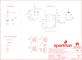

Contents
========

* [PRS14414 > SparkFun GPS Breakout XA1110 Qwiic](#prs14414--sparkfun-gps-breakout-xa1110-qwiic)
	* [Schematic](#schematic)
	* [PCB](#pcb)
	* [Interactive BOM](#interactive-bom)
	* [OOMP Parts](#oomp-parts)
	* [Images](#images)
	* [Tags](#tags)
  
![][im]
# PRS14414 > SparkFun GPS Breakout XA1110 Qwiic

- ID: PROJ-SPAR-14414-STAN-01
- Hex ID: PRS14414
- Name: Sparkfun
- Description: Sparkfun
- Long Link: [http://oom.lt/PROJ-SPAR-14414-STAN-01](http://oom.lt/PROJ-SPAR-14414-STAN-01)
- Short Link: [http://oom.lt/PRS14414](http://oom.lt/PRS14414)

## Schematic
  

## PCB
  

## Interactive BOM

- Interactive BOM page: [ibom.html](https://htmlpreview.github.io/?https://github.com/oomlout/oomlout_OOMP_projects/blob/main/PROJ-SPAR-14414-STAN-01/kicad/bom/ibom.html)

## OOMP Parts
  

|OOMP ID|Name|Identifier|
| :---: | :---: | :---: |
|UNMATCHED-UNMATCHED-X-UNMATCHED-01||B1, J1, JP1, JP5, U$3, U1|
|[CAPC-0603-X-NF100-V50](https://github.com/oomlout/oomlout_OOMP_parts/tree/main/CAPC-0603-X-NF100-V50/)|[SMD (0603) 100 nF Capacitor (Ceramic) 50v](https://github.com/oomlout/oomlout_OOMP_parts/tree/main/CAPC-0603-X-NF100-V50/)|[C1](https://github.com/oomlout/oomlout_OOMP_parts/tree/main/CAPC-0603-X-NF100-V50/)|
|CAPC-0603-X-UNMATCHED-01||C2, C3, C4|
|[LEDS-0603-L-STAN-01](https://github.com/oomlout/oomlout_OOMP_parts/tree/main/LEDS-0603-L-STAN-01/)|[SMD (0603) Blue LED](https://github.com/oomlout/oomlout_OOMP_parts/tree/main/LEDS-0603-L-STAN-01/)|[D1](https://github.com/oomlout/oomlout_OOMP_parts/tree/main/LEDS-0603-L-STAN-01/)|
|DIOD-S323-X-UNMATCHED-01||D2|
|FERB-0603-X-UNMATCHED-01||FB1|
|HEAD-UNMATCHED-X-PI04-01||J2, J4|
|[HEAD-I01-X-PI04-01](https://github.com/oomlout/oomlout_OOMP_parts/tree/main/HEAD-I01-X-PI04-01/)|[2.54 mm 4 Pin Header](https://github.com/oomlout/oomlout_OOMP_parts/tree/main/HEAD-I01-X-PI04-01/)|[J3](https://github.com/oomlout/oomlout_OOMP_parts/tree/main/HEAD-I01-X-PI04-01/)|
|HEAD-I01-X-PI01-01||J5|
|[HEAD-I01-X-PI05-01](https://github.com/oomlout/oomlout_OOMP_parts/tree/main/HEAD-I01-X-PI05-01/)|[2.54 mm 5 Pin Header](https://github.com/oomlout/oomlout_OOMP_parts/tree/main/HEAD-I01-X-PI05-01/)|[J7](https://github.com/oomlout/oomlout_OOMP_parts/tree/main/HEAD-I01-X-PI05-01/)|
|UNMATCHED-0603-X-UNMATCHED-01||L1|
|[RESE-0603-X-O103-01](https://github.com/oomlout/oomlout_OOMP_parts/tree/main/RESE-0603-X-O103-01/)|[SMD (0603) 10k Ohm Resistor](https://github.com/oomlout/oomlout_OOMP_parts/tree/main/RESE-0603-X-O103-01/)|[R1, R2](https://github.com/oomlout/oomlout_OOMP_parts/tree/main/RESE-0603-X-O103-01/)|
|[RESE-0603-X-O471-01](https://github.com/oomlout/oomlout_OOMP_parts/tree/main/RESE-0603-X-O471-01/)|[SMD (0603) 470 Ohm Resistor](https://github.com/oomlout/oomlout_OOMP_parts/tree/main/RESE-0603-X-O471-01/)|[R3, R6, R11](https://github.com/oomlout/oomlout_OOMP_parts/tree/main/RESE-0603-X-O471-01/)|
|[RESE-0603-X-O102-01](https://github.com/oomlout/oomlout_OOMP_parts/tree/main/RESE-0603-X-O102-01/)|[SMD (0603) 1k Ohm Resistor](https://github.com/oomlout/oomlout_OOMP_parts/tree/main/RESE-0603-X-O102-01/)|[R5](https://github.com/oomlout/oomlout_OOMP_parts/tree/main/RESE-0603-X-O102-01/)|
|[RESE-0603-X-O472-01](https://github.com/oomlout/oomlout_OOMP_parts/tree/main/RESE-0603-X-O472-01/)|[SMD (0603) 4.7k Ohm Resistor](https://github.com/oomlout/oomlout_OOMP_parts/tree/main/RESE-0603-X-O472-01/)|[R7, R8](https://github.com/oomlout/oomlout_OOMP_parts/tree/main/RESE-0603-X-O472-01/)|

## Images
  
  

|bominteractivefront|bominteractiveback|kicadPcb3d|kicadPcb3dFront|kicadPcb3dBack|eagleImage|eagleSchemImage|pcbdraw|pcbdrawback|
| :---: | :---: | :---: | :---: | :---: | :---: | :---: | :---: | :---: |
||||||||||

## Tags

- hexID: PRS14414
- oompType: PROJ
- oompSize: SPAR
- oompColor: 14414
- oompDesc: STAN
- oompIndex: 01
- oompName: SparkFun GPS Breakout XA1110 Qwiic
- sources: All source files from https://github.com/sparkfun/SparkFun_GPS_Breakout_XA1110_Qwiic (source licence details in srcLicense.md)
- linkBuyPage: https://www.sparkfun.com/products/14414
- oompID: PROJ-SPAR-14414-STAN-01
- oompParts: B1,UNMATCHED-UNMATCHED-X-UNMATCHED-01
- oompParts: C1,CAPC-0603-X-NF100-V50
- oompParts: C2,CAPC-0603-X-UNMATCHED-01
- oompParts: C3,CAPC-0603-X-UNMATCHED-01
- oompParts: C4,CAPC-0603-X-UNMATCHED-01
- oompParts: D1,LEDS-0603-L-STAN-01
- oompParts: D2,DIOD-S323-X-UNMATCHED-01
- oompParts: FB1,FERB-0603-X-UNMATCHED-01
- oompParts: J1,UNMATCHED-UNMATCHED-X-UNMATCHED-01
- oompParts: J2,HEAD-UNMATCHED-X-PI04-01
- oompParts: J3,HEAD-I01-X-PI04-01
- oompParts: J4,HEAD-UNMATCHED-X-PI04-01
- oompParts: J5,HEAD-I01-X-PI01-01
- oompParts: J7,HEAD-I01-X-PI05-01
- oompParts: JP1,UNMATCHED-UNMATCHED-X-UNMATCHED-01
- oompParts: JP5,UNMATCHED-UNMATCHED-X-UNMATCHED-01
- oompParts: L1,UNMATCHED-0603-X-UNMATCHED-01
- oompParts: R1,RESE-0603-X-O103-01
- oompParts: R2,RESE-0603-X-O103-01
- oompParts: R3,RESE-0603-X-O471-01
- oompParts: R5,RESE-0603-X-O102-01
- oompParts: R6,RESE-0603-X-O471-01
- oompParts: R7,RESE-0603-X-O472-01
- oompParts: R8,RESE-0603-X-O472-01
- oompParts: R11,RESE-0603-X-O471-01
- oompParts: U$3,UNMATCHED-UNMATCHED-X-UNMATCHED-01
- oompParts: U1,UNMATCHED-UNMATCHED-X-UNMATCHED-01
- rawParts: B1,6.8MM_COIN_CELL,BATTERY-6.8MM_SMD,BATTCON-6.8MM,Battery - Single Cell,BATT-13734,,6.8MM_COIN_CELL,
- rawParts: C1,0.1uF,0.1UF-0603-25V-(+80/-20%),0603,0.1µF ceramic capacitors,CAP-00810,,0.1uF,
- rawParts: C2,1.0uF,1.0UF-0603-16V-10%,0603,1µF ceramic capacitors,CAP-00868,,1.0uF,
- rawParts: C3,1.0uF,1.0UF-0603-16V-10%,0603,1µF ceramic capacitors,CAP-00868,,1.0uF,
- rawParts: C4,1.0uF,1.0UF-0603-16V-10%,0603,1µF ceramic capacitors,CAP-00868,,1.0uF,
- rawParts: D1,BLUE,LED-BLUE0603,LED-0603,Blue SMD LED,DIO-08575,,BLUE,
- rawParts: D2,0.5A/40V/420mV,DIODE-SCHOTTKY-PMEG4005EJ,SOD-323,Schottky diode,DIO-10955,,0.5A/40V/420mV,
- rawParts: FB1,600Ohm/100MHz,FERRITE_BEAD-0603,0603,Ferrite Bead (blocks, cores, rings, chokes, etc.),NDUC-07859,,30Ω/1.8A,
- rawParts: FRAME1,FRAME-LETTER,FRAME-LETTER,CREATIVE_COMMONS,Schematic Frame - Letter,,,,
- rawParts: J1,U.FL,U.FL2PIN,U.FL,SMD Antenna Connector - U.FL,CONN-09193,WRL-09144,U.FL,
- rawParts: J2,Qwiic Right Angle,I2C_STANDARDQWIIC,1X04_1MM_RA,SparkFun I2C Standard Pinout Header,CONN-13729,,Qwiic Right Angle,
- rawParts: J3,PTH,I2C_STANDARD_NO_SILK,1X04_NO_SILK,SparkFun I2C Standard Pinout Header,,,,
- rawParts: J4,Qwiic Right Angle,I2C_STANDARDQWIIC,1X04_1MM_RA,SparkFun I2C Standard Pinout Header,CONN-13729,,Qwiic Right Angle,
- rawParts: J5,,CONN_01PTH_NO_SILK_YES_STOP,1X01_NO_SILK,Single connection point. Often used as Generic Header-pin footprint for 0.1 inch spaced/style header connections,,,,
- rawParts: J7,,CONN_05NO_SILK,1X05_NO_SILK,Multi connection point. Often used as Generic Header-pin footprint for 0.1 inch spaced/style header connections,,,,
- rawParts: JP1,,JUMPER-SMT_3_2-NC_PASTE_SILK,SMT-JUMPER_3_2-NC_PASTE_SILK,Normally closed solder jumper (2 of 2 connections),,,,
- rawParts: JP2,FIDUCIALUFIDUCIAL,FIDUCIALUFIDUCIAL,MICRO-FIDUCIAL,Fiducial Alignment Points,,,,
- rawParts: JP3,STAND-OFF,STAND-OFF,STAND-OFF,Stand Off,,,,
- rawParts: JP4,STAND-OFF,STAND-OFF,STAND-OFF,Stand Off,,,,
- rawParts: JP5,,JUMPER-SMT_2_NC_TRACE_NO-SILK,SMT-JUMPER_2_NC_TRACE_NO-SILK,Normally closed trace jumper,,,,
- rawParts: JP6,FIDUCIALUFIDUCIAL,FIDUCIALUFIDUCIAL,MICRO-FIDUCIAL,Fiducial Alignment Points,,,,
- rawParts: JP7,FIDUCIALUFIDUCIAL,FIDUCIALUFIDUCIAL,MICRO-FIDUCIAL,Fiducial Alignment Points,,,,
- rawParts: JP8,FIDUCIALUFIDUCIAL,FIDUCIALUFIDUCIAL,MICRO-FIDUCIAL,Fiducial Alignment Points,,,,
- rawParts: L1,33nH/±5%/500mA,INDUCTOR-0603-33NH,0603,Inductors,NDUC-07874,,33nH/±5%/500mA,
- rawParts: LOGO1,OSHW-LOGOMINI,OSHW-LOGOMINI,OSHW-LOGO-MINI,Open-Source Hardware (OSHW) Logo,,,,
- rawParts: LOGO2,SFE_LOGO_NAME_FLAME.1_INCH,SFE_LOGO_NAME_FLAME.1_INCH,SFE_LOGO_NAME_FLAME_.1,SparkFun Font Logo w/ Flame,,,,
- rawParts: LOGO3,REVISION,REVISION,REVISION,Revision By Text,,,,
- rawParts: R1,10k,10KOHM-0603-1/10W-1%,0603,10kΩ resistor,RES-00824,,10k,
- rawParts: R2,10k,10KOHM-0603-1/10W-1%,0603,10kΩ resistor,RES-00824,,10k,
- rawParts: R3,470,470OHM-0603-1/10W-1%,0603,470Ω resistor,RES-07869,,470,
- rawParts: R5,1k,1KOHM-0603-1/10W-1%,0603,1kΩ resistor,RES-07856,,1k,
- rawParts: R6,470,470OHM-0603-1/10W-1%,0603,470Ω resistor,RES-07869,,470,
- rawParts: R7,4.7k,4.7KOHM-0603-1/10W-1%,0603,4.7kΩ resistor,RES-07857,,4.7k,
- rawParts: R8,4.7k,4.7KOHM-0603-1/10W-1%,0603,4.7kΩ resistor,RES-07857,,4.7k,
- rawParts: R11,470,470OHM-0603-1/10W-1%,0603,470Ω resistor,RES-07869,,470,
- rawParts: U$3,SPECIAL_INSTRUCTIONS-PRODUCTION,SPECIAL_INSTRUCTIONS-PRODUCTION,PRODUCTION_INSTRUCTIONS,Special Ordering/Production Instructions Alert,,,,
- rawParts: U1,Titan X1 GPS,TITAN_X1_GPS,TITAN_X1_GPS,Titan X1 GPS,GPS-13693,,Titan X1 GPS,

[im]: kicadPcb3d_450.png
