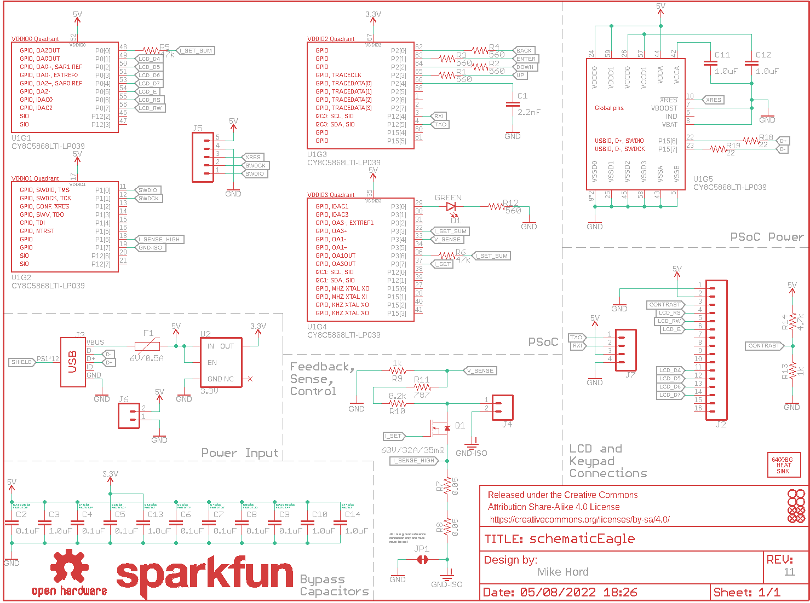
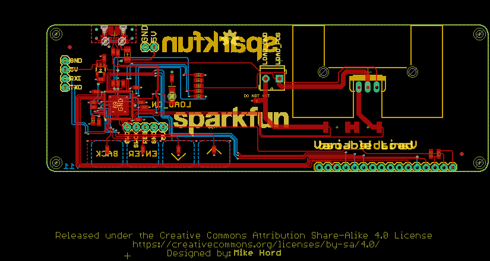
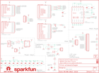

Contents
========

* [PRS14449 > Variable Load](#prs14449--variable-load)
	* [Schematic](#schematic)
	* [PCB](#pcb)
	* [Interactive BOM](#interactive-bom)
	* [OOMP Parts](#oomp-parts)
	* [Images](#images)
	* [Tags](#tags)
  
![][im]
# PRS14449 > Variable Load

- ID: PROJ-SPAR-14449-STAN-01
- Hex ID: PRS14449
- Name: Sparkfun
- Description: Sparkfun
- Long Link: [http://oom.lt/PROJ-SPAR-14449-STAN-01](http://oom.lt/PROJ-SPAR-14449-STAN-01)
- Short Link: [http://oom.lt/PRS14449](http://oom.lt/PRS14449)

## Schematic
  

## PCB
  

## Interactive BOM

- Interactive BOM page: [ibom.html](https://htmlpreview.github.io/?https://github.com/oomlout/oomlout_OOMP_projects/blob/main/PROJ-SPAR-14449-STAN-01/kicad/bom/ibom.html)

## OOMP Parts
  

|OOMP Parts|
| :---: |
|C1 C1,CAPC-0603-X-PF22D-01|
|C2 C2,CAPC-0402-X-UF1D-01|
|C3 C3,CAPC-0402-X-UF1-01|
|C4 C4,CAPC-0402-X-UF1D-01|
|C5 C5,CAPC-0402-X-UF1D-01|
|C6 C6,CAPC-0402-X-UF1D-01|
|C7 C7,CAPC-0402-X-UF1D-01|
|C8 C8,CAPC-0402-X-UF1D-01|
|C9 C9,CAPC-0402-X-UF1D-01|
|C10 C10,CAPC-0402-X-UF1-01|
|C11 C11,CAPC-0402-X-UF1-01|
|C12 C12,CAPC-0402-X-UF1-01|
|C13 C13,CAPC-0402-X-UF1-01|
|C14 C14,CAPC-0402-X-UF1-01|
|D1 D1,LEDS-1206-G-STAN-01|
|F1 F1,UNMATCHED-1206-X-UNMATCHED-01|
|H1 H1,UNMATCHED-UNMATCHED-X-UNMATCHED-01|
|J2 J2,UNMATCHED-UNMATCHED-X-UNMATCHED-01|
|J3 J3,UNMATCHED-UNMATCHED-X-UNMATCHED-01|
|[J4 TERS-35D-L-PI02-01 3.5 mm 2 Pin Blue Screw Terminal](https://github.com/oomlout/oomlout_OOMP_parts/tree/main/TERS-35D-L-PI02-01/)|
|J5 J5,UNMATCHED-UNMATCHED-X-UNMATCHED-01|
|J6 J6,UNMATCHED-UNMATCHED-X-UNMATCHED-01|
|J7 J7,UNMATCHED-UNMATCHED-X-UNMATCHED-01|
|Q1 Q1,MOSN-UNMATCHED-X-UNMATCHED-01|
|R1 R1,RESE-0402-X-O561-01|
|R2 R2,RESE-0402-X-O561-01|
|R3 R3,RESE-0402-X-O561-01|
|R4 R4,RESE-0402-X-O561-01|
|[R5 RESE-0603-X-O473-01 SMD (0603) 47k Ohm Resistor](https://github.com/oomlout/oomlout_OOMP_parts/tree/main/RESE-0603-X-O473-01/)|
|[R6 RESE-0603-X-O473-01 SMD (0603) 47k Ohm Resistor](https://github.com/oomlout/oomlout_OOMP_parts/tree/main/RESE-0603-X-O473-01/)|
|R7 R7,RESE-UNMATCHED-X-UNMATCHED-01|
|R8 R8,RESE-UNMATCHED-X-UNMATCHED-01|
|[R9 RESE-0603-X-O102-01 SMD (0603) 1k Ohm Resistor](https://github.com/oomlout/oomlout_OOMP_parts/tree/main/RESE-0603-X-O102-01/)|
|R10 R10,RESE-0603-X-UNMATCHED-01|
|R11 R11,RESE-0603-X-O781-01|
|R12 R12,RESE-0402-X-O561-01|
|[R13 RESE-0603-X-O102-01 SMD (0603) 1k Ohm Resistor](https://github.com/oomlout/oomlout_OOMP_parts/tree/main/RESE-0603-X-O102-01/)|
|[R14 RESE-0603-X-O472-01 SMD (0603) 4.7k Ohm Resistor](https://github.com/oomlout/oomlout_OOMP_parts/tree/main/RESE-0603-X-O472-01/)|
|R18 R18,RESE-0402-X-O220-01|
|R19 R19,RESE-0402-X-O220-01|
|U1 U1,UNMATCHED-UNMATCHED-X-UNMATCHED-01|
|U2 U2,VREG-SO235-X-KAP2112K-V33D|

## Images
  
  

|kicadPcb3d|kicadPcb3dFront|kicadPcb3dBack|eagleImage|eagleSchemImage|
| :---: | :---: | :---: | :---: | :---: |
||||||

## Tags

- hexID: PRS14449
- oompType: PROJ
- oompSize: SPAR
- oompColor: 14449
- oompDesc: STAN
- oompIndex: 01
- oompName: Variable Load
- sources: All source files from https://github.com/sparkfun/Variable_Load (source licence details in srcLicense.md)
- linkBuyPage: https://www.sparkfun.com/products/14449
- oompID: PROJ-SPAR-14449-STAN-01
- oompParts: C1,CAPC-0603-X-PF22D-01
- oompParts: C2,CAPC-0402-X-UF1D-01
- oompParts: C3,CAPC-0402-X-UF1-01
- oompParts: C4,CAPC-0402-X-UF1D-01
- oompParts: C5,CAPC-0402-X-UF1D-01
- oompParts: C6,CAPC-0402-X-UF1D-01
- oompParts: C7,CAPC-0402-X-UF1D-01
- oompParts: C8,CAPC-0402-X-UF1D-01
- oompParts: C9,CAPC-0402-X-UF1D-01
- oompParts: C10,CAPC-0402-X-UF1-01
- oompParts: C11,CAPC-0402-X-UF1-01
- oompParts: C12,CAPC-0402-X-UF1-01
- oompParts: C13,CAPC-0402-X-UF1-01
- oompParts: C14,CAPC-0402-X-UF1-01
- oompParts: D1,LEDS-1206-G-STAN-01
- oompParts: F1,UNMATCHED-1206-X-UNMATCHED-01
- oompParts: H1,UNMATCHED-UNMATCHED-X-UNMATCHED-01
- oompParts: J2,UNMATCHED-UNMATCHED-X-UNMATCHED-01
- oompParts: J3,UNMATCHED-UNMATCHED-X-UNMATCHED-01
- oompParts: J4,TERS-35D-L-PI02-01
- oompParts: J5,UNMATCHED-UNMATCHED-X-UNMATCHED-01
- oompParts: J6,UNMATCHED-UNMATCHED-X-UNMATCHED-01
- oompParts: J7,UNMATCHED-UNMATCHED-X-UNMATCHED-01
- oompParts: Q1,MOSN-UNMATCHED-X-UNMATCHED-01
- oompParts: R1,RESE-0402-X-O561-01
- oompParts: R2,RESE-0402-X-O561-01
- oompParts: R3,RESE-0402-X-O561-01
- oompParts: R4,RESE-0402-X-O561-01
- oompParts: R5,RESE-0603-X-O473-01
- oompParts: R6,RESE-0603-X-O473-01
- oompParts: R7,RESE-UNMATCHED-X-UNMATCHED-01
- oompParts: R8,RESE-UNMATCHED-X-UNMATCHED-01
- oompParts: R9,RESE-0603-X-O102-01
- oompParts: R10,RESE-0603-X-UNMATCHED-01
- oompParts: R11,RESE-0603-X-O781-01
- oompParts: R12,RESE-0402-X-O561-01
- oompParts: R13,RESE-0603-X-O102-01
- oompParts: R14,RESE-0603-X-O472-01
- oompParts: R18,RESE-0402-X-O220-01
- oompParts: R19,RESE-0402-X-O220-01
- oompParts: U1,UNMATCHED-UNMATCHED-X-UNMATCHED-01
- oompParts: U2,VREG-SO235-X-KAP2112K-V33D
- rawParts: C1,2.2nF,2.2NF/2200PF-0603-50V-10%,0603,2.2nF/2,200pF ceramic capacitors,CAP-07877,,2.2nF,
- rawParts: C2,0.1uF,0.1UF-0402-16V-10%,0402,0.1µF ceramic capacitors,CAP-12416,,0.1uF,
- rawParts: C3,1.0uF,1.0UF-0402-16V-10%,0402,1µF ceramic capacitors,CAP-12417,,1.0uF,
- rawParts: C4,0.1uF,0.1UF-0402-16V-10%,0402,0.1µF ceramic capacitors,CAP-12416,,0.1uF,
- rawParts: C5,0.1uF,0.1UF-0402-16V-10%,0402,0.1µF ceramic capacitors,CAP-12416,,0.1uF,
- rawParts: C6,0.1uF,0.1UF-0402-16V-10%,0402,0.1µF ceramic capacitors,CAP-12416,,0.1uF,
- rawParts: C7,0.1uF,0.1UF-0402-16V-10%,0402,0.1µF ceramic capacitors,CAP-12416,,0.1uF,
- rawParts: C8,0.1uF,0.1UF-0402-16V-10%,0402,0.1µF ceramic capacitors,CAP-12416,,0.1uF,
- rawParts: C9,0.1uF,0.1UF-0402-16V-10%,0402,0.1µF ceramic capacitors,CAP-12416,,0.1uF,
- rawParts: C10,1.0uF,1.0UF-0402-16V-10%,0402,1µF ceramic capacitors,CAP-12417,,1.0uF,
- rawParts: C11,1.0uF,1.0UF-0402-16V-10%,0402,1µF ceramic capacitors,CAP-12417,,1.0uF,
- rawParts: C12,1.0uF,1.0UF-0402-16V-10%,0402,1µF ceramic capacitors,CAP-12417,,1.0uF,
- rawParts: C13,1.0uF,1.0UF-0402-16V-10%,0402,1µF ceramic capacitors,CAP-12417,,1.0uF,
- rawParts: C14,1.0uF,1.0UF-0402-16V-10%,0402,1µF ceramic capacitors,CAP-12417,,1.0uF,
- rawParts: D1,GREEN,LED1206-BOTTOM,LED-1206-BOTTOM,LED (Generic),DIO-11076,,,
- rawParts: F1,6V/0.5A,PPTC_HALF-AMP,1206,Resettable Fuse PPTC,RES-08585,,6V/0.5A,
- rawParts: FD1,FIDUCIAL1X2,FIDUCIAL1X2,FIDUCIAL-1X2,Fiducial Alignment Points,,,,
- rawParts: FD2,FIDUCIAL1X2,FIDUCIAL1X2,FIDUCIAL-1X2,Fiducial Alignment Points,,,,
- rawParts: FD3,FIDUCIAL1X2,FIDUCIAL1X2,FIDUCIAL-1X2,Fiducial Alignment Points,,,,
- rawParts: FD4,FIDUCIAL1X2,FIDUCIAL1X2,FIDUCIAL-1X2,Fiducial Alignment Points,,,,
- rawParts: FRAME1,FRAME-LETTER,FRAME-LETTER,CREATIVE_COMMONS,Schematic Frame - Letter,,,,
- rawParts: H1,6400BG_HEATSINK,6400BG_HEATSINK,6400BG_HEATSINK,6400BG Heatsink - Multiwatt Package,COMP-09537,PRT-09576,,
- rawParts: H2,STAND-OFF,STAND-OFF,STAND-OFF,Stand Off,,,,
- rawParts: H3,STAND-OFF,STAND-OFF,STAND-OFF,Stand Off,,,,
- rawParts: H4,STAND-OFF,STAND-OFF,STAND-OFF,Stand Off,,,,
- rawParts: H5,STAND-OFF,STAND-OFF,STAND-OFF,Stand Off,,,,
- rawParts: J2,,CONN_16,1X16,Multi connection point. Often used as Generic Header-pin footprint for 0.1 inch spaced/style header connections,,,,
- rawParts: J3,AMP FCI 10103594-0001LF,USB_MICRO-B_HALF_PTH,USB-MICROB-PTH,USB Type Micro-B Connector,CONN-13711,,AMP FCI 10103594-0001LF,
- rawParts: J4,,CONN_023.5MM_LOCK,SCREWTERMINAL-3.5MM-2_LOCK,Multi connection point. Often used as Generic Header-pin footprint for 0.1 inch spaced/style header connections,CONN-08399,,,
- rawParts: J5,,CONN_05,1X05,Multi connection point. Often used as Generic Header-pin footprint for 0.1 inch spaced/style header connections,,,,
- rawParts: J6,,CONN_02,1X02,Multi connection point. Often used as Generic Header-pin footprint for 0.1 inch spaced/style header connections,,,,
- rawParts: J7,,CONN_04,1X04,Multi connection point. Often used as Generic Header-pin footprint for 0.1 inch spaced/style header connections,CONN-09696,,,
- rawParts: JP1,JUMPER-SMT_2_NC_TRACE_NO-SILK,JUMPER-SMT_2_NC_TRACE_NO-SILK,SMT-JUMPER_2_NC_TRACE_NO-SILK,Normally closed trace jumper,,,,
- rawParts: LOGO1,OSHW-LOGOM,OSHW-LOGOM,OSHW-LOGO-M,Open-Source Hardware (OSHW) Logo,,,,
- rawParts: LOGO2,SFE_LOGO_NAME.3_INCH,SFE_LOGO_NAME.3_INCH,SFE_LOGO_NAME_.3,SparkFun Font Logo,,,,
- rawParts: LOGO3,SFE_LOGO_NAME.3_INCH,SFE_LOGO_NAME.3_INCH,SFE_LOGO_NAME_.3,SparkFun Font Logo,,,,
- rawParts: Q1,60V/32A/35mΩ,MOSFET-NCH-FQP30N06L,TO220V,N-channel MOSFETs,TRANS-10060,,60V/32A/35mΩ,
- rawParts: R1,560,560OHM_0402_1%,0402,,RES-13766,,560,
- rawParts: R2,560,560OHM_0402_1%,0402,,RES-13766,,560,
- rawParts: R3,560,560OHM_0402_1%,0402,,RES-13766,,560,
- rawParts: R4,560,560OHM_0402_1%,0402,,RES-13766,,560,
- rawParts: R5,47k,47KOHM-0603-1/10W-1%,0603,47kΩ resistor,RES-07871,,47k,
- rawParts: R6,47k,47KOHM-0603-1/10W-1%,0603,47kΩ resistor,RES-07871,,47k,
- rawParts: R7,0.05,0.05OHM-2512-3W-1%,2512,0.05Ω resistor,RES-13771,,0.05,
- rawParts: R8,0.05,0.05OHM-2512-3W-1%,2512,0.05Ω resistor,RES-13771,,0.05,
- rawParts: R9,1k,1KOHM-0603-1/10W-1%,0603,1kΩ resistor,RES-07856,,1k,
- rawParts: R10,8.2k,8.2KOHM-0603-1/10W-5%,0603,8.2kΩ resistor,RES-10646,,8.2k,
- rawParts: R11,787,787OHM-0603-1/10W-1%,0603,787Ω resistor,RES-11228,,787,
- rawParts: R12,560,560OHM_0402_1%,0402,,RES-13766,,560,
- rawParts: R13,1k,1KOHM-0603-1/10W-1%,0603,1kΩ resistor,RES-07856,,1k,
- rawParts: R14,4.7k,4.7KOHM-0603-1/10W-1%,0603,4.7kΩ resistor,RES-07857,,4.7k,
- rawParts: R18,22,22OHM1/10W1%(0402),0402-RES,,RES-12427,,22,
- rawParts: R19,22,22OHM1/10W1%(0402),0402-RES,,RES-12427,,22,
- rawParts: U1,CY8C5868LTI-LP039,PSOC_5LP_68QFN,QFN-68,PSoC5LP 68-QFN package,IC-12391,,CY8C5868LTI-LP039,
- rawParts: U2,3.3V,V_REG_AP2112K-3.3V,SOT23-5,AP2112 - 600mA CMOS LDO Regulator w/ Enable,VREG-12457,,3.3V,

[im]: kicadPcb3d_450.png
