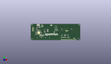
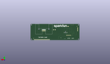
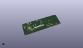

Contents
========

* [PROJ-SPAR-14449-STAN-01>Variable Load](#proj-spar-14449-stan-01variable-load)
	* [Images](#images)
	* [Interactive BOM](#interactive-bom)
	* [Tags](#tags)
  
![][im]
# PROJ-SPAR-14449-STAN-01>Variable Load

- ID: PROJ-SPAR-14449-STAN-01
- Hex ID: PRS14449
- Name: Variable Load
- Description: 

## Images
  
  

|eagleImage|kicadPcb3dFront|kicadPcb3dBack|kicadPcb3d|
| :---: | :---: | :---: | :---: |
|||||

## Interactive BOM

- Interactive BOM page: [ibom.html](kicad/bom/ibom.html)

## Tags

- hexID: PRS14449
- oompType: PROJ
- oompSize: SPAR
- oompColor: 14449
- oompDesc: STAN
- oompIndex: 01
- oompName: Variable Load
- sources: All source files from https://github.com/sparkfun/Variable_Load (source licence details in srcLicense.md)
- linkBuyPage: https://www.sparkfun.com/products/14449
- oompID: PROJ-SPAR-14449-STAN-01
- oompParts: C1,UNMATCHED-UNMATCHED-UNMATCHED-UNMATCHED-UNMATCHED
- oompParts: C2,UNMATCHED-UNMATCHED-UNMATCHED-UNMATCHED-UNMATCHED
- oompParts: C3,UNMATCHED-UNMATCHED-UNMATCHED-UNMATCHED-UNMATCHED
- oompParts: C4,UNMATCHED-UNMATCHED-UNMATCHED-UNMATCHED-UNMATCHED
- oompParts: C5,UNMATCHED-UNMATCHED-UNMATCHED-UNMATCHED-UNMATCHED
- oompParts: C6,UNMATCHED-UNMATCHED-UNMATCHED-UNMATCHED-UNMATCHED
- oompParts: C7,UNMATCHED-UNMATCHED-UNMATCHED-UNMATCHED-UNMATCHED
- oompParts: C8,UNMATCHED-UNMATCHED-UNMATCHED-UNMATCHED-UNMATCHED
- oompParts: C9,UNMATCHED-UNMATCHED-UNMATCHED-UNMATCHED-UNMATCHED
- oompParts: C10,UNMATCHED-UNMATCHED-UNMATCHED-UNMATCHED-UNMATCHED
- oompParts: C11,UNMATCHED-UNMATCHED-UNMATCHED-UNMATCHED-UNMATCHED
- oompParts: C12,UNMATCHED-UNMATCHED-UNMATCHED-UNMATCHED-UNMATCHED
- oompParts: C13,UNMATCHED-UNMATCHED-UNMATCHED-UNMATCHED-UNMATCHED
- oompParts: C14,UNMATCHED-UNMATCHED-UNMATCHED-UNMATCHED-UNMATCHED
- oompParts: D1,UNMATCHED-UNMATCHED-UNMATCHED-UNMATCHED-UNMATCHED
- oompParts: F1,UNMATCHED-UNMATCHED-UNMATCHED-UNMATCHED-UNMATCHED
- oompParts: FRAME1,UNMATCHED-UNMATCHED-UNMATCHED-UNMATCHED-UNMATCHED
- oompParts: H1,UNMATCHED-UNMATCHED-UNMATCHED-UNMATCHED-UNMATCHED
- oompParts: H2,UNMATCHED-UNMATCHED-UNMATCHED-UNMATCHED-UNMATCHED
- oompParts: H3,UNMATCHED-UNMATCHED-UNMATCHED-UNMATCHED-UNMATCHED
- oompParts: H4,UNMATCHED-UNMATCHED-UNMATCHED-UNMATCHED-UNMATCHED
- oompParts: H5,UNMATCHED-UNMATCHED-UNMATCHED-UNMATCHED-UNMATCHED
- oompParts: J2,UNMATCHED-UNMATCHED-UNMATCHED-UNMATCHED-UNMATCHED
- oompParts: J3,UNMATCHED-UNMATCHED-UNMATCHED-UNMATCHED-UNMATCHED
- oompParts: J4,UNMATCHED-UNMATCHED-UNMATCHED-UNMATCHED-UNMATCHED
- oompParts: J5,UNMATCHED-UNMATCHED-UNMATCHED-UNMATCHED-UNMATCHED
- oompParts: J6,UNMATCHED-UNMATCHED-UNMATCHED-UNMATCHED-UNMATCHED
- oompParts: J7,UNMATCHED-UNMATCHED-UNMATCHED-UNMATCHED-UNMATCHED
- oompParts: JP1,UNMATCHED-UNMATCHED-UNMATCHED-UNMATCHED-UNMATCHED
- oompParts: LOGO1,UNMATCHED-UNMATCHED-UNMATCHED-UNMATCHED-UNMATCHED
- oompParts: LOGO2,UNMATCHED-UNMATCHED-UNMATCHED-UNMATCHED-UNMATCHED
- oompParts: LOGO3,UNMATCHED-UNMATCHED-UNMATCHED-UNMATCHED-UNMATCHED
- oompParts: Q1,UNMATCHED-UNMATCHED-UNMATCHED-UNMATCHED-UNMATCHED
- oompParts: R1,UNMATCHED-UNMATCHED-UNMATCHED-UNMATCHED-UNMATCHED
- oompParts: R2,UNMATCHED-UNMATCHED-UNMATCHED-UNMATCHED-UNMATCHED
- oompParts: R3,UNMATCHED-UNMATCHED-UNMATCHED-UNMATCHED-UNMATCHED
- oompParts: R4,UNMATCHED-UNMATCHED-UNMATCHED-UNMATCHED-UNMATCHED
- oompParts: R5,UNMATCHED-UNMATCHED-UNMATCHED-UNMATCHED-UNMATCHED
- oompParts: R6,UNMATCHED-UNMATCHED-UNMATCHED-UNMATCHED-UNMATCHED
- oompParts: R7,UNMATCHED-UNMATCHED-UNMATCHED-UNMATCHED-UNMATCHED
- oompParts: R8,UNMATCHED-UNMATCHED-UNMATCHED-UNMATCHED-UNMATCHED
- oompParts: R9,UNMATCHED-UNMATCHED-UNMATCHED-UNMATCHED-UNMATCHED
- oompParts: R10,UNMATCHED-UNMATCHED-UNMATCHED-UNMATCHED-UNMATCHED
- oompParts: R11,UNMATCHED-UNMATCHED-UNMATCHED-UNMATCHED-UNMATCHED
- oompParts: R12,UNMATCHED-UNMATCHED-UNMATCHED-UNMATCHED-UNMATCHED
- oompParts: R13,UNMATCHED-UNMATCHED-UNMATCHED-UNMATCHED-UNMATCHED
- oompParts: R14,UNMATCHED-UNMATCHED-UNMATCHED-UNMATCHED-UNMATCHED
- oompParts: R18,UNMATCHED-UNMATCHED-UNMATCHED-UNMATCHED-UNMATCHED
- oompParts: R19,UNMATCHED-UNMATCHED-UNMATCHED-UNMATCHED-UNMATCHED
- oompParts: U1,UNMATCHED-UNMATCHED-UNMATCHED-UNMATCHED-UNMATCHED
- oompParts: U2,UNMATCHED-UNMATCHED-UNMATCHED-UNMATCHED-UNMATCHED
- rawParts: C1,2.2nF,2.2NF/2200PF-0603-50V-10%,0603,2.2nF/2,200pF ceramic capacitors,CAP-07877,,2.2nF,
- rawParts: C2,0.1uF,0.1UF-0402-16V-10%,0402,0.1µF ceramic capacitors,CAP-12416,,0.1uF,
- rawParts: C3,1.0uF,1.0UF-0402-16V-10%,0402,1µF ceramic capacitors,CAP-12417,,1.0uF,
- rawParts: C4,0.1uF,0.1UF-0402-16V-10%,0402,0.1µF ceramic capacitors,CAP-12416,,0.1uF,
- rawParts: C5,0.1uF,0.1UF-0402-16V-10%,0402,0.1µF ceramic capacitors,CAP-12416,,0.1uF,
- rawParts: C6,0.1uF,0.1UF-0402-16V-10%,0402,0.1µF ceramic capacitors,CAP-12416,,0.1uF,
- rawParts: C7,0.1uF,0.1UF-0402-16V-10%,0402,0.1µF ceramic capacitors,CAP-12416,,0.1uF,
- rawParts: C8,0.1uF,0.1UF-0402-16V-10%,0402,0.1µF ceramic capacitors,CAP-12416,,0.1uF,
- rawParts: C9,0.1uF,0.1UF-0402-16V-10%,0402,0.1µF ceramic capacitors,CAP-12416,,0.1uF,
- rawParts: C10,1.0uF,1.0UF-0402-16V-10%,0402,1µF ceramic capacitors,CAP-12417,,1.0uF,
- rawParts: C11,1.0uF,1.0UF-0402-16V-10%,0402,1µF ceramic capacitors,CAP-12417,,1.0uF,
- rawParts: C12,1.0uF,1.0UF-0402-16V-10%,0402,1µF ceramic capacitors,CAP-12417,,1.0uF,
- rawParts: C13,1.0uF,1.0UF-0402-16V-10%,0402,1µF ceramic capacitors,CAP-12417,,1.0uF,
- rawParts: C14,1.0uF,1.0UF-0402-16V-10%,0402,1µF ceramic capacitors,CAP-12417,,1.0uF,
- rawParts: D1,GREEN,LED1206-BOTTOM,LED-1206-BOTTOM,LED (Generic),DIO-11076,,,
- rawParts: F1,6V/0.5A,PPTC_HALF-AMP,1206,Resettable Fuse PPTC,RES-08585,,6V/0.5A,
- rawParts: FD1,FIDUCIAL1X2,FIDUCIAL1X2,FIDUCIAL-1X2,Fiducial Alignment Points,,,,
- rawParts: FD2,FIDUCIAL1X2,FIDUCIAL1X2,FIDUCIAL-1X2,Fiducial Alignment Points,,,,
- rawParts: FD3,FIDUCIAL1X2,FIDUCIAL1X2,FIDUCIAL-1X2,Fiducial Alignment Points,,,,
- rawParts: FD4,FIDUCIAL1X2,FIDUCIAL1X2,FIDUCIAL-1X2,Fiducial Alignment Points,,,,
- rawParts: FRAME1,FRAME-LETTER,FRAME-LETTER,CREATIVE_COMMONS,Schematic Frame - Letter,,,,
- rawParts: H1,6400BG_HEATSINK,6400BG_HEATSINK,6400BG_HEATSINK,6400BG Heatsink - Multiwatt Package,COMP-09537,PRT-09576,,
- rawParts: H2,STAND-OFF,STAND-OFF,STAND-OFF,Stand Off,,,,
- rawParts: H3,STAND-OFF,STAND-OFF,STAND-OFF,Stand Off,,,,
- rawParts: H4,STAND-OFF,STAND-OFF,STAND-OFF,Stand Off,,,,
- rawParts: H5,STAND-OFF,STAND-OFF,STAND-OFF,Stand Off,,,,
- rawParts: J2,,CONN_16,1X16,Multi connection point. Often used as Generic Header-pin footprint for 0.1 inch spaced/style header connections,,,,
- rawParts: J3,AMP FCI 10103594-0001LF,USB_MICRO-B_HALF_PTH,USB-MICROB-PTH,USB Type Micro-B Connector,CONN-13711,,AMP FCI 10103594-0001LF,
- rawParts: J4,,CONN_023.5MM_LOCK,SCREWTERMINAL-3.5MM-2_LOCK,Multi connection point. Often used as Generic Header-pin footprint for 0.1 inch spaced/style header connections,CONN-08399,,,
- rawParts: J5,,CONN_05,1X05,Multi connection point. Often used as Generic Header-pin footprint for 0.1 inch spaced/style header connections,,,,
- rawParts: J6,,CONN_02,1X02,Multi connection point. Often used as Generic Header-pin footprint for 0.1 inch spaced/style header connections,,,,
- rawParts: J7,,CONN_04,1X04,Multi connection point. Often used as Generic Header-pin footprint for 0.1 inch spaced/style header connections,CONN-09696,,,
- rawParts: JP1,JUMPER-SMT_2_NC_TRACE_NO-SILK,JUMPER-SMT_2_NC_TRACE_NO-SILK,SMT-JUMPER_2_NC_TRACE_NO-SILK,Normally closed trace jumper,,,,
- rawParts: LOGO1,OSHW-LOGOM,OSHW-LOGOM,OSHW-LOGO-M,Open-Source Hardware (OSHW) Logo,,,,
- rawParts: LOGO2,SFE_LOGO_NAME.3_INCH,SFE_LOGO_NAME.3_INCH,SFE_LOGO_NAME_.3,SparkFun Font Logo,,,,
- rawParts: LOGO3,SFE_LOGO_NAME.3_INCH,SFE_LOGO_NAME.3_INCH,SFE_LOGO_NAME_.3,SparkFun Font Logo,,,,
- rawParts: Q1,60V/32A/35mΩ,MOSFET-NCH-FQP30N06L,TO220V,N-channel MOSFETs,TRANS-10060,,60V/32A/35mΩ,
- rawParts: R1,560,560OHM_0402_1%,0402,,RES-13766,,560,
- rawParts: R2,560,560OHM_0402_1%,0402,,RES-13766,,560,
- rawParts: R3,560,560OHM_0402_1%,0402,,RES-13766,,560,
- rawParts: R4,560,560OHM_0402_1%,0402,,RES-13766,,560,
- rawParts: R5,47k,47KOHM-0603-1/10W-1%,0603,47kΩ resistor,RES-07871,,47k,
- rawParts: R6,47k,47KOHM-0603-1/10W-1%,0603,47kΩ resistor,RES-07871,,47k,
- rawParts: R7,0.05,0.05OHM-2512-3W-1%,2512,0.05Ω resistor,RES-13771,,0.05,
- rawParts: R8,0.05,0.05OHM-2512-3W-1%,2512,0.05Ω resistor,RES-13771,,0.05,
- rawParts: R9,1k,1KOHM-0603-1/10W-1%,0603,1kΩ resistor,RES-07856,,1k,
- rawParts: R10,8.2k,8.2KOHM-0603-1/10W-5%,0603,8.2kΩ resistor,RES-10646,,8.2k,
- rawParts: R11,787,787OHM-0603-1/10W-1%,0603,787Ω resistor,RES-11228,,787,
- rawParts: R12,560,560OHM_0402_1%,0402,,RES-13766,,560,
- rawParts: R13,1k,1KOHM-0603-1/10W-1%,0603,1kΩ resistor,RES-07856,,1k,
- rawParts: R14,4.7k,4.7KOHM-0603-1/10W-1%,0603,4.7kΩ resistor,RES-07857,,4.7k,
- rawParts: R18,22,22OHM1/10W1%(0402),0402-RES,,RES-12427,,22,
- rawParts: R19,22,22OHM1/10W1%(0402),0402-RES,,RES-12427,,22,
- rawParts: U1,CY8C5868LTI-LP039,PSOC_5LP_68QFN,QFN-68,PSoC5LP 68-QFN package,IC-12391,,CY8C5868LTI-LP039,
- rawParts: U2,3.3V,V_REG_AP2112K-3.3V,SOT23-5,AP2112 - 600mA CMOS LDO Regulator w/ Enable,VREG-12457,,3.3V,

[im]: kicadPcb3d_450.png
