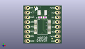
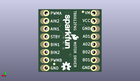
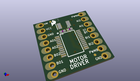

Contents
========

* [PROJ-SPAR-14450-STAN-01>Motor Driver-Dual TB6612FNG](#proj-spar-14450-stan-01motor-driver-dual-tb6612fng)
	* [Images](#images)
	* [Interactive BOM](#interactive-bom)
	* [OOMP Parts](#oomp-parts)
	* [Tags](#tags)
  
![][im]
# PROJ-SPAR-14450-STAN-01>Motor Driver-Dual TB6612FNG

- ID: PROJ-SPAR-14450-STAN-01
- Hex ID: PRS14450
- Name: Motor Driver-Dual TB6612FNG
- Description: 

## Images
  
  

|eagleImage|kicadPcb3dFront|kicadPcb3dBack|kicadPcb3d|
| :---: | :---: | :---: | :---: |
|||||

## Interactive BOM

- Interactive BOM page: [ibom.html](kicad/bom/ibom.html)

## OOMP Parts
  

|OOMP Parts|
| :---: |
|CAPE-0402-X-NF100-01, C1, 11.43, 13.97, 0,C1, 0.1uF, 0402, SparkFun-Capacitors, (0.45, 0.55), R0|
|CAPE-0402-X-NF100-01, C2, 8.889999999999999, 13.97, 180,C2, 0.1uF, 0402, SparkFun-Capacitors, (0.35, 0.55), R180|
|CAPE-UNMATCHED-X-UNMATCHED-01, C3, 10.16, 16.509999999999998, 180,C3, 10uF, EIA3528, SparkFun-Capacitors, (0.4, 0.65), R180|
|UNMATCHED-UNMATCHED-X-UNMATCHED-01, FD1, 6.019799999999999, 19.4818, M0,FD1, FIDUCIALUFIDUCIAL, FIDUCIAL-MICRO, SparkFun-Aesthetics, (0.237, 0.767), MR0|
|UNMATCHED-UNMATCHED-X-UNMATCHED-01, FD2, 15.239999999999998, 2.54, 0,FD2, FIDUCIALUFIDUCIAL, FIDUCIAL-MICRO, SparkFun-Aesthetics, (0.6, 0.1), R0|
|UNMATCHED-UNMATCHED-X-UNMATCHED-01, FD3, 15.239999999999998, 2.54, M0,FD3, FIDUCIALUFIDUCIAL, FIDUCIAL-MICRO, SparkFun-Aesthetics, (0.6, 0.1), MR0|
|UNMATCHED-UNMATCHED-X-UNMATCHED-01, FD4, 6.019799999999999, 19.4818, 0,FD4, FIDUCIALUFIDUCIAL, FIDUCIAL-MICRO, SparkFun-Aesthetics, (0.237, 0.767), R0|
|UNMATCHED-UNMATCHED-X-UNMATCHED-01, JP1, 2.54, 1.27, 90,JP1, 1X08_OFFSET_REDUCED, Testing, (0.1, 0.05), R90|
|UNMATCHED-UNMATCHED-X-UNMATCHED-01, JP2, 17.779999999999998, 19.049999999999997, 270,JP2, 1X08_OFFSET_REDUCED, Testing, (0.7, 0.75), R270|
|UNMATCHED-UNMATCHED-X-UNMATCHED-01, U1, 10.16, 8.889999999999999, 270,U1, TB6612FNG, SSOP24, SparkFun-IC-Special-Function, (0.4, 0.35), R270|

## Tags

- hexID: PRS14450
- oompType: PROJ
- oompSize: SPAR
- oompColor: 14450
- oompDesc: STAN
- oompIndex: 01
- oompName: Motor Driver-Dual TB6612FNG
- sources: All source files from https://github.com/sparkfun/Motor_Driver-Dual_TB6612FNG (source licence details in srcLicense.md)
- linkBuyPage: https://www.sparkfun.com/products/14450
- oompPart: CAPE-0402-X-NF100-01, C1, 11.43, 13.97, 0
- oompPart: CAPE-0402-X-NF100-01, C2, 8.889999999999999, 13.97, 180
- oompPart: CAPE-UNMATCHED-X-UNMATCHED-01, C3, 10.16, 16.509999999999998, 180
- oompPart: UNMATCHED-UNMATCHED-X-UNMATCHED-01, FD1, 6.019799999999999, 19.4818, M0
- oompPart: UNMATCHED-UNMATCHED-X-UNMATCHED-01, FD2, 15.239999999999998, 2.54, 0
- oompPart: UNMATCHED-UNMATCHED-X-UNMATCHED-01, FD3, 15.239999999999998, 2.54, M0
- oompPart: UNMATCHED-UNMATCHED-X-UNMATCHED-01, FD4, 6.019799999999999, 19.4818, 0
- oompPart: UNMATCHED-UNMATCHED-X-UNMATCHED-01, JP1, 2.54, 1.27, 90
- oompPart: UNMATCHED-UNMATCHED-X-UNMATCHED-01, JP2, 17.779999999999998, 19.049999999999997, 270
- oompPart: UNMATCHED-UNMATCHED-X-UNMATCHED-01, U1, 10.16, 8.889999999999999, 270
- rawPart: C1, 0.1uF, 0402, SparkFun-Capacitors, (0.45, 0.55), R0
- rawPart: C2, 0.1uF, 0402, SparkFun-Capacitors, (0.35, 0.55), R180
- rawPart: C3, 10uF, EIA3528, SparkFun-Capacitors, (0.4, 0.65), R180
- rawPart: FD1, FIDUCIALUFIDUCIAL, FIDUCIAL-MICRO, SparkFun-Aesthetics, (0.237, 0.767), MR0
- rawPart: FD2, FIDUCIALUFIDUCIAL, FIDUCIAL-MICRO, SparkFun-Aesthetics, (0.6, 0.1), R0
- rawPart: FD3, FIDUCIALUFIDUCIAL, FIDUCIAL-MICRO, SparkFun-Aesthetics, (0.6, 0.1), MR0
- rawPart: FD4, FIDUCIALUFIDUCIAL, FIDUCIAL-MICRO, SparkFun-Aesthetics, (0.237, 0.767), R0
- rawPart: JP1, 1X08_OFFSET_REDUCED, Testing, (0.1, 0.05), R90
- rawPart: JP2, 1X08_OFFSET_REDUCED, Testing, (0.7, 0.75), R270
- rawPart: U1, TB6612FNG, SSOP24, SparkFun-IC-Special-Function, (0.4, 0.35), R270

[im]: kicadPcb3d_450.png
