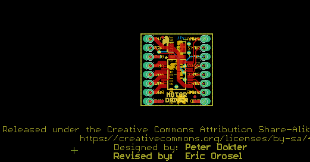
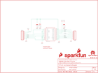

Contents
========

* [PRS14450 > Motor Driver-Dual TB6612FNG](#prs14450--motor-driver-dual-tb6612fng)
	* [Schematic](#schematic)
	* [PCB](#pcb)
	* [Interactive BOM](#interactive-bom)
	* [OOMP Parts](#oomp-parts)
	* [Images](#images)
	* [Tags](#tags)
  
![][im]
# PRS14450 > Motor Driver-Dual TB6612FNG

- ID: PROJ-SPAR-14450-STAN-01
- Hex ID: PRS14450
- Name: Sparkfun
- Description: Sparkfun
- Long Link: [http://oom.lt/PROJ-SPAR-14450-STAN-01](http://oom.lt/PROJ-SPAR-14450-STAN-01)
- Short Link: [http://oom.lt/PRS14450](http://oom.lt/PRS14450)

## Schematic
  

## PCB
  

## Interactive BOM

- Interactive BOM page: [ibom.html](https://htmlpreview.github.io/?https://github.com/oomlout/oomlout_OOMP_projects/blob/main/PROJ-SPAR-14450-STAN-01/kicad/bom/ibom.html)

## OOMP Parts
  

|OOMP Parts|
| :---: |
|CAPC-0402-X-UF1D-01 C1, C2|
|CAPX-3528-X-UF10-01 C3|
|[HEAD-I01-X-PI08-01  2.54 mm 8 Pin Header  JP1, JP2](https://github.com/oomlout/oomlout_OOMP_parts/tree/main/HEAD-I01-X-PI08-01/)|
|UNMATCHED-UNMATCHED-X-UNMATCHED-01 U1|

## Images
  
  

|kicadPcb3d|kicadPcb3dFront|kicadPcb3dBack|eagleImage|eagleSchemImage|
| :---: | :---: | :---: | :---: | :---: |
||||||

## Tags

- hexID: PRS14450
- oompType: PROJ
- oompSize: SPAR
- oompColor: 14450
- oompDesc: STAN
- oompIndex: 01
- oompName: Motor Driver-Dual TB6612FNG
- sources: All source files from https://github.com/sparkfun/Motor_Driver-Dual_TB6612FNG (source licence details in srcLicense.md)
- linkBuyPage: https://www.sparkfun.com/products/14450
- oompID: PROJ-SPAR-14450-STAN-01
- oompParts: C1,CAPC-0402-X-UF1D-01
- oompParts: C2,CAPC-0402-X-UF1D-01
- oompParts: C3,CAPX-3528-X-UF10-01
- oompParts: JP1,HEAD-I01-X-PI08-01
- oompParts: JP2,HEAD-I01-X-PI08-01
- oompParts: U1,UNMATCHED-UNMATCHED-X-UNMATCHED-01
- rawParts: C1,0.1uF,0.1UF-0402-16V-10%,0402,0.1µF ceramic capacitors,CAP-12416,0.1uF,
- rawParts: C2,0.1uF,0.1UF-0402-16V-10%,0402,0.1µF ceramic capacitors,CAP-12416,0.1uF,
- rawParts: C3,10uF,10UF-POLAR-EIA3528-20V-10%(TANT),EIA3528,10.0µF polarized capacitors,CAP-08063,10uF,
- rawParts: FD1,FIDUCIALUFIDUCIAL,FIDUCIALUFIDUCIAL,FIDUCIAL-MICRO,Fiducial Alignment Points,,,
- rawParts: FD2,FIDUCIALUFIDUCIAL,FIDUCIALUFIDUCIAL,FIDUCIAL-MICRO,Fiducial Alignment Points,,,
- rawParts: FD3,FIDUCIALUFIDUCIAL,FIDUCIALUFIDUCIAL,FIDUCIAL-MICRO,Fiducial Alignment Points,,,
- rawParts: FD4,FIDUCIALUFIDUCIAL,FIDUCIALUFIDUCIAL,FIDUCIAL-MICRO,Fiducial Alignment Points,,,
- rawParts: FRAME1,FRAME-LETTER,FRAME-LETTER,CREATIVE_COMMONS,Schematic Frame - Letter,,,
- rawParts: JP1,,M0875_PERCENT_REDUCED,1X08_OFFSET_REDUCED,Header 8,,,
- rawParts: JP2,,M0875_PERCENT_REDUCED,1X08_OFFSET_REDUCED,Header 8,,,
- rawParts: LOGO1,SFE_LOGO_FLAME.1_INCH,SFE_LOGO_FLAME.1_INCH,SFE_LOGO_FLAME_.1,SparkFun Flame Logo,,,
- rawParts: LOGO2,OSHW-LOGOS,OSHW-LOGOS,OSHW-LOGO-S,Open-Source Hardware (OSHW) Logo,,,
- rawParts: LOGO4,SFE_LOGO_NAME_FLAME.1_INCH,SFE_LOGO_NAME_FLAME.1_INCH,SFE_LOGO_NAME_FLAME_.1,SparkFun Font Logo w/ Flame,,,
- rawParts: U1,TB6612FNG,TB6612FNG,SSOP24,Toshiba 1A dual motor driver,IC-09363,TB6612FNG,

[im]: kicadPcb3d_450.png
