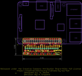
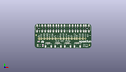
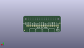
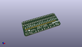

Contents
========

* [PROJ-SPAR-14459-STAN-01>Qwiic Hat for Raspberry Pi](#proj-spar-14459-stan-01qwiic-hat-for-raspberry-pi)
	* [Images](#images)
	* [Interactive BOM](#interactive-bom)
	* [OOMP Parts](#oomp-parts)
	* [Tags](#tags)
  
![][im]
# PROJ-SPAR-14459-STAN-01>Qwiic Hat for Raspberry Pi

- ID: PROJ-SPAR-14459-STAN-01
- Hex ID: PRS14459
- Name: Qwiic Hat for Raspberry Pi
- Description: 

## Images
  
  

|eagleImage|kicadPcb3dFront|kicadPcb3dBack|kicadPcb3d|
| :---: | :---: | :---: | :---: |
|||||

## Interactive BOM

- Interactive BOM page: [ibom.html](kicad/bom/ibom.html)

## OOMP Parts
  

|OOMP Parts|
| :---: |
|CAPE-0603-X-UNMATCHED-01, C1, 3.8099999999999996, 6.35, 0,C1, 1.0uF, 0603, SparkFun-Capacitors, (0.15, 0.25), R0|
|CAPE-0603-X-UNMATCHED-01, C3, 7.619999999999999, 2.54, 270,C3, 1.0uF, 0603, SparkFun-Capacitors, (0.3, 0.1), R270|
|UNMATCHED-UNMATCHED-X-UNMATCHED-01, FD1, 1.27, 12.7, 180,FD1, FIDUCIAL1X2, FIDUCIAL-1X2, SparkFun-Aesthetics, (0.05, 0.5), R180|
|UNMATCHED-UNMATCHED-X-UNMATCHED-01, FD2, 50.8, 2.54, 180,FD2, FIDUCIAL1X2, FIDUCIAL-1X2, SparkFun-Aesthetics, (2, 0.1), R180|
|UNMATCHED-UNMATCHED-X-UNMATCHED-01, FD3, 50.8, 2.54, M0,FD3, FIDUCIAL1X2, FIDUCIAL-1X2, SparkFun-Aesthetics, (2, 0.1), MR0|
|UNMATCHED-UNMATCHED-X-UNMATCHED-01, FD4, 1.27, 12.7, M0,FD4, FIDUCIAL1X2, FIDUCIAL-1X2, SparkFun-Aesthetics, (0.05, 0.5), MR0|
|ERROR, J1 Qwiic Right, 0, 0, 0,J1, Qwiic, Right, Angle, 1X04_1MM_RA, SparkFun-Connectors, (1.55003076, 0.20000468), R0|
|UNMATCHED-UNMATCHED-X-UNMATCHED-01, J2, 19.049999999999997, 8.889999999999999, 0,J2, 1X02_NO_SILK, SparkFun-Connectors, (0.75, 0.35), R0|
|UNMATCHED-UNMATCHED-X-UNMATCHED-01, J3, 24.13, 8.889999999999999, 0,J3, 1X04_NO_SILK, SparkFun-Connectors, (0.95, 0.35), R0|
|UNMATCHED-UNMATCHED-X-UNMATCHED-01, J4, 34.29, 8.889999999999999, 0,J4, 1X06_NO_SILK, SparkFun-Connectors, (1.35, 0.35), R0|
|UNMATCHED-UNMATCHED-X-UNMATCHED-01, J5, 3.8099999999999996, 8.889999999999999, 0,J5, 1X04_NO_SILK, SparkFun-Connectors, (0.15, 0.35), R0|
|ERROR, J6 Qwiic Right, 0, 0, 0,J6, Qwiic, Right, Angle, 1X04_1MM_RA, SparkFun-Connectors, (0.5, 0.2), R0|
|ERROR, J7 Qwiic Right, 0, 0, 0,J7, Qwiic, Right, Angle, 1X04_1MM_RA, SparkFun-Connectors, (0.85, 0.2), R0|
|ERROR, J8 Qwiic Right, 0, 0, 0,J8, Qwiic, Right, Angle, 1X04_1MM_RA, SparkFun-Connectors, (1.2, 0.2), R0|
|UNMATCHED-UNMATCHED-X-UNMATCHED-01, J12, 13.97, 8.889999999999999, 0,J12, 1X02_NO_SILK, SparkFun-Connectors, (0.55, 0.35), R0|
|UNMATCHED-UNMATCHED-X-UNMATCHED-01, U2, 3.8099999999999996, 2.54, 270,U2, 3.3V/600mA, SOT23-5, SparkFun-IC-Power, (0.15, 0.1), R270|
|UNMATCHED-UNMATCHED-X-UNMATCHED-01, U3, -6.35, 13.97, 0,U3, RASPBERRY_PI_SHIELD_BOTTOM_ENTRY_NOHOLES, SparkFun-Connectors, (-0.25, 0.55), R0|

## Tags

- hexID: PRS14459
- oompType: PROJ
- oompSize: SPAR
- oompColor: 14459
- oompDesc: STAN
- oompIndex: 01
- oompName: Qwiic Hat for Raspberry Pi
- sources: All source files from https://github.com/sparkfun/Qwiic_Hat_for_Raspberry_Pi (source licence details in srcLicense.md)
- linkBuyPage: https://www.sparkfun.com/products/14459
- oompPart: CAPE-0603-X-UNMATCHED-01, C1, 3.8099999999999996, 6.35, 0
- oompPart: CAPE-0603-X-UNMATCHED-01, C3, 7.619999999999999, 2.54, 270
- oompPart: UNMATCHED-UNMATCHED-X-UNMATCHED-01, FD1, 1.27, 12.7, 180
- oompPart: UNMATCHED-UNMATCHED-X-UNMATCHED-01, FD2, 50.8, 2.54, 180
- oompPart: UNMATCHED-UNMATCHED-X-UNMATCHED-01, FD3, 50.8, 2.54, M0
- oompPart: UNMATCHED-UNMATCHED-X-UNMATCHED-01, FD4, 1.27, 12.7, M0
- oompPart: ERROR, J1 Qwiic Right, 0, 0, 0
- oompPart: UNMATCHED-UNMATCHED-X-UNMATCHED-01, J2, 19.049999999999997, 8.889999999999999, 0
- oompPart: UNMATCHED-UNMATCHED-X-UNMATCHED-01, J3, 24.13, 8.889999999999999, 0
- oompPart: UNMATCHED-UNMATCHED-X-UNMATCHED-01, J4, 34.29, 8.889999999999999, 0
- oompPart: UNMATCHED-UNMATCHED-X-UNMATCHED-01, J5, 3.8099999999999996, 8.889999999999999, 0
- oompPart: ERROR, J6 Qwiic Right, 0, 0, 0
- oompPart: ERROR, J7 Qwiic Right, 0, 0, 0
- oompPart: ERROR, J8 Qwiic Right, 0, 0, 0
- oompPart: UNMATCHED-UNMATCHED-X-UNMATCHED-01, J12, 13.97, 8.889999999999999, 0
- oompPart: UNMATCHED-UNMATCHED-X-UNMATCHED-01, U2, 3.8099999999999996, 2.54, 270
- oompPart: UNMATCHED-UNMATCHED-X-UNMATCHED-01, U3, -6.35, 13.97, 0
- rawPart: C1, 1.0uF, 0603, SparkFun-Capacitors, (0.15, 0.25), R0
- rawPart: C3, 1.0uF, 0603, SparkFun-Capacitors, (0.3, 0.1), R270
- rawPart: FD1, FIDUCIAL1X2, FIDUCIAL-1X2, SparkFun-Aesthetics, (0.05, 0.5), R180
- rawPart: FD2, FIDUCIAL1X2, FIDUCIAL-1X2, SparkFun-Aesthetics, (2, 0.1), R180
- rawPart: FD3, FIDUCIAL1X2, FIDUCIAL-1X2, SparkFun-Aesthetics, (2, 0.1), MR0
- rawPart: FD4, FIDUCIAL1X2, FIDUCIAL-1X2, SparkFun-Aesthetics, (0.05, 0.5), MR0
- rawPart: J1, Qwiic, Right, Angle, 1X04_1MM_RA, SparkFun-Connectors, (1.55003076, 0.20000468), R0
- rawPart: J2, 1X02_NO_SILK, SparkFun-Connectors, (0.75, 0.35), R0
- rawPart: J3, 1X04_NO_SILK, SparkFun-Connectors, (0.95, 0.35), R0
- rawPart: J4, 1X06_NO_SILK, SparkFun-Connectors, (1.35, 0.35), R0
- rawPart: J5, 1X04_NO_SILK, SparkFun-Connectors, (0.15, 0.35), R0
- rawPart: J6, Qwiic, Right, Angle, 1X04_1MM_RA, SparkFun-Connectors, (0.5, 0.2), R0
- rawPart: J7, Qwiic, Right, Angle, 1X04_1MM_RA, SparkFun-Connectors, (0.85, 0.2), R0
- rawPart: J8, Qwiic, Right, Angle, 1X04_1MM_RA, SparkFun-Connectors, (1.2, 0.2), R0
- rawPart: J12, 1X02_NO_SILK, SparkFun-Connectors, (0.55, 0.35), R0
- rawPart: U2, 3.3V/600mA, SOT23-5, SparkFun-IC-Power, (0.15, 0.1), R270
- rawPart: U3, RASPBERRY_PI_SHIELD_BOTTOM_ENTRY_NOHOLES, SparkFun-Connectors, (-0.25, 0.55), R0

[im]: kicadPcb3d_450.png
