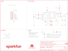

Contents
========

* [PRS14475 > Sparkfun](#prs14475--sparkfun)
	* [Schematic](#schematic)
	* [Interactive BOM](#interactive-bom)
	* [OOMP Parts](#oomp-parts)
	* [Images](#images)
	* [Tags](#tags)
  
![][im]
# PRS14475 > Sparkfun

- ID: PROJ-SPAR-14475-STAN-01
- Hex ID: PRS14475
- Name: Sparkfun
- Description: Sparkfun
- Long Link: [http://oom.lt/PROJ-SPAR-14475-STAN-01](http://oom.lt/PROJ-SPAR-14475-STAN-01)
- Short Link: [http://oom.lt/PRS14475](http://oom.lt/PRS14475)

## Schematic
  

## Interactive BOM

- Interactive BOM page: [ibom.html](https://htmlpreview.github.io/?https://github.com/oomlout/oomlout_OOMP_projects/blob/main/PROJ-SPAR-14475-STAN-01/kicad/bom/ibom.html)

## OOMP Parts
  

|OOMP Parts|
| :---: |
|C1,CAPC-0603-X-UNMATCHED-01,C1,1.0uF,1.0UF-0603-16V-10%-X7R,0603,1µF ceramic capacitors,CAP-13930,1.0uF,|
|C2,CAPC-0603-X-UNMATCHED-01,C2,1.0uF,1.0UF-0603-16V-10%-X7R,0603,1µF ceramic capacitors,CAP-13930,1.0uF,|
|C3,CAPX-UNMATCHED-X-UF100-01,C3,100uF,100UF-POLAR-25V-20%(ELEC),PANASONIC_D,100µF polarized capacitors,CAP-12547,100uF,|
|C4,CAPX-UNMATCHED-X-UF100-01,C4,100uF,100UF-POLAR-25V-20%(ELEC),PANASONIC_D,100µF polarized capacitors,CAP-12547,100uF,|
|C5,CAPC-0603-X-UNMATCHED-01,C5,1.0uF,1.0UF-0603-16V-10%-X7R,0603,1µF ceramic capacitors,CAP-13930,1.0uF,|
|C6,CAPC-0603-X-UNMATCHED-01,C6,1.0uF,1.0UF-0603-16V-10%-X7R,0603,1µF ceramic capacitors,CAP-13930,1.0uF,|
|J1,UNMATCHED-UNMATCHED-X-UNMATCHED-01,FD1,FIDUCIALUFIDUCIAL,FIDUCIALUFIDUCIAL,FIDUCIAL-MICRO,Fiducial Alignment Points,,,|
|JP1,UNMATCHED-UNMATCHED-X-UNMATCHED-01,FD2,FIDUCIALUFIDUCIAL,FIDUCIALUFIDUCIAL,FIDUCIAL-MICRO,Fiducial Alignment Points,,,|
|JP2,UNMATCHED-UNMATCHED-X-UNMATCHED-01,FD3,FIDUCIALUFIDUCIAL,FIDUCIALUFIDUCIAL,FIDUCIAL-MICRO,Fiducial Alignment Points,,,|
|POT1,UNMATCHED-UNMATCHED-X-UNMATCHED-01,FD4,FIDUCIALUFIDUCIAL,FIDUCIALUFIDUCIAL,FIDUCIAL-MICRO,Fiducial Alignment Points,,,|
|R1,RESE-0603-X-UNMATCHED-01,FRAME1,FRAME-LETTER,FRAME-LETTER,CREATIVE_COMMONS,Schematic Frame - Letter,,,|
|R2,RESE-0603-X-UNMATCHED-01,H1,STAND-OFF,STAND-OFF,STAND-OFF,Stand Off,,,|
|R3,RESE-0603-X-O102-01,H2,STAND-OFF,STAND-OFF,STAND-OFF,Stand Off,,,|
|R4,RESE-0603-X-O102-01,J1,,CONN_10NO_SILK_PTH_FEMALE,1X10_NO_SILK,Multi connection point. Often used as Generic Header-pin footprint for 0.1 inch spaced/style header connections,CONN-11563,,|
|R5,RESE-0603-X-O1003-01,JP1,,JUMPER-SMT_2_NO_NO-SILK,SMT-JUMPER_2_NO_NO-SILK,Normally open jumper,,,|
|R6,RESE-0603-X-O1003-01,JP2,,JUMPER-SMT_2_NO_NO-SILK,SMT-JUMPER_2_NO_NO-SILK,Normally open jumper,,,|
|R7,RESE-UNMATCHED-X-UNMATCHED-01,LOGO1,SFE_LOGO_NAME.1_INCH,SFE_LOGO_NAME.1_INCH,SFE_LOGO_NAME_.1,SparkFun Font Logo,,,|
|R8,RESE-UNMATCHED-X-UNMATCHED-01,LOGO2,OSHW-LOGOS,OSHW-LOGOS,OSHW-LOGO-S,Open-Source Hardware (OSHW) Logo,,,|
|U1,UNMATCHED-UNMATCHED-X-UNMATCHED-01,POT1,20k,POTENTIOMETER_DUAL_W/SWITCH,POT-DUAL-SWITCH-PTH,,RES-13814,20k,|

## Images
  
  

|kicadPcb3d|kicadPcb3dFront|kicadPcb3dBack|eagleImage|eagleSchemImage|
| :---: | :---: | :---: | :---: | :---: |
||||||

## Tags

- hexID: PRS14475
- oompType: PROJ
- oompSize: SPAR
- oompColor: 14475
- oompDesc: STAN
- oompIndex: 01
- oompName: Noisy Cricket-1.5W Stereo Amplifier Breakout
- sources: All source files from https://github.com/sparkfun/Noisy_Cricket-1.5W_Stereo_Amplifier_Breakout (source licence details in srcLicense.md)
- linkBuyPage: https://www.sparkfun.com/products/14475
- oompID: PROJ-SPAR-14475-STAN-01
- oompParts: C1,CAPC-0603-X-UNMATCHED-01
- oompParts: C2,CAPC-0603-X-UNMATCHED-01
- oompParts: C3,CAPX-UNMATCHED-X-UF100-01
- oompParts: C4,CAPX-UNMATCHED-X-UF100-01
- oompParts: C5,CAPC-0603-X-UNMATCHED-01
- oompParts: C6,CAPC-0603-X-UNMATCHED-01
- oompParts: J1,UNMATCHED-UNMATCHED-X-UNMATCHED-01
- oompParts: JP1,UNMATCHED-UNMATCHED-X-UNMATCHED-01
- oompParts: JP2,UNMATCHED-UNMATCHED-X-UNMATCHED-01
- oompParts: POT1,UNMATCHED-UNMATCHED-X-UNMATCHED-01
- oompParts: R1,RESE-0603-X-UNMATCHED-01
- oompParts: R2,RESE-0603-X-UNMATCHED-01
- oompParts: R3,RESE-0603-X-O102-01
- oompParts: R4,RESE-0603-X-O102-01
- oompParts: R5,RESE-0603-X-O1003-01
- oompParts: R6,RESE-0603-X-O1003-01
- oompParts: R7,RESE-UNMATCHED-X-UNMATCHED-01
- oompParts: R8,RESE-UNMATCHED-X-UNMATCHED-01
- oompParts: U1,UNMATCHED-UNMATCHED-X-UNMATCHED-01
- rawParts: C1,1.0uF,1.0UF-0603-16V-10%-X7R,0603,1µF ceramic capacitors,CAP-13930,1.0uF,
- rawParts: C2,1.0uF,1.0UF-0603-16V-10%-X7R,0603,1µF ceramic capacitors,CAP-13930,1.0uF,
- rawParts: C3,100uF,100UF-POLAR-25V-20%(ELEC),PANASONIC_D,100µF polarized capacitors,CAP-12547,100uF,
- rawParts: C4,100uF,100UF-POLAR-25V-20%(ELEC),PANASONIC_D,100µF polarized capacitors,CAP-12547,100uF,
- rawParts: C5,1.0uF,1.0UF-0603-16V-10%-X7R,0603,1µF ceramic capacitors,CAP-13930,1.0uF,
- rawParts: C6,1.0uF,1.0UF-0603-16V-10%-X7R,0603,1µF ceramic capacitors,CAP-13930,1.0uF,
- rawParts: FD1,FIDUCIALUFIDUCIAL,FIDUCIALUFIDUCIAL,FIDUCIAL-MICRO,Fiducial Alignment Points,,,
- rawParts: FD2,FIDUCIALUFIDUCIAL,FIDUCIALUFIDUCIAL,FIDUCIAL-MICRO,Fiducial Alignment Points,,,
- rawParts: FD3,FIDUCIALUFIDUCIAL,FIDUCIALUFIDUCIAL,FIDUCIAL-MICRO,Fiducial Alignment Points,,,
- rawParts: FD4,FIDUCIALUFIDUCIAL,FIDUCIALUFIDUCIAL,FIDUCIAL-MICRO,Fiducial Alignment Points,,,
- rawParts: FRAME1,FRAME-LETTER,FRAME-LETTER,CREATIVE_COMMONS,Schematic Frame - Letter,,,
- rawParts: H1,STAND-OFF,STAND-OFF,STAND-OFF,Stand Off,,,
- rawParts: H2,STAND-OFF,STAND-OFF,STAND-OFF,Stand Off,,,
- rawParts: J1,,CONN_10NO_SILK_PTH_FEMALE,1X10_NO_SILK,Multi connection point. Often used as Generic Header-pin footprint for 0.1 inch spaced/style header connections,CONN-11563,,
- rawParts: JP1,,JUMPER-SMT_2_NO_NO-SILK,SMT-JUMPER_2_NO_NO-SILK,Normally open jumper,,,
- rawParts: JP2,,JUMPER-SMT_2_NO_NO-SILK,SMT-JUMPER_2_NO_NO-SILK,Normally open jumper,,,
- rawParts: LOGO1,SFE_LOGO_NAME.1_INCH,SFE_LOGO_NAME.1_INCH,SFE_LOGO_NAME_.1,SparkFun Font Logo,,,
- rawParts: LOGO2,OSHW-LOGOS,OSHW-LOGOS,OSHW-LOGO-S,Open-Source Hardware (OSHW) Logo,,,
- rawParts: POT1,20k,POTENTIOMETER_DUAL_W/SWITCH,POT-DUAL-SWITCH-PTH,,RES-13814,20k,
- rawParts: R1,2.2k,2.2KOHM-0603-1/10W-1%,0603,2.2kΩ resistor,RES-08272,2.2k,
- rawParts: R2,2.2k,2.2KOHM-0603-1/10W-1%,0603,2.2kΩ resistor,RES-08272,2.2k,
- rawParts: R3,1k,1KOHM-0603-1/10W-1%,0603,1kΩ resistor,RES-07856,1k,
- rawParts: R4,1k,1KOHM-0603-1/10W-1%,0603,1kΩ resistor,RES-07856,1k,
- rawParts: R5,100k,100KOHM-0603-1/10W-1%,0603,100kΩ resistor,RES-07828,100k,
- rawParts: R6,100k,100KOHM-0603-1/10W-1%,0603,100kΩ resistor,RES-07828,100k,
- rawParts: R7, ,RESISTORAXIAL-0.3-KIT,AXIAL-0.3-KIT,Generic Resistor Package, , ,
- rawParts: R8, ,RESISTORAXIAL-0.3-KIT,AXIAL-0.3-KIT,Generic Resistor Package, , ,
- rawParts: U1,LM4853,LM4853,TFSOP-10,,IC-13812,LM4853,

[im]: kicadPcb3d_450.png
