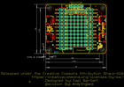
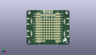
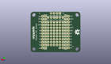
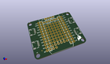

Contents
========

* [PROJ-SPAR-14477-STAN-01>Qwiic Shield for Photon](#proj-spar-14477-stan-01qwiic-shield-for-photon)
	* [Images](#images)
	* [Interactive BOM](#interactive-bom)
	* [Tags](#tags)
  
![][im]
# PROJ-SPAR-14477-STAN-01>Qwiic Shield for Photon

- ID: PROJ-SPAR-14477-STAN-01
- Hex ID: PRS14477
- Name: Qwiic Shield for Photon
- Description: 

## Images
  
  

|eagleImage|kicadPcb3dFront|kicadPcb3dBack|kicadPcb3d|
| :---: | :---: | :---: | :---: |
|||||

## Interactive BOM

- Interactive BOM page: [ibom.html](kicad/bom/ibom.html)

## Tags

- hexID: PRS14477
- oompType: PROJ
- oompSize: SPAR
- oompColor: 14477
- oompDesc: STAN
- oompIndex: 01
- oompName: Qwiic Shield for Photon
- sources: All source files from https://github.com/sparkfun/Qwiic_Shield_for_Photon (source licence details in srcLicense.md)
- linkBuyPage: https://www.sparkfun.com/products/14477
- oompID: PROJ-SPAR-14477-STAN-01
- oompParts: FRAME1,UNMATCHED-UNMATCHED-UNMATCHED-UNMATCHED-UNMATCHED
- oompParts: H1,UNMATCHED-UNMATCHED-UNMATCHED-UNMATCHED-UNMATCHED
- oompParts: H2,UNMATCHED-UNMATCHED-UNMATCHED-UNMATCHED-UNMATCHED
- oompParts: H3,UNMATCHED-UNMATCHED-UNMATCHED-UNMATCHED-UNMATCHED
- oompParts: H4,UNMATCHED-UNMATCHED-UNMATCHED-UNMATCHED-UNMATCHED
- oompParts: J1,UNMATCHED-UNMATCHED-UNMATCHED-UNMATCHED-UNMATCHED
- oompParts: J2,UNMATCHED-UNMATCHED-UNMATCHED-UNMATCHED-UNMATCHED
- oompParts: J3,UNMATCHED-UNMATCHED-UNMATCHED-UNMATCHED-UNMATCHED
- oompParts: J4,UNMATCHED-UNMATCHED-UNMATCHED-UNMATCHED-UNMATCHED
- oompParts: JP1,UNMATCHED-UNMATCHED-UNMATCHED-UNMATCHED-UNMATCHED
- oompParts: JP2,UNMATCHED-UNMATCHED-UNMATCHED-UNMATCHED-UNMATCHED
- oompParts: JP3,UNMATCHED-UNMATCHED-UNMATCHED-UNMATCHED-UNMATCHED
- oompParts: JP4,UNMATCHED-UNMATCHED-UNMATCHED-UNMATCHED-UNMATCHED
- oompParts: JP5,UNMATCHED-UNMATCHED-UNMATCHED-UNMATCHED-UNMATCHED
- oompParts: JP6,UNMATCHED-UNMATCHED-UNMATCHED-UNMATCHED-UNMATCHED
- oompParts: JP7,UNMATCHED-UNMATCHED-UNMATCHED-UNMATCHED-UNMATCHED
- oompParts: JP8,UNMATCHED-UNMATCHED-UNMATCHED-UNMATCHED-UNMATCHED
- oompParts: JP9,UNMATCHED-UNMATCHED-UNMATCHED-UNMATCHED-UNMATCHED
- oompParts: JP10,UNMATCHED-UNMATCHED-UNMATCHED-UNMATCHED-UNMATCHED
- oompParts: LOGO1,UNMATCHED-UNMATCHED-UNMATCHED-UNMATCHED-UNMATCHED
- oompParts: LOGO2,UNMATCHED-UNMATCHED-UNMATCHED-UNMATCHED-UNMATCHED
- oompParts: U$4,UNMATCHED-UNMATCHED-UNMATCHED-UNMATCHED-UNMATCHED
- rawParts: FD1,FIDUCIALUFIDUCIAL,FIDUCIALUFIDUCIAL,FIDUCIAL-MICRO,Fiducial Alignment Points,,,
- rawParts: FD2,FIDUCIALUFIDUCIAL,FIDUCIALUFIDUCIAL,FIDUCIAL-MICRO,Fiducial Alignment Points,,,
- rawParts: FD3,FIDUCIALUFIDUCIAL,FIDUCIALUFIDUCIAL,FIDUCIAL-MICRO,Fiducial Alignment Points,,,
- rawParts: FD4,FIDUCIALUFIDUCIAL,FIDUCIALUFIDUCIAL,FIDUCIAL-MICRO,Fiducial Alignment Points,,,
- rawParts: FRAME1,FRAME-LETTER,FRAME-LETTER,CREATIVE_COMMONS,Schematic Frame - Letter,,,
- rawParts: H1,STAND-OFF,STAND-OFF,STAND-OFF,Stand Off,,,
- rawParts: H2,STAND-OFF,STAND-OFF,STAND-OFF,Stand Off,,,
- rawParts: H3,STAND-OFF,STAND-OFF,STAND-OFF,Stand Off,,,
- rawParts: H4,STAND-OFF,STAND-OFF,STAND-OFF,Stand Off,,,
- rawParts: J1,,QWIIC_CONNECTORJS-1MM,1X04_1MM_RA,SparkFun I2C Standard Qwiic Connector,CONN-13694,,
- rawParts: J2,,QWIIC_CONNECTORJS-1MM,1X04_1MM_RA,SparkFun I2C Standard Qwiic Connector,CONN-13694,,
- rawParts: J3,,QWIIC_CONNECTORJS-1MM,1X04_1MM_RA,SparkFun I2C Standard Qwiic Connector,CONN-13694,,
- rawParts: J4,,I2C_STANDARDJS-1MM,1X04_1MM_RA,SparkFun I2C Standard Pinout Header,,,
- rawParts: JP1,PARTICLE_PHOTONTEMPLATE_NO_STANDOFF,PARTICLE_PHOTONTEMPLATE_NO_STANDOFF,PARTICLE_PHOTON_TEMPLATE_NO_STANDOFF,Particle Photon,,,
- rawParts: JP2,,M04PTH,1X04,Header 4,,,
- rawParts: JP3,,M03PTH,1X03,Header 3,,,
- rawParts: JP4,,M03PTH,1X03,Header 3,,,
- rawParts: JP5,,M10NO_SILK_PTH_FEMALE,1X10_NO_SILK,Header 10,CONN-11563,,
- rawParts: JP6,,M10NO_SILK_PTH_FEMALE,1X10_NO_SILK,Header 10,CONN-11563,,
- rawParts: JP7,,M09NO_SILK,1X09_NO_SILK,Header 9,,,
- rawParts: JP8,,M09NO_SILK,1X09_NO_SILK,Header 9,,,
- rawParts: JP9,,M09NO_SILK,1X09_NO_SILK,Header 9,,,
- rawParts: JP10,,M09NO_SILK,1X09_NO_SILK,Header 9,,,
- rawParts: LOGO1,OSHW-LOGOM,OSHW-LOGOM,OSHW-LOGO-M,Open-Source Hardware (OSHW) Logo,,,
- rawParts: LOGO2,REVISION,REVISION,REVISION,Revision By Text,,,
- rawParts: U$4,SFE_LOGO_NAME.1_INCH,SFE_LOGO_NAME.1_INCH,SFE_LOGO_NAME_.1,SparkFun Font Logo,,,

[im]: kicadPcb3d_450.png
