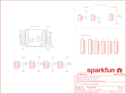

Contents
========

* [PRS14477 > Qwiic Shield for Photon](#prs14477--qwiic-shield-for-photon)
	* [Schematic](#schematic)
	* [PCB](#pcb)
	* [Interactive BOM](#interactive-bom)
	* [OOMP Parts](#oomp-parts)
	* [Images](#images)
	* [Tags](#tags)
  
![][im]
# PRS14477 > Qwiic Shield for Photon

- ID: PROJ-SPAR-14477-STAN-01
- Hex ID: PRS14477
- Name: Sparkfun
- Description: Sparkfun
- Long Link: [http://oom.lt/PROJ-SPAR-14477-STAN-01](http://oom.lt/PROJ-SPAR-14477-STAN-01)
- Short Link: [http://oom.lt/PRS14477](http://oom.lt/PRS14477)

## Schematic
  

## PCB
  

## Interactive BOM

- Interactive BOM page: [ibom.html](https://htmlpreview.github.io/?https://github.com/oomlout/oomlout_OOMP_projects/blob/main/PROJ-SPAR-14477-STAN-01/kicad/bom/ibom.html)

## OOMP Parts
  

|OOMP Parts|
| :---: |
|J1 J1,UNMATCHED-UNMATCHED-X-UNMATCHED-01|
|J2 J2,UNMATCHED-UNMATCHED-X-UNMATCHED-01|
|J3 J3,UNMATCHED-UNMATCHED-X-UNMATCHED-01|
|J4 J4,UNMATCHED-UNMATCHED-X-UNMATCHED-01|
|[JP2 HEAD-I01-X-PI04-01 2.54 mm 4 Pin Header](https://github.com/oomlout/oomlout_OOMP_parts/tree/main/HEAD-I01-X-PI04-01/)|
|[JP3 HEAD-I01-X-PI03-01 2.54 mm 3 Pin Header](https://github.com/oomlout/oomlout_OOMP_parts/tree/main/HEAD-I01-X-PI03-01/)|
|[JP4 HEAD-I01-X-PI03-01 2.54 mm 3 Pin Header](https://github.com/oomlout/oomlout_OOMP_parts/tree/main/HEAD-I01-X-PI03-01/)|
|[JP5 HEAD-I01-X-PI10-01 2.54 mm 10 Pin Header](https://github.com/oomlout/oomlout_OOMP_parts/tree/main/HEAD-I01-X-PI10-01/)|
|[JP6 HEAD-I01-X-PI10-01 2.54 mm 10 Pin Header](https://github.com/oomlout/oomlout_OOMP_parts/tree/main/HEAD-I01-X-PI10-01/)|
|[JP7 HEAD-I01-X-PI09-01 2.54 mm 9 Pin Header](https://github.com/oomlout/oomlout_OOMP_parts/tree/main/HEAD-I01-X-PI09-01/)|
|[JP8 HEAD-I01-X-PI09-01 2.54 mm 9 Pin Header](https://github.com/oomlout/oomlout_OOMP_parts/tree/main/HEAD-I01-X-PI09-01/)|
|[JP9 HEAD-I01-X-PI09-01 2.54 mm 9 Pin Header](https://github.com/oomlout/oomlout_OOMP_parts/tree/main/HEAD-I01-X-PI09-01/)|
|[JP10 HEAD-I01-X-PI09-01 2.54 mm 9 Pin Header](https://github.com/oomlout/oomlout_OOMP_parts/tree/main/HEAD-I01-X-PI09-01/)|

## Images
  
  

|kicadPcb3d|kicadPcb3dFront|kicadPcb3dBack|eagleImage|eagleSchemImage|
| :---: | :---: | :---: | :---: | :---: |
||||||

## Tags

- hexID: PRS14477
- oompType: PROJ
- oompSize: SPAR
- oompColor: 14477
- oompDesc: STAN
- oompIndex: 01
- oompName: Qwiic Shield for Photon
- sources: All source files from https://github.com/sparkfun/Qwiic_Shield_for_Photon (source licence details in srcLicense.md)
- linkBuyPage: https://www.sparkfun.com/products/14477
- oompID: PROJ-SPAR-14477-STAN-01
- oompParts: J1,UNMATCHED-UNMATCHED-X-UNMATCHED-01
- oompParts: J2,UNMATCHED-UNMATCHED-X-UNMATCHED-01
- oompParts: J3,UNMATCHED-UNMATCHED-X-UNMATCHED-01
- oompParts: J4,UNMATCHED-UNMATCHED-X-UNMATCHED-01
- oompParts: JP2,HEAD-I01-X-PI04-01
- oompParts: JP3,HEAD-I01-X-PI03-01
- oompParts: JP4,HEAD-I01-X-PI03-01
- oompParts: JP5,HEAD-I01-X-PI10-01
- oompParts: JP6,HEAD-I01-X-PI10-01
- oompParts: JP7,HEAD-I01-X-PI09-01
- oompParts: JP8,HEAD-I01-X-PI09-01
- oompParts: JP9,HEAD-I01-X-PI09-01
- oompParts: JP10,HEAD-I01-X-PI09-01
- rawParts: FD1,FIDUCIALUFIDUCIAL,FIDUCIALUFIDUCIAL,FIDUCIAL-MICRO,Fiducial Alignment Points,,,
- rawParts: FD2,FIDUCIALUFIDUCIAL,FIDUCIALUFIDUCIAL,FIDUCIAL-MICRO,Fiducial Alignment Points,,,
- rawParts: FD3,FIDUCIALUFIDUCIAL,FIDUCIALUFIDUCIAL,FIDUCIAL-MICRO,Fiducial Alignment Points,,,
- rawParts: FD4,FIDUCIALUFIDUCIAL,FIDUCIALUFIDUCIAL,FIDUCIAL-MICRO,Fiducial Alignment Points,,,
- rawParts: FRAME1,FRAME-LETTER,FRAME-LETTER,CREATIVE_COMMONS,Schematic Frame - Letter,,,
- rawParts: H1,STAND-OFF,STAND-OFF,STAND-OFF,Stand Off,,,
- rawParts: H2,STAND-OFF,STAND-OFF,STAND-OFF,Stand Off,,,
- rawParts: H3,STAND-OFF,STAND-OFF,STAND-OFF,Stand Off,,,
- rawParts: H4,STAND-OFF,STAND-OFF,STAND-OFF,Stand Off,,,
- rawParts: J1,,QWIIC_CONNECTORJS-1MM,1X04_1MM_RA,SparkFun I2C Standard Qwiic Connector,CONN-13694,,
- rawParts: J2,,QWIIC_CONNECTORJS-1MM,1X04_1MM_RA,SparkFun I2C Standard Qwiic Connector,CONN-13694,,
- rawParts: J3,,QWIIC_CONNECTORJS-1MM,1X04_1MM_RA,SparkFun I2C Standard Qwiic Connector,CONN-13694,,
- rawParts: J4,,I2C_STANDARDJS-1MM,1X04_1MM_RA,SparkFun I2C Standard Pinout Header,,,
- rawParts: JP1,PARTICLE_PHOTONTEMPLATE_NO_STANDOFF,PARTICLE_PHOTONTEMPLATE_NO_STANDOFF,PARTICLE_PHOTON_TEMPLATE_NO_STANDOFF,Particle Photon,,,
- rawParts: JP2,,M04PTH,1X04,Header 4,,,
- rawParts: JP3,,M03PTH,1X03,Header 3,,,
- rawParts: JP4,,M03PTH,1X03,Header 3,,,
- rawParts: JP5,,M10NO_SILK_PTH_FEMALE,1X10_NO_SILK,Header 10,CONN-11563,,
- rawParts: JP6,,M10NO_SILK_PTH_FEMALE,1X10_NO_SILK,Header 10,CONN-11563,,
- rawParts: JP7,,M09NO_SILK,1X09_NO_SILK,Header 9,,,
- rawParts: JP8,,M09NO_SILK,1X09_NO_SILK,Header 9,,,
- rawParts: JP9,,M09NO_SILK,1X09_NO_SILK,Header 9,,,
- rawParts: JP10,,M09NO_SILK,1X09_NO_SILK,Header 9,,,
- rawParts: LOGO1,OSHW-LOGOM,OSHW-LOGOM,OSHW-LOGO-M,Open-Source Hardware (OSHW) Logo,,,
- rawParts: LOGO2,REVISION,REVISION,REVISION,Revision By Text,,,
- rawParts: U$4,SFE_LOGO_NAME.1_INCH,SFE_LOGO_NAME.1_INCH,SFE_LOGO_NAME_.1,SparkFun Font Logo,,,

[im]: kicadPcb3d_450.png
