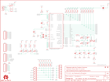

Contents
========

* [PRS14478 > Sparkfun](#prs14478--sparkfun)
	* [Schematic](#schematic)
	* [Interactive BOM](#interactive-bom)
	* [OOMP Parts](#oomp-parts)
	* [Images](#images)
	* [Tags](#tags)
  
![][im]
# PRS14478 > Sparkfun

- ID: PROJ-SPAR-14478-STAN-01
- Hex ID: PRS14478
- Name: Sparkfun
- Description: Sparkfun
- Long Link: [http://oom.lt/PROJ-SPAR-14478-STAN-01](http://oom.lt/PROJ-SPAR-14478-STAN-01)
- Short Link: [http://oom.lt/PRS14478](http://oom.lt/PRS14478)

## Schematic
  

## Interactive BOM

- Interactive BOM page: [ibom.html](https://htmlpreview.github.io/?https://github.com/oomlout/oomlout_OOMP_projects/blob/main/PROJ-SPAR-14478-STAN-01/kicad/bom/ibom.html)

## OOMP Parts
  

|OOMP Parts|
| :---: |
|C1,UNMATCHED-UNMATCHED-UNMATCHED-UNMATCHED-UNMATCHED,C1,0.1uF,CAP0603-CAP,0603-CAP,Capacitor,,|
|C2,UNMATCHED-UNMATCHED-UNMATCHED-UNMATCHED-UNMATCHED,C2,1uF,CAP0603-CAP,0603-CAP,Capacitor,,|
|C3,UNMATCHED-UNMATCHED-UNMATCHED-UNMATCHED-UNMATCHED,C3,22pF,CAP0603-CAP,0603-CAP,Capacitor,,|
|C4,UNMATCHED-UNMATCHED-UNMATCHED-UNMATCHED-UNMATCHED,C4,22pF,CAP0603-CAP,0603-CAP,Capacitor,,|
|C5,UNMATCHED-UNMATCHED-UNMATCHED-UNMATCHED-UNMATCHED,C5,0.1uF,CAP0603-CAP,0603-CAP,Capacitor,,|
|C6,UNMATCHED-UNMATCHED-UNMATCHED-UNMATCHED-UNMATCHED,C6,1uF,CAP0603-CAP,0603-CAP,Capacitor,,|
|C7,UNMATCHED-UNMATCHED-UNMATCHED-UNMATCHED-UNMATCHED,C7,10uF,CAP_POL1206,EIA3216,Capacitor Polarized,,|
|C8,UNMATCHED-UNMATCHED-UNMATCHED-UNMATCHED-UNMATCHED,C8,0.1uF,CAP0603-CAP,0603-CAP,Capacitor,,|
|CLICK,UNMATCHED-UNMATCHED-UNMATCHED-UNMATCHED-UNMATCHED,CLICK,,M01ALLIGATOR-3MM,1X01_ALLIGATOR_3MM,Header 1,,|
|DOWN,UNMATCHED-UNMATCHED-UNMATCHED-UNMATCHED-UNMATCHED,DOWN,,M01ALLIGATOR-3MM,1X01_ALLIGATOR_3MM,Header 1,,|
|F1,UNMATCHED-UNMATCHED-UNMATCHED-UNMATCHED-UNMATCHED,F1,500mA,PTCSMD-W,PTC-1206-WIDE,Resettable Fuse PTC,,|
|JP3,UNMATCHED-UNMATCHED-UNMATCHED-UNMATCHED-UNMATCHED,JP1,FIDUCIALUFIDUCIAL,FIDUCIALUFIDUCIAL,MICRO-FIDUCIAL,Fiducial Alignment Points,,|
|JP5,UNMATCHED-UNMATCHED-UNMATCHED-UNMATCHED-UNMATCHED,JP2,FIDUCIALUFIDUCIAL,FIDUCIALUFIDUCIAL,MICRO-FIDUCIAL,Fiducial Alignment Points,,|
|JP6,UNMATCHED-UNMATCHED-UNMATCHED-UNMATCHED-UNMATCHED,JP3,,M06SMD-STRAIGHT-COMBO,1X06_SMD_STRAIGHT_COMBO,Header 6,,|
|JP7,UNMATCHED-UNMATCHED-UNMATCHED-UNMATCHED-UNMATCHED,JP5,,M01ALLIGATOR-3MM,1X01_ALLIGATOR_3MM,Header 1,,|
|JP8,UNMATCHED-UNMATCHED-UNMATCHED-UNMATCHED-UNMATCHED,JP6,,M01ALLIGATOR-3MM,1X01_ALLIGATOR_3MM,Header 1,,|
|JP9,UNMATCHED-UNMATCHED-UNMATCHED-UNMATCHED-UNMATCHED,JP7,,M01ALLIGATOR-3MM,1X01_ALLIGATOR_3MM,Header 1,,|
|JP10,UNMATCHED-UNMATCHED-UNMATCHED-UNMATCHED-UNMATCHED,JP8,,M01ALLIGATOR-3MM,1X01_ALLIGATOR_3MM,Header 1,,|
|JP11,UNMATCHED-UNMATCHED-UNMATCHED-UNMATCHED-UNMATCHED,JP9,LOGO-SFENEW,LOGO-SFENEW,SFE-NEW-WEBLOGO,Spark Fun Electronics PCB Logo,,|
|JP12,UNMATCHED-UNMATCHED-UNMATCHED-UNMATCHED-UNMATCHED,JP10,,M01ALLIGATOR-3MM,1X01_ALLIGATOR_3MM,Header 1,,|
|JP13,UNMATCHED-UNMATCHED-UNMATCHED-UNMATCHED-UNMATCHED,JP11,,M01ALLIGATOR-3MM,1X01_ALLIGATOR_3MM,Header 1,,|
|JP14,UNMATCHED-UNMATCHED-UNMATCHED-UNMATCHED-UNMATCHED,JP12,,M06SMD-STRAIGHT-COMBO,1X06_SMD_STRAIGHT_COMBO,Header 6,,|
|LED1,UNMATCHED-UNMATCHED-UNMATCHED-UNMATCHED-UNMATCHED,JP13,,M06SMD-STRAIGHT-COMBO,1X06_SMD_STRAIGHT_COMBO,Header 6,,|
|LED2,UNMATCHED-UNMATCHED-UNMATCHED-UNMATCHED-UNMATCHED,JP14,,M06SMD-STRAIGHT-COMBO,1X06_SMD_STRAIGHT_COMBO,Header 6,,|
|LED3,UNMATCHED-UNMATCHED-UNMATCHED-UNMATCHED-UNMATCHED,LED1,GREEN,LED1206-BOTTOM,LED-1206-BOTTOM,LEDs,,|
|LED4,UNMATCHED-UNMATCHED-UNMATCHED-UNMATCHED-UNMATCHED,LED2,GREEN,LED1206-BOTTOM,LED-1206-BOTTOM,LEDs,,|
|LED5,UNMATCHED-UNMATCHED-UNMATCHED-UNMATCHED-UNMATCHED,LED3,GREEN,LED1206-BOTTOM,LED-1206-BOTTOM,LEDs,,|
|LED6,UNMATCHED-UNMATCHED-UNMATCHED-UNMATCHED-UNMATCHED,LED4,GREEN,LED1206-BOTTOM,LED-1206-BOTTOM,LEDs,,|
|LED7,UNMATCHED-UNMATCHED-UNMATCHED-UNMATCHED-UNMATCHED,LED5,GREEN,LED1206-BOTTOM,LED-1206-BOTTOM,LEDs,,|
|LED8,UNMATCHED-UNMATCHED-UNMATCHED-UNMATCHED-UNMATCHED,LED6,GREEN,LED1206-BOTTOM,LED-1206-BOTTOM,LEDs,,|
|LED9,UNMATCHED-UNMATCHED-UNMATCHED-UNMATCHED-UNMATCHED,LED7,RED,LED0603,LED-0603,LEDs,,|
|LED10,UNMATCHED-UNMATCHED-UNMATCHED-UNMATCHED-UNMATCHED,LED8,GREEN,LED0603,LED-0603,LEDs,,|
|LED11,UNMATCHED-UNMATCHED-UNMATCHED-UNMATCHED-UNMATCHED,LED9,GREEN,LED0603,LED-0603,LEDs,,|
|LEFT,UNMATCHED-UNMATCHED-UNMATCHED-UNMATCHED-UNMATCHED,LED10,RED,LED0603,LED-0603,LEDs,,|
|R1,UNMATCHED-UNMATCHED-UNMATCHED-UNMATCHED-UNMATCHED,LED11,RED,LED0603,LED-0603,LEDs,,|
|R2,UNMATCHED-UNMATCHED-UNMATCHED-UNMATCHED-UNMATCHED,LEFT,,M01ALLIGATOR-3MM,1X01_ALLIGATOR_3MM,Header 1,,|
|R3,UNMATCHED-UNMATCHED-UNMATCHED-UNMATCHED-UNMATCHED,R1,22,RESISTOR0603-RES,0603-RES,Resistor,,|
|R4,UNMATCHED-UNMATCHED-UNMATCHED-UNMATCHED-UNMATCHED,R2,22,RESISTOR0603-RES,0603-RES,Resistor,,|
|R5,UNMATCHED-UNMATCHED-UNMATCHED-UNMATCHED-UNMATCHED,R3,10K,RESISTOR0603-RES,0603-RES,Resistor,,|
|R6,UNMATCHED-UNMATCHED-UNMATCHED-UNMATCHED-UNMATCHED,R4,22M,RESISTOR0603-RES,0603-RES,Resistor,,|
|R7,UNMATCHED-UNMATCHED-UNMATCHED-UNMATCHED-UNMATCHED,R5,22M,RESISTOR0603-RES,0603-RES,Resistor,,|
|R8,UNMATCHED-UNMATCHED-UNMATCHED-UNMATCHED-UNMATCHED,R6,22M,RESISTOR0603-RES,0603-RES,Resistor,,|
|R9,UNMATCHED-UNMATCHED-UNMATCHED-UNMATCHED-UNMATCHED,R7,22M,RESISTOR0603-RES,0603-RES,Resistor,,|
|R10,UNMATCHED-UNMATCHED-UNMATCHED-UNMATCHED-UNMATCHED,R8,22M,RESISTOR0603-RES,0603-RES,Resistor,,|
|R11,UNMATCHED-UNMATCHED-UNMATCHED-UNMATCHED-UNMATCHED,R9,22M,RESISTOR0603-RES,0603-RES,Resistor,,|
|R12,UNMATCHED-UNMATCHED-UNMATCHED-UNMATCHED-UNMATCHED,R10,22M,RESISTOR0603-RES,0603-RES,Resistor,,|
|R13,UNMATCHED-UNMATCHED-UNMATCHED-UNMATCHED-UNMATCHED,R11,22M,RESISTOR0603-RES,0603-RES,Resistor,,|
|R14,UNMATCHED-UNMATCHED-UNMATCHED-UNMATCHED-UNMATCHED,R12,22M,RESISTOR0603-RES,0603-RES,Resistor,,|
|R15,UNMATCHED-UNMATCHED-UNMATCHED-UNMATCHED-UNMATCHED,R13,22M,RESISTOR0603-RES,0603-RES,Resistor,,|
|R16,UNMATCHED-UNMATCHED-UNMATCHED-UNMATCHED-UNMATCHED,R14,22M,RESISTOR0603-RES,0603-RES,Resistor,,|
|R17,UNMATCHED-UNMATCHED-UNMATCHED-UNMATCHED-UNMATCHED,R15,22M,RESISTOR0603-RES,0603-RES,Resistor,,|
|R18,UNMATCHED-UNMATCHED-UNMATCHED-UNMATCHED-UNMATCHED,R16,1k,RESISTOR0603-RES,0603-RES,Resistor,,|
|R19,UNMATCHED-UNMATCHED-UNMATCHED-UNMATCHED-UNMATCHED,R17,330,RESISTOR0603-RES,0603-RES,Resistor,,|
|R20,UNMATCHED-UNMATCHED-UNMATCHED-UNMATCHED-UNMATCHED,R18,330,RESISTOR0603-RES,0603-RES,Resistor,,|
|R21,UNMATCHED-UNMATCHED-UNMATCHED-UNMATCHED-UNMATCHED,R19,1k,RESISTOR0603-RES,0603-RES,Resistor,,|
|R22,UNMATCHED-UNMATCHED-UNMATCHED-UNMATCHED-UNMATCHED,R20,330,RESISTOR0603-RES,0603-RES,Resistor,,|
|R23,UNMATCHED-UNMATCHED-UNMATCHED-UNMATCHED-UNMATCHED,R21,330,RESISTOR0603-RES,0603-RES,Resistor,,|
|R24,UNMATCHED-UNMATCHED-UNMATCHED-UNMATCHED-UNMATCHED,R22,330,RESISTOR0603-RES,0603-RES,Resistor,,|
|R25,UNMATCHED-UNMATCHED-UNMATCHED-UNMATCHED-UNMATCHED,R23,1k,RESISTOR0603-RES,0603-RES,Resistor,,|
|R26,UNMATCHED-UNMATCHED-UNMATCHED-UNMATCHED-UNMATCHED,R24,22M,RESISTOR0603-RES,0603-RES,Resistor,,|
|R27,UNMATCHED-UNMATCHED-UNMATCHED-UNMATCHED-UNMATCHED,R25,22M,RESISTOR0603-RES,0603-RES,Resistor,,|
|R28,UNMATCHED-UNMATCHED-UNMATCHED-UNMATCHED-UNMATCHED,R26,22M,RESISTOR0603-RES,0603-RES,Resistor,,|
|R29,UNMATCHED-UNMATCHED-UNMATCHED-UNMATCHED-UNMATCHED,R27,22M,RESISTOR0603-RES,0603-RES,Resistor,,|
|RIGHT,UNMATCHED-UNMATCHED-UNMATCHED-UNMATCHED-UNMATCHED,R28,22M,RESISTOR0603-RES,0603-RES,Resistor,,|
|SJ1,UNMATCHED-UNMATCHED-UNMATCHED-UNMATCHED-UNMATCHED,R29,22M,RESISTOR0603-RES,0603-RES,Resistor,,|
|SPACE,UNMATCHED-UNMATCHED-UNMATCHED-UNMATCHED-UNMATCHED,RIGHT,,M01ALLIGATOR-3MM,1X01_ALLIGATOR_3MM,Header 1,,|
|U$1,UNMATCHED-UNMATCHED-UNMATCHED-UNMATCHED-UNMATCHED,SJ1,Pull-ups,SOLDERJUMPER-OLDTRACE,SJ_2S-TRACE,Solder Jumper,,|
|U1,UNMATCHED-UNMATCHED-UNMATCHED-UNMATCHED-UNMATCHED,SPACE,,M01ALLIGATOR-3MM,1X01_ALLIGATOR_3MM,Header 1,,|
|UP,UNMATCHED-UNMATCHED-UNMATCHED-UNMATCHED-UNMATCHED,U$1,OSHW-LOGOM,OSHW-LOGOM,OSHW-LOGO-M,Open Source Hardware Logo This logo indicates the piece of hardware it is found on incorporates a OSHW license and/or adheres to the definition of open source hardware found here: http://freedomdefined.org/OSHW,,|
|X1,UNMATCHED-UNMATCHED-UNMATCHED-UNMATCHED-UNMATCHED,U1,ATMEGA32U4TQFP,ATMEGA32U4TQFP,TQFP44,Atmel 44-pin 8-bit Microcontroller with 32KBytes of ISP Flash and USB Controller,,|
|Y1,UNMATCHED-UNMATCHED-UNMATCHED-UNMATCHED-UNMATCHED,UP,,M01ALLIGATOR-3MM,1X01_ALLIGATOR_3MM,Header 1,,|

## Images
  
  

|kicadPcb3d|kicadPcb3dFront|kicadPcb3dBack|eagleImage|eagleSchemImage|
| :---: | :---: | :---: | :---: | :---: |
||||||

## Tags

- hexID: PRS14478
- oompType: PROJ
- oompSize: SPAR
- oompColor: 14478
- oompDesc: STAN
- oompIndex: 01
- oompName: MaKeyMaKey
- sources: All source files from https://github.com/sparkfun/MaKeyMaKey (source licence details in srcLicense.md)
- linkBuyPage: https://www.sparkfun.com/products/14478
- oompID: PROJ-SPAR-14478-STAN-01
- oompParts: C1,UNMATCHED-UNMATCHED-UNMATCHED-UNMATCHED-UNMATCHED
- oompParts: C2,UNMATCHED-UNMATCHED-UNMATCHED-UNMATCHED-UNMATCHED
- oompParts: C3,UNMATCHED-UNMATCHED-UNMATCHED-UNMATCHED-UNMATCHED
- oompParts: C4,UNMATCHED-UNMATCHED-UNMATCHED-UNMATCHED-UNMATCHED
- oompParts: C5,UNMATCHED-UNMATCHED-UNMATCHED-UNMATCHED-UNMATCHED
- oompParts: C6,UNMATCHED-UNMATCHED-UNMATCHED-UNMATCHED-UNMATCHED
- oompParts: C7,UNMATCHED-UNMATCHED-UNMATCHED-UNMATCHED-UNMATCHED
- oompParts: C8,UNMATCHED-UNMATCHED-UNMATCHED-UNMATCHED-UNMATCHED
- oompParts: CLICK,UNMATCHED-UNMATCHED-UNMATCHED-UNMATCHED-UNMATCHED
- oompParts: DOWN,UNMATCHED-UNMATCHED-UNMATCHED-UNMATCHED-UNMATCHED
- oompParts: F1,UNMATCHED-UNMATCHED-UNMATCHED-UNMATCHED-UNMATCHED
- oompParts: JP3,UNMATCHED-UNMATCHED-UNMATCHED-UNMATCHED-UNMATCHED
- oompParts: JP5,UNMATCHED-UNMATCHED-UNMATCHED-UNMATCHED-UNMATCHED
- oompParts: JP6,UNMATCHED-UNMATCHED-UNMATCHED-UNMATCHED-UNMATCHED
- oompParts: JP7,UNMATCHED-UNMATCHED-UNMATCHED-UNMATCHED-UNMATCHED
- oompParts: JP8,UNMATCHED-UNMATCHED-UNMATCHED-UNMATCHED-UNMATCHED
- oompParts: JP9,UNMATCHED-UNMATCHED-UNMATCHED-UNMATCHED-UNMATCHED
- oompParts: JP10,UNMATCHED-UNMATCHED-UNMATCHED-UNMATCHED-UNMATCHED
- oompParts: JP11,UNMATCHED-UNMATCHED-UNMATCHED-UNMATCHED-UNMATCHED
- oompParts: JP12,UNMATCHED-UNMATCHED-UNMATCHED-UNMATCHED-UNMATCHED
- oompParts: JP13,UNMATCHED-UNMATCHED-UNMATCHED-UNMATCHED-UNMATCHED
- oompParts: JP14,UNMATCHED-UNMATCHED-UNMATCHED-UNMATCHED-UNMATCHED
- oompParts: LED1,UNMATCHED-UNMATCHED-UNMATCHED-UNMATCHED-UNMATCHED
- oompParts: LED2,UNMATCHED-UNMATCHED-UNMATCHED-UNMATCHED-UNMATCHED
- oompParts: LED3,UNMATCHED-UNMATCHED-UNMATCHED-UNMATCHED-UNMATCHED
- oompParts: LED4,UNMATCHED-UNMATCHED-UNMATCHED-UNMATCHED-UNMATCHED
- oompParts: LED5,UNMATCHED-UNMATCHED-UNMATCHED-UNMATCHED-UNMATCHED
- oompParts: LED6,UNMATCHED-UNMATCHED-UNMATCHED-UNMATCHED-UNMATCHED
- oompParts: LED7,UNMATCHED-UNMATCHED-UNMATCHED-UNMATCHED-UNMATCHED
- oompParts: LED8,UNMATCHED-UNMATCHED-UNMATCHED-UNMATCHED-UNMATCHED
- oompParts: LED9,UNMATCHED-UNMATCHED-UNMATCHED-UNMATCHED-UNMATCHED
- oompParts: LED10,UNMATCHED-UNMATCHED-UNMATCHED-UNMATCHED-UNMATCHED
- oompParts: LED11,UNMATCHED-UNMATCHED-UNMATCHED-UNMATCHED-UNMATCHED
- oompParts: LEFT,UNMATCHED-UNMATCHED-UNMATCHED-UNMATCHED-UNMATCHED
- oompParts: R1,UNMATCHED-UNMATCHED-UNMATCHED-UNMATCHED-UNMATCHED
- oompParts: R2,UNMATCHED-UNMATCHED-UNMATCHED-UNMATCHED-UNMATCHED
- oompParts: R3,UNMATCHED-UNMATCHED-UNMATCHED-UNMATCHED-UNMATCHED
- oompParts: R4,UNMATCHED-UNMATCHED-UNMATCHED-UNMATCHED-UNMATCHED
- oompParts: R5,UNMATCHED-UNMATCHED-UNMATCHED-UNMATCHED-UNMATCHED
- oompParts: R6,UNMATCHED-UNMATCHED-UNMATCHED-UNMATCHED-UNMATCHED
- oompParts: R7,UNMATCHED-UNMATCHED-UNMATCHED-UNMATCHED-UNMATCHED
- oompParts: R8,UNMATCHED-UNMATCHED-UNMATCHED-UNMATCHED-UNMATCHED
- oompParts: R9,UNMATCHED-UNMATCHED-UNMATCHED-UNMATCHED-UNMATCHED
- oompParts: R10,UNMATCHED-UNMATCHED-UNMATCHED-UNMATCHED-UNMATCHED
- oompParts: R11,UNMATCHED-UNMATCHED-UNMATCHED-UNMATCHED-UNMATCHED
- oompParts: R12,UNMATCHED-UNMATCHED-UNMATCHED-UNMATCHED-UNMATCHED
- oompParts: R13,UNMATCHED-UNMATCHED-UNMATCHED-UNMATCHED-UNMATCHED
- oompParts: R14,UNMATCHED-UNMATCHED-UNMATCHED-UNMATCHED-UNMATCHED
- oompParts: R15,UNMATCHED-UNMATCHED-UNMATCHED-UNMATCHED-UNMATCHED
- oompParts: R16,UNMATCHED-UNMATCHED-UNMATCHED-UNMATCHED-UNMATCHED
- oompParts: R17,UNMATCHED-UNMATCHED-UNMATCHED-UNMATCHED-UNMATCHED
- oompParts: R18,UNMATCHED-UNMATCHED-UNMATCHED-UNMATCHED-UNMATCHED
- oompParts: R19,UNMATCHED-UNMATCHED-UNMATCHED-UNMATCHED-UNMATCHED
- oompParts: R20,UNMATCHED-UNMATCHED-UNMATCHED-UNMATCHED-UNMATCHED
- oompParts: R21,UNMATCHED-UNMATCHED-UNMATCHED-UNMATCHED-UNMATCHED
- oompParts: R22,UNMATCHED-UNMATCHED-UNMATCHED-UNMATCHED-UNMATCHED
- oompParts: R23,UNMATCHED-UNMATCHED-UNMATCHED-UNMATCHED-UNMATCHED
- oompParts: R24,UNMATCHED-UNMATCHED-UNMATCHED-UNMATCHED-UNMATCHED
- oompParts: R25,UNMATCHED-UNMATCHED-UNMATCHED-UNMATCHED-UNMATCHED
- oompParts: R26,UNMATCHED-UNMATCHED-UNMATCHED-UNMATCHED-UNMATCHED
- oompParts: R27,UNMATCHED-UNMATCHED-UNMATCHED-UNMATCHED-UNMATCHED
- oompParts: R28,UNMATCHED-UNMATCHED-UNMATCHED-UNMATCHED-UNMATCHED
- oompParts: R29,UNMATCHED-UNMATCHED-UNMATCHED-UNMATCHED-UNMATCHED
- oompParts: RIGHT,UNMATCHED-UNMATCHED-UNMATCHED-UNMATCHED-UNMATCHED
- oompParts: SJ1,UNMATCHED-UNMATCHED-UNMATCHED-UNMATCHED-UNMATCHED
- oompParts: SPACE,UNMATCHED-UNMATCHED-UNMATCHED-UNMATCHED-UNMATCHED
- oompParts: U$1,UNMATCHED-UNMATCHED-UNMATCHED-UNMATCHED-UNMATCHED
- oompParts: U1,UNMATCHED-UNMATCHED-UNMATCHED-UNMATCHED-UNMATCHED
- oompParts: UP,UNMATCHED-UNMATCHED-UNMATCHED-UNMATCHED-UNMATCHED
- oompParts: X1,UNMATCHED-UNMATCHED-UNMATCHED-UNMATCHED-UNMATCHED
- oompParts: Y1,UNMATCHED-UNMATCHED-UNMATCHED-UNMATCHED-UNMATCHED
- rawParts: C1,0.1uF,CAP0603-CAP,0603-CAP,Capacitor,,
- rawParts: C2,1uF,CAP0603-CAP,0603-CAP,Capacitor,,
- rawParts: C3,22pF,CAP0603-CAP,0603-CAP,Capacitor,,
- rawParts: C4,22pF,CAP0603-CAP,0603-CAP,Capacitor,,
- rawParts: C5,0.1uF,CAP0603-CAP,0603-CAP,Capacitor,,
- rawParts: C6,1uF,CAP0603-CAP,0603-CAP,Capacitor,,
- rawParts: C7,10uF,CAP_POL1206,EIA3216,Capacitor Polarized,,
- rawParts: C8,0.1uF,CAP0603-CAP,0603-CAP,Capacitor,,
- rawParts: CLICK,,M01ALLIGATOR-3MM,1X01_ALLIGATOR_3MM,Header 1,,
- rawParts: DOWN,,M01ALLIGATOR-3MM,1X01_ALLIGATOR_3MM,Header 1,,
- rawParts: F1,500mA,PTCSMD-W,PTC-1206-WIDE,Resettable Fuse PTC,,
- rawParts: JP1,FIDUCIALUFIDUCIAL,FIDUCIALUFIDUCIAL,MICRO-FIDUCIAL,Fiducial Alignment Points,,
- rawParts: JP2,FIDUCIALUFIDUCIAL,FIDUCIALUFIDUCIAL,MICRO-FIDUCIAL,Fiducial Alignment Points,,
- rawParts: JP3,,M06SMD-STRAIGHT-COMBO,1X06_SMD_STRAIGHT_COMBO,Header 6,,
- rawParts: JP5,,M01ALLIGATOR-3MM,1X01_ALLIGATOR_3MM,Header 1,,
- rawParts: JP6,,M01ALLIGATOR-3MM,1X01_ALLIGATOR_3MM,Header 1,,
- rawParts: JP7,,M01ALLIGATOR-3MM,1X01_ALLIGATOR_3MM,Header 1,,
- rawParts: JP8,,M01ALLIGATOR-3MM,1X01_ALLIGATOR_3MM,Header 1,,
- rawParts: JP9,LOGO-SFENEW,LOGO-SFENEW,SFE-NEW-WEBLOGO,Spark Fun Electronics PCB Logo,,
- rawParts: JP10,,M01ALLIGATOR-3MM,1X01_ALLIGATOR_3MM,Header 1,,
- rawParts: JP11,,M01ALLIGATOR-3MM,1X01_ALLIGATOR_3MM,Header 1,,
- rawParts: JP12,,M06SMD-STRAIGHT-COMBO,1X06_SMD_STRAIGHT_COMBO,Header 6,,
- rawParts: JP13,,M06SMD-STRAIGHT-COMBO,1X06_SMD_STRAIGHT_COMBO,Header 6,,
- rawParts: JP14,,M06SMD-STRAIGHT-COMBO,1X06_SMD_STRAIGHT_COMBO,Header 6,,
- rawParts: LED1,GREEN,LED1206-BOTTOM,LED-1206-BOTTOM,LEDs,,
- rawParts: LED2,GREEN,LED1206-BOTTOM,LED-1206-BOTTOM,LEDs,,
- rawParts: LED3,GREEN,LED1206-BOTTOM,LED-1206-BOTTOM,LEDs,,
- rawParts: LED4,GREEN,LED1206-BOTTOM,LED-1206-BOTTOM,LEDs,,
- rawParts: LED5,GREEN,LED1206-BOTTOM,LED-1206-BOTTOM,LEDs,,
- rawParts: LED6,GREEN,LED1206-BOTTOM,LED-1206-BOTTOM,LEDs,,
- rawParts: LED7,RED,LED0603,LED-0603,LEDs,,
- rawParts: LED8,GREEN,LED0603,LED-0603,LEDs,,
- rawParts: LED9,GREEN,LED0603,LED-0603,LEDs,,
- rawParts: LED10,RED,LED0603,LED-0603,LEDs,,
- rawParts: LED11,RED,LED0603,LED-0603,LEDs,,
- rawParts: LEFT,,M01ALLIGATOR-3MM,1X01_ALLIGATOR_3MM,Header 1,,
- rawParts: R1,22,RESISTOR0603-RES,0603-RES,Resistor,,
- rawParts: R2,22,RESISTOR0603-RES,0603-RES,Resistor,,
- rawParts: R3,10K,RESISTOR0603-RES,0603-RES,Resistor,,
- rawParts: R4,22M,RESISTOR0603-RES,0603-RES,Resistor,,
- rawParts: R5,22M,RESISTOR0603-RES,0603-RES,Resistor,,
- rawParts: R6,22M,RESISTOR0603-RES,0603-RES,Resistor,,
- rawParts: R7,22M,RESISTOR0603-RES,0603-RES,Resistor,,
- rawParts: R8,22M,RESISTOR0603-RES,0603-RES,Resistor,,
- rawParts: R9,22M,RESISTOR0603-RES,0603-RES,Resistor,,
- rawParts: R10,22M,RESISTOR0603-RES,0603-RES,Resistor,,
- rawParts: R11,22M,RESISTOR0603-RES,0603-RES,Resistor,,
- rawParts: R12,22M,RESISTOR0603-RES,0603-RES,Resistor,,
- rawParts: R13,22M,RESISTOR0603-RES,0603-RES,Resistor,,
- rawParts: R14,22M,RESISTOR0603-RES,0603-RES,Resistor,,
- rawParts: R15,22M,RESISTOR0603-RES,0603-RES,Resistor,,
- rawParts: R16,1k,RESISTOR0603-RES,0603-RES,Resistor,,
- rawParts: R17,330,RESISTOR0603-RES,0603-RES,Resistor,,
- rawParts: R18,330,RESISTOR0603-RES,0603-RES,Resistor,,
- rawParts: R19,1k,RESISTOR0603-RES,0603-RES,Resistor,,
- rawParts: R20,330,RESISTOR0603-RES,0603-RES,Resistor,,
- rawParts: R21,330,RESISTOR0603-RES,0603-RES,Resistor,,
- rawParts: R22,330,RESISTOR0603-RES,0603-RES,Resistor,,
- rawParts: R23,1k,RESISTOR0603-RES,0603-RES,Resistor,,
- rawParts: R24,22M,RESISTOR0603-RES,0603-RES,Resistor,,
- rawParts: R25,22M,RESISTOR0603-RES,0603-RES,Resistor,,
- rawParts: R26,22M,RESISTOR0603-RES,0603-RES,Resistor,,
- rawParts: R27,22M,RESISTOR0603-RES,0603-RES,Resistor,,
- rawParts: R28,22M,RESISTOR0603-RES,0603-RES,Resistor,,
- rawParts: R29,22M,RESISTOR0603-RES,0603-RES,Resistor,,
- rawParts: RIGHT,,M01ALLIGATOR-3MM,1X01_ALLIGATOR_3MM,Header 1,,
- rawParts: SJ1,Pull-ups,SOLDERJUMPER-OLDTRACE,SJ_2S-TRACE,Solder Jumper,,
- rawParts: SPACE,,M01ALLIGATOR-3MM,1X01_ALLIGATOR_3MM,Header 1,,
- rawParts: U$1,OSHW-LOGOM,OSHW-LOGOM,OSHW-LOGO-M,Open Source Hardware Logo This logo indicates the piece of hardware it is found on incorporates a OSHW license and/or adheres to the definition of open source hardware found here: http://freedomdefined.org/OSHW,,
- rawParts: U1,ATMEGA32U4TQFP,ATMEGA32U4TQFP,TQFP44,Atmel 44-pin 8-bit Microcontroller with 32KBytes of ISP Flash and USB Controller,,
- rawParts: UP,,M01ALLIGATOR-3MM,1X01_ALLIGATOR_3MM,Header 1,,
- rawParts: X1,USBSMD,USBSMD,USB-MINIB,USB Connectors,,
- rawParts: Y1,16MHz,CRYSTAL5X3,CRYSTAL-SMD-5X3,Crystals,,

[im]: kicadPcb3d_450.png
