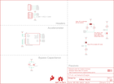

Contents
========

* [PRS14480 > Triple Axis Accelerometer Breakout-H3LIS331DL](#prs14480--triple-axis-accelerometer-breakout-h3lis331dl)
	* [Schematic](#schematic)
	* [PCB](#pcb)
	* [Interactive BOM](#interactive-bom)
	* [OOMP Parts](#oomp-parts)
	* [Images](#images)
	* [Tags](#tags)
  
![][im]
# PRS14480 > Triple Axis Accelerometer Breakout-H3LIS331DL

- ID: PROJ-SPAR-14480-STAN-01
- Hex ID: PRS14480
- Name: Sparkfun
- Description: Sparkfun
- Long Link: [http://oom.lt/PROJ-SPAR-14480-STAN-01](http://oom.lt/PROJ-SPAR-14480-STAN-01)
- Short Link: [http://oom.lt/PRS14480](http://oom.lt/PRS14480)

## Schematic
  

## PCB
  

## Interactive BOM

- Interactive BOM page: [ibom.html](https://htmlpreview.github.io/?https://github.com/oomlout/oomlout_OOMP_projects/blob/main/PROJ-SPAR-14480-STAN-01/kicad/bom/ibom.html)

## OOMP Parts
  

|OOMP Parts|
| :---: |
|CAPT-3216-X-UF10-01 C1|
|CAPC-0603-X-UF1D-01 C2|
|[HEAD-I01-X-PI04-01  2.54 mm 4 Pin Header  J1, J2](https://github.com/oomlout/oomlout_OOMP_parts/tree/main/HEAD-I01-X-PI04-01/)|
|[RESE-0603-X-O103-01  SMD (0603) 10k Ohm Resistor  R1, R4](https://github.com/oomlout/oomlout_OOMP_parts/tree/main/RESE-0603-X-O103-01/)|
|[RESE-0603-X-O472-01  SMD (0603) 4.7k Ohm Resistor  R2, R3](https://github.com/oomlout/oomlout_OOMP_parts/tree/main/RESE-0603-X-O472-01/)|
|UNMATCHED-UNMATCHED-X-UNMATCHED-01 U1|

## Images
  
  

|kicadPcb3d|kicadPcb3dFront|kicadPcb3dBack|eagleImage|eagleSchemImage|
| :---: | :---: | :---: | :---: | :---: |
||||||

## Tags

- hexID: PRS14480
- oompType: PROJ
- oompSize: SPAR
- oompColor: 14480
- oompDesc: STAN
- oompIndex: 01
- oompName: Triple Axis Accelerometer Breakout-H3LIS331DL
- sources: All source files from https://github.com/sparkfun/Triple_Axis_Accelerometer_Breakout-H3LIS331DL (source licence details in srcLicense.md)
- linkBuyPage: https://www.sparkfun.com/products/14480
- oompID: PROJ-SPAR-14480-STAN-01
- oompParts: C1,CAPT-3216-X-UF10-01
- oompParts: C2,CAPC-0603-X-UF1D-01
- oompParts: J1,HEAD-I01-X-PI04-01
- oompParts: J2,HEAD-I01-X-PI04-01
- oompParts: R1,RESE-0603-X-O103-01
- oompParts: R2,RESE-0603-X-O472-01
- oompParts: R3,RESE-0603-X-O472-01
- oompParts: R4,RESE-0603-X-O103-01
- oompParts: U1,UNMATCHED-UNMATCHED-X-UNMATCHED-01
- rawParts: C1,10uF,10UF-POLAR-EIA3216-16V-10%(TANT),EIA3216,10.0µF polarized capacitors,CAP-00811,10uF,
- rawParts: C2,0.1uF,0.1UF-0603-25V-5%,0603,0.1µF ceramic capacitors,CAP-08604,0.1uF,
- rawParts: FRAME1,FRAME-LETTER,FRAME-LETTER,CREATIVE_COMMONS,Schematic Frame - Letter,,,
- rawParts: J1,,CONN_04,1X04,Multi connection point. Often used as Generic Header-pin footprint for 0.1 inch spaced/style header connections,CONN-09696,,
- rawParts: J2,,I2C_STANDARD,1X04,SparkFun I2C Standard Pinout Header,,,
- rawParts: JP1,JUMPER-SMT_3_2-NC_PASTE_NO-SILK,JUMPER-SMT_3_2-NC_PASTE_NO-SILK,SMT-JUMPER_3_2-NC_PASTE_NO-SILK,Normally closed solder jumper (2 of 2 connections),,,
- rawParts: JP2,JUMPER-SMT_2_NO_NO-SILK,JUMPER-SMT_2_NO_NO-SILK,SMT-JUMPER_2_NO_NO-SILK,Normally open jumper,,,
- rawParts: JP3,JUMPER-SMT_2_NC_PASTE_NO-SILK,JUMPER-SMT_2_NC_PASTE_NO-SILK,SMT-JUMPER_2_NC_PASTE_NO-SILK,Normally closed solder jumper,,,
- rawParts: JP4,FIDUCIAL1X2,FIDUCIAL1X2,FIDUCIAL-1X2,Fiducial Alignment Points,,,
- rawParts: JP5,FIDUCIAL1X2,FIDUCIAL1X2,FIDUCIAL-1X2,Fiducial Alignment Points,,,
- rawParts: JP6,FIDUCIAL1X2,FIDUCIAL1X2,FIDUCIAL-1X2,Fiducial Alignment Points,,,
- rawParts: JP7,FIDUCIAL1X2,FIDUCIAL1X2,FIDUCIAL-1X2,Fiducial Alignment Points,,,
- rawParts: JP8,STAND-OFF,STAND-OFF,STAND-OFF,Stand Off,,,
- rawParts: JP9,STAND-OFF,STAND-OFF,STAND-OFF,Stand Off,,,
- rawParts: JP10,STAND-OFF,STAND-OFF,STAND-OFF,Stand Off,,,
- rawParts: JP11,STAND-OFF,STAND-OFF,STAND-OFF,Stand Off,,,
- rawParts: LOGO1,SFE_LOGO_FLAME.1_INCH,SFE_LOGO_FLAME.1_INCH,SFE_LOGO_FLAME_.1,SparkFun Flame Logo,,,
- rawParts: LOGO2,OSHW-LOGOS,OSHW-LOGOS,OSHW-LOGO-S,Open-Source Hardware (OSHW) Logo,,,
- rawParts: R1,10k,10KOHM-0603-1/10W-1%,0603,10kΩ resistor,RES-00824,10k,
- rawParts: R2,4.7k,4.7KOHM-0603-1/10W-1%,0603,4.7kΩ resistor,RES-07857,4.7k,
- rawParts: R3,4.7k,4.7KOHM-0603-1/10W-1%,0603,4.7kΩ resistor,RES-07857,4.7k,
- rawParts: R4,10k,10KOHM-0603-1/10W-1%,0603,10kΩ resistor,RES-00824,10k,
- rawParts: U1,H3LIS331DL,H3LIS331DL,LGA-16-3X3,,IC-13786,H3LIS331DL,

[im]: kicadPcb3d_450.png
