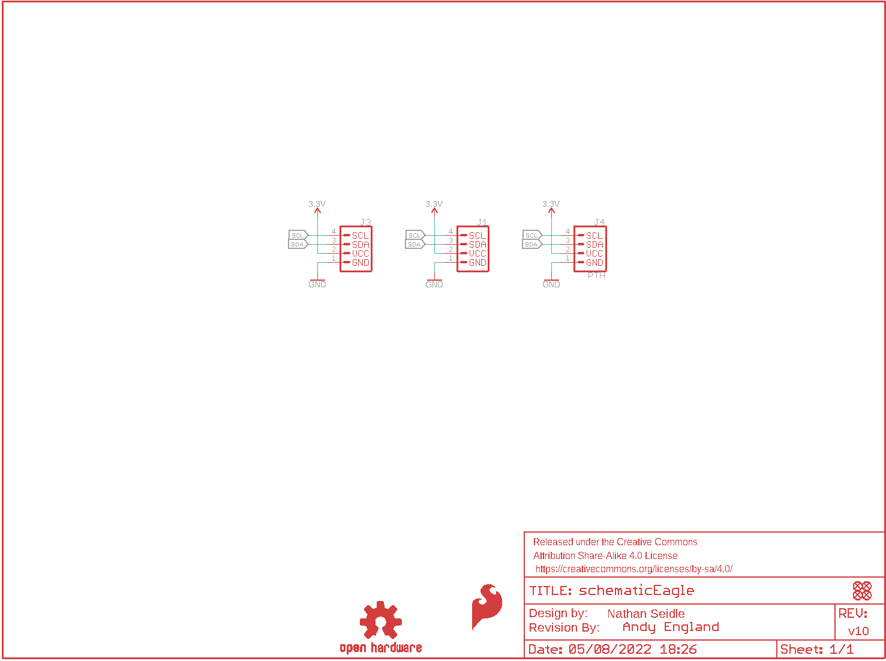
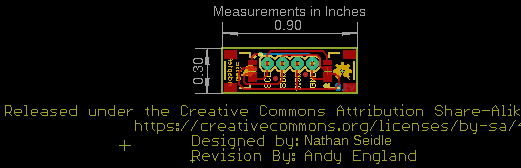
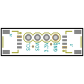
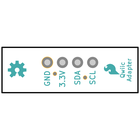
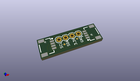
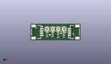
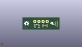

Contents
========

* [PRS14495 > Qwiic Adapter](#prs14495--qwiic-adapter)
	* [Schematic](#schematic)
	* [PCB](#pcb)
	* [Interactive BOM](#interactive-bom)
	* [OOMP Parts](#oomp-parts)
	* [Images](#images)
	* [Tags](#tags)
  
![][im]
# PRS14495 > Qwiic Adapter

- ID: PROJ-SPAR-14495-STAN-01
- Hex ID: PRS14495
- Name: Sparkfun
- Description: Sparkfun
- Long Link: [http://oom.lt/PROJ-SPAR-14495-STAN-01](http://oom.lt/PROJ-SPAR-14495-STAN-01)
- Short Link: [http://oom.lt/PRS14495](http://oom.lt/PRS14495)

## Schematic
  

## PCB
  

## Interactive BOM

- Interactive BOM page: [ibom.html](https://htmlpreview.github.io/?https://github.com/oomlout/oomlout_OOMP_projects/blob/main/PROJ-SPAR-14495-STAN-01/kicad/bom/ibom.html)

## OOMP Parts
  

|OOMP Parts|
| :---: |
|UNMATCHED-UNMATCHED-X-UNMATCHED-01 J1, J3|
|[HEAD-I01-X-PI04-01  2.54 mm 4 Pin Header  J4](https://github.com/oomlout/oomlout_OOMP_parts/tree/main/HEAD-I01-X-PI04-01/)|

## Images
  
  

|bominteractivefront|bominteractiveback|kicadPcb3d|kicadPcb3dFront|kicadPcb3dBack|eagleImage|eagleSchemImage|
| :---: | :---: | :---: | :---: | :---: | :---: | :---: |
||||||||

## Tags

- hexID: PRS14495
- oompType: PROJ
- oompSize: SPAR
- oompColor: 14495
- oompDesc: STAN
- oompIndex: 01
- oompName: Qwiic Adapter
- sources: All source files from https://github.com/sparkfun/Qwiic_Adapter (source licence details in srcLicense.md)
- linkBuyPage: https://www.sparkfun.com/products/14495
- oompID: PROJ-SPAR-14495-STAN-01
- oompParts: J1,UNMATCHED-UNMATCHED-X-UNMATCHED-01
- oompParts: J3,UNMATCHED-UNMATCHED-X-UNMATCHED-01
- oompParts: J4,HEAD-I01-X-PI04-01
- rawParts: FD1,FIDUCIALUFIDUCIAL,FIDUCIALUFIDUCIAL,FIDUCIAL-MICRO,Fiducial Alignment Points,,,
- rawParts: FD2,FIDUCIALUFIDUCIAL,FIDUCIALUFIDUCIAL,FIDUCIAL-MICRO,Fiducial Alignment Points,,,
- rawParts: FD3,FIDUCIALUFIDUCIAL,FIDUCIALUFIDUCIAL,FIDUCIAL-MICRO,Fiducial Alignment Points,,,
- rawParts: FD4,FIDUCIALUFIDUCIAL,FIDUCIALUFIDUCIAL,FIDUCIAL-MICRO,Fiducial Alignment Points,,,
- rawParts: FRAME1,FRAME-LETTER,FRAME-LETTER,CREATIVE_COMMONS,Schematic Frame - Letter,,,
- rawParts: J1,,QWIIC_CONNECTORJS-1MM,1X04_1MM_RA,SparkFun I2C Standard Qwiic Connector,CONN-13694,,
- rawParts: J3,,QWIIC_CONNECTORJS-1MM,1X04_1MM_RA,SparkFun I2C Standard Qwiic Connector,CONN-13694,,
- rawParts: J4,PTH,I2C_STANDARD,1X04,SparkFun I2C Standard Pinout Header,,,
- rawParts: LOGO1,REVISION,REVISION,REVISION,Revision By Text,,,
- rawParts: LOGO4,OSHW-LOGOS,OSHW-LOGOS,OSHW-LOGO-S,Open-Source Hardware (OSHW) Logo,,,
- rawParts: U$1,SFE_LOGO_FLAME.1_INCH,SFE_LOGO_FLAME.1_INCH,SFE_LOGO_FLAME_.1,SparkFun Flame Logo,,,

[im]: kicadPcb3d_450.png
