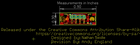

Contents
========

* [PROJ-SPAR-14495-STAN-01>Qwiic Adapter](#proj-spar-14495-stan-01qwiic-adapter)
	* [Images](#images)
	* [Interactive BOM](#interactive-bom)
	* [OOMP Parts](#oomp-parts)
	* [Tags](#tags)
  
![][im]
# PROJ-SPAR-14495-STAN-01>Qwiic Adapter

- ID: PROJ-SPAR-14495-STAN-01
- Hex ID: PRS14495
- Name: Qwiic Adapter
- Description: 

## Images
  
  

|eagleImage|kicadPcb3dFront|kicadPcb3dBack|kicadPcb3d|
| :---: | :---: | :---: | :---: |
|||||

## Interactive BOM

- Interactive BOM page: [ibom.html](kicad/bom/ibom.html)

## OOMP Parts
  

|OOMP Parts|
| :---: |
|UNMATCHED-UNMATCHED-X-UNMATCHED-01, J1, 5.08, 3.8099999999999996, 270,J1, 1X04_1MM_RA, SparkFun-Connectors, (0.2, 0.15), R270|
|UNMATCHED-UNMATCHED-X-UNMATCHED-01, J3, 17.779999999999998, 3.8099999999999996, 90,J3, 1X04_1MM_RA, SparkFun-Connectors, (0.7, 0.15), R90|
|UNMATCHED-UNMATCHED-X-UNMATCHED-01, J4, 15.239999999999998, 5.08, 180,J4, PTH, 1X04, SparkFun-Connectors, (0.6, 0.2), R180|

## Tags

- hexID: PRS14495
- oompType: PROJ
- oompSize: SPAR
- oompColor: 14495
- oompDesc: STAN
- oompIndex: 01
- oompName: Qwiic Adapter
- sources: All source files from https://github.com/sparkfun/Qwiic_Adapter (source licence details in srcLicense.md)
- linkBuyPage: https://www.sparkfun.com/products/14495
- oompID: PROJ-SPAR-14495-STAN-01
- oompPart: SKIP-UNMATCHED-X-UNMATCHED-01, FD1, 8.889999999999999, 2.54, 0
- oompPart: SKIP-UNMATCHED-X-UNMATCHED-01, FD2, 8.889999999999999, 2.54, M0
- oompPart: SKIP-UNMATCHED-X-UNMATCHED-01, FD3, 13.97, 3.175, 0
- oompPart: SKIP-UNMATCHED-X-UNMATCHED-01, FD4, 13.97, 3.175, M0
- oompPart: UNMATCHED-UNMATCHED-X-UNMATCHED-01, J1, 5.08, 3.8099999999999996, 270
- oompPart: UNMATCHED-UNMATCHED-X-UNMATCHED-01, J3, 17.779999999999998, 3.8099999999999996, 90
- oompPart: UNMATCHED-UNMATCHED-X-UNMATCHED-01, J4, 15.239999999999998, 5.08, 180
- rawPart: FD1, FIDUCIALUFIDUCIAL, FIDUCIAL-MICRO, SparkFun-Aesthetics, (0.35, 0.1), R0
- rawPart: FD2, FIDUCIALUFIDUCIAL, FIDUCIAL-MICRO, SparkFun-Aesthetics, (0.35, 0.1), MR0
- rawPart: FD3, FIDUCIALUFIDUCIAL, FIDUCIAL-MICRO, SparkFun-Aesthetics, (0.55, 0.125), R0
- rawPart: FD4, FIDUCIALUFIDUCIAL, FIDUCIAL-MICRO, SparkFun-Aesthetics, (0.55, 0.125), MR0
- rawPart: J1, 1X04_1MM_RA, SparkFun-Connectors, (0.2, 0.15), R270
- rawPart: J3, 1X04_1MM_RA, SparkFun-Connectors, (0.7, 0.15), R90
- rawPart: J4, PTH, 1X04, SparkFun-Connectors, (0.6, 0.2), R180

[im]: kicadPcb3d_450.png
