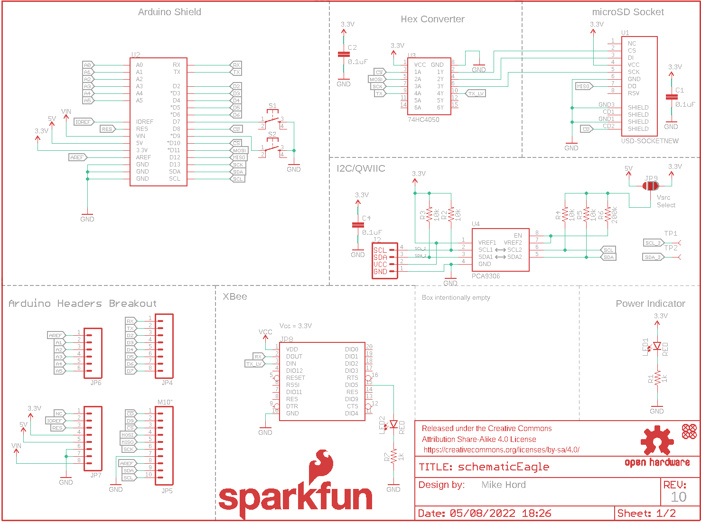
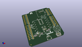
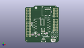
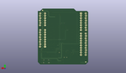
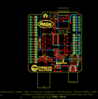

Contents
========

* [PRS14531 > Sparkfun](#prs14531--sparkfun)
	* [Schematic](#schematic)
	* [Interactive BOM](#interactive-bom)
	* [OOMP Parts](#oomp-parts)
	* [Images](#images)
	* [Tags](#tags)
  
![][im]
# PRS14531 > Sparkfun

- ID: PROJ-SPAR-14531-STAN-01
- Hex ID: PRS14531
- Name: Sparkfun
- Description: Sparkfun
- Long Link: [http://oom.lt/PROJ-SPAR-14531-STAN-01](http://oom.lt/PROJ-SPAR-14531-STAN-01)
- Short Link: [http://oom.lt/PRS14531](http://oom.lt/PRS14531)

## Schematic
  

## Interactive BOM

- Interactive BOM page: [ibom.html](https://htmlpreview.github.io/?https://github.com/oomlout/oomlout_OOMP_projects/blob/main/PROJ-SPAR-14531-STAN-01/kicad/bom/ibom.html)

## OOMP Parts
  

|OOMP Parts|
| :---: |
|C1,CAPC-0603-X-NF100-V50,C1,0.1uF,0.1UF-0603-25V-5%,0603,0.1µF ceramic capacitors,,CAP-08604,,0.1uF,,|
|C2,CAPC-0603-X-NF100-V50,C2,0.1uF,0.1UF-0603-25V-5%,0603,0.1µF ceramic capacitors,,CAP-08604,,0.1uF,,|
|C4,CAPC-0603-X-NF100-V50,C4,0.1uF,0.1UF-0603-25V-5%,0603,0.1µF ceramic capacitors,,CAP-08604,,0.1uF,,|
|C5,CAPC-0805-X-UF10-V10,C5,10uF,10UF-0805-10V-10%,0805,10.0µF ceramic capacitors,,CAP-11330,,10uF,,|
|C6,CAPC-0603-X-UF10-01,C6,10uF,10UF-0603-6.3V-20%,0603,10.0µF ceramic capacitors,,CAP-11015,,10uF,,|
|C7,CAPC-0603-X-UNMATCHED-01,C7,22pF,22PF-0603-50V-5%,0603,22pF ceramic capacitors,,CAP-07876,,22pF,,|
|D1,DIOD-UNMATCHED-X-UNMATCHED-01,D1,3A/40V/500mV,DIODE-SCHOTTKY-B340A,SMA-DIODE,Schottky diode,,DIO-09886,,3A/40V/500mV,,|
|J1,UNMATCHED-UNMATCHED-X-UNMATCHED-01,FRAME1,FRAME-LETTER,FRAME-LETTER,CREATIVE_COMMONS,Schematic Frame - Letter,,,,,,|
|J2,UNMATCHED-UNMATCHED-X-UNMATCHED-01,FRAME2,FRAME-LETTERNO_PACKAGE,FRAME-LETTERNO_PACKAGE,DUMMY,Schematic Frame - Letter,Nobody,,,,v01,|
|JP4,HEAD-I01-X-PI08-01,J1,AMP FCI 10103594-0001LF,USB_MICRO-B_HALF_PTH,USB-MICROB-PTH,USB Type Micro-B Connector,,CONN-13711,,AMP FCI 10103594-0001LF,,|
|JP5,HEAD-I01-X-PI10-01,J2,,QWIIC_CONNECTORJS-1MM,1X04_1MM_RA,SparkFun I2C Standard Qwiic Connector,,CONN-13694,,,,|
|JP6,HEAD-I01-X-PI06-01,JP1,SFE_LOGO_NAME_FLAME.1_INCH,SFE_LOGO_NAME_FLAME.1_INCH,SFE_LOGO_NAME_FLAME_.1,SparkFun Font Logo w/ Flame,,,,,,|
|JP7,HEAD-I01-X-PI08-01,JP2,FIDUCIAL1X2,FIDUCIAL1X2,FIDUCIAL-1X2,Fiducial Alignment Points,,,,,,|
|JP8,UNMATCHED-UNMATCHED-X-UNMATCHED-01,JP3,FIDUCIAL1X2,FIDUCIAL1X2,FIDUCIAL-1X2,Fiducial Alignment Points,,,,,,|
|JP9,UNMATCHED-UNMATCHED-X-UNMATCHED-01,JP4,,M08,1X08,Header 8,,,,,,|
|L1,UNMATCHED-UNMATCHED-X-UNMATCHED-01,JP5,M10,M10,1X10,Header 10,,,,,,|
|LED1,LEDS-0603-G-STAN-01,JP6,,M06SIP,1X06,Header 6,,,,,,|
|LED2,LEDS-0603-G-STAN-01,JP7,,M081X08,1X08,Header 8,,,,,,|
|R1,RESE-0603-X-O102-01,JP8,,XBEESMD,XBEE-SMD,Digi XBee and XBee Pro,,CONN-09042,,,,|
|R2,RESE-0603-X-O103-01,JP9,JUMPER-SMT_3_1-NC_PASTE_SILK,JUMPER-SMT_3_1-NC_PASTE_SILK,SMT-JUMPER_3_1-NC_PASTE_SILK,Normally closed solder jumper (1 of 2 connections),,,,,,|
|R3,RESE-0603-X-O103-01,JP10,FIDUCIAL1X2,FIDUCIAL1X2,FIDUCIAL-1X2,Fiducial Alignment Points,,,,,,|
|R4,RESE-0603-X-O103-01,JP11,FIDUCIAL1X2,FIDUCIAL1X2,FIDUCIAL-1X2,Fiducial Alignment Points,,,,,,|
|R5,RESE-0603-X-O103-01,L1,1uH,INDUCTOR-SRP4020-1UH,INDUCTOR-SRP4020,Inductors,,NDUC-12274,,1uH,,|
|R6,RESE-0603-X-O2003-01,LED1,RED,LED-RED0603,LED-0603,Red SMD LED,,DIO-00819,,RED,,|
|R7,RESE-0603-X-O102-01,LED2,RED,LED-RED0603,LED-0603,Red SMD LED,,DIO-00819,,RED,,|
|R8,RESE-0603-X-O1803-01,LOGO1,OSHW-LOGOM,OSHW-LOGOM,OSHW-LOGO-M,Open-Source Hardware (OSHW) Logo,,,,,,|
|R9,RESE-0603-X-O8203-01,R1,1k,1KOHM-0603-1/10W-1%,0603,1kΩ resistor,,RES-07856,,1k,,|
|S1,UNMATCHED-UNMATCHED-X-UNMATCHED-01,R2,10k,10KOHM-0603-1/10W-1%,0603,10kΩ resistor,,RES-00824,,10k,,|
|S2,UNMATCHED-UNMATCHED-X-UNMATCHED-01,R3,10k,10KOHM-0603-1/10W-1%,0603,10kΩ resistor,,RES-00824,,10k,,|
|TP1,UNMATCHED-UNMATCHED-X-UNMATCHED-01,R4,10k,10KOHM-0603-1/10W-1%,0603,10kΩ resistor,,RES-00824,,10k,,|
|TP2,UNMATCHED-UNMATCHED-X-UNMATCHED-01,R5,10k,10KOHM-0603-1/10W-1%,0603,10kΩ resistor,,RES-00824,,10k,,|
|TP3,UNMATCHED-UNMATCHED-X-UNMATCHED-01,R6,200k,200KOHM-0603-1/10W-1%,0603,200kΩ resistor,,RES-09385,,200k,,|
|U1,UNMATCHED-UNMATCHED-X-UNMATCHED-01,R7,1k,1KOHM-0603-1/10W-1%,0603,1kΩ resistor,,RES-07856,,1k,,|
|U2,UNMATCHED-UNMATCHED-X-UNMATCHED-01,R8,180k,180KOHM-0603-1/10W-1%,0603,RES-10066,,RES-10066,,180k,,|
|U3,UNMATCHED-UNMATCHED-X-UNMATCHED-01,R9,820k,820KOHM-0603-1/10W-1%,0603,820kΩ resistor,,RES-13247,,820k,,|
|U4,UNMATCHED-UNMATCHED-X-UNMATCHED-01,S1,,MOMENTARY-SWITCH-SPST-2-SMD-5.2MM,TACTILE_SWITCH_SMD_5.2MM,Momentary Switch (Pushbutton) - SPST - Two Circuits,,SWCH-08247,COM-08720,,,|
|U5,UNMATCHED-UNMATCHED-X-UNMATCHED-01,S2,,MOMENTARY-SWITCH-SPST-2-SMD-5.2MM,TACTILE_SWITCH_SMD_5.2MM,Momentary Switch (Pushbutton) - SPST - Two Circuits,,SWCH-08247,COM-08720,,,|

## Images
  
  

|kicadPcb3d|kicadPcb3dFront|kicadPcb3dBack|eagleImage|eagleSchemImage|
| :---: | :---: | :---: | :---: | :---: |
||||||

## Tags

- hexID: PRS14531
- oompType: PROJ
- oompSize: SPAR
- oompColor: 14531
- oompDesc: STAN
- oompIndex: 01
- oompName: Pioneer IoT Kit Shield
- sources: All source files from https://github.com/sparkfun/Pioneer_IoT_Kit_Shield (source licence details in srcLicense.md)
- linkBuyPage: https://www.sparkfun.com/products/14531
- oompID: PROJ-SPAR-14531-STAN-01
- oompParts: C1,CAPC-0603-X-NF100-V50
- oompParts: C2,CAPC-0603-X-NF100-V50
- oompParts: C4,CAPC-0603-X-NF100-V50
- oompParts: C5,CAPC-0805-X-UF10-V10
- oompParts: C6,CAPC-0603-X-UF10-01
- oompParts: C7,CAPC-0603-X-UNMATCHED-01
- oompParts: D1,DIOD-UNMATCHED-X-UNMATCHED-01
- oompParts: J1,UNMATCHED-UNMATCHED-X-UNMATCHED-01
- oompParts: J2,UNMATCHED-UNMATCHED-X-UNMATCHED-01
- oompParts: JP4,HEAD-I01-X-PI08-01
- oompParts: JP5,HEAD-I01-X-PI10-01
- oompParts: JP6,HEAD-I01-X-PI06-01
- oompParts: JP7,HEAD-I01-X-PI08-01
- oompParts: JP8,UNMATCHED-UNMATCHED-X-UNMATCHED-01
- oompParts: JP9,UNMATCHED-UNMATCHED-X-UNMATCHED-01
- oompParts: L1,UNMATCHED-UNMATCHED-X-UNMATCHED-01
- oompParts: LED1,LEDS-0603-G-STAN-01
- oompParts: LED2,LEDS-0603-G-STAN-01
- oompParts: R1,RESE-0603-X-O102-01
- oompParts: R2,RESE-0603-X-O103-01
- oompParts: R3,RESE-0603-X-O103-01
- oompParts: R4,RESE-0603-X-O103-01
- oompParts: R5,RESE-0603-X-O103-01
- oompParts: R6,RESE-0603-X-O2003-01
- oompParts: R7,RESE-0603-X-O102-01
- oompParts: R8,RESE-0603-X-O1803-01
- oompParts: R9,RESE-0603-X-O8203-01
- oompParts: S1,UNMATCHED-UNMATCHED-X-UNMATCHED-01
- oompParts: S2,UNMATCHED-UNMATCHED-X-UNMATCHED-01
- oompParts: TP1,UNMATCHED-UNMATCHED-X-UNMATCHED-01
- oompParts: TP2,UNMATCHED-UNMATCHED-X-UNMATCHED-01
- oompParts: TP3,UNMATCHED-UNMATCHED-X-UNMATCHED-01
- oompParts: U1,UNMATCHED-UNMATCHED-X-UNMATCHED-01
- oompParts: U2,UNMATCHED-UNMATCHED-X-UNMATCHED-01
- oompParts: U3,UNMATCHED-UNMATCHED-X-UNMATCHED-01
- oompParts: U4,UNMATCHED-UNMATCHED-X-UNMATCHED-01
- oompParts: U5,UNMATCHED-UNMATCHED-X-UNMATCHED-01
- rawParts: C1,0.1uF,0.1UF-0603-25V-5%,0603,0.1µF ceramic capacitors,,CAP-08604,,0.1uF,,
- rawParts: C2,0.1uF,0.1UF-0603-25V-5%,0603,0.1µF ceramic capacitors,,CAP-08604,,0.1uF,,
- rawParts: C4,0.1uF,0.1UF-0603-25V-5%,0603,0.1µF ceramic capacitors,,CAP-08604,,0.1uF,,
- rawParts: C5,10uF,10UF-0805-10V-10%,0805,10.0µF ceramic capacitors,,CAP-11330,,10uF,,
- rawParts: C6,10uF,10UF-0603-6.3V-20%,0603,10.0µF ceramic capacitors,,CAP-11015,,10uF,,
- rawParts: C7,22pF,22PF-0603-50V-5%,0603,22pF ceramic capacitors,,CAP-07876,,22pF,,
- rawParts: D1,3A/40V/500mV,DIODE-SCHOTTKY-B340A,SMA-DIODE,Schottky diode,,DIO-09886,,3A/40V/500mV,,
- rawParts: FRAME1,FRAME-LETTER,FRAME-LETTER,CREATIVE_COMMONS,Schematic Frame - Letter,,,,,,
- rawParts: FRAME2,FRAME-LETTERNO_PACKAGE,FRAME-LETTERNO_PACKAGE,DUMMY,Schematic Frame - Letter,Nobody,,,,v01,
- rawParts: J1,AMP FCI 10103594-0001LF,USB_MICRO-B_HALF_PTH,USB-MICROB-PTH,USB Type Micro-B Connector,,CONN-13711,,AMP FCI 10103594-0001LF,,
- rawParts: J2,,QWIIC_CONNECTORJS-1MM,1X04_1MM_RA,SparkFun I2C Standard Qwiic Connector,,CONN-13694,,,,
- rawParts: JP1,SFE_LOGO_NAME_FLAME.1_INCH,SFE_LOGO_NAME_FLAME.1_INCH,SFE_LOGO_NAME_FLAME_.1,SparkFun Font Logo w/ Flame,,,,,,
- rawParts: JP2,FIDUCIAL1X2,FIDUCIAL1X2,FIDUCIAL-1X2,Fiducial Alignment Points,,,,,,
- rawParts: JP3,FIDUCIAL1X2,FIDUCIAL1X2,FIDUCIAL-1X2,Fiducial Alignment Points,,,,,,
- rawParts: JP4,,M08,1X08,Header 8,,,,,,
- rawParts: JP5,M10,M10,1X10,Header 10,,,,,,
- rawParts: JP6,,M06SIP,1X06,Header 6,,,,,,
- rawParts: JP7,,M081X08,1X08,Header 8,,,,,,
- rawParts: JP8,,XBEESMD,XBEE-SMD,Digi XBee and XBee Pro,,CONN-09042,,,,
- rawParts: JP9,JUMPER-SMT_3_1-NC_PASTE_SILK,JUMPER-SMT_3_1-NC_PASTE_SILK,SMT-JUMPER_3_1-NC_PASTE_SILK,Normally closed solder jumper (1 of 2 connections),,,,,,
- rawParts: JP10,FIDUCIAL1X2,FIDUCIAL1X2,FIDUCIAL-1X2,Fiducial Alignment Points,,,,,,
- rawParts: JP11,FIDUCIAL1X2,FIDUCIAL1X2,FIDUCIAL-1X2,Fiducial Alignment Points,,,,,,
- rawParts: L1,1uH,INDUCTOR-SRP4020-1UH,INDUCTOR-SRP4020,Inductors,,NDUC-12274,,1uH,,
- rawParts: LED1,RED,LED-RED0603,LED-0603,Red SMD LED,,DIO-00819,,RED,,
- rawParts: LED2,RED,LED-RED0603,LED-0603,Red SMD LED,,DIO-00819,,RED,,
- rawParts: LOGO1,OSHW-LOGOM,OSHW-LOGOM,OSHW-LOGO-M,Open-Source Hardware (OSHW) Logo,,,,,,
- rawParts: R1,1k,1KOHM-0603-1/10W-1%,0603,1kΩ resistor,,RES-07856,,1k,,
- rawParts: R2,10k,10KOHM-0603-1/10W-1%,0603,10kΩ resistor,,RES-00824,,10k,,
- rawParts: R3,10k,10KOHM-0603-1/10W-1%,0603,10kΩ resistor,,RES-00824,,10k,,
- rawParts: R4,10k,10KOHM-0603-1/10W-1%,0603,10kΩ resistor,,RES-00824,,10k,,
- rawParts: R5,10k,10KOHM-0603-1/10W-1%,0603,10kΩ resistor,,RES-00824,,10k,,
- rawParts: R6,200k,200KOHM-0603-1/10W-1%,0603,200kΩ resistor,,RES-09385,,200k,,
- rawParts: R7,1k,1KOHM-0603-1/10W-1%,0603,1kΩ resistor,,RES-07856,,1k,,
- rawParts: R8,180k,180KOHM-0603-1/10W-1%,0603,RES-10066,,RES-10066,,180k,,
- rawParts: R9,820k,820KOHM-0603-1/10W-1%,0603,820kΩ resistor,,RES-13247,,820k,,
- rawParts: S1,,MOMENTARY-SWITCH-SPST-2-SMD-5.2MM,TACTILE_SWITCH_SMD_5.2MM,Momentary Switch (Pushbutton) - SPST - Two Circuits,,SWCH-08247,COM-08720,,,
- rawParts: S2,,MOMENTARY-SWITCH-SPST-2-SMD-5.2MM,TACTILE_SWITCH_SMD_5.2MM,Momentary Switch (Pushbutton) - SPST - Two Circuits,,SWCH-08247,COM-08720,,,
- rawParts: TP1,TEST-POINTTP_15TH_THRU,TEST-POINTTP_15TH_THRU,TP_15TH,SparkFun Test Points,,,,,,
- rawParts: TP2,TEST-POINTTP_15TH_THRU,TEST-POINTTP_15TH_THRU,TP_15TH,SparkFun Test Points,,,,,,
- rawParts: TP3,TEST-POINTTP_15TH_THRU,TEST-POINTTP_15TH_THRU,TP_15TH,SparkFun Test Points,,,,,,
- rawParts: U1,USD-SOCKETNEW,USD-SOCKETNEW,MICRO-SD-SOCKET-PP,microSD Socket,,CONN-7820,,,,
- rawParts: U2,ARDUINO_UNO_R3_SHIELDUNO_R3_SHIELD_NOLABELS_LOCK,ARDUINO_UNO_R3_SHIELDUNO_R3_SHIELD_NOLABELS_LOCK,UNO_R3_SHIELD_NOLABELS_LOCK,Arduino R3 Shield Footprint,,,,,,
- rawParts: U3,74HC4050,HEX_CONVERTER,SO16,74HC4050 Hex Buffer,,IC-09604,,74HC4050,,
- rawParts: U4,PCA9306,PCA9306PCA9306DC-1:1,PCA9306DC,Bidirectional I2C level shifter,,IC-10023,,PCA9306,,
- rawParts: U5,TPS62065,TPS62065,WSON-8-PAD,TPS62065 DC/DC step-Down regulator.,,IC-12273,,,,

[im]: kicadPcb3d_450.png
