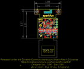
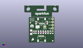
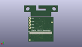
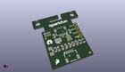

Contents
========

* [PROJ-SPAR-14532-STAN-01>Qwiic Micro OLED](#proj-spar-14532-stan-01qwiic-micro-oled)
	* [Images](#images)
	* [Interactive BOM](#interactive-bom)
	* [OOMP Parts](#oomp-parts)
	* [Tags](#tags)
  
![][im]
# PROJ-SPAR-14532-STAN-01>Qwiic Micro OLED

- ID: PROJ-SPAR-14532-STAN-01
- Hex ID: PRS14532
- Name: Qwiic Micro OLED
- Description: 

## Images
  
  

|eagleImage|kicadPcb3dFront|kicadPcb3dBack|kicadPcb3d|
| :---: | :---: | :---: | :---: |
|||||

## Interactive BOM

- Interactive BOM page: [ibom.html](kicad/bom/ibom.html)

## OOMP Parts
  

|OOMP Parts|
| :---: |
|CAPC-0805-X-UF22D-01, C1, 4.064, 8.254999999999999, 90,C1, 2.2uF, 0805, SparkFun-Capacitors, (0.16, 0.325), R90|
|CAPC-0805-X-UNMATCHED-01, C2, 17.145, 8.254999999999999, 90,C2, 1.0uF, 0805, SparkFun-Capacitors, (0.675, 0.325), R90|
|CAPC-0805-X-UNMATCHED-01, C3, 19.049999999999997, 8.254999999999999, 90,C3, 1.0uF, 0805, SparkFun-Capacitors, (0.75, 0.325), R90|
|CAPC-0603-X-UNMATCHED-01, C4, 7.619999999999999, 8.254999999999999, 270,C4, 1.0uF, 0603, SparkFun-Capacitors, (0.3, 0.325), R270|
|CAPC-UNMATCHED-X-UNMATCHED-01, C5, 1.9049999999999998, 8.254999999999999, 270,C5, 4.7uF, 1206, SparkFun-Capacitors, (0.075, 0.325), R270|
|CAPC-0603-X-UNMATCHED-01, C6, 15.239999999999998, 8.254999999999999, 90,C6, 1.0uF, 0603, SparkFun-Capacitors, (0.6, 0.325), R90|
|CAPC-0603-X-UNMATCHED-01, C7, 11.43, 8.254999999999999, 270,C7, 1.0uF, 0603, SparkFun-Capacitors, (0.45, 0.325), R270|
|UNMATCHED-UNMATCHED-X-UNMATCHED-01, J1, 10.16, 15.239999999999998, 180,J1, 1X04_1MM_RA, SparkFun-Connectors, (0.4, 0.6), R180|
|UNMATCHED-UNMATCHED-X-UNMATCHED-01, J2, 10.16, 5.08, 0,J2, 1X04_1MM_RA, SparkFun-Connectors, (0.4, 0.2), R0|
|UNMATCHED-UNMATCHED-X-UNMATCHED-01, J3, 19.049999999999997, 11.43, 90,J3, 1X04_NO_SILK, SparkX, (0.75, 0.45), R90|
|UNMATCHED-UNMATCHED-X-UNMATCHED-01, JP2, 6.985, 12.7, 180,JP2, SMT-JUMPER_3_2-NC_PASTE_SILK, SparkFun-Jumpers, (0.275, 0.5), R180|
|UNMATCHED-UNMATCHED-X-UNMATCHED-01, JP3, 12.7, 12.7, 0,JP3, SMT-JUMPER_2_NO_SILK, SparkFun-Jumpers, (0.5, 0.5), R0|
|UNMATCHED-UNMATCHED-X-UNMATCHED-01, OLED1, 19.049999999999997, 7.112, M0,OLED1, OLED0.66, OLED-0.66-64X48, SparkFun-Displays, (0.75, 0.28), MR0|
|RESE-0603-X-O394-01, R1, 5.715, 8.254999999999999, 90,R1, 390k, 0603, SparkFun-Resistors, (0.225, 0.325), R90|
|<table><tr><td></td><td> R2</td><td>[RESE-0603-X-O103-01 SMD (0603) 10k Ohm Resistor](https://github.com/oomlout/oomlout_OOMP_parts/tree/main/RESE-0603-X-O103-01/)</td><td>[R6103](https://github.com/oomlout/oomlout_OOMP_parts/tree/main/RESE-0603-X-O103-01/)</td></tr></table>|
|<table><tr><td></td><td> R3</td><td>[RESE-0603-X-O103-01 SMD (0603) 10k Ohm Resistor](https://github.com/oomlout/oomlout_OOMP_parts/tree/main/RESE-0603-X-O103-01/)</td><td>[R6103](https://github.com/oomlout/oomlout_OOMP_parts/tree/main/RESE-0603-X-O103-01/)</td></tr></table>|
|RESE-0603-X-UNMATCHED-01, R13, 5.715, 15.875, 270,R13, 4.7k, 0603, SparkFun-Resistors, (0.225, 0.625), R270|
|RESE-0603-X-UNMATCHED-01, R14, 14.604999999999999, 15.875, 270,R14, 4.7k, 0603, SparkFun-Resistors, (0.575, 0.625), R270|

## Tags

- hexID: PRS14532
- oompType: PROJ
- oompSize: SPAR
- oompColor: 14532
- oompDesc: STAN
- oompIndex: 01
- oompName: Qwiic Micro OLED
- sources: All source files from https://github.com/sparkfun/Qwiic_Micro_OLED (source licence details in srcLicense.md)
- linkBuyPage: https://www.sparkfun.com/products/14532
- oompID: PROJ-SPAR-14532-STAN-01
- oompPart: CAPC-0805-X-UF22D-01, C1, 4.064, 8.254999999999999, 90
- oompPart: CAPC-0805-X-UNMATCHED-01, C2, 17.145, 8.254999999999999, 90
- oompPart: CAPC-0805-X-UNMATCHED-01, C3, 19.049999999999997, 8.254999999999999, 90
- oompPart: CAPC-0603-X-UNMATCHED-01, C4, 7.619999999999999, 8.254999999999999, 270
- oompPart: CAPC-UNMATCHED-X-UNMATCHED-01, C5, 1.9049999999999998, 8.254999999999999, 270
- oompPart: CAPC-0603-X-UNMATCHED-01, C6, 15.239999999999998, 8.254999999999999, 90
- oompPart: CAPC-0603-X-UNMATCHED-01, C7, 11.43, 8.254999999999999, 270
- oompPart: SKIP-UNMATCHED-X-UNMATCHED-01, FID1, 19.049999999999997, 1.27, 0
- oompPart: SKIP-UNMATCHED-X-UNMATCHED-01, FID2, 1.27, 15.875, 0
- oompPart: SKIP-UNMATCHED-X-UNMATCHED-01, FID3, 1.27, 15.875, M0
- oompPart: SKIP-UNMATCHED-X-UNMATCHED-01, FID4, 19.049999999999997, 1.27, M0
- oompPart: UNMATCHED-UNMATCHED-X-UNMATCHED-01, J1, 10.16, 15.239999999999998, 180
- oompPart: UNMATCHED-UNMATCHED-X-UNMATCHED-01, J2, 10.16, 5.08, 0
- oompPart: UNMATCHED-UNMATCHED-X-UNMATCHED-01, J3, 19.049999999999997, 11.43, 90
- oompPart: UNMATCHED-UNMATCHED-X-UNMATCHED-01, JP2, 6.985, 12.7, 180
- oompPart: UNMATCHED-UNMATCHED-X-UNMATCHED-01, JP3, 12.7, 12.7, 0
- oompPart: UNMATCHED-UNMATCHED-X-UNMATCHED-01, OLED1, 19.049999999999997, 7.112, M0
- oompPart: RESE-0603-X-O394-01, R1, 5.715, 8.254999999999999, 90
- oompPart: RESE-0603-X-O103-01, R2, 9.524999999999999, 8.254999999999999, 270
- oompPart: RESE-0603-X-O103-01, R3, 13.334999999999999, 8.254999999999999, 90
- oompPart: RESE-0603-X-UNMATCHED-01, R13, 5.715, 15.875, 270
- oompPart: RESE-0603-X-UNMATCHED-01, R14, 14.604999999999999, 15.875, 270
- rawPart: C1, 2.2uF, 0805, SparkFun-Capacitors, (0.16, 0.325), R90
- rawPart: C2, 1.0uF, 0805, SparkFun-Capacitors, (0.675, 0.325), R90
- rawPart: C3, 1.0uF, 0805, SparkFun-Capacitors, (0.75, 0.325), R90
- rawPart: C4, 1.0uF, 0603, SparkFun-Capacitors, (0.3, 0.325), R270
- rawPart: C5, 4.7uF, 1206, SparkFun-Capacitors, (0.075, 0.325), R270
- rawPart: C6, 1.0uF, 0603, SparkFun-Capacitors, (0.6, 0.325), R90
- rawPart: C7, 1.0uF, 0603, SparkFun-Capacitors, (0.45, 0.325), R270
- rawPart: FID1, FIDUCIAL1X2, FIDUCIAL-1X2, SparkFun-Aesthetics, (0.75, 0.05), R0
- rawPart: FID2, FIDUCIAL1X2, FIDUCIAL-1X2, SparkFun-Aesthetics, (0.05, 0.625), R0
- rawPart: FID3, FIDUCIAL1X2, FIDUCIAL-1X2, SparkFun-Aesthetics, (0.05, 0.625), MR0
- rawPart: FID4, FIDUCIAL1X2, FIDUCIAL-1X2, SparkFun-Aesthetics, (0.75, 0.05), MR0
- rawPart: J1, 1X04_1MM_RA, SparkFun-Connectors, (0.4, 0.6), R180
- rawPart: J2, 1X04_1MM_RA, SparkFun-Connectors, (0.4, 0.2), R0
- rawPart: J3, 1X04_NO_SILK, SparkX, (0.75, 0.45), R90
- rawPart: JP2, SMT-JUMPER_3_2-NC_PASTE_SILK, SparkFun-Jumpers, (0.275, 0.5), R180
- rawPart: JP3, SMT-JUMPER_2_NO_SILK, SparkFun-Jumpers, (0.5, 0.5), R0
- rawPart: OLED1, OLED0.66, OLED-0.66-64X48, SparkFun-Displays, (0.75, 0.28), MR0
- rawPart: R1, 390k, 0603, SparkFun-Resistors, (0.225, 0.325), R90
- rawPart: R2, 10k, 0603, SparkFun-Resistors, (0.375, 0.325), R270
- rawPart: R3, 10k, 0603, SparkFun-Resistors, (0.525, 0.325), R90
- rawPart: R13, 4.7k, 0603, SparkFun-Resistors, (0.225, 0.625), R270
- rawPart: R14, 4.7k, 0603, SparkFun-Resistors, (0.575, 0.625), R270

[im]: kicadPcb3d_450.png
