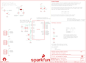

Contents
========

* [PRS14532 > Sparkfun](#prs14532--sparkfun)
	* [Schematic](#schematic)
	* [Interactive BOM](#interactive-bom)
	* [OOMP Parts](#oomp-parts)
	* [Images](#images)
	* [Tags](#tags)
  
![][im]
# PRS14532 > Sparkfun

- ID: PROJ-SPAR-14532-STAN-01
- Hex ID: PRS14532
- Name: Sparkfun
- Description: Sparkfun
- Long Link: [http://oom.lt/PROJ-SPAR-14532-STAN-01](http://oom.lt/PROJ-SPAR-14532-STAN-01)
- Short Link: [http://oom.lt/PRS14532](http://oom.lt/PRS14532)

## Schematic
  

## Interactive BOM

- Interactive BOM page: [ibom.html](https://htmlpreview.github.io/?https://github.com/oomlout/oomlout_OOMP_projects/blob/main/PROJ-SPAR-14532-STAN-01/kicad/bom/ibom.html)

## OOMP Parts
  

|OOMP Parts|
| :---: |
|C1,CAPC-0805-X-UNMATCHED-01,C1,2.2uF,2.2UF-0805-25V-(+80/-20%),0805,2.2µF ceramic capacitors,CAP-11624,2.2uF,|
|C2,CAPC-0805-X-UNMATCHED-01,C2,1.0uF,1.0UF-0805-25V-10%,0805,1µF ceramic capacitors,CAP-08064,1.0uF,|
|C3,CAPC-0805-X-UNMATCHED-01,C3,1.0uF,1.0UF-0805-25V-10%,0805,1µF ceramic capacitors,CAP-08064,1.0uF,|
|C4,CAPC-0603-X-UNMATCHED-01,C4,1.0uF,1.0UF-0603-16V-10%,0603,1µF ceramic capacitors,CAP-00868,1.0uF,|
|C5,CAPC-1206-X-UNMATCHED-01,C5,4.7uF,4.7UF-1206-16V-(+80/-20%),1206,4.7µF ceramic capacitors,CAP-10300,4.7uF,|
|C6,CAPC-0603-X-UNMATCHED-01,C6,1.0uF,1.0UF-0603-16V-10%,0603,1µF ceramic capacitors,CAP-00868,1.0uF,|
|C7,CAPC-0603-X-UNMATCHED-01,C7,1.0uF,1.0UF-0603-16V-10%,0603,1µF ceramic capacitors,CAP-00868,1.0uF,|
|J1,UNMATCHED-UNMATCHED-X-UNMATCHED-01,FID1,FIDUCIAL1X2,FIDUCIAL1X2,FIDUCIAL-1X2,Fiducial Alignment Points,,,|
|J2,UNMATCHED-UNMATCHED-X-UNMATCHED-01,FID2,FIDUCIAL1X2,FIDUCIAL1X2,FIDUCIAL-1X2,Fiducial Alignment Points,,,|
|J3,UNMATCHED-UNMATCHED-X-UNMATCHED-01,FID3,FIDUCIAL1X2,FIDUCIAL1X2,FIDUCIAL-1X2,Fiducial Alignment Points,,,|
|JP2,UNMATCHED-UNMATCHED-X-UNMATCHED-01,FID4,FIDUCIAL1X2,FIDUCIAL1X2,FIDUCIAL-1X2,Fiducial Alignment Points,,,|
|JP3,UNMATCHED-UNMATCHED-X-UNMATCHED-01,FRAME1,FRAME-LETTER,FRAME-LETTER,CREATIVE_COMMONS,Schematic Frame,,,|
|LOGO1,UNMATCHED-UNMATCHED-X-UNMATCHED-01,H1,STAND-OFF,STAND-OFF,STAND-OFF,Stand Off,,,|
|OLED1,UNMATCHED-UNMATCHED-X-UNMATCHED-01,H2,STAND-OFF,STAND-OFF,STAND-OFF,Stand Off,,,|
|R1,RESE-0603-X-O3903-01,J1,,QWIIC_CONNECTORJS-1MM,1X04_1MM_RA,SparkFun I2C Standard Qwiic Connector,CONN-13694,,|
|R2,RESE-0603-X-O103-01,J2,,QWIIC_CONNECTORJS-1MM,1X04_1MM_RA,SparkFun I2C Standard Qwiic Connector,CONN-13694,,|
|R3,RESE-0603-X-O103-01,J3,,I2C_STANDARD_NO_SILK,1X04_NO_SILK,SparkFun I2C Standard Pinout Header,,,|
|R13,RESE-0603-X-UNMATCHED-01,JP2,,JUMPER-SMT_3_2-NC_PASTE_SILK,SMT-JUMPER_3_2-NC_PASTE_SILK,Normally closed solder jumper (2 of 2 connections),,,|
|R14,RESE-0603-X-UNMATCHED-01,JP3,,JUMPER-SMT_2_NO_SILK,SMT-JUMPER_2_NO_SILK,Normally open jumper,,,|

## Images
  
  

|kicadPcb3d|kicadPcb3dFront|kicadPcb3dBack|eagleImage|eagleSchemImage|
| :---: | :---: | :---: | :---: | :---: |
||||||

## Tags

- hexID: PRS14532
- oompType: PROJ
- oompSize: SPAR
- oompColor: 14532
- oompDesc: STAN
- oompIndex: 01
- oompName: Qwiic Micro OLED
- sources: All source files from https://github.com/sparkfun/Qwiic_Micro_OLED (source licence details in srcLicense.md)
- linkBuyPage: https://www.sparkfun.com/products/14532
- oompID: PROJ-SPAR-14532-STAN-01
- oompParts: C1,CAPC-0805-X-UNMATCHED-01
- oompParts: C2,CAPC-0805-X-UNMATCHED-01
- oompParts: C3,CAPC-0805-X-UNMATCHED-01
- oompParts: C4,CAPC-0603-X-UNMATCHED-01
- oompParts: C5,CAPC-1206-X-UNMATCHED-01
- oompParts: C6,CAPC-0603-X-UNMATCHED-01
- oompParts: C7,CAPC-0603-X-UNMATCHED-01
- oompParts: J1,UNMATCHED-UNMATCHED-X-UNMATCHED-01
- oompParts: J2,UNMATCHED-UNMATCHED-X-UNMATCHED-01
- oompParts: J3,UNMATCHED-UNMATCHED-X-UNMATCHED-01
- oompParts: JP2,UNMATCHED-UNMATCHED-X-UNMATCHED-01
- oompParts: JP3,UNMATCHED-UNMATCHED-X-UNMATCHED-01
- oompParts: LOGO1,UNMATCHED-UNMATCHED-X-UNMATCHED-01
- oompParts: OLED1,UNMATCHED-UNMATCHED-X-UNMATCHED-01
- oompParts: R1,RESE-0603-X-O3903-01
- oompParts: R2,RESE-0603-X-O103-01
- oompParts: R3,RESE-0603-X-O103-01
- oompParts: R13,RESE-0603-X-UNMATCHED-01
- oompParts: R14,RESE-0603-X-UNMATCHED-01
- rawParts: C1,2.2uF,2.2UF-0805-25V-(+80/-20%),0805,2.2µF ceramic capacitors,CAP-11624,2.2uF,
- rawParts: C2,1.0uF,1.0UF-0805-25V-10%,0805,1µF ceramic capacitors,CAP-08064,1.0uF,
- rawParts: C3,1.0uF,1.0UF-0805-25V-10%,0805,1µF ceramic capacitors,CAP-08064,1.0uF,
- rawParts: C4,1.0uF,1.0UF-0603-16V-10%,0603,1µF ceramic capacitors,CAP-00868,1.0uF,
- rawParts: C5,4.7uF,4.7UF-1206-16V-(+80/-20%),1206,4.7µF ceramic capacitors,CAP-10300,4.7uF,
- rawParts: C6,1.0uF,1.0UF-0603-16V-10%,0603,1µF ceramic capacitors,CAP-00868,1.0uF,
- rawParts: C7,1.0uF,1.0UF-0603-16V-10%,0603,1µF ceramic capacitors,CAP-00868,1.0uF,
- rawParts: FID1,FIDUCIAL1X2,FIDUCIAL1X2,FIDUCIAL-1X2,Fiducial Alignment Points,,,
- rawParts: FID2,FIDUCIAL1X2,FIDUCIAL1X2,FIDUCIAL-1X2,Fiducial Alignment Points,,,
- rawParts: FID3,FIDUCIAL1X2,FIDUCIAL1X2,FIDUCIAL-1X2,Fiducial Alignment Points,,,
- rawParts: FID4,FIDUCIAL1X2,FIDUCIAL1X2,FIDUCIAL-1X2,Fiducial Alignment Points,,,
- rawParts: FRAME1,FRAME-LETTER,FRAME-LETTER,CREATIVE_COMMONS,Schematic Frame,,,
- rawParts: H1,STAND-OFF,STAND-OFF,STAND-OFF,Stand Off,,,
- rawParts: H2,STAND-OFF,STAND-OFF,STAND-OFF,Stand Off,,,
- rawParts: J1,,QWIIC_CONNECTORJS-1MM,1X04_1MM_RA,SparkFun I2C Standard Qwiic Connector,CONN-13694,,
- rawParts: J2,,QWIIC_CONNECTORJS-1MM,1X04_1MM_RA,SparkFun I2C Standard Qwiic Connector,CONN-13694,,
- rawParts: J3,,I2C_STANDARD_NO_SILK,1X04_NO_SILK,SparkFun I2C Standard Pinout Header,,,
- rawParts: JP2,,JUMPER-SMT_3_2-NC_PASTE_SILK,SMT-JUMPER_3_2-NC_PASTE_SILK,Normally closed solder jumper (2 of 2 connections),,,
- rawParts: JP3,,JUMPER-SMT_2_NO_SILK,SMT-JUMPER_2_NO_SILK,Normally open jumper,,,
- rawParts: LOGO1,REVISION,REVISION,REVISION,Revision By Text,,,
- rawParts: LOGO2,SFE_LOGO_FLAME.1_INCH,SFE_LOGO_FLAME.1_INCH,SFE_LOGO_FLAME_.1,SparkFun Flame Logo,,,
- rawParts: LOGO3,OSHW-LOGOS,OSHW-LOGOS,OSHW-LOGO-S,Open Source Hardware Logo This logo indicates the piece of hardware it is found on incorporates a OSHW license and/or adheres to the definition of open source hardware found here: http://freedomdefined.org/OSHW,,,
- rawParts: LOGO4,SFE_LOGO_NAME.1_INCH,SFE_LOGO_NAME.1_INCH,SFE_LOGO_NAME_.1,SparkFun Font Logo,,,
- rawParts: OLED1,OLED0.66,OLED0.66,OLED-0.66-64X48,Micro OLED,LCD-12019,,
- rawParts: R1,390k,390KOHM-0603-1/10W-1%,0603,390kΩ resistor,RES-12024,390k,
- rawParts: R2,10k,10KOHM-0603-1/10W-1%,0603,10kΩ resistor,RES-00824,10k,
- rawParts: R3,10k,10KOHM-0603-1/10W-1%,0603,10kΩ resistor,RES-00824,10k,
- rawParts: R13,4.7k,4.7KOHM-0603-1/10W-1%,0603,4.7kΩ resistor,RES-07857,4.7k,
- rawParts: R14,4.7k,4.7KOHM-0603-1/10W-1%,0603,4.7kΩ resistor,RES-07857,4.7k,

[im]: kicadPcb3d_450.png
