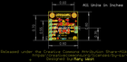
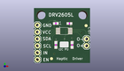
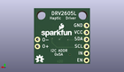
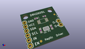

Contents
========

* [PROJ-SPAR-14538-STAN-01>Haptic Motor Driver](#proj-spar-14538-stan-01haptic-motor-driver)
	* [Images](#images)
	* [Interactive BOM](#interactive-bom)
	* [OOMP Parts](#oomp-parts)
	* [Tags](#tags)
  
![][im]
# PROJ-SPAR-14538-STAN-01>Haptic Motor Driver

- ID: PROJ-SPAR-14538-STAN-01
- Hex ID: PRS14538
- Name: Haptic Motor Driver
- Description: 

## Images
  
  

|eagleImage|kicadPcb3dFront|kicadPcb3dBack|kicadPcb3d|
| :---: | :---: | :---: | :---: |
|||||

## Interactive BOM

- Interactive BOM page: [ibom.html](kicad/bom/ibom.html)

## OOMP Parts
  

|OOMP Parts|
| :---: |
|CAPC-0402-X-UNMATCHED-01, C1, 12.858749999999999, 14.604999999999999, 180,C1, 1.0uF, 0402-CAP, SparkFun-Capacitors, (0.50625, 0.575), R180|
|CAPC-0402-X-UNMATCHED-01, C3, 7.9375, 14.604999999999999, 0,C3, 1.0uF, 0402-CAP, SparkFun-Capacitors, (0.3125, 0.575), R0|
|<table><tr><td></td><td> JP1</td><td>[HEAD-I01-X-PI06-01 2.54 mm 6 Pin Header](https://github.com/oomlout/oomlout_OOMP_parts/tree/main/HEAD-I01-X-PI06-01/)</td><td>[H06](https://github.com/oomlout/oomlout_OOMP_parts/tree/main/HEAD-I01-X-PI06-01/)</td></tr></table>|
|<table><tr><td></td><td> JP2</td><td>[HEAD-I01-X-PI02-01 2.54 mm 2 Pin Header](https://github.com/oomlout/oomlout_OOMP_parts/tree/main/HEAD-I01-X-PI02-01/)</td><td>[H02](https://github.com/oomlout/oomlout_OOMP_parts/tree/main/HEAD-I01-X-PI02-01/)</td></tr></table>|
|RESE-0603-X-UNMATCHED-01, R1, 13.811249999999998, 6.6674999999999995, 270,R1, 2.2k, 0603-RES, SparkFun-Resistors, (0.54375, 0.2625), R270|
|RESE-0603-X-UNMATCHED-01, R2, 7.9375, 6.6674999999999995, 270,R2, 2.2k, 0603-RES, SparkFun-Resistors, (0.3125, 0.2625), R270|
|UNMATCHED-UNMATCHED-X-UNMATCHED-01, U1, 10.63625, 11.7475, 0,U1, DRV2605L, VSSOP-10, SparkFun-PowerIC, (0.41875, 0.4625), R0|

## Tags

- hexID: PRS14538
- oompType: PROJ
- oompSize: SPAR
- oompColor: 14538
- oompDesc: STAN
- oompIndex: 01
- oompName: Haptic Motor Driver
- sources: All source files from https://github.com/sparkfun/Haptic_Motor_Driver (source licence details in srcLicense.md)
- linkBuyPage: https://www.sparkfun.com/products/14538
- oompPart: CAPC-0402-X-UNMATCHED-01, C1, 12.858749999999999, 14.604999999999999, 180
- oompPart: CAPC-0402-X-UNMATCHED-01, C3, 7.9375, 14.604999999999999, 0
- oompPart: SKIP-UNMATCHED-X-UNMATCHED-01, FID1, 6.35, 1.5875, 0
- oompPart: SKIP-UNMATCHED-X-UNMATCHED-01, FID2, 18.89125, 13.811249999999998, 0
- oompPart: SKIP-UNMATCHED-X-UNMATCHED-01, I2C, 10.95375, 6.826249999999999, 180
- oompPart: HEAD-I01-X-PI06-01, JP1, 1.27, 1.27, 90
- oompPart: HEAD-I01-X-PI02-01, JP2, 19.049999999999997, 8.889999999999999, 270
- oompPart: RESE-0603-X-UNMATCHED-01, R1, 13.811249999999998, 6.6674999999999995, 270
- oompPart: RESE-0603-X-UNMATCHED-01, R2, 7.9375, 6.6674999999999995, 270
- oompPart: UNMATCHED-UNMATCHED-X-UNMATCHED-01, U1, 10.63625, 11.7475, 0
- rawPart: C1, 1.0uF, 0402-CAP, SparkFun-Capacitors, (0.50625, 0.575), R180
- rawPart: C3, 1.0uF, 0402-CAP, SparkFun-Capacitors, (0.3125, 0.575), R0
- rawPart: FID1, FIDUCIAL1X2, FIDUCIAL-1X2, SparkFun-Aesthetics, (0.25, 0.0625), R0
- rawPart: FID2, FIDUCIAL1X2, FIDUCIAL-1X2, SparkFun-Aesthetics, (0.74375, 0.54375), R0
- rawPart: I2C, JUMPER-PAD-3-NC_BY_PASTE, PAD-JUMPER-3-NC_BY_PASTE_YES_SILK_FULL_BOX, SparkFun-Passives, (0.43125, 0.26875), R180
- rawPart: JP1, 1X06, SparkFun-Connectors, (0.05, 0.05), R90
- rawPart: JP2, 1X02, SparkFun-Connectors, (0.75, 0.35), R270
- rawPart: R1, 2.2k, 0603-RES, SparkFun-Resistors, (0.54375, 0.2625), R270
- rawPart: R2, 2.2k, 0603-RES, SparkFun-Resistors, (0.3125, 0.2625), R270
- rawPart: U1, DRV2605L, VSSOP-10, SparkFun-PowerIC, (0.41875, 0.4625), R0
- oompID: PROJ-SPAR-14538-STAN-01

[im]: kicadPcb3d_450.png
