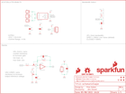

Contents
========

* [PRS14544 > Sparkfun](#prs14544--sparkfun)
	* [Schematic](#schematic)
	* [Interactive BOM](#interactive-bom)
	* [OOMP Parts](#oomp-parts)
	* [Images](#images)
	* [Tags](#tags)
  
![][im]
# PRS14544 > Sparkfun

- ID: PROJ-SPAR-14544-STAN-01
- Hex ID: PRS14544
- Name: Sparkfun
- Description: Sparkfun
- Long Link: [http://oom.lt/PROJ-SPAR-14544-STAN-01](http://oom.lt/PROJ-SPAR-14544-STAN-01)
- Short Link: [http://oom.lt/PRS14544](http://oom.lt/PRS14544)

## Schematic
  

## Interactive BOM

- Interactive BOM page: [ibom.html](https://htmlpreview.github.io/?https://github.com/oomlout/oomlout_OOMP_projects/blob/main/PROJ-SPAR-14544-STAN-01/kicad/bom/ibom.html)

## OOMP Parts
  

|OOMP Parts|
| :---: |
|C1,CAPC-0603-X-UNMATCHED-01,C1,100pF,100PF-0603-50V-5%,0603,100pF/0.1nF ceramic capacitors,,CAP-07883,100pF,|
|C2,CAPC-0603-X-NF100-V50,C2,0.1uF,0.1UF-0603-25V-(+80/-20%),0603,0.1µF ceramic capacitors,,CAP-00810,0.1uF,|
|C3,CAPC-0603-X-NF100-V50,C3,0.1uF,0.1UF-0603-25V-(+80/-20%),0603,0.1µF ceramic capacitors,,CAP-00810,0.1uF,|
|C4,CAPC-0603-X-NF100-V50,C4,0.1uF,0.1UF-0603-25V-(+80/-20%),0603,0.1µF ceramic capacitors,,CAP-00810,0.1uF,|
|C5,CAPC-0603-X-UNMATCHED-01,C5,1nF,1.0NF/1000PF-0603-50V-10%,0603,1nF/1,000pF ceramic capacitors,,CAP-07886,1nF,|
|J1,UNMATCHED-UNMATCHED-X-UNMATCHED-01,FD1,FIDUCIAL1X2,FIDUCIAL1X2,FIDUCIAL-1X2,Fiducial Alignment Points,,,,|
|J2,UNMATCHED-UNMATCHED-X-UNMATCHED-01,FD2,FIDUCIAL1X2,FIDUCIAL1X2,FIDUCIAL-1X2,Fiducial Alignment Points,,,,|
|J3,UNMATCHED-UNMATCHED-X-UNMATCHED-01,FD3,FIDUCIAL1X2,FIDUCIAL1X2,FIDUCIAL-1X2,Fiducial Alignment Points,,,,|
|JP1,UNMATCHED-UNMATCHED-X-UNMATCHED-01,FD4,FIDUCIAL1X2,FIDUCIAL1X2,FIDUCIAL-1X2,Fiducial Alignment Points,,,,|
|JP3,HEAD-I01-X-PI03-01,FRAME1,FRAME-LETTER,FRAME-LETTER,CREATIVE_COMMONS,Schematic Frame - Letter,,,,|
|R1,RESE-0603-X-O223-01,H1,STAND-OFFTIGHT,STAND-OFFTIGHT,STAND-OFF-TIGHT,Stand Off,,,,|
|R2,RESE-0603-X-O102-01,J1,,CONN_01SMTSO-256-ET-0.165DIA,SMTSO-256-ET-0.165DIA,Single connection point. Often used as Generic Header-pin footprint for 0.1 inch spaced/style header connections,,HW-08694,,|
|R5,RESE-0603-X-UNMATCHED-01,J2,,CONN_01SMTSO-256-ET-0.165DIA,SMTSO-256-ET-0.165DIA,Single connection point. Often used as Generic Header-pin footprint for 0.1 inch spaced/style header connections,,HW-08694,,|
|U1,UNMATCHED-UNMATCHED-X-UNMATCHED-01,J3,,CONN_021X02_NO_SILK,1X02_NO_SILK,Multi connection point. Often used as Generic Header-pin footprint for 0.1 inch spaced/style header connections,,,,|
|U2,UNMATCHED-SO235-X-UNMATCHED-01,JP1,JUMPER-SMT_2_NO_SILK,JUMPER-SMT_2_NO_SILK,SMT-JUMPER_2_NO_SILK,Normally open jumper,,,,|
|VR1,UNMATCHED-UNMATCHED-X-UNMATCHED-01,JP3,,M03PTH,1X03,Header 3,,,,|
|VR2,UNMATCHED-UNMATCHED-X-UNMATCHED-01,LOGO1,SFE_LOGO_NAME_FLAME.1_INCH,SFE_LOGO_NAME_FLAME.1_INCH,SFE_LOGO_NAME_FLAME_.1,SparkFun Font Logo w/ Flame,,,,|

## Images
  
  

|kicadPcb3d|kicadPcb3dFront|kicadPcb3dBack|eagleImage|eagleSchemImage|
| :---: | :---: | :---: | :---: | :---: |
||||||

## Tags

- hexID: PRS14544
- oompType: PROJ
- oompSize: SPAR
- oompColor: 14544
- oompDesc: STAN
- oompIndex: 01
- oompName: Current Sensor Breakout-ACS723-Low Current
- sources: All source files from https://github.com/sparkfun/Current_Sensor_Breakout-ACS723-Low_Current (source licence details in srcLicense.md)
- linkBuyPage: https://www.sparkfun.com/products/14544
- oompID: PROJ-SPAR-14544-STAN-01
- oompParts: C1,CAPC-0603-X-UNMATCHED-01
- oompParts: C2,CAPC-0603-X-NF100-V50
- oompParts: C3,CAPC-0603-X-NF100-V50
- oompParts: C4,CAPC-0603-X-NF100-V50
- oompParts: C5,CAPC-0603-X-UNMATCHED-01
- oompParts: J1,UNMATCHED-UNMATCHED-X-UNMATCHED-01
- oompParts: J2,UNMATCHED-UNMATCHED-X-UNMATCHED-01
- oompParts: J3,UNMATCHED-UNMATCHED-X-UNMATCHED-01
- oompParts: JP1,UNMATCHED-UNMATCHED-X-UNMATCHED-01
- oompParts: JP3,HEAD-I01-X-PI03-01
- oompParts: R1,RESE-0603-X-O223-01
- oompParts: R2,RESE-0603-X-O102-01
- oompParts: R5,RESE-0603-X-UNMATCHED-01
- oompParts: U1,UNMATCHED-UNMATCHED-X-UNMATCHED-01
- oompParts: U2,UNMATCHED-SO235-X-UNMATCHED-01
- oompParts: VR1,UNMATCHED-UNMATCHED-X-UNMATCHED-01
- oompParts: VR2,UNMATCHED-UNMATCHED-X-UNMATCHED-01
- rawParts: C1,100pF,100PF-0603-50V-5%,0603,100pF/0.1nF ceramic capacitors,,CAP-07883,100pF,
- rawParts: C2,0.1uF,0.1UF-0603-25V-(+80/-20%),0603,0.1µF ceramic capacitors,,CAP-00810,0.1uF,
- rawParts: C3,0.1uF,0.1UF-0603-25V-(+80/-20%),0603,0.1µF ceramic capacitors,,CAP-00810,0.1uF,
- rawParts: C4,0.1uF,0.1UF-0603-25V-(+80/-20%),0603,0.1µF ceramic capacitors,,CAP-00810,0.1uF,
- rawParts: C5,1nF,1.0NF/1000PF-0603-50V-10%,0603,1nF/1,000pF ceramic capacitors,,CAP-07886,1nF,
- rawParts: FD1,FIDUCIAL1X2,FIDUCIAL1X2,FIDUCIAL-1X2,Fiducial Alignment Points,,,,
- rawParts: FD2,FIDUCIAL1X2,FIDUCIAL1X2,FIDUCIAL-1X2,Fiducial Alignment Points,,,,
- rawParts: FD3,FIDUCIAL1X2,FIDUCIAL1X2,FIDUCIAL-1X2,Fiducial Alignment Points,,,,
- rawParts: FD4,FIDUCIAL1X2,FIDUCIAL1X2,FIDUCIAL-1X2,Fiducial Alignment Points,,,,
- rawParts: FRAME1,FRAME-LETTER,FRAME-LETTER,CREATIVE_COMMONS,Schematic Frame - Letter,,,,
- rawParts: H1,STAND-OFFTIGHT,STAND-OFFTIGHT,STAND-OFF-TIGHT,Stand Off,,,,
- rawParts: J1,,CONN_01SMTSO-256-ET-0.165DIA,SMTSO-256-ET-0.165DIA,Single connection point. Often used as Generic Header-pin footprint for 0.1 inch spaced/style header connections,,HW-08694,,
- rawParts: J2,,CONN_01SMTSO-256-ET-0.165DIA,SMTSO-256-ET-0.165DIA,Single connection point. Often used as Generic Header-pin footprint for 0.1 inch spaced/style header connections,,HW-08694,,
- rawParts: J3,,CONN_021X02_NO_SILK,1X02_NO_SILK,Multi connection point. Often used as Generic Header-pin footprint for 0.1 inch spaced/style header connections,,,,
- rawParts: JP1,JUMPER-SMT_2_NO_SILK,JUMPER-SMT_2_NO_SILK,SMT-JUMPER_2_NO_SILK,Normally open jumper,,,,
- rawParts: JP3,,M03PTH,1X03,Header 3,,,,
- rawParts: LOGO1,SFE_LOGO_NAME_FLAME.1_INCH,SFE_LOGO_NAME_FLAME.1_INCH,SFE_LOGO_NAME_FLAME_.1,SparkFun Font Logo w/ Flame,,,,
- rawParts: LOGO2,OSHW-LOGOS,OSHW-LOGOS,OSHW-LOGO-S,Open-Source Hardware (OSHW) Logo,,,,
- rawParts: LOGO3,SFE_LOGO_FLAME.1_INCH,SFE_LOGO_FLAME.1_INCH,SFE_LOGO_FLAME_.1,SparkFun Flame Logo,,,,
- rawParts: R1,22k,22KOHM-0603-1/10W-1%,0603,22kΩ resistor,,RES-07853,22k,
- rawParts: R2,1k,1KOHM-0603-1/10W-1%,0603,1kΩ resistor,,RES-07856,1k,
- rawParts: R5,4.7k,4.7KOHM-0603-1/10W-1%,0603,4.7kΩ resistor,,RES-07857,4.7k,
- rawParts: U1,ACS723,ACS723,SO08,,ACS723ACS723LLCTR-05AB-T2,IC-13872,,
- rawParts: U2,OPA344,OPA344,SOT23-5,Single gate rail-to-rail output op-amp. Inputs extend 300mV past rails.,,IC-08251,OPA344,
- rawParts: VR1,10k,TRIMPOT-SMD-3MM-OPEN-1/10W-25%,TRIMPOT-SMD-TC33X,Trimming Potentiometer (Trimpot),,RES-12428, RES-08048,10k,
- rawParts: VR2,10k,TRIMPOT-SMD-3MM-OPEN-1/10W-25%,TRIMPOT-SMD-TC33X,Trimming Potentiometer (Trimpot),,RES-12428, RES-08048,10k,

[im]: kicadPcb3d_450.png
