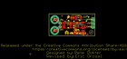
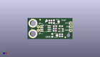
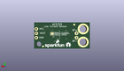
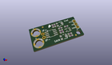

Contents
========

* [PROJ-SPAR-14544-STAN-01>Current Sensor Breakout-ACS723-Low Current](#proj-spar-14544-stan-01current-sensor-breakout-acs723-low-current)
	* [Images](#images)
	* [Interactive BOM](#interactive-bom)
	* [OOMP Parts](#oomp-parts)
	* [Tags](#tags)
  
![][im]
# PROJ-SPAR-14544-STAN-01>Current Sensor Breakout-ACS723-Low Current

- ID: PROJ-SPAR-14544-STAN-01
- Hex ID: PRS14544
- Name: Current Sensor Breakout-ACS723-Low Current
- Description: 

## Images
  
  

|eagleImage|kicadPcb3dFront|kicadPcb3dBack|kicadPcb3d|
| :---: | :---: | :---: | :---: |
|||||

## Interactive BOM

- Interactive BOM page: [ibom.html](kicad/bom/ibom.html)

## OOMP Parts
  

|OOMP Parts|
| :---: |
|CAPE-0603-X-UNMATCHED-01, C1, 23.622, 1.9049999999999998, 180,C1, 100pF, 0603, SparkFun-Capacitors, (0.93, 0.075), R180|
|<table><tr><td></td><td> C2</td><td>[CAPC-0603-X-NF100-V50 SMD (0603) 100 nF Capacitor (Ceramic) 50v](https://github.com/oomlout/oomlout_OOMP_parts/tree/main/CAPC-0603-X-NF100-V50/)</td><td>[C6N100](https://github.com/oomlout/oomlout_OOMP_parts/tree/main/CAPC-0603-X-NF100-V50/)</td></tr></table>|
|<table><tr><td></td><td> C3</td><td>[CAPC-0603-X-NF100-V50 SMD (0603) 100 nF Capacitor (Ceramic) 50v](https://github.com/oomlout/oomlout_OOMP_parts/tree/main/CAPC-0603-X-NF100-V50/)</td><td>[C6N100](https://github.com/oomlout/oomlout_OOMP_parts/tree/main/CAPC-0603-X-NF100-V50/)</td></tr></table>|
|<table><tr><td></td><td> C4</td><td>[CAPC-0603-X-NF100-V50 SMD (0603) 100 nF Capacitor (Ceramic) 50v](https://github.com/oomlout/oomlout_OOMP_parts/tree/main/CAPC-0603-X-NF100-V50/)</td><td>[C6N100](https://github.com/oomlout/oomlout_OOMP_parts/tree/main/CAPC-0603-X-NF100-V50/)</td></tr></table>|
|CAPC-0603-X-UNMATCHED-01, C5, 19.431, 9.334499999999998, 0,C5, 1nF, 0603, SparkFun-Capacitors, (0.765, 0.3675), R0|
|UNMATCHED-UNMATCHED-X-UNMATCHED-01, J1, 3.8099999999999996, 11.43, 0,J1, SMTSO-256-ET-0.165DIA, SparkFun-Connectors, (0.15, 0.45), R0|
|UNMATCHED-UNMATCHED-X-UNMATCHED-01, J2, 3.8099999999999996, 3.8099999999999996, 0,J2, SMTSO-256-ET-0.165DIA, SparkFun-Connectors, (0.15, 0.15), R0|
|UNMATCHED-UNMATCHED-X-UNMATCHED-01, J3, 7.619999999999999, 6.35, 90,J3, 1X02_NO_SILK, SparkFun-Connectors, (0.3, 0.25), R90|
|UNMATCHED-UNMATCHED-X-UNMATCHED-01, JP1, 21.4376, 8.6614, M0,JP1, JUMPER-SMT_2_NO_SILK, SMT-JUMPER_2_NO_SILK, SparkFun-Jumpers, (0.844, 0.341), MR0|
|<table><tr><td></td><td> JP3</td><td>[HEAD-I01-X-PI03-01 2.54 mm 3 Pin Header](https://github.com/oomlout/oomlout_OOMP_parts/tree/main/HEAD-I01-X-PI03-01/)</td><td>[H03](https://github.com/oomlout/oomlout_OOMP_parts/tree/main/HEAD-I01-X-PI03-01/)</td></tr></table>|
|<table><tr><td></td><td> R1</td><td>[RESE-0603-X-O223-01 SMD (0603) 22k Ohm Resistor](https://github.com/oomlout/oomlout_OOMP_parts/tree/main/RESE-0603-X-O223-01/)</td><td>[R6223](https://github.com/oomlout/oomlout_OOMP_parts/tree/main/RESE-0603-X-O223-01/)</td></tr></table>|
|RESE-0603-X-UNMATCHED-01, R2, 18.541999999999998, 6.7945, 90,R2, 1k, 0603, SparkFun-Resistors, (0.73, 0.2675), R90|
|RESE-0603-X-UNMATCHED-01, R5, 20.066, 6.7945, 90,R5, 4.7k, 0603, SparkFun-Resistors, (0.79, 0.2675), R90|
|UNMATCHED-UNMATCHED-X-UNMATCHED-01, U1, 12.7, 7.619999999999999, 270,U1, ACS723, SO08, SparkFun-Sensors, (0.5, 0.3), R270|
|UNMATCHED-UNMATCHED-X-UNMATCHED-01, U2, 23.622, 6.5405, 90,U2, OPA344, SOT23-5, SparkFun-IC-Amplifiers, (0.93, 0.2575), R90|
|UNMATCHED-UNMATCHED-X-UNMATCHED-01, VR1, 19.304, 2.667, 270,VR1, 10k, TRIMPOT-SMD-TC33X, SparkFun-Resistors, (0.76, 0.105), R270|
|UNMATCHED-UNMATCHED-X-UNMATCHED-01, VR2, 20.447, 12.572999999999999, 270,VR2, 10k, TRIMPOT-SMD-TC33X, SparkFun-Resistors, (0.805, 0.495), R270|

## Tags

- hexID: PRS14544
- oompType: PROJ
- oompSize: SPAR
- oompColor: 14544
- oompDesc: STAN
- oompIndex: 01
- oompName: Current Sensor Breakout-ACS723-Low Current
- sources: All source files from https://github.com/sparkfun/Current_Sensor_Breakout-ACS723-Low_Current (source licence details in srcLicense.md)
- linkBuyPage: https://www.sparkfun.com/products/14544
- oompID: PROJ-SPAR-14544-STAN-01
- oompPart: CAPE-0603-X-UNMATCHED-01, C1, 23.622, 1.9049999999999998, 180
- oompPart: CAPC-0603-X-NF100-V50, C2, 23.622, 9.334499999999998, 0
- oompPart: CAPC-0603-X-NF100-V50, C3, 16.891, 12.572999999999999, 90
- oompPart: CAPC-0603-X-NF100-V50, C4, 15.366999999999999, 12.572999999999999, 270
- oompPart: CAPC-0603-X-UNMATCHED-01, C5, 19.431, 9.334499999999998, 0
- oompPart: SKIP-UNMATCHED-X-UNMATCHED-01, FD1, 8.889999999999999, 13.97, 0
- oompPart: SKIP-UNMATCHED-X-UNMATCHED-01, FD2, 8.889999999999999, 13.97, M0
- oompPart: SKIP-UNMATCHED-X-UNMATCHED-01, FD3, 26.669999999999998, 1.27, 0
- oompPart: SKIP-UNMATCHED-X-UNMATCHED-01, FD4, 26.669999999999998, 1.27, M0
- oompPart: UNMATCHED-UNMATCHED-X-UNMATCHED-01, J1, 3.8099999999999996, 11.43, 0
- oompPart: UNMATCHED-UNMATCHED-X-UNMATCHED-01, J2, 3.8099999999999996, 3.8099999999999996, 0
- oompPart: UNMATCHED-UNMATCHED-X-UNMATCHED-01, J3, 7.619999999999999, 6.35, 90
- oompPart: UNMATCHED-UNMATCHED-X-UNMATCHED-01, JP1, 21.4376, 8.6614, M0
- oompPart: HEAD-I01-X-PI03-01, JP3, 30.479999999999997, 11.43, 270
- oompPart: RESE-0603-X-O223-01, R1, 23.622, 3.429, 180
- oompPart: RESE-0603-X-UNMATCHED-01, R2, 18.541999999999998, 6.7945, 90
- oompPart: RESE-0603-X-UNMATCHED-01, R5, 20.066, 6.7945, 90
- oompPart: UNMATCHED-UNMATCHED-X-UNMATCHED-01, U1, 12.7, 7.619999999999999, 270
- oompPart: UNMATCHED-UNMATCHED-X-UNMATCHED-01, U2, 23.622, 6.5405, 90
- oompPart: UNMATCHED-UNMATCHED-X-UNMATCHED-01, VR1, 19.304, 2.667, 270
- oompPart: UNMATCHED-UNMATCHED-X-UNMATCHED-01, VR2, 20.447, 12.572999999999999, 270
- rawPart: C1, 100pF, 0603, SparkFun-Capacitors, (0.93, 0.075), R180
- rawPart: C2, 0.1uF, 0603, SparkFun-Capacitors, (0.93, 0.3675), R0
- rawPart: C3, 0.1uF, 0603, SparkFun-Capacitors, (0.665, 0.495), R90
- rawPart: C4, 0.1uF, 0603, SparkFun-Capacitors, (0.605, 0.495), R270
- rawPart: C5, 1nF, 0603, SparkFun-Capacitors, (0.765, 0.3675), R0
- rawPart: FD1, FIDUCIAL1X2, FIDUCIAL-1X2, SparkFun-Aesthetics, (0.35, 0.55), R0
- rawPart: FD2, FIDUCIAL1X2, FIDUCIAL-1X2, SparkFun-Aesthetics, (0.35, 0.55), MR0
- rawPart: FD3, FIDUCIAL1X2, FIDUCIAL-1X2, SparkFun-Aesthetics, (1.05, 0.05), R0
- rawPart: FD4, FIDUCIAL1X2, FIDUCIAL-1X2, SparkFun-Aesthetics, (1.05, 0.05), MR0
- rawPart: J1, SMTSO-256-ET-0.165DIA, SparkFun-Connectors, (0.15, 0.45), R0
- rawPart: J2, SMTSO-256-ET-0.165DIA, SparkFun-Connectors, (0.15, 0.15), R0
- rawPart: J3, 1X02_NO_SILK, SparkFun-Connectors, (0.3, 0.25), R90
- rawPart: JP1, JUMPER-SMT_2_NO_SILK, SMT-JUMPER_2_NO_SILK, SparkFun-Jumpers, (0.844, 0.341), MR0
- rawPart: JP3, 1X03, SparkFun, (1.2, 0.45), R270
- rawPart: R1, 22k, 0603, SparkFun-Resistors, (0.93, 0.135), R180
- rawPart: R2, 1k, 0603, SparkFun-Resistors, (0.73, 0.2675), R90
- rawPart: R5, 4.7k, 0603, SparkFun-Resistors, (0.79, 0.2675), R90
- rawPart: U1, ACS723, SO08, SparkFun-Sensors, (0.5, 0.3), R270
- rawPart: U2, OPA344, SOT23-5, SparkFun-IC-Amplifiers, (0.93, 0.2575), R90
- rawPart: VR1, 10k, TRIMPOT-SMD-TC33X, SparkFun-Resistors, (0.76, 0.105), R270
- rawPart: VR2, 10k, TRIMPOT-SMD-TC33X, SparkFun-Resistors, (0.805, 0.495), R270

[im]: kicadPcb3d_450.png
