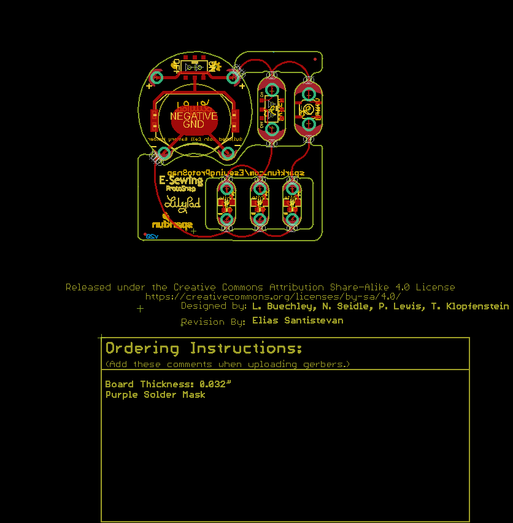
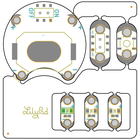
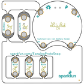
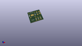
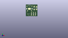
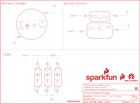

Contents
========

* [PRS14546 > LilyPad E-Sewing Kit](#prs14546--lilypad-e-sewing-kit)
	* [Schematic](#schematic)
	* [PCB](#pcb)
	* [Interactive BOM](#interactive-bom)
	* [OOMP Parts](#oomp-parts)
	* [Images](#images)
	* [Tags](#tags)
  
![][im]
# PRS14546 > LilyPad E-Sewing Kit

- ID: PROJ-SPAR-14546-STAN-01
- Hex ID: PRS14546
- Name: Sparkfun
- Description: Sparkfun
- Long Link: [http://oom.lt/PROJ-SPAR-14546-STAN-01](http://oom.lt/PROJ-SPAR-14546-STAN-01)
- Short Link: [http://oom.lt/PRS14546](http://oom.lt/PRS14546)

## Schematic
  

## PCB
  

## Interactive BOM

- Interactive BOM page: [ibom.html](https://htmlpreview.github.io/?https://github.com/oomlout/oomlout_OOMP_projects/blob/main/PROJ-SPAR-14546-STAN-01/kicad/bom/ibom.html)

## OOMP Parts
  

|OOMP Parts|
| :---: |
|UNMATCHED-UNMATCHED-X-UNMATCHED-01 BAT1, S1, S2, S3, U$9|
|LEDS-1206-G-STAN-01 LED1, LED2, LED3|
|RESE-0603-X-O151-01 R1, R2, R3|

## Images
  
  

|bominteractivefront|bominteractiveback|kicadPcb3d|kicadPcb3dFront|kicadPcb3dBack|eagleImage|eagleSchemImage|
| :---: | :---: | :---: | :---: | :---: | :---: | :---: |
||||||||

## Tags

- hexID: PRS14546
- oompType: PROJ
- oompSize: SPAR
- oompColor: 14546
- oompDesc: STAN
- oompIndex: 01
- oompName: LilyPad E-Sewing Kit
- sources: All source files from https://github.com/sparkfun/LilyPad_E-Sewing_Kit (source licence details in srcLicense.md)
- linkBuyPage: https://www.sparkfun.com/products/14546
- oompID: PROJ-SPAR-14546-STAN-01
- oompParts: BAT1,UNMATCHED-UNMATCHED-X-UNMATCHED-01
- oompParts: LED1,LEDS-1206-G-STAN-01
- oompParts: LED2,LEDS-1206-G-STAN-01
- oompParts: LED3,LEDS-1206-G-STAN-01
- oompParts: R1,RESE-0603-X-O151-01
- oompParts: R2,RESE-0603-X-O151-01
- oompParts: R3,RESE-0603-X-O151-01
- oompParts: S1,UNMATCHED-UNMATCHED-X-UNMATCHED-01
- oompParts: S2,UNMATCHED-UNMATCHED-X-UNMATCHED-01
- oompParts: S3,UNMATCHED-UNMATCHED-X-UNMATCHED-01
- oompParts: U$9,UNMATCHED-UNMATCHED-X-UNMATCHED-01
- rawParts: BAT1,20mm coincell,BATTERY20MM_4LEGS,BATTCON_20MM_4LEGS,Battery Holders,,BATT-10373,,20mm coincell,
- rawParts: BATB-,SEWTAP6,SEWTAP6,PETAL-SMALL-2SIDE,Sew Taps for LilyPad Boards.,,,,,
- rawParts: BATB-2,SEWTAP6,SEWTAP6,PETAL-SMALL-2SIDE,Sew Taps for LilyPad Boards.,,,,,
- rawParts: BATT+,SEWTAP6,SEWTAP6,PETAL-SMALL-2SIDE,Sew Taps for LilyPad Boards.,,,,,
- rawParts: BATT+2,SEWTAP6,SEWTAP6,PETAL-SMALL-2SIDE,Sew Taps for LilyPad Boards.,,,,,
- rawParts: BUTTON-,SEWTAP8,SEWTAP8,PETAL-MEDIUM-2SIDE,Sew Taps for LilyPad Boards.,,,,,
- rawParts: BUTTONS,SEWTAP8,SEWTAP8,PETAL-MEDIUM-2SIDE,Sew Taps for LilyPad Boards.,,,,,
- rawParts: FD1,FIDUCIALUFIDUCIAL,FIDUCIALUFIDUCIAL,MICRO-FIDUCIAL,Fiducial Alignment Points,,,,,
- rawParts: FD2,FIDUCIALUFIDUCIAL,FIDUCIALUFIDUCIAL,MICRO-FIDUCIAL,Fiducial Alignment Points,,,,,
- rawParts: FD3,FIDUCIALUFIDUCIAL,FIDUCIALUFIDUCIAL,MICRO-FIDUCIAL,Fiducial Alignment Points,,,,,
- rawParts: FD4,FIDUCIALUFIDUCIAL,FIDUCIALUFIDUCIAL,MICRO-FIDUCIAL,Fiducial Alignment Points,,,,,
- rawParts: FRAME1,FRAME-LETTER,FRAME-LETTER,CREATIVE_COMMONS,Schematic Frame,,,,,
- rawParts: LED+1,SEWTAP6,SEWTAP6,PETAL-SMALL-2SIDE,Sew Taps for LilyPad Boards.,,,,,
- rawParts: LED+2,SEWTAP6,SEWTAP6,PETAL-SMALL-2SIDE,Sew Taps for LilyPad Boards.,,,,,
- rawParts: LED+3,SEWTAP6,SEWTAP6,PETAL-SMALL-2SIDE,Sew Taps for LilyPad Boards.,,,,,
- rawParts: LED-1,SEWTAP6,SEWTAP6,PETAL-SMALL-2SIDE,Sew Taps for LilyPad Boards.,,,,,
- rawParts: LED-2,SEWTAP6,SEWTAP6,PETAL-SMALL-2SIDE,Sew Taps for LilyPad Boards.,,,,,
- rawParts: LED-3,SEWTAP6,SEWTAP6,PETAL-SMALL-2SIDE,Sew Taps for LilyPad Boards.,,,,,
- rawParts: LED1,WHITE,LED-WHITE1206,LED-1206,White SMD LEDs,,DIO-09955,,WHITE,
- rawParts: LED2,WHITE,LED-WHITE1206,LED-1206,White SMD LEDs,,DIO-09955,,WHITE,
- rawParts: LED3,WHITE,LED-WHITE1206,LED-1206,White SMD LEDs,,DIO-09955,,WHITE,
- rawParts: LOGO1,SFE_LOGO_FLAME.1_INCH,SFE_LOGO_FLAME.1_INCH,SFE_LOGO_FLAME_.1,SFE Logo, flame only,,,,,
- rawParts: LOGO2,OSHW-LOGOS,OSHW-LOGOS,OSHW-LOGO-S,Open Source Hardware Logo,,,,,
- rawParts: LOGO3,SFE_LOGO_NAME_FLAME.1_INCH,SFE_LOGO_NAME_FLAME.1_INCH,SFE_LOGO_NAME_FLAME_.1,SparkFun Font Logo w/ Flame,,,,,
- rawParts: MB+,MOUSE-BITE-12_HOLES,MOUSE-BITE-12_HOLES,MOUST-BITE-1-(2_HOLES),,,,,,
- rawParts: MB-,MOUSE-BITE-12_HOLES,MOUSE-BITE-12_HOLES,MOUST-BITE-1-(2_HOLES),,,,,,
- rawParts: MB1,MOUSE-BITE-12_HOLES,MOUSE-BITE-12_HOLES,MOUST-BITE-1-(2_HOLES),,,,,,
- rawParts: MB2,MOUSE-BITE-12_HOLES,MOUSE-BITE-12_HOLES,MOUST-BITE-1-(2_HOLES),,,,,,
- rawParts: MB3,MOUSE-BITE-12_HOLES,MOUSE-BITE-12_HOLES,MOUST-BITE-1-(2_HOLES),,,,,,
- rawParts: MB4,MOUSE-BITE-12_HOLES,MOUSE-BITE-12_HOLES,MOUST-BITE-1-(2_HOLES),,,,,,
- rawParts: MB5,MOUSE-BITE-12_HOLES,MOUSE-BITE-12_HOLES,MOUST-BITE-1-(2_HOLES),,,,,,
- rawParts: MB6,MOUSE-BITE-12_HOLES,MOUSE-BITE-12_HOLES,MOUST-BITE-1-(2_HOLES),,,,,,
- rawParts: MB7,MOUSE-BITE-12_HOLES,MOUSE-BITE-12_HOLES,MOUST-BITE-1-(2_HOLES),,,,,,
- rawParts: MB8,MOUSE-BITE-12_HOLES,MOUSE-BITE-12_HOLES,MOUST-BITE-1-(2_HOLES),,,,,,
- rawParts: MB9,MOUSE-BITE-12_HOLES,MOUSE-BITE-12_HOLES,MOUST-BITE-1-(2_HOLES),,,,,,
- rawParts: MB10,MOUSE-BITE-12_HOLES,MOUSE-BITE-12_HOLES,MOUST-BITE-1-(2_HOLES),,,,,,
- rawParts: R1,150,150OHM-1/10W-1%(0603),0603-RES,RES-11028,13326,,,150,
- rawParts: R2,150,150OHM-1/10W-1%(0603),0603-RES,RES-11028,13326,,,150,
- rawParts: R3,150,150OHM-1/10W-1%(0603),0603-RES,RES-11028,13326,,,150,
- rawParts: S1,S1,SWITCH-SPDTSMD,AYZ0202,SPDT Switch,,SWCH-08179,COM-00597,,
- rawParts: S2,SWITCH-MOMENTARY-2SMD,SWITCH-MOMENTARY-2SMD,TACTILE-SWITCH-SMD,Various NO switches- pushbuttons, reed, etc,,SWCH-08247,,,
- rawParts: S3,S3,SWITCH-SPDTSMD,AYZ0202,SPDT Switch,,SWCH-08179,COM-00597,,
- rawParts: SLIDEOFF,SEWTAP8,SEWTAP8,PETAL-MEDIUM-2SIDE,Sew Taps for LilyPad Boards.,,,,,
- rawParts: SLIDEON,SEWTAP8,SEWTAP8,PETAL-MEDIUM-2SIDE,Sew Taps for LilyPad Boards.,,,,,
- rawParts: U$1,REVISION,REVISION,REVISION,,,,,,
- rawParts: U$9,SPECIAL_INSTRUCTIONS-ORDERING,SPECIAL_INSTRUCTIONS-ORDERING,ORDERING_INSTRUCTIONS,Special Ordering/Production Instructions Alert,,,,,

[im]: kicadPcb3d_450.png
