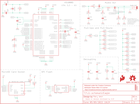

Contents
========

* [PRS14554 > Sparkfun](#prs14554--sparkfun)
	* [Schematic](#schematic)
	* [Interactive BOM](#interactive-bom)
	* [OOMP Parts](#oomp-parts)
	* [Images](#images)
	* [Tags](#tags)
  
![][im]
# PRS14554 > Sparkfun

- ID: PROJ-SPAR-14554-STAN-01
- Hex ID: PRS14554
- Name: Sparkfun
- Description: Sparkfun
- Long Link: [http://oom.lt/PROJ-SPAR-14554-STAN-01](http://oom.lt/PROJ-SPAR-14554-STAN-01)
- Short Link: [http://oom.lt/PRS14554](http://oom.lt/PRS14554)

## Schematic
  

## Interactive BOM

- Interactive BOM page: [ibom.html](https://htmlpreview.github.io/?https://github.com/oomlout/oomlout_OOMP_projects/blob/main/PROJ-SPAR-14554-STAN-01/kicad/bom/ibom.html)

## OOMP Parts
  

|OOMP Parts|
| :---: |
|C1,CAPC-0603-X-UNMATCHED-01,C1,22pF,22PF-50V-5%(0603),0603-CAP,CAP-07876,CAP-07876,,,22pF,|
|C2,CAPC-0603-X-UNMATCHED-01,C2,22pF,22PF-50V-5%(0603),0603-CAP,CAP-07876,CAP-07876,,,22pF,|
|C3,CAPC-0603-X-UF10-01,C3,10uF,10UF-0603-6.3V-20%,0603,10.0µF ceramic capacitors,CAP-11015,,,10uF,|
|C4,CAPC-0603-X-UF10-01,C4,10uF,10UF-0603-6.3V-20%,0603,10.0µF ceramic capacitors,CAP-11015,,,10uF,|
|C5,CAPC-0603-X-UF10-01,C5,10uF,10UF-0603-6.3V-20%,0603,10.0µF ceramic capacitors,CAP-11015,,,10uF,|
|C6,CAPC-0603-X-UNMATCHED-01,C6,1.0uF,1.0UF-16V-10%(0603),0603-CAP,CAP-00868,CAP-00868,,,1.0uF,|
|C7,CAPC-0603-X-UNMATCHED-01,C7,1.0uF,1.0UF-16V-10%(0603),0603-CAP,CAP-00868,CAP-00868,,,1.0uF,|
|C8,CAPC-0603-X-NF100-V50,C8,0.1uF,0.1UF-0603-25V-(+80/-20%),0603,0.1µF ceramic capacitors,CAP-00810,,,0.1uF,|
|C9,CAPC-0603-X-UF10-01,C9,10uF,10UF-6.3V-20%(0603),0603-CAP,CAP-11015,CAP-11015,,,10uF,|
|C10,CAPC-0603-X-UF10-01,C10,10uF,10UF-6.3V-20%(0603),0603-CAP,CAP-11015,CAP-11015,,,10uF,|
|C11,CAPC-0603-X-UNMATCHED-01,C11,10nF,10NF/10000PF-50V-10%(0603),0603-CAP,CAP-00867,CAP-00867,,,10nF,|
|C12,CAPC-0603-X-UNMATCHED-01,C12,10nF,10NF/10000PF-50V-10%(0603),0603-CAP,CAP-00867,CAP-00867,,,10nF,|
|C13,CAPC-0603-X-UF10-01,C13,10uF,10UF-6.3V-20%(0603),0603-CAP,CAP-11015,CAP-11015,,,10uF,|
|C14,CAPC-0603-X-UNMATCHED-01,C14,2.2uF,2.2UF-0603-10V-20%,0603,2.2µF ceramic capacitors,CAP-07888,,,2.2uF,|
|C15,CAPC-0603-X-UNMATCHED-01,C15,47nF,47NF(0.047UF/47000PF)-25V-5%(0603)SMD,0603-CAP,CAP-08605,CAP-08605,,,47nF,|
|C16,CAPC-0603-X-NF100-V50,C16,0.1uF,0.1UF-0603-25V-(+80/-20%),0603,0.1µF ceramic capacitors,CAP-00810,,,0.1uF,|
|D1,LEDS-0603-G-STAN-01,D1,GREEN,LED-GREEN0603,LED-0603,Green SMD LED,DIO-00821,,,GREEN,|
|D2,LEDS-0603-G-STAN-01,D2,RED,LED-RED0603,LED-0603,Red SMD LED,DIO-00819,,,RED,|
|D3,LEDS-0603-G-STAN-01,D3,RED,LED-RED0603,LED-0603,Red SMD LED,DIO-00819,,,RED,|
|J1,UNMATCHED-UNMATCHED-X-UNMATCHED-01,FD1,FIDUCIALUFIDUCIAL,FIDUCIALUFIDUCIAL,FIDUCIAL-MICRO,Fiducial Alignment Points,,,,,|
|J2,UNMATCHED-UNMATCHED-X-UNMATCHED-01,FD2,FIDUCIALUFIDUCIAL,FIDUCIALUFIDUCIAL,FIDUCIAL-MICRO,Fiducial Alignment Points,,,,,|
|J3,UNMATCHED-UNMATCHED-X-UNMATCHED-01,FD3,FIDUCIALUFIDUCIAL,FIDUCIALUFIDUCIAL,FIDUCIAL-MICRO,Fiducial Alignment Points,,,,,|
|J4,UNMATCHED-UNMATCHED-X-UNMATCHED-01,FD4,FIDUCIALUFIDUCIAL,FIDUCIALUFIDUCIAL,FIDUCIAL-MICRO,Fiducial Alignment Points,,,,,|
|J5,UNMATCHED-UNMATCHED-X-UNMATCHED-01,FRAME1,FRAME-LETTER,FRAME-LETTER,CREATIVE_COMMONS,Schematic Frame - Letter,,,,,|
|J6,UNMATCHED-UNMATCHED-X-UNMATCHED-01,FRAME2,FRAME-LETTER,FRAME-LETTER,CREATIVE_COMMONS,Schematic Frame - Letter,,,,,|
|J7,UNMATCHED-UNMATCHED-X-UNMATCHED-01,H1,STAND-OFFTIGHT,STAND-OFFTIGHT,STAND-OFF-TIGHT,#4 Stand Off,,,,,|
|J8,UNMATCHED-UNMATCHED-X-UNMATCHED-01,H2,STAND-OFFTIGHT,STAND-OFFTIGHT,STAND-OFF-TIGHT,#4 Stand Off,,,,,|
|J9,UNMATCHED-UNMATCHED-X-UNMATCHED-01,H3,STAND-OFFTIGHT,STAND-OFFTIGHT,STAND-OFF-TIGHT,#4 Stand Off,,,,,|
|J10,UNMATCHED-UNMATCHED-X-UNMATCHED-01,J1,Audio Jack,AUDIO-JACKSMD2,AUDIO-JACK-3.5MM-SMD,3.5mm Audio Jack,CONN-10353,,,,|
|J11,UNMATCHED-UNMATCHED-X-UNMATCHED-01,J2,MICRO-SD_CARD_SOCKET,MICRO-SD_CARD_SOCKET,MICRO-SD-SOCKET,microSD Socket for Transflash,CONN-07820,PRT-00127,,,|
|J12,UNMATCHED-UNMATCHED-X-UNMATCHED-01,J3,,CONN_02,1X02,Multi connection point. Often used as Generic Header-pin footprint for 0.1 inch spaced/style header connections,,,,,|
|R1,RESE-0603-X-O105-01,J4,,6_PIN_SERIAL_TARGETSILK,6_PIN_SERIAL_TARGET_SIDE_W_SILK,6-pin header connection for use with the FTDI BASIC pinout - TARGET SIDE.,,,,,|
|R2,RESE-0603-X-O1003-01,J5,,CONN_02,1X02,Multi connection point. Often used as Generic Header-pin footprint for 0.1 inch spaced/style header connections,,,,,|
|R3,RESE-0603-X-O1003-01,J6,,CONN_05,1X05,Multi connection point. Often used as Generic Header-pin footprint for 0.1 inch spaced/style header connections,,,,,|
|R4,RESE-0603-X-O103-01,J7,,CONN_04,1X04,Multi connection point. Often used as Generic Header-pin footprint for 0.1 inch spaced/style header connections,CONN-09696,,,,|
|R5,RESE-0603-X-O103-01,J8,,CONN_02,1X02,Multi connection point. Often used as Generic Header-pin footprint for 0.1 inch spaced/style header connections,,,,,|
|R6,RESE-0603-X-O471-01,J9,,CONN_02,1X02,Multi connection point. Often used as Generic Header-pin footprint for 0.1 inch spaced/style header connections,,,,,|
|R7,RESE-0603-X-O471-01,J10,,CONN_02,1X02,Multi connection point. Often used as Generic Header-pin footprint for 0.1 inch spaced/style header connections,,,,,|
|R8,RESE-0603-X-O21-01,J11,,CONN_02,1X02,Multi connection point. Often used as Generic Header-pin footprint for 0.1 inch spaced/style header connections,,,,,|
|R9,RESE-0603-X-O103-01,J12,,CONN_01,1X01,Single connection point. Often used as Generic Header-pin footprint for 0.1 inch spaced/style header connections,,,,,|
|R10,RESE-0603-X-O21-01,LOGO1,OSHW-LOGOL,OSHW-LOGOL,OSHW-LOGO-L,Open-Source Hardware (OSHW) Logo,,,,,|
|R11,RESE-0603-X-O1003-01,LOGO2,SFE_LOGO_FLAME.2_INCH,SFE_LOGO_FLAME.2_INCH,SFE_LOGO_FLAME_.2,SparkFun Flame Logo,,,,,|
|R12,RESE-0603-X-O1003-01,R1,1M,1MOHM-1/10W-1%(0603),0603-RES,RES-07868,RES-07868,,,1M,|
|R13,RESE-0603-X-O1003-01,R2,100k,100KOHM-1/10W-1%(0603),0603-RES,RES-07828,RES-07828,,,100k,|
|R15,RESE-0603-X-O105-01,R3,100k,100KOHM-1/10W-1%(0603),0603-RES,RES-07828,RES-07828,,,100k,|
|R16,RESE-0603-X-O1003-01,R4,10K,10KOHM-1/10W-1%(0603)0603,0603-RES,RES-00824,RES-00824,,,10K,|
|R17,RESE-0603-X-O331-01,R5,10K,10KOHM-1/10W-1%(0603)0603,0603-RES,RES-00824,RES-00824,,,10K,|
|R18,RESE-0603-X-UNMATCHED-01,R6,470,470OHM1/10W1%(0603),0603-RES,RES-07869,RES-07869,,,470,|
|R19,RESE-0603-X-O1003-01,R7,470,470OHM1/10W1%(0603),0603-RES,RES-07869,RES-07869,,,470,|
|R20,RESE-0603-X-O1003-01,R8,20,20OHM1/10W1%(0603)SMD,0603-RES,RES-07862,RES-07862,,,20,|
|R21,RESE-0603-X-O1003-01,R9,10k,10KOHM-0603-1/10W-1%,0603,10kΩ resistor,RES-00824,,,10k,|
|R22,RESE-0603-X-O1003-01,R10,20,20OHM1/10W1%(0603)SMD,0603-RES,RES-07862,RES-07862,,,20,|
|R23,RESE-0603-X-O1003-01,R11,100k,100KOHM-1/10W-1%(0603),0603-RES,RES-07828,RES-07828,,,100k,|
|R24,RESE-0603-X-O1003-01,R12,100k,100KOHM-1/10W-1%(0603),0603-RES,RES-07828,RES-07828,,,100k,|
|R25,RESE-0603-X-O1003-01,R13,100k,100KOHM-1/10W-1%(0603),0603-RES,RES-07828,RES-07828,,,100k,|
|R26,RESE-0603-X-UNMATCHED-01,R15,1M,1MOHM-1/10W-1%(0603),0603-RES,RES-07868,RES-07868,,,1M,|
|R27,RESE-0603-X-O11-01,R16,100k,100KOHM-1/10W-1%(0603),0603-RES,RES-07828,RES-07828,,,100k,|
|R28,RESE-0603-X-O1003-01,R17,330,330OHM-0603-1/10W-1%,0603,330Ω resistor,RES-00818,,,330,|
|R29,RESE-0603-X-O1003-01,R18,2.0k,2.0KOHM-0603-1/10W-5%,0603,2kΩ resistor,RES-08296,,,2.0k,|
|R30,RESE-0603-X-O1003-01,R19,100k,100KOHM-1/10W-1%(0603),0603-RES,RES-07828,RES-07828,,,100k,|
|R31,RESE-0603-X-O1003-01,R20,100k,100KOHM-1/10W-1%(0603),0603-RES,RES-07828,RES-07828,,,100k,|
|S1,UNMATCHED-UNMATCHED-X-UNMATCHED-01,R21,100k,100KOHM-1/10W-1%(0603),0603-RES,RES-07828,RES-07828,,,100k,|
|U1,UNMATCHED-UNMATCHED-X-UNMATCHED-01,R22,100k,100KOHM-1/10W-1%(0603),0603-RES,RES-07828,RES-07828,,,100k,|
|U2,UNMATCHED-UNMATCHED-X-UNMATCHED-01,R23,100k,100KOHM-1/10W-1%(0603),0603-RES,RES-07828,RES-07828,,,100k,|
|U3,VREG-SO235-X-KAP2112K-V33D,R24,100k,100KOHM-1/10W-1%(0603),0603-RES,RES-07828,RES-07828,,,100k,|
|U4,UNMATCHED-UNMATCHED-X-UNMATCHED-01,R25,100k,100KOHM-1/10W-1%(0603),0603-RES,RES-07828,RES-07828,,,100k,|
|Y1,UNMATCHED-UNMATCHED-X-UNMATCHED-01,R26,2.0k,2.0KOHM-0603-1/10W-5%,0603,2kΩ resistor,RES-08296,,,2.0k,|
|Y2,UNMATCHED-UNMATCHED-X-UNMATCHED-01,R27,10,10OHM-1/10W-5%0603SMD,0603-RES,RES-09834,RES-09834,,,10,|

## Images
  
  

|kicadPcb3d|kicadPcb3dFront|kicadPcb3dBack|eagleImage|eagleSchemImage|
| :---: | :---: | :---: | :---: | :---: |
||||||

## Tags

- hexID: PRS14554
- oompType: PROJ
- oompSize: SPAR
- oompColor: 14554
- oompDesc: STAN
- oompIndex: 01
- oompName: Papa Soundie Audio Player
- sources: All source files from https://github.com/sparkfun/Papa_Soundie_Audio_Player (source licence details in srcLicense.md)
- linkBuyPage: https://www.sparkfun.com/products/14554
- oompID: PROJ-SPAR-14554-STAN-01
- oompParts: C1,CAPC-0603-X-UNMATCHED-01
- oompParts: C2,CAPC-0603-X-UNMATCHED-01
- oompParts: C3,CAPC-0603-X-UF10-01
- oompParts: C4,CAPC-0603-X-UF10-01
- oompParts: C5,CAPC-0603-X-UF10-01
- oompParts: C6,CAPC-0603-X-UNMATCHED-01
- oompParts: C7,CAPC-0603-X-UNMATCHED-01
- oompParts: C8,CAPC-0603-X-NF100-V50
- oompParts: C9,CAPC-0603-X-UF10-01
- oompParts: C10,CAPC-0603-X-UF10-01
- oompParts: C11,CAPC-0603-X-UNMATCHED-01
- oompParts: C12,CAPC-0603-X-UNMATCHED-01
- oompParts: C13,CAPC-0603-X-UF10-01
- oompParts: C14,CAPC-0603-X-UNMATCHED-01
- oompParts: C15,CAPC-0603-X-UNMATCHED-01
- oompParts: C16,CAPC-0603-X-NF100-V50
- oompParts: D1,LEDS-0603-G-STAN-01
- oompParts: D2,LEDS-0603-G-STAN-01
- oompParts: D3,LEDS-0603-G-STAN-01
- oompParts: J1,UNMATCHED-UNMATCHED-X-UNMATCHED-01
- oompParts: J2,UNMATCHED-UNMATCHED-X-UNMATCHED-01
- oompParts: J3,UNMATCHED-UNMATCHED-X-UNMATCHED-01
- oompParts: J4,UNMATCHED-UNMATCHED-X-UNMATCHED-01
- oompParts: J5,UNMATCHED-UNMATCHED-X-UNMATCHED-01
- oompParts: J6,UNMATCHED-UNMATCHED-X-UNMATCHED-01
- oompParts: J7,UNMATCHED-UNMATCHED-X-UNMATCHED-01
- oompParts: J8,UNMATCHED-UNMATCHED-X-UNMATCHED-01
- oompParts: J9,UNMATCHED-UNMATCHED-X-UNMATCHED-01
- oompParts: J10,UNMATCHED-UNMATCHED-X-UNMATCHED-01
- oompParts: J11,UNMATCHED-UNMATCHED-X-UNMATCHED-01
- oompParts: J12,UNMATCHED-UNMATCHED-X-UNMATCHED-01
- oompParts: R1,RESE-0603-X-O105-01
- oompParts: R2,RESE-0603-X-O1003-01
- oompParts: R3,RESE-0603-X-O1003-01
- oompParts: R4,RESE-0603-X-O103-01
- oompParts: R5,RESE-0603-X-O103-01
- oompParts: R6,RESE-0603-X-O471-01
- oompParts: R7,RESE-0603-X-O471-01
- oompParts: R8,RESE-0603-X-O21-01
- oompParts: R9,RESE-0603-X-O103-01
- oompParts: R10,RESE-0603-X-O21-01
- oompParts: R11,RESE-0603-X-O1003-01
- oompParts: R12,RESE-0603-X-O1003-01
- oompParts: R13,RESE-0603-X-O1003-01
- oompParts: R15,RESE-0603-X-O105-01
- oompParts: R16,RESE-0603-X-O1003-01
- oompParts: R17,RESE-0603-X-O331-01
- oompParts: R18,RESE-0603-X-UNMATCHED-01
- oompParts: R19,RESE-0603-X-O1003-01
- oompParts: R20,RESE-0603-X-O1003-01
- oompParts: R21,RESE-0603-X-O1003-01
- oompParts: R22,RESE-0603-X-O1003-01
- oompParts: R23,RESE-0603-X-O1003-01
- oompParts: R24,RESE-0603-X-O1003-01
- oompParts: R25,RESE-0603-X-O1003-01
- oompParts: R26,RESE-0603-X-UNMATCHED-01
- oompParts: R27,RESE-0603-X-O11-01
- oompParts: R28,RESE-0603-X-O1003-01
- oompParts: R29,RESE-0603-X-O1003-01
- oompParts: R30,RESE-0603-X-O1003-01
- oompParts: R31,RESE-0603-X-O1003-01
- oompParts: S1,UNMATCHED-UNMATCHED-X-UNMATCHED-01
- oompParts: U1,UNMATCHED-UNMATCHED-X-UNMATCHED-01
- oompParts: U2,UNMATCHED-UNMATCHED-X-UNMATCHED-01
- oompParts: U3,VREG-SO235-X-KAP2112K-V33D
- oompParts: U4,UNMATCHED-UNMATCHED-X-UNMATCHED-01
- oompParts: Y1,UNMATCHED-UNMATCHED-X-UNMATCHED-01
- oompParts: Y2,UNMATCHED-UNMATCHED-X-UNMATCHED-01
- rawParts: C1,22pF,22PF-50V-5%(0603),0603-CAP,CAP-07876,CAP-07876,,,22pF,
- rawParts: C2,22pF,22PF-50V-5%(0603),0603-CAP,CAP-07876,CAP-07876,,,22pF,
- rawParts: C3,10uF,10UF-0603-6.3V-20%,0603,10.0µF ceramic capacitors,CAP-11015,,,10uF,
- rawParts: C4,10uF,10UF-0603-6.3V-20%,0603,10.0µF ceramic capacitors,CAP-11015,,,10uF,
- rawParts: C5,10uF,10UF-0603-6.3V-20%,0603,10.0µF ceramic capacitors,CAP-11015,,,10uF,
- rawParts: C6,1.0uF,1.0UF-16V-10%(0603),0603-CAP,CAP-00868,CAP-00868,,,1.0uF,
- rawParts: C7,1.0uF,1.0UF-16V-10%(0603),0603-CAP,CAP-00868,CAP-00868,,,1.0uF,
- rawParts: C8,0.1uF,0.1UF-0603-25V-(+80/-20%),0603,0.1µF ceramic capacitors,CAP-00810,,,0.1uF,
- rawParts: C9,10uF,10UF-6.3V-20%(0603),0603-CAP,CAP-11015,CAP-11015,,,10uF,
- rawParts: C10,10uF,10UF-6.3V-20%(0603),0603-CAP,CAP-11015,CAP-11015,,,10uF,
- rawParts: C11,10nF,10NF/10000PF-50V-10%(0603),0603-CAP,CAP-00867,CAP-00867,,,10nF,
- rawParts: C12,10nF,10NF/10000PF-50V-10%(0603),0603-CAP,CAP-00867,CAP-00867,,,10nF,
- rawParts: C13,10uF,10UF-6.3V-20%(0603),0603-CAP,CAP-11015,CAP-11015,,,10uF,
- rawParts: C14,2.2uF,2.2UF-0603-10V-20%,0603,2.2µF ceramic capacitors,CAP-07888,,,2.2uF,
- rawParts: C15,47nF,47NF(0.047UF/47000PF)-25V-5%(0603)SMD,0603-CAP,CAP-08605,CAP-08605,,,47nF,
- rawParts: C16,0.1uF,0.1UF-0603-25V-(+80/-20%),0603,0.1µF ceramic capacitors,CAP-00810,,,0.1uF,
- rawParts: D1,GREEN,LED-GREEN0603,LED-0603,Green SMD LED,DIO-00821,,,GREEN,
- rawParts: D2,RED,LED-RED0603,LED-0603,Red SMD LED,DIO-00819,,,RED,
- rawParts: D3,RED,LED-RED0603,LED-0603,Red SMD LED,DIO-00819,,,RED,
- rawParts: FD1,FIDUCIALUFIDUCIAL,FIDUCIALUFIDUCIAL,FIDUCIAL-MICRO,Fiducial Alignment Points,,,,,
- rawParts: FD2,FIDUCIALUFIDUCIAL,FIDUCIALUFIDUCIAL,FIDUCIAL-MICRO,Fiducial Alignment Points,,,,,
- rawParts: FD3,FIDUCIALUFIDUCIAL,FIDUCIALUFIDUCIAL,FIDUCIAL-MICRO,Fiducial Alignment Points,,,,,
- rawParts: FD4,FIDUCIALUFIDUCIAL,FIDUCIALUFIDUCIAL,FIDUCIAL-MICRO,Fiducial Alignment Points,,,,,
- rawParts: FRAME1,FRAME-LETTER,FRAME-LETTER,CREATIVE_COMMONS,Schematic Frame - Letter,,,,,
- rawParts: FRAME2,FRAME-LETTER,FRAME-LETTER,CREATIVE_COMMONS,Schematic Frame - Letter,,,,,
- rawParts: H1,STAND-OFFTIGHT,STAND-OFFTIGHT,STAND-OFF-TIGHT,#4 Stand Off,,,,,
- rawParts: H2,STAND-OFFTIGHT,STAND-OFFTIGHT,STAND-OFF-TIGHT,#4 Stand Off,,,,,
- rawParts: H3,STAND-OFFTIGHT,STAND-OFFTIGHT,STAND-OFF-TIGHT,#4 Stand Off,,,,,
- rawParts: J1,Audio Jack,AUDIO-JACKSMD2,AUDIO-JACK-3.5MM-SMD,3.5mm Audio Jack,CONN-10353,,,,
- rawParts: J2,MICRO-SD_CARD_SOCKET,MICRO-SD_CARD_SOCKET,MICRO-SD-SOCKET,microSD Socket for Transflash,CONN-07820,PRT-00127,,,
- rawParts: J3,,CONN_02,1X02,Multi connection point. Often used as Generic Header-pin footprint for 0.1 inch spaced/style header connections,,,,,
- rawParts: J4,,6_PIN_SERIAL_TARGETSILK,6_PIN_SERIAL_TARGET_SIDE_W_SILK,6-pin header connection for use with the FTDI BASIC pinout - TARGET SIDE.,,,,,
- rawParts: J5,,CONN_02,1X02,Multi connection point. Often used as Generic Header-pin footprint for 0.1 inch spaced/style header connections,,,,,
- rawParts: J6,,CONN_05,1X05,Multi connection point. Often used as Generic Header-pin footprint for 0.1 inch spaced/style header connections,,,,,
- rawParts: J7,,CONN_04,1X04,Multi connection point. Often used as Generic Header-pin footprint for 0.1 inch spaced/style header connections,CONN-09696,,,,
- rawParts: J8,,CONN_02,1X02,Multi connection point. Often used as Generic Header-pin footprint for 0.1 inch spaced/style header connections,,,,,
- rawParts: J9,,CONN_02,1X02,Multi connection point. Often used as Generic Header-pin footprint for 0.1 inch spaced/style header connections,,,,,
- rawParts: J10,,CONN_02,1X02,Multi connection point. Often used as Generic Header-pin footprint for 0.1 inch spaced/style header connections,,,,,
- rawParts: J11,,CONN_02,1X02,Multi connection point. Often used as Generic Header-pin footprint for 0.1 inch spaced/style header connections,,,,,
- rawParts: J12,,CONN_01,1X01,Single connection point. Often used as Generic Header-pin footprint for 0.1 inch spaced/style header connections,,,,,
- rawParts: LOGO1,OSHW-LOGOL,OSHW-LOGOL,OSHW-LOGO-L,Open-Source Hardware (OSHW) Logo,,,,,
- rawParts: LOGO2,SFE_LOGO_FLAME.2_INCH,SFE_LOGO_FLAME.2_INCH,SFE_LOGO_FLAME_.2,SparkFun Flame Logo,,,,,
- rawParts: R1,1M,1MOHM-1/10W-1%(0603),0603-RES,RES-07868,RES-07868,,,1M,
- rawParts: R2,100k,100KOHM-1/10W-1%(0603),0603-RES,RES-07828,RES-07828,,,100k,
- rawParts: R3,100k,100KOHM-1/10W-1%(0603),0603-RES,RES-07828,RES-07828,,,100k,
- rawParts: R4,10K,10KOHM-1/10W-1%(0603)0603,0603-RES,RES-00824,RES-00824,,,10K,
- rawParts: R5,10K,10KOHM-1/10W-1%(0603)0603,0603-RES,RES-00824,RES-00824,,,10K,
- rawParts: R6,470,470OHM1/10W1%(0603),0603-RES,RES-07869,RES-07869,,,470,
- rawParts: R7,470,470OHM1/10W1%(0603),0603-RES,RES-07869,RES-07869,,,470,
- rawParts: R8,20,20OHM1/10W1%(0603)SMD,0603-RES,RES-07862,RES-07862,,,20,
- rawParts: R9,10k,10KOHM-0603-1/10W-1%,0603,10kΩ resistor,RES-00824,,,10k,
- rawParts: R10,20,20OHM1/10W1%(0603)SMD,0603-RES,RES-07862,RES-07862,,,20,
- rawParts: R11,100k,100KOHM-1/10W-1%(0603),0603-RES,RES-07828,RES-07828,,,100k,
- rawParts: R12,100k,100KOHM-1/10W-1%(0603),0603-RES,RES-07828,RES-07828,,,100k,
- rawParts: R13,100k,100KOHM-1/10W-1%(0603),0603-RES,RES-07828,RES-07828,,,100k,
- rawParts: R15,1M,1MOHM-1/10W-1%(0603),0603-RES,RES-07868,RES-07868,,,1M,
- rawParts: R16,100k,100KOHM-1/10W-1%(0603),0603-RES,RES-07828,RES-07828,,,100k,
- rawParts: R17,330,330OHM-0603-1/10W-1%,0603,330Ω resistor,RES-00818,,,330,
- rawParts: R18,2.0k,2.0KOHM-0603-1/10W-5%,0603,2kΩ resistor,RES-08296,,,2.0k,
- rawParts: R19,100k,100KOHM-1/10W-1%(0603),0603-RES,RES-07828,RES-07828,,,100k,
- rawParts: R20,100k,100KOHM-1/10W-1%(0603),0603-RES,RES-07828,RES-07828,,,100k,
- rawParts: R21,100k,100KOHM-1/10W-1%(0603),0603-RES,RES-07828,RES-07828,,,100k,
- rawParts: R22,100k,100KOHM-1/10W-1%(0603),0603-RES,RES-07828,RES-07828,,,100k,
- rawParts: R23,100k,100KOHM-1/10W-1%(0603),0603-RES,RES-07828,RES-07828,,,100k,
- rawParts: R24,100k,100KOHM-1/10W-1%(0603),0603-RES,RES-07828,RES-07828,,,100k,
- rawParts: R25,100k,100KOHM-1/10W-1%(0603),0603-RES,RES-07828,RES-07828,,,100k,
- rawParts: R26,2.0k,2.0KOHM-0603-1/10W-5%,0603,2kΩ resistor,RES-08296,,,2.0k,
- rawParts: R27,10,10OHM-1/10W-5%0603SMD,0603-RES,RES-09834,RES-09834,,,10,
- rawParts: R28,100k,100KOHM-1/10W-1%(0603),0603-RES,RES-07828,RES-07828,,,100k,
- rawParts: R29,100k,100KOHM-1/10W-1%(0603),0603-RES,RES-07828,RES-07828,,,100k,
- rawParts: R30,100k,100KOHM-1/10W-1%(0603),0603-RES,RES-07828,RES-07828,,,100k,
- rawParts: R31,100k,100KOHM-1/10W-1%(0603),0603-RES,RES-07828,RES-07828,,,100k,
- rawParts: S1,RESET,MOMENTARY-SWITCH-SPST-SMD-5.2MM,TACTILE_SWITCH_SMD_5.2MM,Momentary Switch (Pushbutton) - SPST,SWCH-08247,,COM-08720,,
- rawParts: U1,ATMEGA328P_TQFP,ATMEGA328P_TQFP,TQFP32-08,Popular 328P in QFP,IC-09069,,,ATMEGA328P_TQFP,
- rawParts: U2,VS1000D,VS1000,LQFP-48,VS1000D,LPA-12743,,,VS1000D,
- rawParts: U3,3.3V,V_REG_AP2112K-3.3V,SOT23-5,AP2112 - 600mA CMOS LDO Regulator w/ Enable,VREG-12457,,,3.3V,
- rawParts: U4,4MB Flash,AT25SF041,SO08,AT25SF041 4Mb Serial Flash Memory,IC-12455,,,4MB Flash,
- rawParts: Y1,12MHz,CRYSTALCRYSTAL-SMD-5X3-12MHZ,CRYSTAL-SMD-5X3,Various standard crystals. Proven footprints.,XTAL-08297,,,12MHz,
- rawParts: Y2,8MHz,RESONATOR-8MHZSMD_3.2X1.3,RESONATOR-SMD-3.2X1.3,8MHz Resonator,XTAL-08895,,,8MHz,

[im]: kicadPcb3d_450.png
