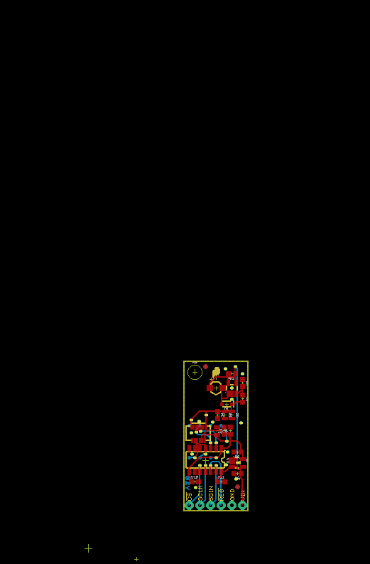
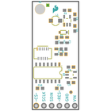
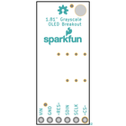
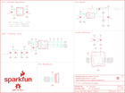

Contents
========

* [PRS14606 > Flexible Grayscale OLED](#prs14606--flexible-grayscale-oled)
	* [Schematic](#schematic)
	* [PCB](#pcb)
	* [Interactive BOM](#interactive-bom)
	* [OOMP Parts](#oomp-parts)
	* [Images](#images)
	* [Tags](#tags)
  
![][im]
# PRS14606 > Flexible Grayscale OLED

- ID: PROJ-SPAR-14606-STAN-01
- Hex ID: PRS14606
- Name: Sparkfun
- Description: Sparkfun
- Long Link: [http://oom.lt/PROJ-SPAR-14606-STAN-01](http://oom.lt/PROJ-SPAR-14606-STAN-01)
- Short Link: [http://oom.lt/PRS14606](http://oom.lt/PRS14606)

## Schematic
  

## PCB
  

## Interactive BOM

- Interactive BOM page: [ibom.html](https://htmlpreview.github.io/?https://github.com/oomlout/oomlout_OOMP_projects/blob/main/PROJ-SPAR-14606-STAN-01/kicad/bom/ibom.html)

## OOMP Parts
  

|OOMP Parts|
| :---: |
|CAPC-0603-X-UNMATCHED-01 C1, C5, C8|
|CAPC-0805-X-UNMATCHED-01 C2|
|[CAPC-0603-X-NF100-V50  SMD (0603) 100 nF Capacitor (Ceramic) 50v  C3, C4, C10, C11](https://github.com/oomlout/oomlout_OOMP_parts/tree/main/CAPC-0603-X-NF100-V50/)|
|CAPC-0805-X-UNMATCHED-V25 C6, C7|
|[CAPC-0603-X-UF22D-V10  SMD (0603) 2.2 uF Capacitor (Ceramic) 10v  C9](https://github.com/oomlout/oomlout_OOMP_parts/tree/main/CAPC-0603-X-UF22D-V10/)|
|DIOD-S323-X-UNMATCHED-01 D1|
|UNMATCHED-UNMATCHED-X-UNMATCHED-01 DS1, L1, U3|
|[HEAD-I01-X-PI06-01  2.54 mm 6 Pin Header  J2](https://github.com/oomlout/oomlout_OOMP_parts/tree/main/HEAD-I01-X-PI06-01/)|
|[RESE-0603-X-O473-01  SMD (0603) 47k Ohm Resistor  R1](https://github.com/oomlout/oomlout_OOMP_parts/tree/main/RESE-0603-X-O473-01/)|
|RESE-0603-X-UNMATCHED-01 R2|
|UNMATCHED-SO235-X-UNMATCHED-01 U1|
|VREG-SO235-X-KAP2112K-V33D U2|

## Images
  
  

|bominteractivefront|bominteractiveback|kicadPcb3d|kicadPcb3dFront|kicadPcb3dBack|eagleImage|eagleSchemImage|
| :---: | :---: | :---: | :---: | :---: | :---: | :---: |
||||||||

## Tags

- hexID: PRS14606
- oompType: PROJ
- oompSize: SPAR
- oompColor: 14606
- oompDesc: STAN
- oompIndex: 01
- oompName: Flexible Grayscale OLED
- sources: All source files from https://github.com/sparkfun/Flexible_Grayscale_OLED (source licence details in srcLicense.md)
- linkBuyPage: https://www.sparkfun.com/products/14606
- oompID: PROJ-SPAR-14606-STAN-01
- oompParts: C1,CAPC-0603-X-UNMATCHED-01
- oompParts: C2,CAPC-0805-X-UNMATCHED-01
- oompParts: C3,CAPC-0603-X-NF100-V50
- oompParts: C4,CAPC-0603-X-NF100-V50
- oompParts: C5,CAPC-0603-X-UNMATCHED-01
- oompParts: C6,CAPC-0805-X-UNMATCHED-V25
- oompParts: C7,CAPC-0805-X-UNMATCHED-V25
- oompParts: C8,CAPC-0603-X-UNMATCHED-01
- oompParts: C9,CAPC-0603-X-UF22D-V10
- oompParts: C10,CAPC-0603-X-NF100-V50
- oompParts: C11,CAPC-0603-X-NF100-V50
- oompParts: D1,DIOD-S323-X-UNMATCHED-01
- oompParts: DS1,UNMATCHED-UNMATCHED-X-UNMATCHED-01
- oompParts: J2,HEAD-I01-X-PI06-01
- oompParts: L1,UNMATCHED-UNMATCHED-X-UNMATCHED-01
- oompParts: R1,RESE-0603-X-O473-01
- oompParts: R2,RESE-0603-X-UNMATCHED-01
- oompParts: U1,UNMATCHED-SO235-X-UNMATCHED-01
- oompParts: U2,VREG-SO235-X-KAP2112K-V33D
- oompParts: U3,UNMATCHED-UNMATCHED-X-UNMATCHED-01
- rawParts: C1,1.0uF,1.0UF-0603-16V-10%,0603,1µF ceramic capacitors,CAP-00868,1.0uF,
- rawParts: C2,1.0uF,1.0UF-0805-25V-10%,0805,1µF ceramic capacitors,CAP-08064,1.0uF,
- rawParts: C3,0.1uF,0.1UF-0603-25V-(+80/-20%),0603,0.1µF ceramic capacitors,CAP-00810,0.1uF,
- rawParts: C4,0.1uF/25V,0.1UF-0603-25V-(+80/-20%),0603,0.1µF ceramic capacitors,CAP-00810,0.1uF,
- rawParts: C5,1.0uF,1.0UF-0603-16V-10%,0603,1µF ceramic capacitors,CAP-00868,1.0uF,
- rawParts: C6,2.2uF/25V,2.2UF-0805-25V-(+80/-20%),0805,2.2µF ceramic capacitors,CAP-11624,2.2uF,
- rawParts: C7,2.2uF/25V,2.2UF-0805-25V-(+80/-20%),0805,2.2µF ceramic capacitors,CAP-11624,2.2uF,
- rawParts: C8,1.0uF,1.0UF-0603-16V-10%,0603,1µF ceramic capacitors,CAP-00868,1.0uF,
- rawParts: C9,2.2uF,2.2UF-0603-10V-20%,0603,2.2µF ceramic capacitors,CAP-07888,2.2uF,
- rawParts: C10,0.1uF,0.1UF-0603-25V-(+80/-20%),0603,0.1µF ceramic capacitors,CAP-00810,0.1uF,
- rawParts: C11,0.1uF,0.1UF-0603-25V-(+80/-20%),0603,0.1µF ceramic capacitors,CAP-00810,0.1uF,
- rawParts: D1,1A/23V/620mV,DIODE-SCHOTTKY-BAT20J,SOD-323,Schottky diode,DIO-11623,1A/23V/620mV,
- rawParts: DS1,OEL_1.8OEL_Y3B,OEL_1.8OEL_Y3B,OEL_1.8_FPC_Y3B,WiseChip SSD1320 - 1.80 Flexible Grayscale OLED,LCD-13910, CONN-13933,,
- rawParts: FD1,FIDUCIAL1X2,FIDUCIAL1X2,FIDUCIAL-1X2,Fiducial Alignment Points,,,
- rawParts: FD2,FIDUCIAL1X2,FIDUCIAL1X2,FIDUCIAL-1X2,Fiducial Alignment Points,,,
- rawParts: FD3,FIDUCIAL1X2,FIDUCIAL1X2,FIDUCIAL-1X2,Fiducial Alignment Points,,,
- rawParts: FD4,FIDUCIAL1X2,FIDUCIAL1X2,FIDUCIAL-1X2,Fiducial Alignment Points,,,
- rawParts: FRAME1,FRAME-LETTER,FRAME-LETTER,CREATIVE_COMMONS,Schematic Frame - Letter,,,
- rawParts: H2,STAND-OFF,STAND-OFF,STAND-OFF,Stand Off,,,
- rawParts: J2,,CONN_06NO_SILK_NO_POP,1X06_NO_SILK,Multi connection point. Often used as Generic Header-pin footprint for 0.1 inch spaced/style header connections,,,
- rawParts: L1,10uH,INDUCTOR-CDRH-10UH,INDUCTOR_4.7UH,Inductors,NDUC-13968,10uH,
- rawParts: LOGO1,SFE_LOGO_NAME_FLAME.1_INCH,SFE_LOGO_NAME_FLAME.1_INCH,SFE_LOGO_NAME_FLAME_.1,SparkFun Font Logo w/ Flame,,,
- rawParts: LOGO2,REVISION,REVISION,REVISION,Revision By Text,,,
- rawParts: LOGO3,SFE_LOGO_FLAME.1_INCH,SFE_LOGO_FLAME.1_INCH,SFE_LOGO_FLAME_.1,SparkFun Flame Logo,,,
- rawParts: LOGO4,OSHW-LOGOS,OSHW-LOGOS,OSHW-LOGO-S,Open-Source Hardware (OSHW) Logo,,,
- rawParts: R1,47k,47KOHM-0603-1/10W-1%,0603,47kΩ resistor,RES-07871,47k,
- rawParts: R2,5.6k,5.6KOHM-0603-1/10W-1%,0603,5.6kΩ resistor,RES-12378,5.6k,
- rawParts: TP1,TEST-POINT3,TEST-POINT3,PAD.03X.03,SparkFun Test Points,,,
- rawParts: TP2,TEST-POINT3,TEST-POINT3,PAD.03X.03,SparkFun Test Points,,,
- rawParts: TP3,TEST-POINT3,TEST-POINT3,PAD.03X.03,SparkFun Test Points,,,
- rawParts: TP4,TEST-POINT3,TEST-POINT3,PAD.03X.03,SparkFun Test Points,,,
- rawParts: TP5,TEST-POINT3,TEST-POINT3,PAD.03X.03,SparkFun Test Points,,,
- rawParts: TP6,TEST-POINT3,TEST-POINT3,PAD.03X.03,SparkFun Test Points,,,
- rawParts: TP7,TEST-POINT3,TEST-POINT3,PAD.03X.03,SparkFun Test Points,,,
- rawParts: U1,AP3012,AP3012,SOT23-5,AP3012,VREG-13911,AP3012,
- rawParts: U2,3.3V,V_REG_AP2112K-3.3V,SOT23-5,AP2112 - 600mA CMOS LDO Regulator w/ Enable,VREG-12457,3.3V,
- rawParts: U3,TXB0104,TXB0104PWRSOIC14,SO14,4-Bit Bi-Directional Level Shifter,IC-11329,TXB0104,

[im]: kicadPcb3d_450.png
