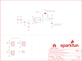

Contents
========

* [PRS14607 > Sparkfun](#prs14607--sparkfun)
	* [Schematic](#schematic)
	* [Interactive BOM](#interactive-bom)
	* [OOMP Parts](#oomp-parts)
	* [Images](#images)
	* [Tags](#tags)
  
![][im]
# PRS14607 > Sparkfun

- ID: PROJ-SPAR-14607-STAN-01
- Hex ID: PRS14607
- Name: Sparkfun
- Description: Sparkfun
- Long Link: [http://oom.lt/PROJ-SPAR-14607-STAN-01](http://oom.lt/PROJ-SPAR-14607-STAN-01)
- Short Link: [http://oom.lt/PRS14607](http://oom.lt/PRS14607)

## Schematic
  

## Interactive BOM

- Interactive BOM page: [ibom.html](https://htmlpreview.github.io/?https://github.com/oomlout/oomlout_OOMP_projects/blob/main/PROJ-SPAR-14607-STAN-01/kicad/bom/ibom.html)

## OOMP Parts
  

|OOMP Parts|
| :---: |
|C1,CAPC-0603-X-UNMATCHED-01,C1,1.0uF,1.0UF-0603-16V-10%,0603,1µF ceramic capacitors,CAP-00868,1.0uF,|
|C2,CAPC-0603-X-UNMATCHED-01,C2,2.2uF,2.2UF-0603-10V-20%,0603,2.2µF ceramic capacitors,CAP-07888,2.2uF,|
|C3,CAPC-0603-X-UF10-01,C3,10uF,10UF-0603-6.3V-20%,0603,10.0µF ceramic capacitors,CAP-11015,10uF,|
|C4,CAPC-0603-X-NF100-V50,C4,0.1uF,0.1UF-0603-25V-(+80/-20%),0603,0.1µF ceramic capacitors,CAP-00810,0.1uF,|
|J1,UNMATCHED-UNMATCHED-X-UNMATCHED-01,FRAME1,FRAME-LETTER,FRAME-LETTER,CREATIVE_COMMONS,Schematic Frame - Letter,,,|
|J2,UNMATCHED-UNMATCHED-X-UNMATCHED-01,J1,,CONN_01PTH_NO_SILK_YES_STOP,1X01_NO_SILK,Single connection point. Often used as Generic Header-pin footprint for 0.1 inch spaced/style header connections,,,|
|J3,UNMATCHED-UNMATCHED-X-UNMATCHED-01,J2,SMD,I2C_STANDARDJS-1MM,1X04_1MM_RA,SparkFun I2C Standard Pinout Header,,,|
|J4,UNMATCHED-UNMATCHED-X-UNMATCHED-01,J3,PTH,I2C_STANDARD_NO_SILK,1X04_NO_SILK,SparkFun I2C Standard Pinout Header,,,|
|JP7,UNMATCHED-UNMATCHED-X-UNMATCHED-01,J4,SMD,I2C_STANDARDJS-1MM,1X04_1MM_RA,SparkFun I2C Standard Pinout Header,,,|
|LOGO2,UNMATCHED-UNMATCHED-X-UNMATCHED-01,JP1,FIDUCIALUFIDUCIAL,FIDUCIALUFIDUCIAL,MICRO-FIDUCIAL,Fiducial Alignment Points,,,|
|R1,RESE-0603-X-O21-01,JP2,FIDUCIALUFIDUCIAL,FIDUCIALUFIDUCIAL,MICRO-FIDUCIAL,Fiducial Alignment Points,,,|
|R2,RESE-0603-X-O103-01,JP3,STAND-OFF,STAND-OFF,STAND-OFF,Stand Off,,,|
|R4,RESE-0603-X-UNMATCHED-01,JP4,STAND-OFF,STAND-OFF,STAND-OFF,Stand Off,,,|
|R5,RESE-0603-X-UNMATCHED-01,JP5,FIDUCIALUFIDUCIAL,FIDUCIALUFIDUCIAL,MICRO-FIDUCIAL,Fiducial Alignment Points,,,|
|U2,UNMATCHED-UNMATCHED-X-UNMATCHED-01,JP6,FIDUCIALUFIDUCIAL,FIDUCIALUFIDUCIAL,MICRO-FIDUCIAL,Fiducial Alignment Points,,,|

## Images
  
  

|kicadPcb3d|kicadPcb3dFront|kicadPcb3dBack|eagleImage|eagleSchemImage|
| :---: | :---: | :---: | :---: | :---: |
||||||

## Tags

- hexID: PRS14607
- oompType: PROJ
- oompSize: SPAR
- oompColor: 14607
- oompDesc: STAN
- oompIndex: 01
- oompName: Qwiic GRIDEye
- sources: All source files from https://github.com/sparkfun/Qwiic_GRIDEye (source licence details in srcLicense.md)
- linkBuyPage: https://www.sparkfun.com/products/14607
- oompID: PROJ-SPAR-14607-STAN-01
- oompParts: C1,CAPC-0603-X-UNMATCHED-01
- oompParts: C2,CAPC-0603-X-UNMATCHED-01
- oompParts: C3,CAPC-0603-X-UF10-01
- oompParts: C4,CAPC-0603-X-NF100-V50
- oompParts: J1,UNMATCHED-UNMATCHED-X-UNMATCHED-01
- oompParts: J2,UNMATCHED-UNMATCHED-X-UNMATCHED-01
- oompParts: J3,UNMATCHED-UNMATCHED-X-UNMATCHED-01
- oompParts: J4,UNMATCHED-UNMATCHED-X-UNMATCHED-01
- oompParts: JP7,UNMATCHED-UNMATCHED-X-UNMATCHED-01
- oompParts: LOGO2,UNMATCHED-UNMATCHED-X-UNMATCHED-01
- oompParts: R1,RESE-0603-X-O21-01
- oompParts: R2,RESE-0603-X-O103-01
- oompParts: R4,RESE-0603-X-UNMATCHED-01
- oompParts: R5,RESE-0603-X-UNMATCHED-01
- oompParts: U2,UNMATCHED-UNMATCHED-X-UNMATCHED-01
- rawParts: C1,1.0uF,1.0UF-0603-16V-10%,0603,1µF ceramic capacitors,CAP-00868,1.0uF,
- rawParts: C2,2.2uF,2.2UF-0603-10V-20%,0603,2.2µF ceramic capacitors,CAP-07888,2.2uF,
- rawParts: C3,10uF,10UF-0603-6.3V-20%,0603,10.0µF ceramic capacitors,CAP-11015,10uF,
- rawParts: C4,0.1uF,0.1UF-0603-25V-(+80/-20%),0603,0.1µF ceramic capacitors,CAP-00810,0.1uF,
- rawParts: FRAME1,FRAME-LETTER,FRAME-LETTER,CREATIVE_COMMONS,Schematic Frame - Letter,,,
- rawParts: J1,,CONN_01PTH_NO_SILK_YES_STOP,1X01_NO_SILK,Single connection point. Often used as Generic Header-pin footprint for 0.1 inch spaced/style header connections,,,
- rawParts: J2,SMD,I2C_STANDARDJS-1MM,1X04_1MM_RA,SparkFun I2C Standard Pinout Header,,,
- rawParts: J3,PTH,I2C_STANDARD_NO_SILK,1X04_NO_SILK,SparkFun I2C Standard Pinout Header,,,
- rawParts: J4,SMD,I2C_STANDARDJS-1MM,1X04_1MM_RA,SparkFun I2C Standard Pinout Header,,,
- rawParts: JP1,FIDUCIALUFIDUCIAL,FIDUCIALUFIDUCIAL,MICRO-FIDUCIAL,Fiducial Alignment Points,,,
- rawParts: JP2,FIDUCIALUFIDUCIAL,FIDUCIALUFIDUCIAL,MICRO-FIDUCIAL,Fiducial Alignment Points,,,
- rawParts: JP3,STAND-OFF,STAND-OFF,STAND-OFF,Stand Off,,,
- rawParts: JP4,STAND-OFF,STAND-OFF,STAND-OFF,Stand Off,,,
- rawParts: JP5,FIDUCIALUFIDUCIAL,FIDUCIALUFIDUCIAL,MICRO-FIDUCIAL,Fiducial Alignment Points,,,
- rawParts: JP6,FIDUCIALUFIDUCIAL,FIDUCIALUFIDUCIAL,MICRO-FIDUCIAL,Fiducial Alignment Points,,,
- rawParts: JP7,,JUMPER-SMT_3_2-NC_PASTE_SILK,SMT-JUMPER_3_2-NC_PASTE_SILK,Normally closed solder jumper (2 of 2 connections),,,
- rawParts: LOGO1,OSHW-LOGOMINI,OSHW-LOGOMINI,OSHW-LOGO-MINI,Open-Source Hardware (OSHW) Logo,,,
- rawParts: LOGO2,REVISION,REVISION,REVISION,Revision By Text,,,
- rawParts: R1,20,20OHM-0603-1/10W-1%,0603,RES-07862,RES-07862,20,
- rawParts: R2,10k,10KOHM-0603-1/10W-1%,0603,10kΩ resistor,RES-00824,10k,
- rawParts: R4,4.7k,4.7KOHM-0603-1/10W-1%,0603,4.7kΩ resistor,RES-07857,4.7k,
- rawParts: R5,4.7k,4.7KOHM-0603-1/10W-1%,0603,4.7kΩ resistor,RES-07857,4.7k,
- rawParts: SJ1,,SOLDERJUMPERNO,SJ_2S-NO,Solder Jumper,,,
- rawParts: U$1,SFE_LOGO_NAME.1_INCH,SFE_LOGO_NAME.1_INCH,SFE_LOGO_NAME_.1,SparkFun Font Logo,,,
- rawParts: U$2,SFE_LOGO_NAME_FLAME.1_INCH,SFE_LOGO_NAME_FLAME.1_INCH,SFE_LOGO_NAME_FLAME_.1,SparkFun Font Logo w/ Flame,,,
- rawParts: U2,GRIDEYE,GRIDEYE,GRIDEYE-AMG88,Panasonic AMG8833 GRIDEye,IC-13912,,

[im]: kicadPcb3d_450.png
