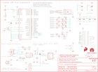

Contents
========

* [PRS14631 > Sparkfun](#prs14631--sparkfun)
	* [Schematic](#schematic)
	* [Interactive BOM](#interactive-bom)
	* [OOMP Parts](#oomp-parts)
	* [Images](#images)
	* [Tags](#tags)
  
![][im]
# PRS14631 > Sparkfun

- ID: PROJ-SPAR-14631-STAN-01
- Hex ID: PRS14631
- Name: Sparkfun
- Description: Sparkfun
- Long Link: [http://oom.lt/PROJ-SPAR-14631-STAN-01](http://oom.lt/PROJ-SPAR-14631-STAN-01)
- Long Link: [http://oom.lt/PRS14631](http://oom.lt/PRS14631)

## Schematic
  
![][schem]
## Interactive BOM

- Interactive BOM page: [ibom.html](https://htmlpreview.github.io/?https://github.com/oomlout/oomlout_OOMP_projects/blob/main/PROJ-SPAR-14631-STAN-01/kicad/bom/ibom.html)

## OOMP Parts
  

|OOMP Parts|
| :---: |
|C2,UNMATCHED-UNMATCHED-UNMATCHED-UNMATCHED-UNMATCHED,C2,0.1uF,0.1UF-0402-16V-10%,0402,0.1µF ceramic capacitors,CAP-12416,,,0.1uF,|
|C3,UNMATCHED-UNMATCHED-UNMATCHED-UNMATCHED-UNMATCHED,C3,0.1uF,0.1UF-0402-16V-10%,0402,0.1µF ceramic capacitors,CAP-12416,,,0.1uF,|
|C4,UNMATCHED-UNMATCHED-UNMATCHED-UNMATCHED-UNMATCHED,C4,0.1uF,0.1UF-0402-16V-10%,0402,0.1µF ceramic capacitors,CAP-12416,,,0.1uF,|
|C5,UNMATCHED-UNMATCHED-UNMATCHED-UNMATCHED-UNMATCHED,C5,1.0uF,1.0UF-0402-16V-10%,0402,1µF ceramic capacitors,CAP-12417,,,1.0uF,|
|C6,UNMATCHED-UNMATCHED-UNMATCHED-UNMATCHED-UNMATCHED,C6,4.7uF,4.7UF0603,0603,4.7µF ceramic capacitors,CAP-08280,,,4.7uF,|
|C7,UNMATCHED-UNMATCHED-UNMATCHED-UNMATCHED-UNMATCHED,C7,4.7uF,4.7UF0603,0603,4.7µF ceramic capacitors,CAP-08280,,,4.7uF,|
|C8,UNMATCHED-UNMATCHED-UNMATCHED-UNMATCHED-UNMATCHED,C8,4.7uF,4.7UF0603,0603,4.7µF ceramic capacitors,CAP-08280,,,4.7uF,|
|D1,UNMATCHED-UNMATCHED-UNMATCHED-UNMATCHED-UNMATCHED,D1,3A/40V/500mV,DIODE-SCHOTTKY-B340A,SMA-DIODE,Schottky diode,DIO-09886,,,3A/40V/500mV,|
|D10,UNMATCHED-UNMATCHED-UNMATCHED-UNMATCHED-UNMATCHED,D10,XZM2CRKM2DGFBB45SCCB,SUNLEDSMD1,PLCC4SMDLED,LED-RGB Common Cathode,DIO-13722,,,XZM2CRKM2DGFBB45SCCB,|
|FRAME1,UNMATCHED-UNMATCHED-UNMATCHED-UNMATCHED-UNMATCHED,FRAME1,FRAME-LETTER,FRAME-LETTER,CREATIVE_COMMONS,Schematic Frame - Letter,,,,,|
|J1,UNMATCHED-UNMATCHED-UNMATCHED-UNMATCHED-UNMATCHED,J1,SEWTAP_LONG-2SIDE,SEWTAP_LONG-2SIDE,PETAL-LONG-1-2SIDE,SparkFun LilyPad Sew Taps,,,,,|
|J2,UNMATCHED-UNMATCHED-UNMATCHED-UNMATCHED-UNMATCHED,J2,SEWTAP_LONG-2SIDE,SEWTAP_LONG-2SIDE,PETAL-LONG-1-2SIDE,SparkFun LilyPad Sew Taps,,,,,|
|J3,UNMATCHED-UNMATCHED-UNMATCHED-UNMATCHED-UNMATCHED,J3,SEWTAP_LONG-2SIDE,SEWTAP_LONG-2SIDE,PETAL-LONG-1-2SIDE,SparkFun LilyPad Sew Taps,,,,,|
|J4,UNMATCHED-UNMATCHED-UNMATCHED-UNMATCHED-UNMATCHED,J4,SEWTAP_LONG-2SIDE,SEWTAP_LONG-2SIDE,PETAL-LONG-1-2SIDE,SparkFun LilyPad Sew Taps,,,,,|
|J5,UNMATCHED-UNMATCHED-UNMATCHED-UNMATCHED-UNMATCHED,J5,SEWTAP_LONG-2SIDE,SEWTAP_LONG-2SIDE,PETAL-LONG-1-2SIDE,SparkFun LilyPad Sew Taps,,,,,|
|J6,UNMATCHED-UNMATCHED-UNMATCHED-UNMATCHED-UNMATCHED,J6,SEWTAP_LONG-2SIDE,SEWTAP_LONG-2SIDE,PETAL-LONG-1-2SIDE,SparkFun LilyPad Sew Taps,,,,,|
|J7,UNMATCHED-UNMATCHED-UNMATCHED-UNMATCHED-UNMATCHED,J7,SEWTAP_LONG-2SIDE,SEWTAP_LONG-2SIDE,PETAL-LONG-1-2SIDE,SparkFun LilyPad Sew Taps,,,,,|
|J8,UNMATCHED-UNMATCHED-UNMATCHED-UNMATCHED-UNMATCHED,J8,SEWTAP_LONG-2SIDE,SEWTAP_LONG-2SIDE,PETAL-LONG-1-2SIDE,SparkFun LilyPad Sew Taps,,,,,|
|J9,UNMATCHED-UNMATCHED-UNMATCHED-UNMATCHED-UNMATCHED,J9,SEWTAP_LONG-2SIDE,SEWTAP_LONG-2SIDE,PETAL-LONG-1-2SIDE,SparkFun LilyPad Sew Taps,,,,,|
|J10,UNMATCHED-UNMATCHED-UNMATCHED-UNMATCHED-UNMATCHED,J10,SEWTAP_LONG-2SIDE,SEWTAP_LONG-2SIDE,PETAL-LONG-1-2SIDE,SparkFun LilyPad Sew Taps,,,,,|
|J11,UNMATCHED-UNMATCHED-UNMATCHED-UNMATCHED-UNMATCHED,J11,SEWTAP_LONG-2SIDE,SEWTAP_LONG-2SIDE,PETAL-LONG-1-2SIDE,SparkFun LilyPad Sew Taps,,,,,|
|J12,UNMATCHED-UNMATCHED-UNMATCHED-UNMATCHED-UNMATCHED,J12,SEWTAP_LONG-2SIDE,SEWTAP_LONG-2SIDE,PETAL-LONG-1-2SIDE,SparkFun LilyPad Sew Taps,,,,,|
|J13,UNMATCHED-UNMATCHED-UNMATCHED-UNMATCHED-UNMATCHED,J13,SEWTAP_LONG-2SIDE,SEWTAP_LONG-2SIDE,PETAL-LONG-1-2SIDE,SparkFun LilyPad Sew Taps,,,,,|
|J14,UNMATCHED-UNMATCHED-UNMATCHED-UNMATCHED-UNMATCHED,J14,SEWTAP_LONG-2SIDE,SEWTAP_LONG-2SIDE,PETAL-LONG-1-2SIDE,SparkFun LilyPad Sew Taps,,,,,|
|J15,UNMATCHED-UNMATCHED-UNMATCHED-UNMATCHED-UNMATCHED,J15,AMP FCI 10103594-0001LF,USB_MICRO-B_HALF_PTH,USB-MICROB-PTH,USB Type Micro-B Connector,CONN-13711,,,AMP FCI 10103594-0001LF,|
|J16,UNMATCHED-UNMATCHED-UNMATCHED-UNMATCHED-UNMATCHED,J16,,JST_2MM_MALE,JST-2-SMD,JST 2MM MALE RA CONNECTOR,CONN-11443,PRT-08612,,,|
|LED1,UNMATCHED-UNMATCHED-UNMATCHED-UNMATCHED-UNMATCHED,JP1,FIDUCIALUFIDUCIAL,FIDUCIALUFIDUCIAL,MICRO-FIDUCIAL,Fiducial Alignment Points,,,,,|
|LED2,UNMATCHED-UNMATCHED-UNMATCHED-UNMATCHED-UNMATCHED,JP2,FIDUCIALUFIDUCIAL,FIDUCIALUFIDUCIAL,MICRO-FIDUCIAL,Fiducial Alignment Points,,,,,|
|LED3,UNMATCHED-UNMATCHED-UNMATCHED-UNMATCHED-UNMATCHED,JP3,FIDUCIALUFIDUCIAL,FIDUCIALUFIDUCIAL,MICRO-FIDUCIAL,Fiducial Alignment Points,,,,,|
|LED4,UNMATCHED-UNMATCHED-UNMATCHED-UNMATCHED-UNMATCHED,JP4,FIDUCIALUFIDUCIAL,FIDUCIALUFIDUCIAL,MICRO-FIDUCIAL,Fiducial Alignment Points,,,,,|
|LED5,UNMATCHED-UNMATCHED-UNMATCHED-UNMATCHED-UNMATCHED,LED1,RED,LED-RED0603,LED-0603,Red SMD LED,DIO-00819,,,RED,|
|LED6,UNMATCHED-UNMATCHED-UNMATCHED-UNMATCHED-UNMATCHED,LED2,Yellow,LED-YELLOW0603,LED-0603,Yellow SMD LED,DIO-09003,,,Yellow,|
|LED7,UNMATCHED-UNMATCHED-UNMATCHED-UNMATCHED-UNMATCHED,LED3,GREEN,LED-GREEN0603,LED-0603,Green SMD LED,DIO-00821,,,GREEN,|
|LED8,UNMATCHED-UNMATCHED-UNMATCHED-UNMATCHED-UNMATCHED,LED4,WHITE,LED-WHITE0603,LED-0603,White SMD LED,DIO-09004,,,WHITE,|
|LED9,UNMATCHED-UNMATCHED-UNMATCHED-UNMATCHED-UNMATCHED,LED5,WHITE,LED-WHITE0603,LED-0603,White SMD LED,DIO-09004,,,WHITE,|
|LOGO1,UNMATCHED-UNMATCHED-UNMATCHED-UNMATCHED-UNMATCHED,LED6,WHITE,LED-WHITE0603,LED-0603,White SMD LED,DIO-09004,,,WHITE,|
|LOGO6,UNMATCHED-UNMATCHED-UNMATCHED-UNMATCHED-UNMATCHED,LED7,WHITE,LED-WHITE0603,LED-0603,White SMD LED,DIO-09004,,,WHITE,|
|R1,UNMATCHED-UNMATCHED-UNMATCHED-UNMATCHED-UNMATCHED,LED8,WHITE,LED-WHITE0603,LED-0603,White SMD LED,DIO-09004,,,WHITE,|
|R2,UNMATCHED-UNMATCHED-UNMATCHED-UNMATCHED-UNMATCHED,LED9,WHITE,LED-WHITE0603,LED-0603,White SMD LED,DIO-09004,,,WHITE,|
|R3,UNMATCHED-UNMATCHED-UNMATCHED-UNMATCHED-UNMATCHED,LOGO1,SFE_LOGO_FLAME.2_INCH,SFE_LOGO_FLAME.2_INCH,SFE_LOGO_FLAME_.2,SparkFun Flame Logo,,,,,|
|R4,UNMATCHED-UNMATCHED-UNMATCHED-UNMATCHED-UNMATCHED,LOGO6,OSHW-LOGOS,OSHW-LOGOS,OSHW-LOGO-S,Open-Source Hardware (OSHW) Logo,,,,,|
|R5,UNMATCHED-UNMATCHED-UNMATCHED-UNMATCHED-UNMATCHED,R1,330,330OHM-0603-1/10W-1%,0603,330Ω resistor,RES-00818,,,330,|
|R6,UNMATCHED-UNMATCHED-UNMATCHED-UNMATCHED-UNMATCHED,R2,10k,10KOHM-0603-1/10W-1%,0603,10kΩ resistor,RES-00824,,,10k,|
|R7,UNMATCHED-UNMATCHED-UNMATCHED-UNMATCHED-UNMATCHED,R3,10k,10KOHM-0603-1/10W-1%,0603,10kΩ resistor,RES-00824,,,10k,|
|R8,UNMATCHED-UNMATCHED-UNMATCHED-UNMATCHED-UNMATCHED,R4,22,22OHM-0402-1/10W-1%,0402,22Ω resistor,RES-12427,,,22,|
|R9,UNMATCHED-UNMATCHED-UNMATCHED-UNMATCHED-UNMATCHED,R5,22,22OHM-0402-1/10W-1%,0402,22Ω resistor,RES-12427,,,22,|
|R10,UNMATCHED-UNMATCHED-UNMATCHED-UNMATCHED-UNMATCHED,R6,2.2k,2.2KOHM-0603-1/10W-1%,0603,2.2kΩ resistor,RES-08272,,,2.2k,|
|R11,UNMATCHED-UNMATCHED-UNMATCHED-UNMATCHED-UNMATCHED,R7,330,330OHM-0603-1/10W-1%,0603,330Ω resistor,RES-00818,,,330,|
|R12,UNMATCHED-UNMATCHED-UNMATCHED-UNMATCHED-UNMATCHED,R8,470,470OHM-0402-1/16W-5%,0402,470Ω resistor,RES-13829,,,470,|
|R13,UNMATCHED-UNMATCHED-UNMATCHED-UNMATCHED-UNMATCHED,R9,470,470OHM-0402-1/16W-5%,0402,470Ω resistor,RES-13829,,,470,|
|R14,UNMATCHED-UNMATCHED-UNMATCHED-UNMATCHED-UNMATCHED,R10,470,470OHM-0402-1/16W-5%,0402,470Ω resistor,RES-13829,,,470,|
|R15,UNMATCHED-UNMATCHED-UNMATCHED-UNMATCHED-UNMATCHED,R11,470,470OHM-0402-1/16W-5%,0402,470Ω resistor,RES-13829,,,470,|
|R16,UNMATCHED-UNMATCHED-UNMATCHED-UNMATCHED-UNMATCHED,R12,470,470OHM-0402-1/16W-5%,0402,470Ω resistor,RES-13829,,,470,|
|S1,UNMATCHED-UNMATCHED-UNMATCHED-UNMATCHED-UNMATCHED,R13,470,470OHM-0402-1/16W-5%,0402,470Ω resistor,RES-13829,,,470,|
|S2,UNMATCHED-UNMATCHED-UNMATCHED-UNMATCHED-UNMATCHED,R14,330,330OHM-0603-1/10W-1%,0603,330Ω resistor,RES-00818,,,330,|
|TP1,UNMATCHED-UNMATCHED-UNMATCHED-UNMATCHED-UNMATCHED,R15,22,22OHM-0402-1/10W-1%,0402,22Ω resistor,RES-12427,,,22,|
|TP2,UNMATCHED-UNMATCHED-UNMATCHED-UNMATCHED-UNMATCHED,R16,22,22OHM-0402-1/10W-1%,0402,22Ω resistor,RES-12427,,,22,|
|TP3,UNMATCHED-UNMATCHED-UNMATCHED-UNMATCHED-UNMATCHED,S1,,SWITCH-DPDT-SMD-AYZ0202,SWITCH_DPDT_SMD_AYZ0202,Double-Pole, Double-Throw (DPDT) Switch,SWCH-08179,,COM-00597,,|
|TP4,UNMATCHED-UNMATCHED-UNMATCHED-UNMATCHED-UNMATCHED,S2,!RESET,MOMENTARY-SWITCH-SPST-SMD-5.2-REDUNDANT,TACTILE_SWITCH_SMD_5.2MM,Momentary Switch (Pushbutton) - SPST,SWCH-08247,,COM-08720,,|
|TP5,UNMATCHED-UNMATCHED-UNMATCHED-UNMATCHED-UNMATCHED,TP1,TEST-POINT3,TEST-POINT3,PAD.03X.03,SparkFun Test Points,,,,,|
|TP6,UNMATCHED-UNMATCHED-UNMATCHED-UNMATCHED-UNMATCHED,TP2,TEST-POINT3,TEST-POINT3,PAD.03X.03,SparkFun Test Points,,,,,|
|TP7,UNMATCHED-UNMATCHED-UNMATCHED-UNMATCHED-UNMATCHED,TP3,TEST-POINT3,TEST-POINT3,PAD.03X.03,SparkFun Test Points,,,,,|
|TP8,UNMATCHED-UNMATCHED-UNMATCHED-UNMATCHED-UNMATCHED,TP4,TEST-POINT3,TEST-POINT3,PAD.03X.03,SparkFun Test Points,,,,,|
|U$1,UNMATCHED-UNMATCHED-UNMATCHED-UNMATCHED-UNMATCHED,TP5,TEST-POINT3,TEST-POINT3,PAD.03X.03,SparkFun Test Points,,,,,|
|U$13,UNMATCHED-UNMATCHED-UNMATCHED-UNMATCHED-UNMATCHED,TP6,TEST-POINT3,TEST-POINT3,PAD.03X.03,SparkFun Test Points,,,,,|
|U$44,UNMATCHED-UNMATCHED-UNMATCHED-UNMATCHED-UNMATCHED,TP7,TEST-POINT3,TEST-POINT3,PAD.03X.03,SparkFun Test Points,,,,,|
|U1,UNMATCHED-UNMATCHED-UNMATCHED-UNMATCHED-UNMATCHED,TP8,TEST-POINT3,TEST-POINT3,PAD.03X.03,SparkFun Test Points,,,,,|
|U2,UNMATCHED-UNMATCHED-UNMATCHED-UNMATCHED-UNMATCHED,U$1,LILYLOGO_SHORT,LILYLOGO_SHORT,LILYPAD-WEARABLES_LOGO-LILYPAD,,,,,,|
|U5,UNMATCHED-UNMATCHED-UNMATCHED-UNMATCHED-UNMATCHED,U$13,LILYLOGO_SHORT,LILYLOGO_SHORT,LILYPAD-WEARABLES_LOGO-LILYPAD,,,,,,|
|Y1,UNMATCHED-UNMATCHED-UNMATCHED-UNMATCHED-UNMATCHED,U$44,SPECIAL_INSTRUCTIONS-ORDERING,SPECIAL_INSTRUCTIONS-ORDERING,ORDERING_INSTRUCTIONS,Special Ordering/Production Instructions Alert,,,,,|

## Images
  
  

|kicadPcb3d|kicadPcb3dFront|kicadPcb3dBack|eagleImage|eagleSchemImage|
| :---: | :---: | :---: | :---: | :---: |
||||||

## Tags

- hexID: PRS14631
- oompType: PROJ
- oompSize: SPAR
- oompColor: 14631
- oompDesc: STAN
- oompIndex: 01
- oompName: LilyPad USB Plus Standalone
- sources: All source files from https://github.com/sparkfun/LilyPad_USB_Plus_Standalone (source licence details in srcLicense.md)
- linkBuyPage: https://www.sparkfun.com/products/14631
- oompID: PROJ-SPAR-14631-STAN-01
- oompParts: C2,UNMATCHED-UNMATCHED-UNMATCHED-UNMATCHED-UNMATCHED
- oompParts: C3,UNMATCHED-UNMATCHED-UNMATCHED-UNMATCHED-UNMATCHED
- oompParts: C4,UNMATCHED-UNMATCHED-UNMATCHED-UNMATCHED-UNMATCHED
- oompParts: C5,UNMATCHED-UNMATCHED-UNMATCHED-UNMATCHED-UNMATCHED
- oompParts: C6,UNMATCHED-UNMATCHED-UNMATCHED-UNMATCHED-UNMATCHED
- oompParts: C7,UNMATCHED-UNMATCHED-UNMATCHED-UNMATCHED-UNMATCHED
- oompParts: C8,UNMATCHED-UNMATCHED-UNMATCHED-UNMATCHED-UNMATCHED
- oompParts: D1,UNMATCHED-UNMATCHED-UNMATCHED-UNMATCHED-UNMATCHED
- oompParts: D10,UNMATCHED-UNMATCHED-UNMATCHED-UNMATCHED-UNMATCHED
- oompParts: FRAME1,UNMATCHED-UNMATCHED-UNMATCHED-UNMATCHED-UNMATCHED
- oompParts: J1,UNMATCHED-UNMATCHED-UNMATCHED-UNMATCHED-UNMATCHED
- oompParts: J2,UNMATCHED-UNMATCHED-UNMATCHED-UNMATCHED-UNMATCHED
- oompParts: J3,UNMATCHED-UNMATCHED-UNMATCHED-UNMATCHED-UNMATCHED
- oompParts: J4,UNMATCHED-UNMATCHED-UNMATCHED-UNMATCHED-UNMATCHED
- oompParts: J5,UNMATCHED-UNMATCHED-UNMATCHED-UNMATCHED-UNMATCHED
- oompParts: J6,UNMATCHED-UNMATCHED-UNMATCHED-UNMATCHED-UNMATCHED
- oompParts: J7,UNMATCHED-UNMATCHED-UNMATCHED-UNMATCHED-UNMATCHED
- oompParts: J8,UNMATCHED-UNMATCHED-UNMATCHED-UNMATCHED-UNMATCHED
- oompParts: J9,UNMATCHED-UNMATCHED-UNMATCHED-UNMATCHED-UNMATCHED
- oompParts: J10,UNMATCHED-UNMATCHED-UNMATCHED-UNMATCHED-UNMATCHED
- oompParts: J11,UNMATCHED-UNMATCHED-UNMATCHED-UNMATCHED-UNMATCHED
- oompParts: J12,UNMATCHED-UNMATCHED-UNMATCHED-UNMATCHED-UNMATCHED
- oompParts: J13,UNMATCHED-UNMATCHED-UNMATCHED-UNMATCHED-UNMATCHED
- oompParts: J14,UNMATCHED-UNMATCHED-UNMATCHED-UNMATCHED-UNMATCHED
- oompParts: J15,UNMATCHED-UNMATCHED-UNMATCHED-UNMATCHED-UNMATCHED
- oompParts: J16,UNMATCHED-UNMATCHED-UNMATCHED-UNMATCHED-UNMATCHED
- oompParts: LED1,UNMATCHED-UNMATCHED-UNMATCHED-UNMATCHED-UNMATCHED
- oompParts: LED2,UNMATCHED-UNMATCHED-UNMATCHED-UNMATCHED-UNMATCHED
- oompParts: LED3,UNMATCHED-UNMATCHED-UNMATCHED-UNMATCHED-UNMATCHED
- oompParts: LED4,UNMATCHED-UNMATCHED-UNMATCHED-UNMATCHED-UNMATCHED
- oompParts: LED5,UNMATCHED-UNMATCHED-UNMATCHED-UNMATCHED-UNMATCHED
- oompParts: LED6,UNMATCHED-UNMATCHED-UNMATCHED-UNMATCHED-UNMATCHED
- oompParts: LED7,UNMATCHED-UNMATCHED-UNMATCHED-UNMATCHED-UNMATCHED
- oompParts: LED8,UNMATCHED-UNMATCHED-UNMATCHED-UNMATCHED-UNMATCHED
- oompParts: LED9,UNMATCHED-UNMATCHED-UNMATCHED-UNMATCHED-UNMATCHED
- oompParts: LOGO1,UNMATCHED-UNMATCHED-UNMATCHED-UNMATCHED-UNMATCHED
- oompParts: LOGO6,UNMATCHED-UNMATCHED-UNMATCHED-UNMATCHED-UNMATCHED
- oompParts: R1,UNMATCHED-UNMATCHED-UNMATCHED-UNMATCHED-UNMATCHED
- oompParts: R2,UNMATCHED-UNMATCHED-UNMATCHED-UNMATCHED-UNMATCHED
- oompParts: R3,UNMATCHED-UNMATCHED-UNMATCHED-UNMATCHED-UNMATCHED
- oompParts: R4,UNMATCHED-UNMATCHED-UNMATCHED-UNMATCHED-UNMATCHED
- oompParts: R5,UNMATCHED-UNMATCHED-UNMATCHED-UNMATCHED-UNMATCHED
- oompParts: R6,UNMATCHED-UNMATCHED-UNMATCHED-UNMATCHED-UNMATCHED
- oompParts: R7,UNMATCHED-UNMATCHED-UNMATCHED-UNMATCHED-UNMATCHED
- oompParts: R8,UNMATCHED-UNMATCHED-UNMATCHED-UNMATCHED-UNMATCHED
- oompParts: R9,UNMATCHED-UNMATCHED-UNMATCHED-UNMATCHED-UNMATCHED
- oompParts: R10,UNMATCHED-UNMATCHED-UNMATCHED-UNMATCHED-UNMATCHED
- oompParts: R11,UNMATCHED-UNMATCHED-UNMATCHED-UNMATCHED-UNMATCHED
- oompParts: R12,UNMATCHED-UNMATCHED-UNMATCHED-UNMATCHED-UNMATCHED
- oompParts: R13,UNMATCHED-UNMATCHED-UNMATCHED-UNMATCHED-UNMATCHED
- oompParts: R14,UNMATCHED-UNMATCHED-UNMATCHED-UNMATCHED-UNMATCHED
- oompParts: R15,UNMATCHED-UNMATCHED-UNMATCHED-UNMATCHED-UNMATCHED
- oompParts: R16,UNMATCHED-UNMATCHED-UNMATCHED-UNMATCHED-UNMATCHED
- oompParts: S1,UNMATCHED-UNMATCHED-UNMATCHED-UNMATCHED-UNMATCHED
- oompParts: S2,UNMATCHED-UNMATCHED-UNMATCHED-UNMATCHED-UNMATCHED
- oompParts: TP1,UNMATCHED-UNMATCHED-UNMATCHED-UNMATCHED-UNMATCHED
- oompParts: TP2,UNMATCHED-UNMATCHED-UNMATCHED-UNMATCHED-UNMATCHED
- oompParts: TP3,UNMATCHED-UNMATCHED-UNMATCHED-UNMATCHED-UNMATCHED
- oompParts: TP4,UNMATCHED-UNMATCHED-UNMATCHED-UNMATCHED-UNMATCHED
- oompParts: TP5,UNMATCHED-UNMATCHED-UNMATCHED-UNMATCHED-UNMATCHED
- oompParts: TP6,UNMATCHED-UNMATCHED-UNMATCHED-UNMATCHED-UNMATCHED
- oompParts: TP7,UNMATCHED-UNMATCHED-UNMATCHED-UNMATCHED-UNMATCHED
- oompParts: TP8,UNMATCHED-UNMATCHED-UNMATCHED-UNMATCHED-UNMATCHED
- oompParts: U$1,UNMATCHED-UNMATCHED-UNMATCHED-UNMATCHED-UNMATCHED
- oompParts: U$13,UNMATCHED-UNMATCHED-UNMATCHED-UNMATCHED-UNMATCHED
- oompParts: U$44,UNMATCHED-UNMATCHED-UNMATCHED-UNMATCHED-UNMATCHED
- oompParts: U1,UNMATCHED-UNMATCHED-UNMATCHED-UNMATCHED-UNMATCHED
- oompParts: U2,UNMATCHED-UNMATCHED-UNMATCHED-UNMATCHED-UNMATCHED
- oompParts: U5,UNMATCHED-UNMATCHED-UNMATCHED-UNMATCHED-UNMATCHED
- oompParts: Y1,UNMATCHED-UNMATCHED-UNMATCHED-UNMATCHED-UNMATCHED
- rawParts: C2,0.1uF,0.1UF-0402-16V-10%,0402,0.1µF ceramic capacitors,CAP-12416,,,0.1uF,
- rawParts: C3,0.1uF,0.1UF-0402-16V-10%,0402,0.1µF ceramic capacitors,CAP-12416,,,0.1uF,
- rawParts: C4,0.1uF,0.1UF-0402-16V-10%,0402,0.1µF ceramic capacitors,CAP-12416,,,0.1uF,
- rawParts: C5,1.0uF,1.0UF-0402-16V-10%,0402,1µF ceramic capacitors,CAP-12417,,,1.0uF,
- rawParts: C6,4.7uF,4.7UF0603,0603,4.7µF ceramic capacitors,CAP-08280,,,4.7uF,
- rawParts: C7,4.7uF,4.7UF0603,0603,4.7µF ceramic capacitors,CAP-08280,,,4.7uF,
- rawParts: C8,4.7uF,4.7UF0603,0603,4.7µF ceramic capacitors,CAP-08280,,,4.7uF,
- rawParts: D1,3A/40V/500mV,DIODE-SCHOTTKY-B340A,SMA-DIODE,Schottky diode,DIO-09886,,,3A/40V/500mV,
- rawParts: D10,XZM2CRKM2DGFBB45SCCB,SUNLEDSMD1,PLCC4SMDLED,LED-RGB Common Cathode,DIO-13722,,,XZM2CRKM2DGFBB45SCCB,
- rawParts: FRAME1,FRAME-LETTER,FRAME-LETTER,CREATIVE_COMMONS,Schematic Frame - Letter,,,,,
- rawParts: J1,SEWTAP_LONG-2SIDE,SEWTAP_LONG-2SIDE,PETAL-LONG-1-2SIDE,SparkFun LilyPad Sew Taps,,,,,
- rawParts: J2,SEWTAP_LONG-2SIDE,SEWTAP_LONG-2SIDE,PETAL-LONG-1-2SIDE,SparkFun LilyPad Sew Taps,,,,,
- rawParts: J3,SEWTAP_LONG-2SIDE,SEWTAP_LONG-2SIDE,PETAL-LONG-1-2SIDE,SparkFun LilyPad Sew Taps,,,,,
- rawParts: J4,SEWTAP_LONG-2SIDE,SEWTAP_LONG-2SIDE,PETAL-LONG-1-2SIDE,SparkFun LilyPad Sew Taps,,,,,
- rawParts: J5,SEWTAP_LONG-2SIDE,SEWTAP_LONG-2SIDE,PETAL-LONG-1-2SIDE,SparkFun LilyPad Sew Taps,,,,,
- rawParts: J6,SEWTAP_LONG-2SIDE,SEWTAP_LONG-2SIDE,PETAL-LONG-1-2SIDE,SparkFun LilyPad Sew Taps,,,,,
- rawParts: J7,SEWTAP_LONG-2SIDE,SEWTAP_LONG-2SIDE,PETAL-LONG-1-2SIDE,SparkFun LilyPad Sew Taps,,,,,
- rawParts: J8,SEWTAP_LONG-2SIDE,SEWTAP_LONG-2SIDE,PETAL-LONG-1-2SIDE,SparkFun LilyPad Sew Taps,,,,,
- rawParts: J9,SEWTAP_LONG-2SIDE,SEWTAP_LONG-2SIDE,PETAL-LONG-1-2SIDE,SparkFun LilyPad Sew Taps,,,,,
- rawParts: J10,SEWTAP_LONG-2SIDE,SEWTAP_LONG-2SIDE,PETAL-LONG-1-2SIDE,SparkFun LilyPad Sew Taps,,,,,
- rawParts: J11,SEWTAP_LONG-2SIDE,SEWTAP_LONG-2SIDE,PETAL-LONG-1-2SIDE,SparkFun LilyPad Sew Taps,,,,,
- rawParts: J12,SEWTAP_LONG-2SIDE,SEWTAP_LONG-2SIDE,PETAL-LONG-1-2SIDE,SparkFun LilyPad Sew Taps,,,,,
- rawParts: J13,SEWTAP_LONG-2SIDE,SEWTAP_LONG-2SIDE,PETAL-LONG-1-2SIDE,SparkFun LilyPad Sew Taps,,,,,
- rawParts: J14,SEWTAP_LONG-2SIDE,SEWTAP_LONG-2SIDE,PETAL-LONG-1-2SIDE,SparkFun LilyPad Sew Taps,,,,,
- rawParts: J15,AMP FCI 10103594-0001LF,USB_MICRO-B_HALF_PTH,USB-MICROB-PTH,USB Type Micro-B Connector,CONN-13711,,,AMP FCI 10103594-0001LF,
- rawParts: J16,,JST_2MM_MALE,JST-2-SMD,JST 2MM MALE RA CONNECTOR,CONN-11443,PRT-08612,,,
- rawParts: JP1,FIDUCIALUFIDUCIAL,FIDUCIALUFIDUCIAL,MICRO-FIDUCIAL,Fiducial Alignment Points,,,,,
- rawParts: JP2,FIDUCIALUFIDUCIAL,FIDUCIALUFIDUCIAL,MICRO-FIDUCIAL,Fiducial Alignment Points,,,,,
- rawParts: JP3,FIDUCIALUFIDUCIAL,FIDUCIALUFIDUCIAL,MICRO-FIDUCIAL,Fiducial Alignment Points,,,,,
- rawParts: JP4,FIDUCIALUFIDUCIAL,FIDUCIALUFIDUCIAL,MICRO-FIDUCIAL,Fiducial Alignment Points,,,,,
- rawParts: LED1,RED,LED-RED0603,LED-0603,Red SMD LED,DIO-00819,,,RED,
- rawParts: LED2,Yellow,LED-YELLOW0603,LED-0603,Yellow SMD LED,DIO-09003,,,Yellow,
- rawParts: LED3,GREEN,LED-GREEN0603,LED-0603,Green SMD LED,DIO-00821,,,GREEN,
- rawParts: LED4,WHITE,LED-WHITE0603,LED-0603,White SMD LED,DIO-09004,,,WHITE,
- rawParts: LED5,WHITE,LED-WHITE0603,LED-0603,White SMD LED,DIO-09004,,,WHITE,
- rawParts: LED6,WHITE,LED-WHITE0603,LED-0603,White SMD LED,DIO-09004,,,WHITE,
- rawParts: LED7,WHITE,LED-WHITE0603,LED-0603,White SMD LED,DIO-09004,,,WHITE,
- rawParts: LED8,WHITE,LED-WHITE0603,LED-0603,White SMD LED,DIO-09004,,,WHITE,
- rawParts: LED9,WHITE,LED-WHITE0603,LED-0603,White SMD LED,DIO-09004,,,WHITE,
- rawParts: LOGO1,SFE_LOGO_FLAME.2_INCH,SFE_LOGO_FLAME.2_INCH,SFE_LOGO_FLAME_.2,SparkFun Flame Logo,,,,,
- rawParts: LOGO6,OSHW-LOGOS,OSHW-LOGOS,OSHW-LOGO-S,Open-Source Hardware (OSHW) Logo,,,,,
- rawParts: R1,330,330OHM-0603-1/10W-1%,0603,330Ω resistor,RES-00818,,,330,
- rawParts: R2,10k,10KOHM-0603-1/10W-1%,0603,10kΩ resistor,RES-00824,,,10k,
- rawParts: R3,10k,10KOHM-0603-1/10W-1%,0603,10kΩ resistor,RES-00824,,,10k,
- rawParts: R4,22,22OHM-0402-1/10W-1%,0402,22Ω resistor,RES-12427,,,22,
- rawParts: R5,22,22OHM-0402-1/10W-1%,0402,22Ω resistor,RES-12427,,,22,
- rawParts: R6,2.2k,2.2KOHM-0603-1/10W-1%,0603,2.2kΩ resistor,RES-08272,,,2.2k,
- rawParts: R7,330,330OHM-0603-1/10W-1%,0603,330Ω resistor,RES-00818,,,330,
- rawParts: R8,470,470OHM-0402-1/16W-5%,0402,470Ω resistor,RES-13829,,,470,
- rawParts: R9,470,470OHM-0402-1/16W-5%,0402,470Ω resistor,RES-13829,,,470,
- rawParts: R10,470,470OHM-0402-1/16W-5%,0402,470Ω resistor,RES-13829,,,470,
- rawParts: R11,470,470OHM-0402-1/16W-5%,0402,470Ω resistor,RES-13829,,,470,
- rawParts: R12,470,470OHM-0402-1/16W-5%,0402,470Ω resistor,RES-13829,,,470,
- rawParts: R13,470,470OHM-0402-1/16W-5%,0402,470Ω resistor,RES-13829,,,470,
- rawParts: R14,330,330OHM-0603-1/10W-1%,0603,330Ω resistor,RES-00818,,,330,
- rawParts: R15,22,22OHM-0402-1/10W-1%,0402,22Ω resistor,RES-12427,,,22,
- rawParts: R16,22,22OHM-0402-1/10W-1%,0402,22Ω resistor,RES-12427,,,22,
- rawParts: S1,,SWITCH-DPDT-SMD-AYZ0202,SWITCH_DPDT_SMD_AYZ0202,Double-Pole, Double-Throw (DPDT) Switch,SWCH-08179,,COM-00597,,
- rawParts: S2,!RESET,MOMENTARY-SWITCH-SPST-SMD-5.2-REDUNDANT,TACTILE_SWITCH_SMD_5.2MM,Momentary Switch (Pushbutton) - SPST,SWCH-08247,,COM-08720,,
- rawParts: TP1,TEST-POINT3,TEST-POINT3,PAD.03X.03,SparkFun Test Points,,,,,
- rawParts: TP2,TEST-POINT3,TEST-POINT3,PAD.03X.03,SparkFun Test Points,,,,,
- rawParts: TP3,TEST-POINT3,TEST-POINT3,PAD.03X.03,SparkFun Test Points,,,,,
- rawParts: TP4,TEST-POINT3,TEST-POINT3,PAD.03X.03,SparkFun Test Points,,,,,
- rawParts: TP5,TEST-POINT3,TEST-POINT3,PAD.03X.03,SparkFun Test Points,,,,,
- rawParts: TP6,TEST-POINT3,TEST-POINT3,PAD.03X.03,SparkFun Test Points,,,,,
- rawParts: TP7,TEST-POINT3,TEST-POINT3,PAD.03X.03,SparkFun Test Points,,,,,
- rawParts: TP8,TEST-POINT3,TEST-POINT3,PAD.03X.03,SparkFun Test Points,,,,,
- rawParts: U$1,LILYLOGO_SHORT,LILYLOGO_SHORT,LILYPAD-WEARABLES_LOGO-LILYPAD,,,,,,
- rawParts: U$13,LILYLOGO_SHORT,LILYLOGO_SHORT,LILYPAD-WEARABLES_LOGO-LILYPAD,,,,,,
- rawParts: U$44,SPECIAL_INSTRUCTIONS-ORDERING,SPECIAL_INSTRUCTIONS-ORDERING,ORDERING_INSTRUCTIONS,Special Ordering/Production Instructions Alert,,,,,
- rawParts: U1,MCP73831,MCP73831,SOT23-5,Miniature single cell, fully integrated Li-Ion, Li-polymer charge management controller,IC-09995,,,,
- rawParts: U2,3.3V,V_REG_AP2112K-3.3V,SOT23-5,AP2112 - 600mA CMOS LDO Regulator w/ Enable,VREG-12457,,,3.3V,
- rawParts: U5,32U4,ATMEGA32U4_NOARDQFN3,QFN-44-PAD_1:1-LESS_PASTE,Atmel MCU, 32KByte,IC-10828,,,32U4,
- rawParts: Y1,8MHz,RESONATORSMD,RESONATOR-SMD,Resonator,XTAL-08895,,,,

[im]: kicadPcb3d_450.png
[schem]: eagleSchemImage.png
