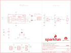

Contents
========

* [PRS14666 > Qwiic Flex Glove Controller](#prs14666--qwiic-flex-glove-controller)
	* [Schematic](#schematic)
	* [PCB](#pcb)
	* [Interactive BOM](#interactive-bom)
	* [OOMP Parts](#oomp-parts)
	* [Images](#images)
	* [Tags](#tags)
  
![][im]
# PRS14666 > Qwiic Flex Glove Controller

- ID: PROJ-SPAR-14666-STAN-01
- Hex ID: PRS14666
- Name: Sparkfun
- Description: Sparkfun
- Long Link: [http://oom.lt/PROJ-SPAR-14666-STAN-01](http://oom.lt/PROJ-SPAR-14666-STAN-01)
- Short Link: [http://oom.lt/PRS14666](http://oom.lt/PRS14666)

## Schematic
  

## PCB
  

## Interactive BOM

- Interactive BOM page: [ibom.html](https://htmlpreview.github.io/?https://github.com/oomlout/oomlout_OOMP_projects/blob/main/PROJ-SPAR-14666-STAN-01/kicad/bom/ibom.html)

## OOMP Parts
  

|OOMP Parts|
| :---: |
|CAPC-0603-X-UF1D-01 C1|
|[LEDS-0603-R-STAN-01  SMD (0603) Red LED  D1](https://github.com/oomlout/oomlout_OOMP_parts/tree/main/LEDS-0603-R-STAN-01/)|
|UNMATCHED-UNMATCHED-X-UNMATCHED-01 J1, J2, U1, U4|
|[HEAD-I01-X-PI02-01  2.54 mm 2 Pin Header  J3, J4](https://github.com/oomlout/oomlout_OOMP_parts/tree/main/HEAD-I01-X-PI02-01/)|
|[RESE-0603-X-O472-01  SMD (0603) 4.7k Ohm Resistor  R1, R2](https://github.com/oomlout/oomlout_OOMP_parts/tree/main/RESE-0603-X-O472-01/)|
|RESE-0603-X-O1003-01 R3, R4|
|[RESE-0603-X-O102-01  SMD (0603) 1k Ohm Resistor  R5](https://github.com/oomlout/oomlout_OOMP_parts/tree/main/RESE-0603-X-O102-01/)|
|RESE-UNMATCHED-X-UNMATCHED-01 R6, R7|

## Images
  
  

|kicadPcb3d|kicadPcb3dFront|kicadPcb3dBack|eagleImage|eagleSchemImage|
| :---: | :---: | :---: | :---: | :---: |
||||||

## Tags

- hexID: PRS14666
- oompType: PROJ
- oompSize: SPAR
- oompColor: 14666
- oompDesc: STAN
- oompIndex: 01
- oompName: Qwiic Flex Glove Controller
- sources: All source files from https://github.com/sparkfun/Qwiic_Flex_Glove_Controller (source licence details in srcLicense.md)
- linkBuyPage: https://www.sparkfun.com/products/14666
- oompID: PROJ-SPAR-14666-STAN-01
- oompParts: C1,CAPC-0603-X-UF1D-01
- oompParts: D1,LEDS-0603-R-STAN-01
- oompParts: J1,UNMATCHED-UNMATCHED-X-UNMATCHED-01
- oompParts: J2,UNMATCHED-UNMATCHED-X-UNMATCHED-01
- oompParts: J3,HEAD-I01-X-PI02-01
- oompParts: J4,HEAD-I01-X-PI02-01
- oompParts: R1,RESE-0603-X-O472-01
- oompParts: R2,RESE-0603-X-O472-01
- oompParts: R3,RESE-0603-X-O1003-01
- oompParts: R4,RESE-0603-X-O1003-01
- oompParts: R5,RESE-0603-X-O102-01
- oompParts: R6,RESE-UNMATCHED-X-UNMATCHED-01
- oompParts: R7,RESE-UNMATCHED-X-UNMATCHED-01
- oompParts: U1,UNMATCHED-UNMATCHED-X-UNMATCHED-01
- oompParts: U4,UNMATCHED-UNMATCHED-X-UNMATCHED-01
- rawParts: C1,0.1uF,0.1UF-0603-25V-(+80/-20%),0603,0.1µF ceramic capacitors,CAP-00810,0.1uF,
- rawParts: D1,RED,LED-RED0603,LED-0603,Red SMD LED,DIO-00819,RED,
- rawParts: FD1,FIDUCIALUFIDUCIAL,FIDUCIALUFIDUCIAL,FIDUCIAL-MICRO,Fiducial Alignment Points,,,
- rawParts: FD2,FIDUCIALUFIDUCIAL,FIDUCIALUFIDUCIAL,FIDUCIAL-MICRO,Fiducial Alignment Points,,,
- rawParts: FD3,FIDUCIALUFIDUCIAL,FIDUCIALUFIDUCIAL,FIDUCIAL-MICRO,Fiducial Alignment Points,,,
- rawParts: FD4,FIDUCIALUFIDUCIAL,FIDUCIALUFIDUCIAL,FIDUCIAL-MICRO,Fiducial Alignment Points,,,
- rawParts: FRAME1,FRAME-LETTER,FRAME-LETTER,CREATIVE_COMMONS,Schematic Frame - Letter,,,
- rawParts: J1,,QWIIC_CONNECTORJS-1MM,1X04_1MM_RA,SparkFun I2C Standard Qwiic Connector,CONN-13694,,
- rawParts: J2,,QWIIC_CONNECTORJS-1MM,1X04_1MM_RA,SparkFun I2C Standard Qwiic Connector,CONN-13694,,
- rawParts: J3,,CONN_02,1X02,Multi connection point. Often used as Generic Header-pin footprint for 0.1 inch spaced/style header connections,,,
- rawParts: J4,,CONN_02,1X02,Multi connection point. Often used as Generic Header-pin footprint for 0.1 inch spaced/style header connections,,,
- rawParts: JP1,JUMPER-SMT_3_2-NC_TRACE_NO-SILK,JUMPER-SMT_3_2-NC_TRACE_NO-SILK,SMT-JUMPER_3_2-NC_TRACE_NO-SILK,Normally closed trace jumper (2 of 2 connections),,,
- rawParts: JP2,JUMPER-SMT_3_1-NC_TRACE_NO-SILK,JUMPER-SMT_3_1-NC_TRACE_NO-SILK,SMT-JUMPER_3_1-NC_TRACE_NO-SILK,Normally closed trace jumper (1 of 2 connections),,,
- rawParts: JP3,JUMPER-SMT_3_NO_NO_SILK,JUMPER-SMT_3_NO_NO_SILK,SMT-JUMPER_3_0-NO_TRACE_NO-SILK,Normally open jumper,,,
- rawParts: LOGO1,SFE_LOGO_NAME_FLAME.1_INCH,SFE_LOGO_NAME_FLAME.1_INCH,SFE_LOGO_NAME_FLAME_.1,SparkFun Font Logo w/ Flame,,,
- rawParts: LOGO2,OSHW-LOGOS,OSHW-LOGOS,OSHW-LOGO-S,Open-Source Hardware (OSHW) Logo,,,
- rawParts: LOGO3,SFE_LOGO_FLAME.1_INCH,SFE_LOGO_FLAME.1_INCH,SFE_LOGO_FLAME_.1,SparkFun Flame Logo,,,
- rawParts: R1,4.7k,4.7KOHM-0603-1/10W-1%,0603,4.7kΩ resistor,RES-07857,4.7k,
- rawParts: R2,4.7k,4.7KOHM-0603-1/10W-1%,0603,4.7kΩ resistor,RES-07857,4.7k,
- rawParts: R3,100k,100KOHM-0603-1/10W-1%,0603,100kΩ resistor,RES-07828,100k,
- rawParts: R4,100k,100KOHM-0603-1/10W-1%,0603,100kΩ resistor,RES-07828,100k,
- rawParts: R5,1k,1KOHM-0603-1/10W-1%,0603,1kΩ resistor,RES-07856,1k,
- rawParts: R6,FLEX_SENSOR-4.5,FLEX_SENSOR-4.5,FLEX_SENSOR,Spectra Symbol Flex Sensor (2.2, 4.5) - A flexible resistor that changes its resistance as it bends.,COMP-13078,,
- rawParts: R7,FLEX_SENSOR-4.5,FLEX_SENSOR-4.5,FLEX_SENSOR,Spectra Symbol Flex Sensor (2.2, 4.5) - A flexible resistor that changes its resistance as it bends.,COMP-13078,,
- rawParts: TP1,TEST-POINT3,TEST-POINT3,PAD.03X.03,SparkFun Test Points,,,
- rawParts: TP2,TEST-POINT3,TEST-POINT3,PAD.03X.03,SparkFun Test Points,,,
- rawParts: U1,ADS1015,ADS1015,MSOP10,ADS1015 12-BIT ADC,IC-12270,ADS1015,
- rawParts: U4,LMV358,LMV358SOIC,SO08,IC LMV358 DUAL OP AMP,IC-09657,LMV358,

[im]: kicadPcb3d_450.png
