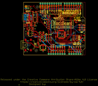
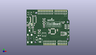
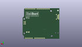
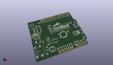

Contents
========

* [PROJ-SPAR-14669-STAN-01>BlackBoard](#proj-spar-14669-stan-01blackboard)
	* [Images](#images)
	* [Interactive BOM](#interactive-bom)
	* [OOMP Parts](#oomp-parts)
	* [Tags](#tags)
  
![][im]
# PROJ-SPAR-14669-STAN-01>BlackBoard

- ID: PROJ-SPAR-14669-STAN-01
- Hex ID: PRS14669
- Name: BlackBoard
- Description: 

## Images
  
  

|eagleImage|kicadPcb3dFront|kicadPcb3dBack|kicadPcb3d|
| :---: | :---: | :---: | :---: |
|||||

## Interactive BOM

- Interactive BOM page: [ibom.html](kicad/bom/ibom.html)

## OOMP Parts
  

|OOMP Parts|
| :---: |
|UNMATCHED-UNMATCHED-X-UNMATCHED-01, BYP, 8.762999999999998, 32.892999999999994, 270,BYP, JUMPER-SMT_2_NO_SILK, SMT-JUMPER_2_NO_SILK, SparkFun-Jumpers, (0.345, 1.295), R270|
|<table><tr><td></td><td> C1</td><td>[CAPC-0603-X-NF100-V50 SMD (0603) 100 nF Capacitor (Ceramic) 50v](https://github.com/oomlout/oomlout_OOMP_parts/tree/main/CAPC-0603-X-NF100-V50/)</td><td>[C6N100](https://github.com/oomlout/oomlout_OOMP_parts/tree/main/CAPC-0603-X-NF100-V50/)</td></tr></table>|
|<table><tr><td></td><td> C2</td><td>[CAPC-0603-X-NF100-V50 SMD (0603) 100 nF Capacitor (Ceramic) 50v](https://github.com/oomlout/oomlout_OOMP_parts/tree/main/CAPC-0603-X-NF100-V50/)</td><td>[C6N100](https://github.com/oomlout/oomlout_OOMP_parts/tree/main/CAPC-0603-X-NF100-V50/)</td></tr></table>|
|CAPC-UNMATCHED-X-UNMATCHED-01, C3, 20.32, 13.462, 180,C3, 10uF, EIA3216, SparkFun-Capacitors, (0.8, 0.53), R180|
|<table><tr><td></td><td> C4</td><td>[CAPC-0603-X-NF100-V50 SMD (0603) 100 nF Capacitor (Ceramic) 50v](https://github.com/oomlout/oomlout_OOMP_parts/tree/main/CAPC-0603-X-NF100-V50/)</td><td>[C6N100](https://github.com/oomlout/oomlout_OOMP_parts/tree/main/CAPC-0603-X-NF100-V50/)</td></tr></table>|
|CAPE-UNMATCHED-X-UNMATCHED-01, C5, 21.59, 5.842, 90,C5, 47uF, PANASONIC_D, SparkFun-Capacitors, (0.85, 0.23), R90|
|CAPC-UNMATCHED-X-UNMATCHED-01, C6, 20.32, 22.352, 0,C6, 10uF, EIA3216, SparkFun-Capacitors, (0.8, 0.88), R0|
|<table><tr><td></td><td> C8</td><td>[CAPC-0603-X-NF100-V50 SMD (0603) 100 nF Capacitor (Ceramic) 50v](https://github.com/oomlout/oomlout_OOMP_parts/tree/main/CAPC-0603-X-NF100-V50/)</td><td>[C6N100](https://github.com/oomlout/oomlout_OOMP_parts/tree/main/CAPC-0603-X-NF100-V50/)</td></tr></table>|
|<table><tr><td></td><td> C10</td><td>[CAPC-0603-X-NF100-V50 SMD (0603) 100 nF Capacitor (Ceramic) 50v](https://github.com/oomlout/oomlout_OOMP_parts/tree/main/CAPC-0603-X-NF100-V50/)</td><td>[C6N100](https://github.com/oomlout/oomlout_OOMP_parts/tree/main/CAPC-0603-X-NF100-V50/)</td></tr></table>|
|<table><tr><td></td><td> C12</td><td>[CAPC-0603-X-NF100-V50 SMD (0603) 100 nF Capacitor (Ceramic) 50v](https://github.com/oomlout/oomlout_OOMP_parts/tree/main/CAPC-0603-X-NF100-V50/)</td><td>[C6N100](https://github.com/oomlout/oomlout_OOMP_parts/tree/main/CAPC-0603-X-NF100-V50/)</td></tr></table>|
|CAPC-UNMATCHED-X-UNMATCHED-01, C15, 10.668, 30.479999999999997, 180,C15, 10uF, EIA3216, SparkFun-Capacitors, (0.42, 1.2), R180|
|CAPC-0603-X-UNMATCHED-01, C16, 20.32, 20.32, 180,C16, 1.0uF, 0603, SparkFun-Capacitors, (0.8, 0.8), R180|
|CAPC-0603-X-UNMATCHED-01, C17, 12.7, 33.019999999999996, 0,C17, 10nF, 0603, SparkFun-Capacitors, (0.5, 1.3), R0|
|<table><tr><td></td><td> C18</td><td>[CAPC-0603-X-NF100-V50 SMD (0603) 100 nF Capacitor (Ceramic) 50v](https://github.com/oomlout/oomlout_OOMP_parts/tree/main/CAPC-0603-X-NF100-V50/)</td><td>[C6N100](https://github.com/oomlout/oomlout_OOMP_parts/tree/main/CAPC-0603-X-NF100-V50/)</td></tr></table>|
|UNMATCHED-UNMATCHED-X-UNMATCHED-01, D1, 16.002, 8.382, 90,D1, 1A/40V/500mV, SMA-DIODE, SparkFun-DiscreteSemi, (0.63, 0.33), R90|
|UNMATCHED-UNMATCHED-X-UNMATCHED-01, D2, 27.94, 36.83, 180,D2, GREEN, LED-1206, SparkFun-LED, (1.1, 1.45), R180|
|UNMATCHED-UNMATCHED-X-UNMATCHED-01, D3, 27.94, 33.019999999999996, 180,D3, YELLOW, LED-1206-HIDDENSILK, SparkFun-LED, (1.1, 1.3), R180|
|UNMATCHED-1210-X-UNMATCHED-01, F2, 5.715, 30.479999999999997, 0,F2, 6V/2A, 1210, SparkFun-Fuses, (0.225, 1.2), R0|
|UNMATCHED-UNMATCHED-X-UNMATCHED-01, IC3, 7.619999999999999, 21.59, 90,IC3, LM1117, SOT223-ALT1, Testing, (0.3, 0.85), R90|
|UNMATCHED-UNMATCHED-X-UNMATCHED-01, J2, 64.77, 27.94, 270,J2, ISP, 2X3_SMT_POSTS, SparkFun-Connectors, (2.55, 1.1), R270|
|UNMATCHED-UNMATCHED-X-UNMATCHED-01, J3, 2.032, 8.636000000000001, 0,J3, POWER_JACKSUPER_BOMB_DIGITY, POWER_JACK_SMD_OVERPASTE_SUPER_BOMB_DIGITY, Testing, (0.08, 0.34), R0|
|UNMATCHED-UNMATCHED-X-UNMATCHED-01, J4, 63.5, 16.509999999999998, 90,J4, QWIIC_RIGHT_ANGLE, JST04_1MM_RA, SparkFun-Connectors, (2.5, 0.65), R90|
|ERROR, J5 USB C, 0, 0, 0,J5, USB, C, USB-C-16P, USB-C, (0.25, 1.55), R270|
|<table><tr><td></td><td> JP2</td><td>[HEAD-I01-X-PI10-01 2.54 mm 10 Pin Header](https://github.com/oomlout/oomlout_OOMP_parts/tree/main/HEAD-I01-X-PI10-01/)</td><td>[H10](https://github.com/oomlout/oomlout_OOMP_parts/tree/main/HEAD-I01-X-PI10-01/)</td></tr></table>|
|HEAD-I01-X-PI2-01, JP8, 66.03999999999999, 11.43, 0,JP8, FIDUCIAL1X2, FIDUCIAL-1X2, SparkFun, (2.6, 0.45), R0|
|HEAD-I01-X-PI2-01, JP9, 11.43, 52.06999999999999, 0,JP9, FIDUCIAL1X2, FIDUCIAL-1X2, SparkFun, (0.45, 2.05), R0|
|HEAD-I01-X-PI08@1-01, JP10, 45.72, 2.54, 180,JP10, 1X08_SMD_COMBINED@1, SparkFun-Connectors, (1.8, 0.1), R180|
|HEAD-I01-X-PI08@1-01, JP11, 63.5, 50.8, 180,JP11, JP11, 1X08_SMD_COMBINED@1, SparkFun-Connectors, (2.5, 2), R180|
|<table><tr><td></td><td> JP12</td><td>[HEAD-I01-X-PI10-01 2.54 mm 10 Pin Header](https://github.com/oomlout/oomlout_OOMP_parts/tree/main/HEAD-I01-X-PI10-01/)</td><td>[H10](https://github.com/oomlout/oomlout_OOMP_parts/tree/main/HEAD-I01-X-PI10-01/)</td></tr></table>|
|<table><tr><td></td><td> JP13</td><td>[HEAD-I01-X-PI06-01 2.54 mm 6 Pin Header](https://github.com/oomlout/oomlout_OOMP_parts/tree/main/HEAD-I01-X-PI06-01/)</td><td>[H06](https://github.com/oomlout/oomlout_OOMP_parts/tree/main/HEAD-I01-X-PI06-01/)</td></tr></table>|
|HEAD-I01-X-PI08@1-01, JP15, 45.72, -1.27, 180,JP15, 1X08_NO_SILK@1, SparkFun-Connectors, (1.8, -0.05), R180|
|HEAD-I01-X-PI06@1-01, JP18, 50.8, -1.27, 0,JP18, 1X06_NO_SILK@1, SparkFun-Connectors, (2, -0.05), R0|
|<table><tr><td></td><td> JP19</td><td>[HEAD-I01-X-PI08-01 2.54 mm 8 Pin Header](https://github.com/oomlout/oomlout_OOMP_parts/tree/main/HEAD-I01-X-PI08-01/)</td><td>[H08](https://github.com/oomlout/oomlout_OOMP_parts/tree/main/HEAD-I01-X-PI08-01/)</td></tr></table>|
|UNMATCHED-UNMATCHED-X-UNMATCHED-01, LED1, 27.94, 40.766999999999996, 0,LED1, Blue, LED-1206-HIDDENSILK, SparkFun-LED, (1.1, 1.605), R0|
|UNMATCHED-UNMATCHED-X-UNMATCHED-01, LED2, 58.419999999999995, 35.687, 0,LED2, GREEN, LED-1206, SparkFun-LED, (2.3, 1.405), R0|
|UNMATCHED-UNMATCHED-X-UNMATCHED-01, Q1, 6.35, 26.924, 270,Q1, 1.1A/60V/600m?, SOT23-3, SparkFun-DiscreteSemi, (0.25, 1.06), R270|
|UNMATCHED-UNMATCHED-X-UNMATCHED-01, Q2, 59.43599999999999, 16.509999999999998, 90,Q2, 310mA/60V/1.6?, SOT323, SparkFun-DiscreteSemi, (2.34, 0.65), R90|
|UNMATCHED-UNMATCHED-X-UNMATCHED-01, Q3, 55.88, 16.509999999999998, 270,Q3, 310mA/60V/1.6?, SOT323, SparkFun-DiscreteSemi, (2.2, 0.65), R270|
|UNMATCHED-UNMATCHED-X-UNMATCHED-01, QW1, 60.959999999999994, 10.16, M0,QW1, JUMPER-SMT_2_NC_TRACE_SILK, SMT-JUMPER_2_NC_TRACE_SILK, SparkFun-Jumpers, (2.4, 0.4), MR0|
|UNMATCHED-UNMATCHED-X-UNMATCHED-01, QW2, 57.15, 10.16, M0,QW2, JUMPER-SMT_2_NC_TRACE_SILK, SMT-JUMPER_2_NC_TRACE_SILK, SparkFun-Jumpers, (2.25, 0.4), MR0|
|RESE-0603-X-UNMATCHED-01, R1, 27.94, 38.862, 180,R1, 4.7k, 0603, SparkFun-Resistors, (1.1, 1.53), R180|
|<table><tr><td></td><td> R2</td><td>[RESE-0603-X-O103-01 SMD (0603) 10k Ohm Resistor](https://github.com/oomlout/oomlout_OOMP_parts/tree/main/RESE-0603-X-O103-01/)</td><td>[R6103](https://github.com/oomlout/oomlout_OOMP_parts/tree/main/RESE-0603-X-O103-01/)</td></tr></table>|
|<table><tr><td></td><td> R3</td><td>[RESE-0603-X-O103-01 SMD (0603) 10k Ohm Resistor](https://github.com/oomlout/oomlout_OOMP_parts/tree/main/RESE-0603-X-O103-01/)</td><td>[R6103](https://github.com/oomlout/oomlout_OOMP_parts/tree/main/RESE-0603-X-O103-01/)</td></tr></table>|
|<table><tr><td></td><td> R4</td><td>[RESE-0603-X-O103-01 SMD (0603) 10k Ohm Resistor](https://github.com/oomlout/oomlout_OOMP_parts/tree/main/RESE-0603-X-O103-01/)</td><td>[R6103](https://github.com/oomlout/oomlout_OOMP_parts/tree/main/RESE-0603-X-O103-01/)</td></tr></table>|
|RESE-0603-X-UNMATCHED-01, R5, 55.88, 19.049999999999997, 0,R5, 2.2k, 0603, SparkFun-Resistors, (2.2, 0.75), R0|
|RESE-0603-X-UNMATCHED-01, R6, 55.88, 13.97, 0,R6, 2.2k, 0603, SparkFun-Resistors, (2.2, 0.55), R0|
|RESE-0603-X-UNMATCHED-01, R7, 1.778, 31.369, 0,R7, 5.1k, 0603, SparkFun-Resistors, (0.07, 1.235), R0|
|RESE-0603-X-UNMATCHED-01, R8, 10.16, 45.72, 180,R8, 5.1k, 0603, SparkFun-Resistors, (0.4, 1.8), R180|
|RESE-0603-X-UNMATCHED-01, R11, 59.43599999999999, 19.049999999999997, 180,R11, 2.2k, 0603, SparkFun-Resistors, (2.34, 0.75), R180|
|RESE-0603-X-UNMATCHED-01, R12, 27.94, 31.115000000000002, 180,R12, 4.7k, 0603, SparkFun-Resistors, (1.1, 1.225), R180|
|RESE-0603-X-UNMATCHED-01, R13, 59.43599999999999, 13.97, 180,R13, 2.2k, 0603, SparkFun-Resistors, (2.34, 0.55), R180|
|RESE-0603-X-UNMATCHED-01, R14, 13.334999999999999, 17.272000000000002, 180,R14, 715, 0603, SparkFun-Resistors, (0.525, 0.68), R180|
|RESE-0603-X-UNMATCHED-01, R15, 13.334999999999999, 19.812, 0,R15, 240, 0603, SparkFun-Resistors, (0.525, 0.78), R0|
|RESE-0603-X-UNMATCHED-01, R16, 27.94, 34.925, 180,R16, 4.7k, 0603, SparkFun-Resistors, (1.1, 1.375), R180|
|ERROR, S1 Tall Switch, 0, 0, 0,S1, Tall, Switch, TACTILE_SWITCH_SMD_5.2MM, SparkFun-Switches, (0.2, 1.95), R180|
|UNMATCHED-UNMATCHED-X-UNMATCHED-01, S2, 27.94, 15.239999999999998, 0,S2, SWITCH_DPDT_SMD_AYZ0202, SparkFun-Switches, (1.1, 0.6), R0|
|UNMATCHED-UNMATCHED-X-UNMATCHED-01, U3, 20.32, 17.779999999999998, 270,U3, AP2112-3.3V, SOT23-5, SparkFun-PowerIC, (0.8, 0.7), R270|
|UNMATCHED-UNMATCHED-X-UNMATCHED-01, U4, 41.91, 20.32, 180,U4, ATMEGA328P_TQFP, TQFP32-08, SparkFun-IC-Microcontroller, (1.65, 0.8), R180|
|UNMATCHED-UNMATCHED-X-UNMATCHED-01, U5, 12.7, 39.37, 270,U5, CH340C, SO016, SparkFun-IC-Comms, (0.5, 1.55), R270|
|UNMATCHED-UNMATCHED-X-UNMATCHED-01, Y1, 49.529999999999994, 22.352, 90,Y1, 16MHz, RESONATOR-SMD-3.2X1.3, SparkFun-Clocks, (1.95, 0.88), R90|

## Tags

- hexID: PRS14669
- oompType: PROJ
- oompSize: SPAR
- oompColor: 14669
- oompDesc: STAN
- oompIndex: 01
- oompName: BlackBoard
- sources: All source files from https://github.com/sparkfun/BlackBoard (source licence details in srcLicense.md)
- linkBuyPage: https://www.sparkfun.com/products/14669
- oompID: PROJ-SPAR-14669-STAN-01
- oompPart: UNMATCHED-UNMATCHED-X-UNMATCHED-01, BYP, 8.762999999999998, 32.892999999999994, 270
- oompPart: CAPC-0603-X-NF100-V50, C1, 35.559999999999995, 17.779999999999998, 270
- oompPart: CAPC-0603-X-NF100-V50, C2, 35.559999999999995, 23.169999888, 270
- oompPart: CAPC-UNMATCHED-X-UNMATCHED-01, C3, 20.32, 13.462, 180
- oompPart: CAPC-0603-X-NF100-V50, C4, 10.16, 26.162, 0
- oompPart: CAPE-UNMATCHED-X-UNMATCHED-01, C5, 21.59, 5.842, 90
- oompPart: CAPC-UNMATCHED-X-UNMATCHED-01, C6, 20.32, 22.352, 0
- oompPart: CAPC-0603-X-NF100-V50, C8, 27.94, 29.337, 0
- oompPart: CAPC-0603-X-NF100-V50, C10, 1.778, 29.590999999999998, 180
- oompPart: CAPC-0603-X-NF100-V50, C12, 10.16, 27.686, 0
- oompPart: CAPC-UNMATCHED-X-UNMATCHED-01, C15, 10.668, 30.479999999999997, 180
- oompPart: CAPC-0603-X-UNMATCHED-01, C16, 20.32, 20.32, 180
- oompPart: CAPC-0603-X-UNMATCHED-01, C17, 12.7, 33.019999999999996, 0
- oompPart: CAPC-0603-X-NF100-V50, C18, 13.97, 45.72, 0
- oompPart: UNMATCHED-UNMATCHED-X-UNMATCHED-01, D1, 16.002, 8.382, 90
- oompPart: UNMATCHED-UNMATCHED-X-UNMATCHED-01, D2, 27.94, 36.83, 180
- oompPart: UNMATCHED-UNMATCHED-X-UNMATCHED-01, D3, 27.94, 33.019999999999996, 180
- oompPart: UNMATCHED-1210-X-UNMATCHED-01, F2, 5.715, 30.479999999999997, 0
- oompPart: UNMATCHED-UNMATCHED-X-UNMATCHED-01, IC3, 7.619999999999999, 21.59, 90
- oompPart: UNMATCHED-UNMATCHED-X-UNMATCHED-01, J2, 64.77, 27.94, 270
- oompPart: UNMATCHED-UNMATCHED-X-UNMATCHED-01, J3, 2.032, 8.636000000000001, 0
- oompPart: UNMATCHED-UNMATCHED-X-UNMATCHED-01, J4, 63.5, 16.509999999999998, 90
- oompPart: ERROR, J5 USB C, 0, 0, 0
- oompPart: HEAD-I01-X-PI10-01, JP2, 18.796, 50.8, 0
- oompPart: HEAD-I01-X-PI2-01, JP8, 66.03999999999999, 11.43, 0
- oompPart: HEAD-I01-X-PI2-01, JP9, 11.43, 52.06999999999999, 0
- oompPart: HEAD-I01-X-PI08@1-01, JP10, 45.72, 2.54, 180
- oompPart: HEAD-I01-X-PI08@1-01, JP11, 63.5, 50.8, 180
- oompPart: HEAD-I01-X-PI10-01, JP12, 18.796, 54.60999999999999, 0
- oompPart: HEAD-I01-X-PI06-01, JP13, 50.8, 2.54, 0
- oompPart: SKIP-UNMATCHED-X-UNMATCHED-01, JP14, 1.9049999999999998, 39.37, M0
- oompPart: HEAD-I01-X-PI08@1-01, JP15, 45.72, -1.27, 180
- oompPart: HEAD-I01-X-PI06@1-01, JP18, 50.8, -1.27, 0
- oompPart: HEAD-I01-X-PI08-01, JP19, 63.5, 54.60999999999999, 180
- oompPart: UNMATCHED-UNMATCHED-X-UNMATCHED-01, LED1, 27.94, 40.766999999999996, 0
- oompPart: UNMATCHED-UNMATCHED-X-UNMATCHED-01, LED2, 58.419999999999995, 35.687, 0
- oompPart: UNMATCHED-UNMATCHED-X-UNMATCHED-01, Q1, 6.35, 26.924, 270
- oompPart: UNMATCHED-UNMATCHED-X-UNMATCHED-01, Q2, 59.43599999999999, 16.509999999999998, 90
- oompPart: UNMATCHED-UNMATCHED-X-UNMATCHED-01, Q3, 55.88, 16.509999999999998, 270
- oompPart: UNMATCHED-UNMATCHED-X-UNMATCHED-01, QW1, 60.959999999999994, 10.16, M0
- oompPart: UNMATCHED-UNMATCHED-X-UNMATCHED-01, QW2, 57.15, 10.16, M0
- oompPart: RESE-0603-X-UNMATCHED-01, R1, 27.94, 38.862, 180
- oompPart: RESE-0603-X-O103-01, R2, 58.419999999999995, 33.782, 0
- oompPart: RESE-0603-X-O103-01, R3, 27.94, 27.304999999999996, 180
- oompPart: RESE-0603-X-O103-01, R4, 3.8099999999999996, 26.796999999999997, 270
- oompPart: RESE-0603-X-UNMATCHED-01, R5, 55.88, 19.049999999999997, 0
- oompPart: RESE-0603-X-UNMATCHED-01, R6, 55.88, 13.97, 0
- oompPart: RESE-0603-X-UNMATCHED-01, R7, 1.778, 31.369, 0
- oompPart: RESE-0603-X-UNMATCHED-01, R8, 10.16, 45.72, 180
- oompPart: RESE-0603-X-UNMATCHED-01, R11, 59.43599999999999, 19.049999999999997, 180
- oompPart: RESE-0603-X-UNMATCHED-01, R12, 27.94, 31.115000000000002, 180
- oompPart: RESE-0603-X-UNMATCHED-01, R13, 59.43599999999999, 13.97, 180
- oompPart: RESE-0603-X-UNMATCHED-01, R14, 13.334999999999999, 17.272000000000002, 180
- oompPart: RESE-0603-X-UNMATCHED-01, R15, 13.334999999999999, 19.812, 0
- oompPart: RESE-0603-X-UNMATCHED-01, R16, 27.94, 34.925, 180
- oompPart: ERROR, S1 Tall Switch, 0, 0, 0
- oompPart: UNMATCHED-UNMATCHED-X-UNMATCHED-01, S2, 27.94, 15.239999999999998, 0
- oompPart: SKIP-UNMATCHED-X-UNMATCHED-01, TP1, 66.03999999999999, 30.479999999999997, M0
- oompPart: SKIP-UNMATCHED-X-UNMATCHED-01, TP2, 66.03999999999999, 27.94, M0
- oompPart: SKIP-UNMATCHED-X-UNMATCHED-01, TP3, 66.03999999999999, 25.4, M0
- oompPart: SKIP-UNMATCHED-X-UNMATCHED-01, TP4, 63.5, 30.479999999999997, M0
- oompPart: SKIP-UNMATCHED-X-UNMATCHED-01, TP5, 63.5, 27.94, M0
- oompPart: SKIP-UNMATCHED-X-UNMATCHED-01, TP6, 63.5, 25.4, M0
- oompPart: UNMATCHED-UNMATCHED-X-UNMATCHED-01, U3, 20.32, 17.779999999999998, 270
- oompPart: UNMATCHED-UNMATCHED-X-UNMATCHED-01, U4, 41.91, 20.32, 180
- oompPart: UNMATCHED-UNMATCHED-X-UNMATCHED-01, U5, 12.7, 39.37, 270
- oompPart: UNMATCHED-UNMATCHED-X-UNMATCHED-01, Y1, 49.529999999999994, 22.352, 90
- rawPart: BYP, JUMPER-SMT_2_NO_SILK, SMT-JUMPER_2_NO_SILK, SparkFun-Jumpers, (0.345, 1.295), R270
- rawPart: C1, 0.1uF, 0603, SparkFun-Capacitors, (1.4, 0.7), R270
- rawPart: C2, 0.1uF, 0603, SparkFun-Capacitors, (1.4, 0.91220472), R270
- rawPart: C3, 10uF, EIA3216, SparkFun-Capacitors, (0.8, 0.53), R180
- rawPart: C4, 0.1uF, 0603, SparkFun-Capacitors, (0.4, 1.03), R0
- rawPart: C5, 47uF, PANASONIC_D, SparkFun-Capacitors, (0.85, 0.23), R90
- rawPart: C6, 10uF, EIA3216, SparkFun-Capacitors, (0.8, 0.88), R0
- rawPart: C8, 0.1uF, 0603, SparkFun-Capacitors, (1.1, 1.155), R0
- rawPart: C10, 0.1uF, 0603, SparkFun-Capacitors, (0.07, 1.165), R180
- rawPart: C12, 0.1uF, 0603, SparkFun-Capacitors, (0.4, 1.09), R0
- rawPart: C15, 10uF, EIA3216, SparkFun-Capacitors, (0.42, 1.2), R180
- rawPart: C16, 1.0uF, 0603, SparkFun-Capacitors, (0.8, 0.8), R180
- rawPart: C17, 10nF, 0603, SparkFun-Capacitors, (0.5, 1.3), R0
- rawPart: C18, 0.1uF, 0603, SparkFun-Capacitors, (0.55, 1.8), R0
- rawPart: D1, 1A/40V/500mV, SMA-DIODE, SparkFun-DiscreteSemi, (0.63, 0.33), R90
- rawPart: D2, GREEN, LED-1206, SparkFun-LED, (1.1, 1.45), R180
- rawPart: D3, YELLOW, LED-1206-HIDDENSILK, SparkFun-LED, (1.1, 1.3), R180
- rawPart: F2, 6V/2A, 1210, SparkFun-Fuses, (0.225, 1.2), R0
- rawPart: IC3, LM1117, SOT223-ALT1, Testing, (0.3, 0.85), R90
- rawPart: J2, ISP, 2X3_SMT_POSTS, SparkFun-Connectors, (2.55, 1.1), R270
- rawPart: J3, POWER_JACKSUPER_BOMB_DIGITY, POWER_JACK_SMD_OVERPASTE_SUPER_BOMB_DIGITY, Testing, (0.08, 0.34), R0
- rawPart: J4, QWIIC_RIGHT_ANGLE, JST04_1MM_RA, SparkFun-Connectors, (2.5, 0.65), R90
- rawPart: J5, USB, C, USB-C-16P, USB-C, (0.25, 1.55), R270
- rawPart: JP2, M10SMD_COMBO, 1X10_SMD_COMBINED, SparkFun-Connectors, (0.74, 2), R0
- rawPart: JP8, FIDUCIAL1X2, FIDUCIAL-1X2, SparkFun, (2.6, 0.45), R0
- rawPart: JP9, FIDUCIAL1X2, FIDUCIAL-1X2, SparkFun, (0.45, 2.05), R0
- rawPart: JP10, 1X08_SMD_COMBINED@1, SparkFun-Connectors, (1.8, 0.1), R180
- rawPart: JP11, JP11, 1X08_SMD_COMBINED@1, SparkFun-Connectors, (2.5, 2), R180
- rawPart: JP12, M10NO_SILK, 1X10_NO_SILK, SparkFun-Connectors, (0.74, 2.15), R0
- rawPart: JP13, 1X06_SMD_STRAIGHT_COMBO, SparkFun-Connectors, (2, 0.1), R0
- rawPart: JP14, USB_SOLDER_PADS, USB-SOLDER-PADS, SparkFun-Connectors, (0.075, 1.55), MR0
- rawPart: JP15, 1X08_NO_SILK@1, SparkFun-Connectors, (1.8, -0.05), R180
- rawPart: JP18, 1X06_NO_SILK@1, SparkFun-Connectors, (2, -0.05), R0
- rawPart: JP19, 1X08_NO_SILK, SparkFun-Connectors, (2.5, 2.15), R180
- rawPart: LED1, Blue, LED-1206-HIDDENSILK, SparkFun-LED, (1.1, 1.605), R0
- rawPart: LED2, GREEN, LED-1206, SparkFun-LED, (2.3, 1.405), R0
- rawPart: Q1, 1.1A/60V/600m?, SOT23-3, SparkFun-DiscreteSemi, (0.25, 1.06), R270
- rawPart: Q2, 310mA/60V/1.6?, SOT323, SparkFun-DiscreteSemi, (2.34, 0.65), R90
- rawPart: Q3, 310mA/60V/1.6?, SOT323, SparkFun-DiscreteSemi, (2.2, 0.65), R270
- rawPart: QW1, JUMPER-SMT_2_NC_TRACE_SILK, SMT-JUMPER_2_NC_TRACE_SILK, SparkFun-Jumpers, (2.4, 0.4), MR0
- rawPart: QW2, JUMPER-SMT_2_NC_TRACE_SILK, SMT-JUMPER_2_NC_TRACE_SILK, SparkFun-Jumpers, (2.25, 0.4), MR0
- rawPart: R1, 4.7k, 0603, SparkFun-Resistors, (1.1, 1.53), R180
- rawPart: R2, 10k, 0603, SparkFun-Resistors, (2.3, 1.33), R0
- rawPart: R3, 10k, 0603, SparkFun-Resistors, (1.1, 1.075), R180
- rawPart: R4, 10k, 0603, SparkFun-Resistors, (0.15, 1.055), R270
- rawPart: R5, 2.2k, 0603, SparkFun-Resistors, (2.2, 0.75), R0
- rawPart: R6, 2.2k, 0603, SparkFun-Resistors, (2.2, 0.55), R0
- rawPart: R7, 5.1k, 0603, SparkFun-Resistors, (0.07, 1.235), R0
- rawPart: R8, 5.1k, 0603, SparkFun-Resistors, (0.4, 1.8), R180
- rawPart: R11, 2.2k, 0603, SparkFun-Resistors, (2.34, 0.75), R180
- rawPart: R12, 4.7k, 0603, SparkFun-Resistors, (1.1, 1.225), R180
- rawPart: R13, 2.2k, 0603, SparkFun-Resistors, (2.34, 0.55), R180
- rawPart: R14, 715, 0603, SparkFun-Resistors, (0.525, 0.68), R180
- rawPart: R15, 240, 0603, SparkFun-Resistors, (0.525, 0.78), R0
- rawPart: R16, 4.7k, 0603, SparkFun-Resistors, (1.1, 1.375), R180
- rawPart: S1, Tall, Switch, TACTILE_SWITCH_SMD_5.2MM, SparkFun-Switches, (0.2, 1.95), R180
- rawPart: S2, SWITCH_DPDT_SMD_AYZ0202, SparkFun-Switches, (1.1, 0.6), R0
- rawPart: TP1, TP-3x5, PAD.03X.05, SparkFun-Connectors, (2.6, 1.2), MR0
- rawPart: TP2, TP-3x5, PAD.03X.05, SparkFun-Connectors, (2.6, 1.1), MR0
- rawPart: TP3, TP-3x5, PAD.03X.05, SparkFun-Connectors, (2.6, 1), MR0
- rawPart: TP4, TP-3x5, PAD.03X.05, SparkFun-Connectors, (2.5, 1.2), MR0
- rawPart: TP5, TP-3x5, PAD.03X.05, SparkFun-Passives, (2.5, 1.1), MR0
- rawPart: TP6, TP-3x5, PAD.03X.05, SparkFun-Connectors, (2.5, 1), MR0
- rawPart: U3, AP2112-3.3V, SOT23-5, SparkFun-PowerIC, (0.8, 0.7), R270
- rawPart: U4, ATMEGA328P_TQFP, TQFP32-08, SparkFun-IC-Microcontroller, (1.65, 0.8), R180
- rawPart: U5, CH340C, SO016, SparkFun-IC-Comms, (0.5, 1.55), R270
- rawPart: Y1, 16MHz, RESONATOR-SMD-3.2X1.3, SparkFun-Clocks, (1.95, 0.88), R90

[im]: kicadPcb3d_450.png
