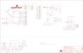

Contents
========

* [PRS14669 > Sparkfun](#prs14669--sparkfun)
	* [Schematic](#schematic)
	* [Interactive BOM](#interactive-bom)
	* [OOMP Parts](#oomp-parts)
	* [Images](#images)
	* [Tags](#tags)
  
![][im]
# PRS14669 > Sparkfun

- ID: PROJ-SPAR-14669-STAN-01
- Hex ID: PRS14669
- Name: Sparkfun
- Description: Sparkfun
- Long Link: [http://oom.lt/PROJ-SPAR-14669-STAN-01](http://oom.lt/PROJ-SPAR-14669-STAN-01)
- Short Link: [http://oom.lt/PRS14669](http://oom.lt/PRS14669)

## Schematic
  

## Interactive BOM

- Interactive BOM page: [ibom.html](https://htmlpreview.github.io/?https://github.com/oomlout/oomlout_OOMP_projects/blob/main/PROJ-SPAR-14669-STAN-01/kicad/bom/ibom.html)

## OOMP Parts
  

|OOMP Parts|
| :---: |
|BYP,UNMATCHED-UNMATCHED-X-UNMATCHED-01,BYP,JUMPER-SMT_2_NO_SILK,JUMPER-SMT_2_NO_SILK,SMT-JUMPER_2_NO_SILK,Normally open jumper,,,,,,|
|C1,CAPC-0603-X-NF100-V50,C1,0.1uF,0.1UF-0603-25V-(+80/-20%),0603,0.1µF ceramic capacitors,,CAP-00810,,,0.1uF,|
|C2,CAPC-0603-X-NF100-V50,C2,0.1uF,0.1UF-0603-25V-(+80/-20%),0603,0.1µF ceramic capacitors,,CAP-00810,,,0.1uF,|
|C3,CAPX-UNMATCHED-X-UF10-01,C3,10uF,10UF-POLAR-EIA3216-16V-10%(TANT),EIA3216,10.0µF polarized capacitors,,CAP-00811,,,10uF,|
|C4,CAPC-0603-X-NF100-V50,C4,0.1uF,0.1UF-0603-25V-(+80/-20%),0603,0.1µF ceramic capacitors,,CAP-00810,,,0.1uF,|
|C5,CAPX-UNMATCHED-X-UF47-01,C5,47uF,47UF-POLAR-PANASONIC_D-35V-20%,PANASONIC_D,47µF polarized capacitors,,CAP-08478,,,47uF,|
|C6,CAPX-UNMATCHED-X-UF10-01,C6,10uF,10UF-POLAR-EIA3216-16V-10%(TANT),EIA3216,10.0µF polarized capacitors,,CAP-00811,,,10uF,|
|C8,CAPC-0603-X-NF100-V50,C8,0.1uF,0.1UF-0603-25V-(+80/-20%),0603,0.1µF ceramic capacitors,,CAP-00810,,,0.1uF,|
|C10,CAPC-0603-X-NF100-V50,C10,0.1uF,0.1UF-0603-25V-(+80/-20%),0603,0.1µF ceramic capacitors,,CAP-00810,,,0.1uF,|
|C12,CAPC-0603-X-NF100-V50,C12,0.1uF,0.1UF-0603-25V-(+80/-20%),0603,0.1µF ceramic capacitors,,CAP-00810,,,0.1uF,|
|C15,CAPX-UNMATCHED-X-UF10-01,C15,10uF,10UF-POLAR-EIA3216-16V-10%(TANT),EIA3216,10.0µF polarized capacitors,,CAP-00811,,,10uF,|
|C16,CAPC-0603-X-UNMATCHED-01,C16,1.0uF,1.0UF-0603-16V-10%,0603,1µF ceramic capacitors,,CAP-00868,,,1.0uF,|
|C17,CAPC-0603-X-UNMATCHED-01,C17,10nF,10NF-0603-50V-10%,0603,0.01uF/10nF/10,000pF ceramic capacitors,,CAP-00867,,,10nF,|
|C18,CAPC-0603-X-NF100-V50,C18,0.1uF,0.1UF-0603-25V-(+80/-20%),0603,0.1µF ceramic capacitors,,CAP-00810,,,0.1uF,|
|D1,DIOD-UNMATCHED-X-UNMATCHED-01,D1,1A/40V/500mV,DIODE-SCHOTTKY-SS14,SMA-DIODE,Schottky diode,,DIO-08053,,,1A/40V/500mV,|
|D2,LEDS-1206-G-STAN-01,D2,GREEN,LED-GREENLILYPAD,LED-1206,Green SMD LED,,DIO-09910,,,GREEN,|
|D3,LEDS-1206-G-STAN-01,D3,YELLOW,LED-YELLOW_HIDDENSILK,LED-1206-HIDDENSILK,Yellow SMD LED,,DIO-09909,,,YELLOW,|
|F2,UNMATCHED-UNMATCHED-X-UNMATCHED-01,F2,6V/2A,PPTC_6V2A,1210,Resettable Fuse PPTC,,RES-14313,,,6V/2A,|
|IC3,UNMATCHED-UNMATCHED-X-UNMATCHED-01,FRAME1,FRAME-LEDGER,FRAME-LEDGER,CREATIVE_COMMONS,Schematic Frame - Ledger,,,,,,|
|J2,UNMATCHED-UNMATCHED-X-UNMATCHED-01,IC3,LM1117,V_REG_LM1117ALT1,SOT223-ALT1,Voltage Regulator LM1117,,VREG-08170,,,,|
|J3,UNMATCHED-UNMATCHED-X-UNMATCHED-01,J2,ISP,AVR_SPI_PROG_3X2SMD,2X3_SMT_POSTS,AVR ISP 6 Pin,,,,,,|
|J4,UNMATCHED-UNMATCHED-X-UNMATCHED-01,J3,POWER_JACKSUPER_BOMB_DIGITY,POWER_JACKSUPER_BOMB_DIGITY,POWER_JACK_SMD_OVERPASTE_SUPER_BOMB_DIGITY,Power Jack,,CONN-08106,,,,|
|J5,UNMATCHED-UNMATCHED-X-UNMATCHED-01,J4,QWIIC_RIGHT_ANGLE,QWIIC_CONNECTORJS-1MM,JST04_1MM_RA,SparkFun I2C Standard Qwiic Connector,,CONN-13694,,,QWIIC_RIGHT_ANGLE,|
|JP2,HEAD-I01-X-PI10-01,J5,USB C,USB_C16PIN,USB-C-16P,USB Type C 16Pin Connector,,,,,,|
|JP10,HEAD-I01-X-PI08-01,JP1,SFE_LOGO_NAME.1_INCH,SFE_LOGO_NAME.1_INCH,SFE_LOGO_NAME_.1,SparkFun Font Logo,,,,,,|
|JP11,HEAD-I01-X-PI08-01,JP2,M10SMD_COMBO,M10SMD_COMBO,1X10_SMD_COMBINED,Header 10,,CONN-11219,,,,|
|JP12,HEAD-I01-X-PI10-01,JP3,STAND-OFF,STAND-OFF,STAND-OFF,Stand Off,,,,,,|
|JP13,HEAD-I01-X-PI06-01,JP4,STAND-OFF,STAND-OFF,STAND-OFF,Stand Off,,,,,,|
|JP14,UNMATCHED-UNMATCHED-X-UNMATCHED-01,JP5,STAND-OFF,STAND-OFF,STAND-OFF,Stand Off,,,,,,|
|JP15,HEAD-I01-X-PI08-01,JP6,STAND-OFF,STAND-OFF,STAND-OFF,Stand Off,,,,,,|
|JP18,HEAD-I01-X-PI06-01,JP7,SFE_LOGO_FLAME.1_INCH,SFE_LOGO_FLAME.1_INCH,SFE_LOGO_FLAME_.1,SparkFun Flame Logo,,,,,,|
|JP19,HEAD-I01-X-PI08-01,JP8,FIDUCIAL1X2,FIDUCIAL1X2,FIDUCIAL-1X2,Fiducial Alignment Points,,,,,,|
|LED1,LEDS-1206-G-STAN-01,JP9,FIDUCIAL1X2,FIDUCIAL1X2,FIDUCIAL-1X2,Fiducial Alignment Points,,,,,,|
|LED2,LEDS-1206-G-STAN-01,JP10,,M08SMD-COMBO,1X08_SMD_COMBINED@1,Header 8,,CONN-10204,,,,|
|Q1,MOSP-SO23-X-UNMATCHED-01,JP11,JP11,M08SMD-COMBO,1X08_SMD_COMBINED@1,Header 8,,CONN-10204,,,,|
|Q2,MOSN-UNMATCHED-X-UNMATCHED-01,JP12,M10NO_SILK,M10NO_SILK,1X10_NO_SILK,Header 10,,CONN-11219,,,,|
|Q3,MOSN-UNMATCHED-X-UNMATCHED-01,JP13,,M06SMD-STRAIGHT-COMBO,1X06_SMD_STRAIGHT_COMBO,Header 6,,CONN-10203,,,,|
|QW1,UNMATCHED-UNMATCHED-X-UNMATCHED-01,JP14,USB_SOLDER_PADS,USB_SOLDER_PADS,USB-SOLDER-PADS,Solder pad access to USB pins. Helpful to expose on PCBs so user can attach external USB connector if necessary.,,,,,,|
|QW2,UNMATCHED-UNMATCHED-X-UNMATCHED-01,JP15,,M08NO_SILK,1X08_NO_SILK@1,Header 8,,CONN-10204,,,,|
|R1,RESE-0603-X-UNMATCHED-01,JP18,,M06NO_SILK,1X06_NO_SILK@1,Header 6,,CONN-10203,,,,|
|R2,RESE-0603-X-O103-01,JP19,,CONN_08NO_SILK_FEMALE_PTH,1X08_NO_SILK,Multi connection point. Often used as Generic Header-pin footprint for 0.1 inch spaced/style header connections,,CONN-08438,,,,|
|R3,RESE-0603-X-O103-01,LED1,Blue,LED-BLUE_HIDDENSILK,LED-1206-HIDDENSILK,Blue SMD LED,,DIO-09911,,,,|
|R4,RESE-0603-X-O103-01,LED2,GREEN,LED-GREENLILYPAD,LED-1206,Green SMD LED,,DIO-09910,,,GREEN,|
|R5,RESE-0603-X-UNMATCHED-01,Q1,1.1A/60V/600mΩ,MOSFET_PCH-SI2309DS,SOT23-3,P-channel MOSFETs,,TRANS-08285,,,1.1A/60V/600mΩ,|
|R6,RESE-0603-X-UNMATCHED-01,Q2,310mA/60V/1.6Ω,MOSFET-NCH-2N7002PW,SOT323,N-channel MOSFETs,,TRANS-11151,,,310mA/60V/1.6Ω,|
|R7,RESE-0603-X-UNMATCHED-01,Q3,310mA/60V/1.6Ω,MOSFET-NCH-2N7002PW,SOT323,N-channel MOSFETs,,TRANS-11151,,,310mA/60V/1.6Ω,|
|R8,RESE-0603-X-UNMATCHED-01,QW1,JUMPER-SMT_2_NC_TRACE_SILK,JUMPER-SMT_2_NC_TRACE_SILK,SMT-JUMPER_2_NC_TRACE_SILK,Normally closed trace jumper,,,,,,|
|R11,RESE-0603-X-UNMATCHED-01,QW2,JUMPER-SMT_2_NC_TRACE_SILK,JUMPER-SMT_2_NC_TRACE_SILK,SMT-JUMPER_2_NC_TRACE_SILK,Normally closed trace jumper,,,,,,|
|R12,RESE-0603-X-UNMATCHED-01,R1,4.7k,4.7KOHM-0603-1/10W-1%,0603,4.7kΩ resistor,,RES-07857,,,4.7k,|
|R13,RESE-0603-X-UNMATCHED-01,R2,10k,10KOHM-0603-1/10W-1%,0603,10kΩ resistor,,RES-00824,,,10k,|
|R14,RESE-0603-X-O711-01,R3,10k,10KOHM-0603-1/10W-1%,0603,10kΩ resistor,,RES-00824,,,10k,|
|R15,RESE-0603-X-O241-01,R4,10k,10KOHM-0603-1/10W-1%,0603,10kΩ resistor,,RES-00824,,,10k,|
|R16,RESE-0603-X-UNMATCHED-01,R5,2.2k,2.2KOHM-0603-1/10W-1%,0603,2.2kΩ resistor,,RES-08272,,,2.2k,|
|S1,UNMATCHED-UNMATCHED-X-UNMATCHED-01,R6,2.2k,2.2KOHM-0603-1/10W-1%,0603,2.2kΩ resistor,,RES-08272,,,2.2k,|
|S2,UNMATCHED-UNMATCHED-X-UNMATCHED-01,R7,5.1k,5.1KOHM5.1KOHM-0603-1/10W-1%,0603,,,RES-12083,,,5.1k,|
|TP1,UNMATCHED-UNMATCHED-X-UNMATCHED-01,R8,5.1k,5.1KOHM5.1KOHM-0603-1/10W-1%,0603,,,RES-12083,,,5.1k,|
|TP2,UNMATCHED-UNMATCHED-X-UNMATCHED-01,R11,2.2k,2.2KOHM-0603-1/10W-1%,0603,2.2kΩ resistor,,RES-08272,,,2.2k,|
|TP3,UNMATCHED-UNMATCHED-X-UNMATCHED-01,R12,4.7k,4.7KOHM-0603-1/10W-1%,0603,4.7kΩ resistor,,RES-07857,,,4.7k,|
|TP4,UNMATCHED-UNMATCHED-X-UNMATCHED-01,R13,2.2k,2.2KOHM-0603-1/10W-1%,0603,2.2kΩ resistor,,RES-08272,,,2.2k,|
|TP5,UNMATCHED-UNMATCHED-X-UNMATCHED-01,R14,715,715OHM-0603-1/10W-1%,0603,715Ω resistor,,RES-07850,,,715,|
|TP6,UNMATCHED-UNMATCHED-X-UNMATCHED-01,R15,240,240OHM-0603-1/10W-1%,0603,240Ω resistor,,RES-07849,,,240,|
|U3,VREG-SO235-X-KAP2112K-V33D,R16,4.7k,4.7KOHM-0603-1/10W-1%,0603,4.7kΩ resistor,,RES-07857,,,4.7k,|
|U4,UNMATCHED-UNMATCHED-X-UNMATCHED-01,S1,Tall Switch,MOMENTARY-SWITCH-SPST-SMD-5.2-TALL-REDUNDANT,TACTILE_SWITCH_SMD_5.2MM,Momentary Switch (Pushbutton) - SPST,,SWCH-14139,,,,|
|U5,UNMATCHED-UNMATCHED-X-UNMATCHED-01,S2,,SWITCH-DPDT-SMD-AYZ0202,SWITCH_DPDT_SMD_AYZ0202,Double-Pole, Double-Throw (DPDT) Switch,,SWCH-08179,,COM-00597,,|
|Y1,UNMATCHED-UNMATCHED-X-UNMATCHED-01,TP1,TP-3x5,TEST-POINT3X5,PAD.03X.05,SparkFun Test Points,,,,,,|

## Images
  
  

|kicadPcb3d|kicadPcb3dFront|kicadPcb3dBack|eagleImage|eagleSchemImage|
| :---: | :---: | :---: | :---: | :---: |
||||||

## Tags

- hexID: PRS14669
- oompType: PROJ
- oompSize: SPAR
- oompColor: 14669
- oompDesc: STAN
- oompIndex: 01
- oompName: BlackBoard
- sources: All source files from https://github.com/sparkfun/BlackBoard (source licence details in srcLicense.md)
- linkBuyPage: https://www.sparkfun.com/products/14669
- oompID: PROJ-SPAR-14669-STAN-01
- oompParts: BYP,UNMATCHED-UNMATCHED-X-UNMATCHED-01
- oompParts: C1,CAPC-0603-X-NF100-V50
- oompParts: C2,CAPC-0603-X-NF100-V50
- oompParts: C3,CAPX-UNMATCHED-X-UF10-01
- oompParts: C4,CAPC-0603-X-NF100-V50
- oompParts: C5,CAPX-UNMATCHED-X-UF47-01
- oompParts: C6,CAPX-UNMATCHED-X-UF10-01
- oompParts: C8,CAPC-0603-X-NF100-V50
- oompParts: C10,CAPC-0603-X-NF100-V50
- oompParts: C12,CAPC-0603-X-NF100-V50
- oompParts: C15,CAPX-UNMATCHED-X-UF10-01
- oompParts: C16,CAPC-0603-X-UNMATCHED-01
- oompParts: C17,CAPC-0603-X-UNMATCHED-01
- oompParts: C18,CAPC-0603-X-NF100-V50
- oompParts: D1,DIOD-UNMATCHED-X-UNMATCHED-01
- oompParts: D2,LEDS-1206-G-STAN-01
- oompParts: D3,LEDS-1206-G-STAN-01
- oompParts: F2,UNMATCHED-UNMATCHED-X-UNMATCHED-01
- oompParts: IC3,UNMATCHED-UNMATCHED-X-UNMATCHED-01
- oompParts: J2,UNMATCHED-UNMATCHED-X-UNMATCHED-01
- oompParts: J3,UNMATCHED-UNMATCHED-X-UNMATCHED-01
- oompParts: J4,UNMATCHED-UNMATCHED-X-UNMATCHED-01
- oompParts: J5,UNMATCHED-UNMATCHED-X-UNMATCHED-01
- oompParts: JP2,HEAD-I01-X-PI10-01
- oompParts: JP10,HEAD-I01-X-PI08-01
- oompParts: JP11,HEAD-I01-X-PI08-01
- oompParts: JP12,HEAD-I01-X-PI10-01
- oompParts: JP13,HEAD-I01-X-PI06-01
- oompParts: JP14,UNMATCHED-UNMATCHED-X-UNMATCHED-01
- oompParts: JP15,HEAD-I01-X-PI08-01
- oompParts: JP18,HEAD-I01-X-PI06-01
- oompParts: JP19,HEAD-I01-X-PI08-01
- oompParts: LED1,LEDS-1206-G-STAN-01
- oompParts: LED2,LEDS-1206-G-STAN-01
- oompParts: Q1,MOSP-SO23-X-UNMATCHED-01
- oompParts: Q2,MOSN-UNMATCHED-X-UNMATCHED-01
- oompParts: Q3,MOSN-UNMATCHED-X-UNMATCHED-01
- oompParts: QW1,UNMATCHED-UNMATCHED-X-UNMATCHED-01
- oompParts: QW2,UNMATCHED-UNMATCHED-X-UNMATCHED-01
- oompParts: R1,RESE-0603-X-UNMATCHED-01
- oompParts: R2,RESE-0603-X-O103-01
- oompParts: R3,RESE-0603-X-O103-01
- oompParts: R4,RESE-0603-X-O103-01
- oompParts: R5,RESE-0603-X-UNMATCHED-01
- oompParts: R6,RESE-0603-X-UNMATCHED-01
- oompParts: R7,RESE-0603-X-UNMATCHED-01
- oompParts: R8,RESE-0603-X-UNMATCHED-01
- oompParts: R11,RESE-0603-X-UNMATCHED-01
- oompParts: R12,RESE-0603-X-UNMATCHED-01
- oompParts: R13,RESE-0603-X-UNMATCHED-01
- oompParts: R14,RESE-0603-X-O711-01
- oompParts: R15,RESE-0603-X-O241-01
- oompParts: R16,RESE-0603-X-UNMATCHED-01
- oompParts: S1,UNMATCHED-UNMATCHED-X-UNMATCHED-01
- oompParts: S2,UNMATCHED-UNMATCHED-X-UNMATCHED-01
- oompParts: TP1,UNMATCHED-UNMATCHED-X-UNMATCHED-01
- oompParts: TP2,UNMATCHED-UNMATCHED-X-UNMATCHED-01
- oompParts: TP3,UNMATCHED-UNMATCHED-X-UNMATCHED-01
- oompParts: TP4,UNMATCHED-UNMATCHED-X-UNMATCHED-01
- oompParts: TP5,UNMATCHED-UNMATCHED-X-UNMATCHED-01
- oompParts: TP6,UNMATCHED-UNMATCHED-X-UNMATCHED-01
- oompParts: U3,VREG-SO235-X-KAP2112K-V33D
- oompParts: U4,UNMATCHED-UNMATCHED-X-UNMATCHED-01
- oompParts: U5,UNMATCHED-UNMATCHED-X-UNMATCHED-01
- oompParts: Y1,UNMATCHED-UNMATCHED-X-UNMATCHED-01
- rawParts: BYP,JUMPER-SMT_2_NO_SILK,JUMPER-SMT_2_NO_SILK,SMT-JUMPER_2_NO_SILK,Normally open jumper,,,,,,
- rawParts: C1,0.1uF,0.1UF-0603-25V-(+80/-20%),0603,0.1µF ceramic capacitors,,CAP-00810,,,0.1uF,
- rawParts: C2,0.1uF,0.1UF-0603-25V-(+80/-20%),0603,0.1µF ceramic capacitors,,CAP-00810,,,0.1uF,
- rawParts: C3,10uF,10UF-POLAR-EIA3216-16V-10%(TANT),EIA3216,10.0µF polarized capacitors,,CAP-00811,,,10uF,
- rawParts: C4,0.1uF,0.1UF-0603-25V-(+80/-20%),0603,0.1µF ceramic capacitors,,CAP-00810,,,0.1uF,
- rawParts: C5,47uF,47UF-POLAR-PANASONIC_D-35V-20%,PANASONIC_D,47µF polarized capacitors,,CAP-08478,,,47uF,
- rawParts: C6,10uF,10UF-POLAR-EIA3216-16V-10%(TANT),EIA3216,10.0µF polarized capacitors,,CAP-00811,,,10uF,
- rawParts: C8,0.1uF,0.1UF-0603-25V-(+80/-20%),0603,0.1µF ceramic capacitors,,CAP-00810,,,0.1uF,
- rawParts: C10,0.1uF,0.1UF-0603-25V-(+80/-20%),0603,0.1µF ceramic capacitors,,CAP-00810,,,0.1uF,
- rawParts: C12,0.1uF,0.1UF-0603-25V-(+80/-20%),0603,0.1µF ceramic capacitors,,CAP-00810,,,0.1uF,
- rawParts: C15,10uF,10UF-POLAR-EIA3216-16V-10%(TANT),EIA3216,10.0µF polarized capacitors,,CAP-00811,,,10uF,
- rawParts: C16,1.0uF,1.0UF-0603-16V-10%,0603,1µF ceramic capacitors,,CAP-00868,,,1.0uF,
- rawParts: C17,10nF,10NF-0603-50V-10%,0603,0.01uF/10nF/10,000pF ceramic capacitors,,CAP-00867,,,10nF,
- rawParts: C18,0.1uF,0.1UF-0603-25V-(+80/-20%),0603,0.1µF ceramic capacitors,,CAP-00810,,,0.1uF,
- rawParts: D1,1A/40V/500mV,DIODE-SCHOTTKY-SS14,SMA-DIODE,Schottky diode,,DIO-08053,,,1A/40V/500mV,
- rawParts: D2,GREEN,LED-GREENLILYPAD,LED-1206,Green SMD LED,,DIO-09910,,,GREEN,
- rawParts: D3,YELLOW,LED-YELLOW_HIDDENSILK,LED-1206-HIDDENSILK,Yellow SMD LED,,DIO-09909,,,YELLOW,
- rawParts: F2,6V/2A,PPTC_6V2A,1210,Resettable Fuse PPTC,,RES-14313,,,6V/2A,
- rawParts: FRAME1,FRAME-LEDGER,FRAME-LEDGER,CREATIVE_COMMONS,Schematic Frame - Ledger,,,,,,
- rawParts: IC3,LM1117,V_REG_LM1117ALT1,SOT223-ALT1,Voltage Regulator LM1117,,VREG-08170,,,,
- rawParts: J2,ISP,AVR_SPI_PROG_3X2SMD,2X3_SMT_POSTS,AVR ISP 6 Pin,,,,,,
- rawParts: J3,POWER_JACKSUPER_BOMB_DIGITY,POWER_JACKSUPER_BOMB_DIGITY,POWER_JACK_SMD_OVERPASTE_SUPER_BOMB_DIGITY,Power Jack,,CONN-08106,,,,
- rawParts: J4,QWIIC_RIGHT_ANGLE,QWIIC_CONNECTORJS-1MM,JST04_1MM_RA,SparkFun I2C Standard Qwiic Connector,,CONN-13694,,,QWIIC_RIGHT_ANGLE,
- rawParts: J5,USB C,USB_C16PIN,USB-C-16P,USB Type C 16Pin Connector,,,,,,
- rawParts: JP1,SFE_LOGO_NAME.1_INCH,SFE_LOGO_NAME.1_INCH,SFE_LOGO_NAME_.1,SparkFun Font Logo,,,,,,
- rawParts: JP2,M10SMD_COMBO,M10SMD_COMBO,1X10_SMD_COMBINED,Header 10,,CONN-11219,,,,
- rawParts: JP3,STAND-OFF,STAND-OFF,STAND-OFF,Stand Off,,,,,,
- rawParts: JP4,STAND-OFF,STAND-OFF,STAND-OFF,Stand Off,,,,,,
- rawParts: JP5,STAND-OFF,STAND-OFF,STAND-OFF,Stand Off,,,,,,
- rawParts: JP6,STAND-OFF,STAND-OFF,STAND-OFF,Stand Off,,,,,,
- rawParts: JP7,SFE_LOGO_FLAME.1_INCH,SFE_LOGO_FLAME.1_INCH,SFE_LOGO_FLAME_.1,SparkFun Flame Logo,,,,,,
- rawParts: JP8,FIDUCIAL1X2,FIDUCIAL1X2,FIDUCIAL-1X2,Fiducial Alignment Points,,,,,,
- rawParts: JP9,FIDUCIAL1X2,FIDUCIAL1X2,FIDUCIAL-1X2,Fiducial Alignment Points,,,,,,
- rawParts: JP10,,M08SMD-COMBO,1X08_SMD_COMBINED@1,Header 8,,CONN-10204,,,,
- rawParts: JP11,JP11,M08SMD-COMBO,1X08_SMD_COMBINED@1,Header 8,,CONN-10204,,,,
- rawParts: JP12,M10NO_SILK,M10NO_SILK,1X10_NO_SILK,Header 10,,CONN-11219,,,,
- rawParts: JP13,,M06SMD-STRAIGHT-COMBO,1X06_SMD_STRAIGHT_COMBO,Header 6,,CONN-10203,,,,
- rawParts: JP14,USB_SOLDER_PADS,USB_SOLDER_PADS,USB-SOLDER-PADS,Solder pad access to USB pins. Helpful to expose on PCBs so user can attach external USB connector if necessary.,,,,,,
- rawParts: JP15,,M08NO_SILK,1X08_NO_SILK@1,Header 8,,CONN-10204,,,,
- rawParts: JP18,,M06NO_SILK,1X06_NO_SILK@1,Header 6,,CONN-10203,,,,
- rawParts: JP19,,CONN_08NO_SILK_FEMALE_PTH,1X08_NO_SILK,Multi connection point. Often used as Generic Header-pin footprint for 0.1 inch spaced/style header connections,,CONN-08438,,,,
- rawParts: LED1,Blue,LED-BLUE_HIDDENSILK,LED-1206-HIDDENSILK,Blue SMD LED,,DIO-09911,,,,
- rawParts: LED2,GREEN,LED-GREENLILYPAD,LED-1206,Green SMD LED,,DIO-09910,,,GREEN,
- rawParts: Q1,1.1A/60V/600mΩ,MOSFET_PCH-SI2309DS,SOT23-3,P-channel MOSFETs,,TRANS-08285,,,1.1A/60V/600mΩ,
- rawParts: Q2,310mA/60V/1.6Ω,MOSFET-NCH-2N7002PW,SOT323,N-channel MOSFETs,,TRANS-11151,,,310mA/60V/1.6Ω,
- rawParts: Q3,310mA/60V/1.6Ω,MOSFET-NCH-2N7002PW,SOT323,N-channel MOSFETs,,TRANS-11151,,,310mA/60V/1.6Ω,
- rawParts: QW1,JUMPER-SMT_2_NC_TRACE_SILK,JUMPER-SMT_2_NC_TRACE_SILK,SMT-JUMPER_2_NC_TRACE_SILK,Normally closed trace jumper,,,,,,
- rawParts: QW2,JUMPER-SMT_2_NC_TRACE_SILK,JUMPER-SMT_2_NC_TRACE_SILK,SMT-JUMPER_2_NC_TRACE_SILK,Normally closed trace jumper,,,,,,
- rawParts: R1,4.7k,4.7KOHM-0603-1/10W-1%,0603,4.7kΩ resistor,,RES-07857,,,4.7k,
- rawParts: R2,10k,10KOHM-0603-1/10W-1%,0603,10kΩ resistor,,RES-00824,,,10k,
- rawParts: R3,10k,10KOHM-0603-1/10W-1%,0603,10kΩ resistor,,RES-00824,,,10k,
- rawParts: R4,10k,10KOHM-0603-1/10W-1%,0603,10kΩ resistor,,RES-00824,,,10k,
- rawParts: R5,2.2k,2.2KOHM-0603-1/10W-1%,0603,2.2kΩ resistor,,RES-08272,,,2.2k,
- rawParts: R6,2.2k,2.2KOHM-0603-1/10W-1%,0603,2.2kΩ resistor,,RES-08272,,,2.2k,
- rawParts: R7,5.1k,5.1KOHM5.1KOHM-0603-1/10W-1%,0603,,,RES-12083,,,5.1k,
- rawParts: R8,5.1k,5.1KOHM5.1KOHM-0603-1/10W-1%,0603,,,RES-12083,,,5.1k,
- rawParts: R11,2.2k,2.2KOHM-0603-1/10W-1%,0603,2.2kΩ resistor,,RES-08272,,,2.2k,
- rawParts: R12,4.7k,4.7KOHM-0603-1/10W-1%,0603,4.7kΩ resistor,,RES-07857,,,4.7k,
- rawParts: R13,2.2k,2.2KOHM-0603-1/10W-1%,0603,2.2kΩ resistor,,RES-08272,,,2.2k,
- rawParts: R14,715,715OHM-0603-1/10W-1%,0603,715Ω resistor,,RES-07850,,,715,
- rawParts: R15,240,240OHM-0603-1/10W-1%,0603,240Ω resistor,,RES-07849,,,240,
- rawParts: R16,4.7k,4.7KOHM-0603-1/10W-1%,0603,4.7kΩ resistor,,RES-07857,,,4.7k,
- rawParts: S1,Tall Switch,MOMENTARY-SWITCH-SPST-SMD-5.2-TALL-REDUNDANT,TACTILE_SWITCH_SMD_5.2MM,Momentary Switch (Pushbutton) - SPST,,SWCH-14139,,,,
- rawParts: S2,,SWITCH-DPDT-SMD-AYZ0202,SWITCH_DPDT_SMD_AYZ0202,Double-Pole, Double-Throw (DPDT) Switch,,SWCH-08179,,COM-00597,,
- rawParts: TP1,TP-3x5,TEST-POINT3X5,PAD.03X.05,SparkFun Test Points,,,,,,
- rawParts: TP2,TP-3x5,TEST-POINT3X5,PAD.03X.05,SparkFun Test Points,,,,,,
- rawParts: TP3,TP-3x5,TEST-POINT3X5,PAD.03X.05,SparkFun Test Points,,,,,,
- rawParts: TP4,TP-3x5,TEST-POINT3X5,PAD.03X.05,SparkFun Test Points,,,,,,
- rawParts: TP5,TP-3x5,TEST-POINT3X5,PAD.03X.05,Bare copper test points for troubleshooting or ICT,,,,,,
- rawParts: TP6,TP-3x5,TEST-POINT3X5,PAD.03X.05,SparkFun Test Points,,,,,,
- rawParts: U$16,OSHW-LOGOS,OSHW-LOGOS,OSHW-LOGO-S,Open-Source Hardware (OSHW) Logo,,,,,,
- rawParts: U3,AP2112-3.3V,V_REG_AP2112K-3.3V,SOT23-5,AP2112 - 600mA CMOS LDO Regulator w/ Enable,,VREG-12457,,,3.3V,
- rawParts: U4,ATMEGA328P_TQFP,ATMEGA328P_TQFP,TQFP32-08,Popular 328P in QFP,,IC-09069,,,ATMEGA328P_TQFP,
- rawParts: U5,CH340C,CH340C,SO016,,,IC-14038,,,,
- rawParts: Y1,16MHz,RESONATOR-16MHZSMD_3.2X1.3,RESONATOR-SMD-3.2X1.3,16MHz Resonator,,XTAL-08900,,,16MHz,

[im]: kicadPcb3d_450.png
