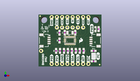
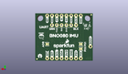
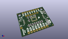

Contents
========

* [PROJ-SPAR-14686-STAN-01>Qwiic IMU BNO080](#proj-spar-14686-stan-01qwiic-imu-bno080)
	* [Images](#images)
	* [Interactive BOM](#interactive-bom)
	* [OOMP Parts](#oomp-parts)
	* [Tags](#tags)
  
![][im]
# PROJ-SPAR-14686-STAN-01>Qwiic IMU BNO080

- ID: PROJ-SPAR-14686-STAN-01
- Hex ID: PRS14686
- Name: Qwiic IMU BNO080
- Description: 

## Images
  
  

|eagleImage|kicadPcb3dFront|kicadPcb3dBack|kicadPcb3d|
| :---: | :---: | :---: | :---: |
|||||

## Interactive BOM

- Interactive BOM page: [ibom.html](kicad/bom/ibom.html)

## OOMP Parts
  

|OOMP Parts|
| :---: |
|<table><tr><td></td><td> C1</td><td>[CAPC-0603-X-NF100-V50 SMD (0603) 100 nF Capacitor (Ceramic) 50v](https://github.com/oomlout/oomlout_OOMP_parts/tree/main/CAPC-0603-X-NF100-V50/)</td><td>[C6N100](https://github.com/oomlout/oomlout_OOMP_parts/tree/main/CAPC-0603-X-NF100-V50/)</td></tr></table>|
|<table><tr><td></td><td> C2</td><td>[CAPC-0603-X-NF100-V50 SMD (0603) 100 nF Capacitor (Ceramic) 50v](https://github.com/oomlout/oomlout_OOMP_parts/tree/main/CAPC-0603-X-NF100-V50/)</td><td>[C6N100](https://github.com/oomlout/oomlout_OOMP_parts/tree/main/CAPC-0603-X-NF100-V50/)</td></tr></table>|
|CAPE-0603-X-UNMATCHED-01, C3, 17.779999999999998, 16.509999999999998, 270,C3, 22pF, 0603, SparkFun-Capacitors, (0.7, 0.65), R270|
|<table><tr><td></td><td> C4</td><td>[CAPC-0603-X-NF100-V50 SMD (0603) 100 nF Capacitor (Ceramic) 50v](https://github.com/oomlout/oomlout_OOMP_parts/tree/main/CAPC-0603-X-NF100-V50/)</td><td>[C6N100](https://github.com/oomlout/oomlout_OOMP_parts/tree/main/CAPC-0603-X-NF100-V50/)</td></tr></table>|
|CAPE-0603-X-UNMATCHED-01, C5, 12.7, 16.509999999999998, 90,C5, 22pF, 0603, SparkFun-Capacitors, (0.5, 0.65), R90|
|UNMATCHED-0603-X-UNMATCHED-01, D1, 27.558999999999997, 18.287999999999997, 270,D1, RED, LED-0603, SparkFun-LED, (1.085, 0.72), R270|
|UNMATCHED-UNMATCHED-X-UNMATCHED-01, J1, 8.889999999999999, 19.049999999999997, 0,J1, 1X06_NO_SILK, SparkFun-Connectors, (0.35, 0.75), R0|
|UNMATCHED-UNMATCHED-X-UNMATCHED-01, J2, 5.08, 12.7, 270,J2, SMD, 1X04_1MM_RA, SparkX, (0.2, 0.5), R270|
|UNMATCHED-UNMATCHED-X-UNMATCHED-01, J3, 11.43, 1.27, 0,J3, PTH, 1X04_NO_SILK, SparkX, (0.45, 0.05), R0|
|UNMATCHED-UNMATCHED-X-UNMATCHED-01, J4, 25.4, 12.7, 90,J4, SMD, 1X04_1MM_RA, SparkX, (1, 0.5), R90|
|UNMATCHED-UNMATCHED-X-UNMATCHED-01, J5, 1.27, 7.619999999999999, 0,J5, 1X01_NO_SILK, SparkFun-Connectors, (0.05, 0.3), R0|
|UNMATCHED-UNMATCHED-X-UNMATCHED-01, J6, 6.35, 24.13, 0,J6, SPI, 1X08_NO_SILK, SparkFun-Connectors, (0.25, 0.95), R0|
|UNMATCHED-UNMATCHED-X-UNMATCHED-01, J7, 21.59, 1.27, 0,J7, 1X02_NO_SILK, SparkFun-Connectors, (0.85, 0.05), R0|
|UNMATCHED-UNMATCHED-X-UNMATCHED-01, J8, 8.889999999999999, 1.27, 180,J8, 1X02_NO_SILK, SparkFun-Connectors, (0.35, 0.05), R180|
|<table><tr><td></td><td> R1</td><td>[RESE-0603-X-O103-01 SMD (0603) 10k Ohm Resistor](https://github.com/oomlout/oomlout_OOMP_parts/tree/main/RESE-0603-X-O103-01/)</td><td>[R6103](https://github.com/oomlout/oomlout_OOMP_parts/tree/main/RESE-0603-X-O103-01/)</td></tr></table>|
|RESE-0603-X-UNMATCHED-01, R2, 29.083, 18.287999999999997, 270,R2, 1k, 0603, SparkFun-Resistors, (1.145, 0.72), R270|
|<table><tr><td></td><td> R3</td><td>[RESE-0603-X-O103-01 SMD (0603) 10k Ohm Resistor](https://github.com/oomlout/oomlout_OOMP_parts/tree/main/RESE-0603-X-O103-01/)</td><td>[R6103](https://github.com/oomlout/oomlout_OOMP_parts/tree/main/RESE-0603-X-O103-01/)</td></tr></table>|
|<table><tr><td></td><td> R6</td><td>[RESE-0603-X-O103-01 SMD (0603) 10k Ohm Resistor](https://github.com/oomlout/oomlout_OOMP_parts/tree/main/RESE-0603-X-O103-01/)</td><td>[R6103](https://github.com/oomlout/oomlout_OOMP_parts/tree/main/RESE-0603-X-O103-01/)</td></tr></table>|
|<table><tr><td></td><td> R7</td><td>[RESE-0603-X-O103-01 SMD (0603) 10k Ohm Resistor](https://github.com/oomlout/oomlout_OOMP_parts/tree/main/RESE-0603-X-O103-01/)</td><td>[R6103](https://github.com/oomlout/oomlout_OOMP_parts/tree/main/RESE-0603-X-O103-01/)</td></tr></table>|
|<table><tr><td></td><td> R8</td><td>[RESE-0603-X-O103-01 SMD (0603) 10k Ohm Resistor](https://github.com/oomlout/oomlout_OOMP_parts/tree/main/RESE-0603-X-O103-01/)</td><td>[R6103](https://github.com/oomlout/oomlout_OOMP_parts/tree/main/RESE-0603-X-O103-01/)</td></tr></table>|
|RESE-0603-X-UNMATCHED-01, R9, 19.939, 7.619999999999999, 270,R9, 4.7k, 0603, SparkFun-Resistors, (0.785, 0.3), R270|
|RESE-0603-X-UNMATCHED-01, R10, 18.034, 7.619999999999999, 270,R10, 4.7k, 0603, SparkFun-Resistors, (0.71, 0.3), R270|
|RESE-0603-X-UNMATCHED-01, R12, 26.669999999999998, 7.619999999999999, 0,R12, 2.2k, 0603, SparkFun-Resistors, (1.05, 0.3), R0|
|RESE-0603-X-UNMATCHED-01, R13, 26.669999999999998, 2.54, 0,R13, 2.2k, 0603, SparkFun-Resistors, (1.05, 0.1), R0|
|UNMATCHED-UNMATCHED-X-UNMATCHED-01, U2, 15.239999999999998, 12.7, 90,U2, BNO080, LGA-28, SparkFun-IC-Special-Function, (0.6, 0.5), R90|
|UNMATCHED-UNMATCHED-X-UNMATCHED-01, Y1, 15.239999999999998, 16.509999999999998, 180,Y1, 32.768kHz, CRYSTAL-SMD-3.2X1.5MM, SparkFun-Clocks, (0.6, 0.65), R180|

## Tags

- hexID: PRS14686
- oompType: PROJ
- oompSize: SPAR
- oompColor: 14686
- oompDesc: STAN
- oompIndex: 01
- oompName: Qwiic IMU BNO080
- sources: All source files from https://github.com/sparkfun/Qwiic_IMU_BNO080 (source licence details in srcLicense.md)
- linkBuyPage: https://www.sparkfun.com/products/14686
- oompPart: CAPC-0603-X-NF100-V50, C1, 12.318999999999999, 7.619999999999999, 270
- oompPart: CAPC-0603-X-NF100-V50, C2, 10.16, 16.509999999999998, 90
- oompPart: CAPE-0603-X-UNMATCHED-01, C3, 17.779999999999998, 16.509999999999998, 270
- oompPart: CAPC-0603-X-NF100-V50, C4, 14.224, 7.619999999999999, 270
- oompPart: CAPE-0603-X-UNMATCHED-01, C5, 12.7, 16.509999999999998, 90
- oompPart: UNMATCHED-0603-X-UNMATCHED-01, D1, 27.558999999999997, 18.287999999999997, 270
- oompPart: UNMATCHED-UNMATCHED-X-UNMATCHED-01, J1, 8.889999999999999, 19.049999999999997, 0
- oompPart: UNMATCHED-UNMATCHED-X-UNMATCHED-01, J2, 5.08, 12.7, 270
- oompPart: UNMATCHED-UNMATCHED-X-UNMATCHED-01, J3, 11.43, 1.27, 0
- oompPart: UNMATCHED-UNMATCHED-X-UNMATCHED-01, J4, 25.4, 12.7, 90
- oompPart: UNMATCHED-UNMATCHED-X-UNMATCHED-01, J5, 1.27, 7.619999999999999, 0
- oompPart: UNMATCHED-UNMATCHED-X-UNMATCHED-01, J6, 6.35, 24.13, 0
- oompPart: UNMATCHED-UNMATCHED-X-UNMATCHED-01, J7, 21.59, 1.27, 0
- oompPart: UNMATCHED-UNMATCHED-X-UNMATCHED-01, J8, 8.889999999999999, 1.27, 180
- oompPart: SKIP-UNMATCHED-X-UNMATCHED-01, JP1, 29.590999999999998, 0.889, M0
- oompPart: SKIP-UNMATCHED-X-UNMATCHED-01, JP2, 29.590999999999998, 0.889, 0
- oompPart: SKIP-UNMATCHED-X-UNMATCHED-01, JP5, 0.7619999999999999, 24.637999999999998, M0
- oompPart: SKIP-UNMATCHED-X-UNMATCHED-01, JP6, 0.7619999999999999, 24.637999999999998, 0
- oompPart: RESE-0603-X-O103-01, R1, 16.128999999999998, 7.619999999999999, 270
- oompPart: RESE-0603-X-UNMATCHED-01, R2, 29.083, 18.287999999999997, 270
- oompPart: RESE-0603-X-O103-01, R3, 21.843999999999998, 7.619999999999999, 270
- oompPart: RESE-0603-X-O103-01, R6, 10.16, 12.7, 90
- oompPart: RESE-0603-X-O103-01, R7, 10.413999999999998, 7.619999999999999, 90
- oompPart: RESE-0603-X-O103-01, R8, 8.509, 7.619999999999999, 90
- oompPart: RESE-0603-X-UNMATCHED-01, R9, 19.939, 7.619999999999999, 270
- oompPart: RESE-0603-X-UNMATCHED-01, R10, 18.034, 7.619999999999999, 270
- oompPart: RESE-0603-X-UNMATCHED-01, R12, 26.669999999999998, 7.619999999999999, 0
- oompPart: RESE-0603-X-UNMATCHED-01, R13, 26.669999999999998, 2.54, 0
- oompPart: SKIP-UNMATCHED-X-UNMATCHED-01, SJ1, 26.669999999999998, 5.08, 270
- oompPart: SKIP-UNMATCHED-X-UNMATCHED-01, SJ2, 24.13, 8.889999999999999, M0
- oompPart: SKIP-UNMATCHED-X-UNMATCHED-01, SJ3, 6.35, 6.35, M180
- oompPart: SKIP-UNMATCHED-X-UNMATCHED-01, SJ4, 6.35, 8.889999999999999, M180
- oompPart: UNMATCHED-UNMATCHED-X-UNMATCHED-01, U2, 15.239999999999998, 12.7, 90
- oompPart: UNMATCHED-UNMATCHED-X-UNMATCHED-01, Y1, 15.239999999999998, 16.509999999999998, 180
- rawPart: C1, 0.1uF, 0603, SparkFun-Capacitors, (0.485, 0.3), R270
- rawPart: C2, 0.1uF, 0603, SparkFun-Capacitors, (0.4, 0.65), R90
- rawPart: C3, 22pF, 0603, SparkFun-Capacitors, (0.7, 0.65), R270
- rawPart: C4, 0.1uF, 0603, SparkFun-Capacitors, (0.56, 0.3), R270
- rawPart: C5, 22pF, 0603, SparkFun-Capacitors, (0.5, 0.65), R90
- rawPart: D1, RED, LED-0603, SparkFun-LED, (1.085, 0.72), R270
- rawPart: J1, 1X06_NO_SILK, SparkFun-Connectors, (0.35, 0.75), R0
- rawPart: J2, SMD, 1X04_1MM_RA, SparkX, (0.2, 0.5), R270
- rawPart: J3, PTH, 1X04_NO_SILK, SparkX, (0.45, 0.05), R0
- rawPart: J4, SMD, 1X04_1MM_RA, SparkX, (1, 0.5), R90
- rawPart: J5, 1X01_NO_SILK, SparkFun-Connectors, (0.05, 0.3), R0
- rawPart: J6, SPI, 1X08_NO_SILK, SparkFun-Connectors, (0.25, 0.95), R0
- rawPart: J7, 1X02_NO_SILK, SparkFun-Connectors, (0.85, 0.05), R0
- rawPart: J8, 1X02_NO_SILK, SparkFun-Connectors, (0.35, 0.05), R180
- rawPart: JP1, FIDUCIALUFIDUCIAL, MICRO-FIDUCIAL, SparkFun, (1.165, 0.035), MR0
- rawPart: JP2, FIDUCIALUFIDUCIAL, MICRO-FIDUCIAL, SparkFun, (1.165, 0.035), R0
- rawPart: JP5, FIDUCIALUFIDUCIAL, MICRO-FIDUCIAL, SparkFun, (0.03, 0.97), MR0
- rawPart: JP6, FIDUCIALUFIDUCIAL, MICRO-FIDUCIAL, SparkFun, (0.03, 0.97), R0
- rawPart: R1, 10k, 0603, SparkFun-Resistors, (0.635, 0.3), R270
- rawPart: R2, 1k, 0603, SparkFun-Resistors, (1.145, 0.72), R270
- rawPart: R3, 10k, 0603, SparkFun-Resistors, (0.86, 0.3), R270
- rawPart: R6, 10k, 0603, SparkFun-Resistors, (0.4, 0.5), R90
- rawPart: R7, 10k, 0603, SparkFun-Resistors, (0.41, 0.3), R90
- rawPart: R8, 10k, 0603, SparkFun-Resistors, (0.335, 0.3), R90
- rawPart: R9, 4.7k, 0603, SparkFun-Resistors, (0.785, 0.3), R270
- rawPart: R10, 4.7k, 0603, SparkFun-Resistors, (0.71, 0.3), R270
- rawPart: R12, 2.2k, 0603, SparkFun-Resistors, (1.05, 0.3), R0
- rawPart: R13, 2.2k, 0603, SparkFun-Resistors, (1.05, 0.1), R0
- rawPart: SJ1, SMT-JUMPER_3_2-NC_PASTE_SILK, SparkFun-Jumpers, (1.05, 0.2), R270
- rawPart: SJ2, SJ_2S-NO, SparkFun, (0.95, 0.35), MR0
- rawPart: SJ3, SJ_2S-NO, SparkFun, (0.25, 0.25), MR180
- rawPart: SJ4, SJ_2S-NO, SparkFun, (0.25, 0.35), MR180
- rawPart: U2, BNO080, LGA-28, SparkFun-IC-Special-Function, (0.6, 0.5), R90
- rawPart: Y1, 32.768kHz, CRYSTAL-SMD-3.2X1.5MM, SparkFun-Clocks, (0.6, 0.65), R180
- oompID: PROJ-SPAR-14686-STAN-01

[im]: kicadPcb3d_450.png
