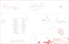

Contents
========

* [PRS14713 > Sparkfun](#prs14713--sparkfun)
	* [Schematic](#schematic)
	* [Interactive BOM](#interactive-bom)
	* [OOMP Parts](#oomp-parts)
	* [Images](#images)
	* [Tags](#tags)
  
![][im]
# PRS14713 > Sparkfun

- ID: PROJ-SPAR-14713-STAN-01
- Hex ID: PRS14713
- Name: Sparkfun
- Description: Sparkfun
- Long Link: [http://oom.lt/PROJ-SPAR-14713-STAN-01](http://oom.lt/PROJ-SPAR-14713-STAN-01)
- Short Link: [http://oom.lt/PRS14713](http://oom.lt/PRS14713)

## Schematic
  

## Interactive BOM

- Interactive BOM page: [ibom.html](https://htmlpreview.github.io/?https://github.com/oomlout/oomlout_OOMP_projects/blob/main/PROJ-SPAR-14713-STAN-01/kicad/bom/ibom.html)

## OOMP Parts
  

|OOMP Parts|
| :---: |
|C1,CAPC-0402-X-UNMATCHED-01,C1,15pF,15PF-0402-50V-5%,0402,15pF ceramic capacitors,,CAP-13063,,,15pF,|
|C2,CAPC-0402-X-UNMATCHED-01,C2,15pF,15PF-0402-50V-5%,0402,15pF ceramic capacitors,,CAP-13063,,,15pF,|
|C3,CAPC-0402-X-NF100-01,C3,0.1uF,0.1UF-0402-16V-10%,0402,0.1µF ceramic capacitors,,CAP-12416,,,0.1uF,|
|C6,CAPC-0603-X-UNMATCHED-01,C6,4.7uF,4.7UF-0603-6.3V-(10%),0603,4.7µF ceramic capacitors,,CAP-08280,,,4.7uF,|
|C7,CAPC-0603-X-UNMATCHED-01,C7,1.0uF,1.0UF-0603-16V-10%-X7R,0603,1µF ceramic capacitors,,CAP-13930,,,1.0uF,|
|C8,CAPC-0402-X-NF100-01,C8,0.1uF,0.1UF-0402-16V-10%,0402,0.1µF ceramic capacitors,,CAP-12416,,,0.1uF,|
|C9,CAPC-0402-X-NF100-01,C9,0.1uF,0.1UF-0402-16V-10%,0402,0.1µF ceramic capacitors,,CAP-12416,,,0.1uF,|
|C10,CAPC-0603-X-UNMATCHED-01,C10,2.2uF,2.2UF-0603-10V-20%,0603,2.2µF ceramic capacitors,,CAP-07888,,,2.2uF,|
|C11,CAPC-0402-X-NF100-01,C11,0.1uF,0.1UF-0402-16V-10%,0402,0.1µF ceramic capacitors,,CAP-12416,,,0.1uF,|
|C12,CAPC-0402-X-NF100-01,C12,0.1uF,0.1UF-0402-16V-10%,0402,0.1µF ceramic capacitors,,CAP-12416,,,0.1uF,|
|C13,CAPC-0603-X-UNMATCHED-01,C13,4.7uF,4.7UF-0603-6.3V-(10%),0603,4.7µF ceramic capacitors,,CAP-08280,,,4.7uF,|
|C14,CAPC-0402-X-NF100-01,C14,0.1uF,0.1UF-0402-16V-10%,0402,0.1µF ceramic capacitors,,CAP-12416,,,0.1uF,|
|C15,CAPC-0805-X-UF10-V10,C15,10uF,10UF-0805-10V-10%,0805,10.0µF ceramic capacitors,,CAP-11330,,,10uF,|
|C19,CAPC-0603-X-UNMATCHED-01,C19,4.7uF,4.7UF-0603-6.3V-(10%),0603,4.7µF ceramic capacitors,,CAP-08280,,,4.7uF,|
|D1,LEDS-0603-G-STAN-01,D1,Yellow,LED-YELLOW0603,LED-0603,Yellow SMD LED,,DIO-09003,,,Yellow,|
|D2,DIOD-S323-X-UNMATCHED-01,D2,1A/23V/620mV,DIODE-SCHOTTKY-BAT20J,SOD-323,Schottky diode,,DIO-11623,,,1A/23V/620mV,|
|D4,LEDS-0603-G-STAN-01,D4,BLUE,LED-BLUE0603,LED-0603,Blue SMD LED,,DIO-08575,,,BLUE,|
|J1,UNMATCHED-UNMATCHED-X-UNMATCHED-01,FD1,FIDUCIALUFIDUCIAL,FIDUCIALUFIDUCIAL,FIDUCIAL-MICRO,Fiducial Alignment Points,,,,,,|
|J2,UNMATCHED-UNMATCHED-X-UNMATCHED-01,FD2,FIDUCIALUFIDUCIAL,FIDUCIALUFIDUCIAL,FIDUCIAL-MICRO,Fiducial Alignment Points,,,,,,|
|J3,UNMATCHED-UNMATCHED-X-UNMATCHED-01,FD3,FIDUCIALUFIDUCIAL,FIDUCIALUFIDUCIAL,FIDUCIAL-MICRO,Fiducial Alignment Points,,,,,,|
|J4,UNMATCHED-UNMATCHED-X-UNMATCHED-01,FD4,FIDUCIALUFIDUCIAL,FIDUCIALUFIDUCIAL,FIDUCIAL-MICRO,Fiducial Alignment Points,,,,,,|
|J6,UNMATCHED-UNMATCHED-X-UNMATCHED-01,FRAME1,FRAME-LEDGER,FRAME-LEDGER,CREATIVE_COMMONS,Schematic Frame - Ledger,,,,,,|
|JP1,UNMATCHED-UNMATCHED-X-UNMATCHED-01,H1,STAND-OFF,STAND-OFF,STAND-OFF,Stand Off,,,,,,|
|L1,UNMATCHED-0603-X-UNMATCHED-01,H2,STAND-OFF,STAND-OFF,STAND-OFF,Stand Off,,,,,,|
|LOGO1,UNMATCHED-UNMATCHED-X-UNMATCHED-01,H3,STAND-OFF,STAND-OFF,STAND-OFF,Stand Off,,,,,,|
|Q1,UNMATCHED-SO23-X-UNMATCHED-01,H4,STAND-OFF,STAND-OFF,STAND-OFF,Stand Off,,,,,,|
|R1,RESE-0603-X-O103-01,J1,,CONN_12SM_SQ_NO_SILK,1X12_SM_SQ_NOSILK,Multi connection point. Often used as Generic Header-pin footprint for 0.1 inch spaced/style header connections,,,,,,|
|R2,RESE-0603-X-O103-01,J2,,CONN_161X16_SM_SQ_NOSILK,1X16_SM_SQ_NOSILK,Multi connection point. Often used as Generic Header-pin footprint for 0.1 inch spaced/style header connections,,,,,,|
|R3,RESE-0603-X-O102-01,J3,,QWIIC_CONNECTORJS-1MM,JST04_1MM_RA,SparkFun I2C Standard Qwiic Connector,,CONN-13694,,,,|
|R4,RESE-0603-X-O103-01,J4,,JST_2MM_MALE,JST-2-SMD,JST 2MM MALE RA CONNECTOR,,CONN-11443,,PRT-08612,,|
|R5,RESE-0603-X-UNMATCHED-01,J6,AMP FCI 10103594-0001LF,USB_MICRO-B_HALF_PTH_MILL,USB-MICROB-PTH-MILL,USB Type Micro-B Connector,,CONN-13711,,,,|
|R6,RESE-0603-X-UNMATCHED-01,JP1,JUMPER-SMT_3_2-NC_TRACE_SILK,JUMPER-SMT_3_2-NC_TRACE_SILK,SMT-JUMPER_3_2-NC_TRACE_SILK,Normally closed trace jumper (2 of 2 connections),,,,,,|
|R7,RESE-0603-X-O103-01,L1,FB - 30Ohm,INDUCTORFB-30OHM,0603,Inductors,,NDUC-07859,,,,|
|R8,RESE-0603-X-O331-01,LOGO1,FOUR_LAYER_WARNING,FOUR_LAYER_WARNING,FOUR_LAYER_WARNING,Four-Layer Board Warning - tDoc Layer,,,,,,|
|R9,RESE-0603-X-UNMATCHED-01,LOGO2,OSHW-LOGOMINI,OSHW-LOGOMINI,OSHW-LOGO-MINI,Open-Source Hardware (OSHW) Logo,,,,,,|
|S1,UNMATCHED-UNMATCHED-X-UNMATCHED-01,LOGO3,SFE_LOGO_NAME_FLAME.1_INCH,SFE_LOGO_NAME_FLAME.1_INCH,SFE_LOGO_NAME_FLAME_.1,SparkFun Font Logo w/ Flame,,,,,,|
|TP1,UNMATCHED-UNMATCHED-X-UNMATCHED-01,LOGO4,SFE_LOGO_FLAME.1_INCH,SFE_LOGO_FLAME.1_INCH,SFE_LOGO_FLAME_.1,SparkFun Flame Logo,,,,,,|
|TP2,UNMATCHED-UNMATCHED-X-UNMATCHED-01,Q1,2.5A/30V,MOSFET-PCHANNELDMG2307L,SOT23-3@1,Generic PMOSFET,,TRANS-11308,,,2.5A/30V,|
|U1,UNMATCHED-SO235-X-UNMATCHED-01,R1,10k,10KOHM-0603-1/10W-1%,0603,10kΩ resistor,,RES-00824,,,10k,|
|U2,UNMATCHED-UNMATCHED-X-UNMATCHED-01,R2,10k,10KOHM-0603-1/10W-1%,0603,10kΩ resistor,,RES-00824,,,10k,|
|U3,VREG-SO235-X-KAP2112K-V33D,R3,1K,1KOHM-1/10W-1%(0603),0603,RES-07856,,RES-07856,,,1K,|
|U4,UNMATCHED-UNMATCHED-X-UNMATCHED-01,R4,10k,10KOHM-0603-1/10W-1%,0603,10kΩ resistor,,RES-00824,,,10k,|
|Y1,UNMATCHED-UNMATCHED-X-UNMATCHED-01,R5,2.2k,2.2KOHM-0603-1/10W-1%,0603,2.2kΩ resistor,,RES-08272,,,2.2k,|

## Images
  
  

|kicadPcb3d|kicadPcb3dFront|kicadPcb3dBack|eagleImage|eagleSchemImage|
| :---: | :---: | :---: | :---: | :---: |
||||||

## Tags

- hexID: PRS14713
- oompType: PROJ
- oompSize: SPAR
- oompColor: 14713
- oompDesc: STAN
- oompIndex: 01
- oompName: SAMD51 Thing Plus
- sources: All source files from https://github.com/sparkfun/SAMD51_Thing_Plus (source licence details in srcLicense.md)
- linkBuyPage: https://www.sparkfun.com/products/14713
- oompID: PROJ-SPAR-14713-STAN-01
- oompParts: C1,CAPC-0402-X-UNMATCHED-01
- oompParts: C2,CAPC-0402-X-UNMATCHED-01
- oompParts: C3,CAPC-0402-X-NF100-01
- oompParts: C6,CAPC-0603-X-UNMATCHED-01
- oompParts: C7,CAPC-0603-X-UNMATCHED-01
- oompParts: C8,CAPC-0402-X-NF100-01
- oompParts: C9,CAPC-0402-X-NF100-01
- oompParts: C10,CAPC-0603-X-UNMATCHED-01
- oompParts: C11,CAPC-0402-X-NF100-01
- oompParts: C12,CAPC-0402-X-NF100-01
- oompParts: C13,CAPC-0603-X-UNMATCHED-01
- oompParts: C14,CAPC-0402-X-NF100-01
- oompParts: C15,CAPC-0805-X-UF10-V10
- oompParts: C19,CAPC-0603-X-UNMATCHED-01
- oompParts: D1,LEDS-0603-G-STAN-01
- oompParts: D2,DIOD-S323-X-UNMATCHED-01
- oompParts: D4,LEDS-0603-G-STAN-01
- oompParts: J1,UNMATCHED-UNMATCHED-X-UNMATCHED-01
- oompParts: J2,UNMATCHED-UNMATCHED-X-UNMATCHED-01
- oompParts: J3,UNMATCHED-UNMATCHED-X-UNMATCHED-01
- oompParts: J4,UNMATCHED-UNMATCHED-X-UNMATCHED-01
- oompParts: J6,UNMATCHED-UNMATCHED-X-UNMATCHED-01
- oompParts: JP1,UNMATCHED-UNMATCHED-X-UNMATCHED-01
- oompParts: L1,UNMATCHED-0603-X-UNMATCHED-01
- oompParts: LOGO1,UNMATCHED-UNMATCHED-X-UNMATCHED-01
- oompParts: Q1,UNMATCHED-SO23-X-UNMATCHED-01
- oompParts: R1,RESE-0603-X-O103-01
- oompParts: R2,RESE-0603-X-O103-01
- oompParts: R3,RESE-0603-X-O102-01
- oompParts: R4,RESE-0603-X-O103-01
- oompParts: R5,RESE-0603-X-UNMATCHED-01
- oompParts: R6,RESE-0603-X-UNMATCHED-01
- oompParts: R7,RESE-0603-X-O103-01
- oompParts: R8,RESE-0603-X-O331-01
- oompParts: R9,RESE-0603-X-UNMATCHED-01
- oompParts: S1,UNMATCHED-UNMATCHED-X-UNMATCHED-01
- oompParts: TP1,UNMATCHED-UNMATCHED-X-UNMATCHED-01
- oompParts: TP2,UNMATCHED-UNMATCHED-X-UNMATCHED-01
- oompParts: U1,UNMATCHED-SO235-X-UNMATCHED-01
- oompParts: U2,UNMATCHED-UNMATCHED-X-UNMATCHED-01
- oompParts: U3,VREG-SO235-X-KAP2112K-V33D
- oompParts: U4,UNMATCHED-UNMATCHED-X-UNMATCHED-01
- oompParts: Y1,UNMATCHED-UNMATCHED-X-UNMATCHED-01
- rawParts: C1,15pF,15PF-0402-50V-5%,0402,15pF ceramic capacitors,,CAP-13063,,,15pF,
- rawParts: C2,15pF,15PF-0402-50V-5%,0402,15pF ceramic capacitors,,CAP-13063,,,15pF,
- rawParts: C3,0.1uF,0.1UF-0402-16V-10%,0402,0.1µF ceramic capacitors,,CAP-12416,,,0.1uF,
- rawParts: C6,4.7uF,4.7UF-0603-6.3V-(10%),0603,4.7µF ceramic capacitors,,CAP-08280,,,4.7uF,
- rawParts: C7,1.0uF,1.0UF-0603-16V-10%-X7R,0603,1µF ceramic capacitors,,CAP-13930,,,1.0uF,
- rawParts: C8,0.1uF,0.1UF-0402-16V-10%,0402,0.1µF ceramic capacitors,,CAP-12416,,,0.1uF,
- rawParts: C9,0.1uF,0.1UF-0402-16V-10%,0402,0.1µF ceramic capacitors,,CAP-12416,,,0.1uF,
- rawParts: C10,2.2uF,2.2UF-0603-10V-20%,0603,2.2µF ceramic capacitors,,CAP-07888,,,2.2uF,
- rawParts: C11,0.1uF,0.1UF-0402-16V-10%,0402,0.1µF ceramic capacitors,,CAP-12416,,,0.1uF,
- rawParts: C12,0.1uF,0.1UF-0402-16V-10%,0402,0.1µF ceramic capacitors,,CAP-12416,,,0.1uF,
- rawParts: C13,4.7uF,4.7UF-0603-6.3V-(10%),0603,4.7µF ceramic capacitors,,CAP-08280,,,4.7uF,
- rawParts: C14,0.1uF,0.1UF-0402-16V-10%,0402,0.1µF ceramic capacitors,,CAP-12416,,,0.1uF,
- rawParts: C15,10uF,10UF-0805-10V-10%,0805,10.0µF ceramic capacitors,,CAP-11330,,,10uF,
- rawParts: C19,4.7uF,4.7UF-0603-6.3V-(10%),0603,4.7µF ceramic capacitors,,CAP-08280,,,4.7uF,
- rawParts: D1,Yellow,LED-YELLOW0603,LED-0603,Yellow SMD LED,,DIO-09003,,,Yellow,
- rawParts: D2,1A/23V/620mV,DIODE-SCHOTTKY-BAT20J,SOD-323,Schottky diode,,DIO-11623,,,1A/23V/620mV,
- rawParts: D4,BLUE,LED-BLUE0603,LED-0603,Blue SMD LED,,DIO-08575,,,BLUE,
- rawParts: FD1,FIDUCIALUFIDUCIAL,FIDUCIALUFIDUCIAL,FIDUCIAL-MICRO,Fiducial Alignment Points,,,,,,
- rawParts: FD2,FIDUCIALUFIDUCIAL,FIDUCIALUFIDUCIAL,FIDUCIAL-MICRO,Fiducial Alignment Points,,,,,,
- rawParts: FD3,FIDUCIALUFIDUCIAL,FIDUCIALUFIDUCIAL,FIDUCIAL-MICRO,Fiducial Alignment Points,,,,,,
- rawParts: FD4,FIDUCIALUFIDUCIAL,FIDUCIALUFIDUCIAL,FIDUCIAL-MICRO,Fiducial Alignment Points,,,,,,
- rawParts: FRAME1,FRAME-LEDGER,FRAME-LEDGER,CREATIVE_COMMONS,Schematic Frame - Ledger,,,,,,
- rawParts: H1,STAND-OFF,STAND-OFF,STAND-OFF,Stand Off,,,,,,
- rawParts: H2,STAND-OFF,STAND-OFF,STAND-OFF,Stand Off,,,,,,
- rawParts: H3,STAND-OFF,STAND-OFF,STAND-OFF,Stand Off,,,,,,
- rawParts: H4,STAND-OFF,STAND-OFF,STAND-OFF,Stand Off,,,,,,
- rawParts: J1,,CONN_12SM_SQ_NO_SILK,1X12_SM_SQ_NOSILK,Multi connection point. Often used as Generic Header-pin footprint for 0.1 inch spaced/style header connections,,,,,,
- rawParts: J2,,CONN_161X16_SM_SQ_NOSILK,1X16_SM_SQ_NOSILK,Multi connection point. Often used as Generic Header-pin footprint for 0.1 inch spaced/style header connections,,,,,,
- rawParts: J3,,QWIIC_CONNECTORJS-1MM,JST04_1MM_RA,SparkFun I2C Standard Qwiic Connector,,CONN-13694,,,,
- rawParts: J4,,JST_2MM_MALE,JST-2-SMD,JST 2MM MALE RA CONNECTOR,,CONN-11443,,PRT-08612,,
- rawParts: J6,AMP FCI 10103594-0001LF,USB_MICRO-B_HALF_PTH_MILL,USB-MICROB-PTH-MILL,USB Type Micro-B Connector,,CONN-13711,,,,
- rawParts: JP1,JUMPER-SMT_3_2-NC_TRACE_SILK,JUMPER-SMT_3_2-NC_TRACE_SILK,SMT-JUMPER_3_2-NC_TRACE_SILK,Normally closed trace jumper (2 of 2 connections),,,,,,
- rawParts: L1,FB - 30Ohm,INDUCTORFB-30OHM,0603,Inductors,,NDUC-07859,,,,
- rawParts: LOGO1,FOUR_LAYER_WARNING,FOUR_LAYER_WARNING,FOUR_LAYER_WARNING,Four-Layer Board Warning - tDoc Layer,,,,,,
- rawParts: LOGO2,OSHW-LOGOMINI,OSHW-LOGOMINI,OSHW-LOGO-MINI,Open-Source Hardware (OSHW) Logo,,,,,,
- rawParts: LOGO3,SFE_LOGO_NAME_FLAME.1_INCH,SFE_LOGO_NAME_FLAME.1_INCH,SFE_LOGO_NAME_FLAME_.1,SparkFun Font Logo w/ Flame,,,,,,
- rawParts: LOGO4,SFE_LOGO_FLAME.1_INCH,SFE_LOGO_FLAME.1_INCH,SFE_LOGO_FLAME_.1,SparkFun Flame Logo,,,,,,
- rawParts: Q1,2.5A/30V,MOSFET-PCHANNELDMG2307L,SOT23-3@1,Generic PMOSFET,,TRANS-11308,,,2.5A/30V,
- rawParts: R1,10k,10KOHM-0603-1/10W-1%,0603,10kΩ resistor,,RES-00824,,,10k,
- rawParts: R2,10k,10KOHM-0603-1/10W-1%,0603,10kΩ resistor,,RES-00824,,,10k,
- rawParts: R3,1K,1KOHM-1/10W-1%(0603),0603,RES-07856,,RES-07856,,,1K,
- rawParts: R4,10k,10KOHM-0603-1/10W-1%,0603,10kΩ resistor,,RES-00824,,,10k,
- rawParts: R5,2.2k,2.2KOHM-0603-1/10W-1%,0603,2.2kΩ resistor,,RES-08272,,,2.2k,
- rawParts: R6,2.0k,2.0KOHM1/10W5%(0603),0603,RES-08296,,RES-08296,,,2.0k,
- rawParts: R7,10k,10KOHM-0603-1/10W-1%,0603,10kΩ resistor,,RES-00824,,,10k,
- rawParts: R8,330,330OHM1/10W1%(0603),0603,RES-00818,,RES-00818,,,330,
- rawParts: R9,2.2k,2.2KOHM-0603-1/10W-1%,0603,2.2kΩ resistor,,RES-08272,,,2.2k,
- rawParts: S1,RESET,MOMENTARY-SWITCH-SPST-2-SMD-4.6X2.8MM,TACTILE_SWITCH_SMD_4.6X2.8MM,Momentary Switch (Pushbutton) - SPST - Two Circuits,,SWCH-13065,,,,
- rawParts: TP1,TEST-POINTTP_15TH_THRU,TEST-POINTTP_15TH_THRU,TP_15TH,SparkFun Test Points,,,,,,
- rawParts: TP2,TEST-POINTTP_15TH_THRU,TEST-POINTTP_15TH_THRU,TP_15TH,SparkFun Test Points,,,,,,
- rawParts: U$69,QWIIC_LOGO_5MM,QWIIC_LOGO_5MM,QWIIC_5MM,Qwiic Logos for placement on schematic and PCB. The 5.5mm silk logo is best for placing next to Qwiic connector.,,,,,,
- rawParts: U1,MCP73831,MCP73831,SOT23-5,Miniature single cell, fully integrated Li-Ion, Li-polymer charge management controller,,IC-09995,,,,
- rawParts: U2,ATSAMD51J20A-A,ATSAMD51J20A-A,TQFP64,,,IC-13952,,,,
- rawParts: U3,AP2112K-3.3V,V_REG_LDOSMD,SOT23-5,Voltage Regulator LDO,,VREG-12457,,,,
- rawParts: U4,4Mb Flash,AT25SF041,SO08,AT25SF041 4Mb Serial Flash Memory,,IC-12455,,,4MB Flash,
- rawParts: Y1,32.768kHz,CRYSTAL-32.768KHZSMD-3.2X1.5,CRYSTAL-SMD-3.2X1.5MM,32.768kHz Crystal,,XTAL-13062,,,32.768kHz,

[im]: kicadPcb3d_450.png
