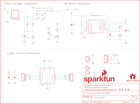

Contents
========

* [PRS14765 > Sparkfun](#prs14765--sparkfun)
	* [Images](#images)
	* [Tags](#tags)
  
![][im]
# PRS14765 > Sparkfun

- ID: PROJ-SPAR-14765-STAN-01
- Hex ID: PRS14765
- Name: Sparkfun
- Description: Sparkfun

## Images
  
  

|kicadPcb3d|kicadPcb3dFront|kicadPcb3dBack|eagleImage|eagleSchemImage|
| :---: | :---: | :---: | :---: | :---: |
||||||

## Tags

- hexID: PRS14765
- oompType: PROJ
- oompSize: SPAR
- oompColor: 14765
- oompDesc: STAN
- oompIndex: 01
- oompName: Single Supply Logic Level Converter
- sources: All source files from https://github.com/sparkfun/Single_Supply_Logic_Level_Converter (source licence details in srcLicense.md)
- linkBuyPage: https://www.sparkfun.com/products/14765
- oompID: PROJ-SPAR-14765-STAN-01
- oompParts: C1,UNMATCHED-UNMATCHED-UNMATCHED-UNMATCHED-UNMATCHED
- oompParts: C2,UNMATCHED-UNMATCHED-UNMATCHED-UNMATCHED-UNMATCHED
- oompParts: C3,UNMATCHED-UNMATCHED-UNMATCHED-UNMATCHED-UNMATCHED
- oompParts: C4,UNMATCHED-UNMATCHED-UNMATCHED-UNMATCHED-UNMATCHED
- oompParts: C5,UNMATCHED-UNMATCHED-UNMATCHED-UNMATCHED-UNMATCHED
- oompParts: C6,UNMATCHED-UNMATCHED-UNMATCHED-UNMATCHED-UNMATCHED
- oompParts: C7,UNMATCHED-UNMATCHED-UNMATCHED-UNMATCHED-UNMATCHED
- oompParts: D1,UNMATCHED-UNMATCHED-UNMATCHED-UNMATCHED-UNMATCHED
- oompParts: FRAME1,UNMATCHED-UNMATCHED-UNMATCHED-UNMATCHED-UNMATCHED
- oompParts: J1,UNMATCHED-UNMATCHED-UNMATCHED-UNMATCHED-UNMATCHED
- oompParts: J2,UNMATCHED-UNMATCHED-UNMATCHED-UNMATCHED-UNMATCHED
- oompParts: J3,UNMATCHED-UNMATCHED-UNMATCHED-UNMATCHED-UNMATCHED
- oompParts: J4,UNMATCHED-UNMATCHED-UNMATCHED-UNMATCHED-UNMATCHED
- oompParts: JP3,UNMATCHED-UNMATCHED-UNMATCHED-UNMATCHED-UNMATCHED
- oompParts: JP7,UNMATCHED-UNMATCHED-UNMATCHED-UNMATCHED-UNMATCHED
- oompParts: L1,UNMATCHED-UNMATCHED-UNMATCHED-UNMATCHED-UNMATCHED
- oompParts: LOGO1,UNMATCHED-UNMATCHED-UNMATCHED-UNMATCHED-UNMATCHED
- oompParts: LOGO2,UNMATCHED-UNMATCHED-UNMATCHED-UNMATCHED-UNMATCHED
- oompParts: R1,UNMATCHED-UNMATCHED-UNMATCHED-UNMATCHED-UNMATCHED
- oompParts: R2,UNMATCHED-UNMATCHED-UNMATCHED-UNMATCHED-UNMATCHED
- oompParts: R3,UNMATCHED-UNMATCHED-UNMATCHED-UNMATCHED-UNMATCHED
- oompParts: R4,UNMATCHED-UNMATCHED-UNMATCHED-UNMATCHED-UNMATCHED
- oompParts: R5,UNMATCHED-UNMATCHED-UNMATCHED-UNMATCHED-UNMATCHED
- oompParts: R6,UNMATCHED-UNMATCHED-UNMATCHED-UNMATCHED-UNMATCHED
- oompParts: U1,UNMATCHED-UNMATCHED-UNMATCHED-UNMATCHED-UNMATCHED
- oompParts: U2,UNMATCHED-UNMATCHED-UNMATCHED-UNMATCHED-UNMATCHED
- oompParts: U3,UNMATCHED-UNMATCHED-UNMATCHED-UNMATCHED-UNMATCHED
- rawParts: C1,0.1uF,0.1UF-25V(+80/-20%)(0603),0603-CAP,Ceramic,CAP-00810,0.1uF,
- rawParts: C2,0.1uF,0.1UF-25V(+80/-20%)(0603),0603-CAP,Ceramic,CAP-00810,0.1uF,
- rawParts: C3,22uF,22UF-0805-6.3V-20%,0805,22µF ceramic capacitors,CAP-08402,22uF,
- rawParts: C4,470pF,470PF-0603-50V-5%,0603,470pF ceramic capacitors,CAP-07884,470pF,
- rawParts: C5,0.1uF,0.1UF-0603-25V-(+80/-20%),0603,0.1µF ceramic capacitors,CAP-00810,0.1uF,
- rawParts: C6,10uF,10UF-0603-6.3V-20%,0603,10.0µF ceramic capacitors,CAP-11015,10uF,
- rawParts: C7,10uF,10UF-POLAR-EIA3216-16V-10%(TANT),EIA3216,10.0µF polarized capacitors,CAP-00811,10uF,
- rawParts: D1,RED,LED-RED0603,LED-0603,Red SMD LED,DIO-00819,RED,
- rawParts: FD1,FIDUCIALUFIDUCIAL,FIDUCIALUFIDUCIAL,FIDUCIAL-MICRO,Fiducial Alignment Points,,,
- rawParts: FD2,FIDUCIALUFIDUCIAL,FIDUCIALUFIDUCIAL,FIDUCIAL-MICRO,Fiducial Alignment Points,,,
- rawParts: FD3,FIDUCIALUFIDUCIAL,FIDUCIALUFIDUCIAL,FIDUCIAL-MICRO,Fiducial Alignment Points,,,
- rawParts: FD4,FIDUCIALUFIDUCIAL,FIDUCIALUFIDUCIAL,FIDUCIAL-MICRO,Fiducial Alignment Points,,,
- rawParts: FRAME1,FRAME-LETTER,FRAME-LETTER,CREATIVE_COMMONS,Schematic Frame - Letter,,,
- rawParts: J1,,CONN_04,1X04,Multi connection point. Often used as Generic Header-pin footprint for 0.1 inch spaced/style header connections,CONN-09696,,
- rawParts: J2,,CONN_04,1X04,Multi connection point. Often used as Generic Header-pin footprint for 0.1 inch spaced/style header connections,CONN-09696,,
- rawParts: J3,,CONN_01,1X01,Single connection point. Often used as Generic Header-pin footprint for 0.1 inch spaced/style header connections,,,
- rawParts: J4,,CONN_01,1X01,Single connection point. Often used as Generic Header-pin footprint for 0.1 inch spaced/style header connections,,,
- rawParts: JP3,455-1750-1-ND,CONN_04,1X04,Multi connection point. Often used as Generic Header-pin footprint for 0.1 inch spaced/style header connections,CONN-09696,,
- rawParts: JP7,VIN,M02PTH,1X02,Header 2,,,
- rawParts: L1,2.2µH/±20%/1.5A,INDUCTOR-VLF4012AT-2.2UH,INDUCTOR_2.2UH,Inductors,NDUC-09513,2.2µH/±20%/1.5A,
- rawParts: LOGO1,SFE_LOGO_NAME_FLAME.1_INCH,SFE_LOGO_NAME_FLAME.1_INCH,SFE_LOGO_NAME_FLAME_.1,SparkFun Font Logo w/ Flame,,,
- rawParts: LOGO2,OSHW-LOGOS,OSHW-LOGOS,OSHW-LOGO-S,Open-Source Hardware (OSHW) Logo,,,
- rawParts: R1, ,RESISTORAXIAL-0.3,AXIAL-0.3,Generic Resistor Package, , ,
- rawParts: R2,22k,22KOHM-0603-1/10W-1%,0603,22kΩ resistor,RES-07853,22k,
- rawParts: R3,13k,13KOHM-0603-1/10W-1%,0603,13kΩ resistor,RES-14017,13k,
- rawParts: R4,1k,1KOHM-0603-1/10W-1%,0603,1kΩ resistor,RES-07856,1k,
- rawParts: R5,1.8M,1.8MOHM,0603,1.8 MOhms ±5% 0.1W, 1/10W Chip Resistor 0603,RES-13994,1.8M,
- rawParts: R6,200k,200KOHM-0603-1/10W-1%,0603,200kΩ resistor,RES-09385,200k,
- rawParts: U1,TXB0104,TXB0104PWR,TSSOP14,4-Bit Bi-Directional Level Shifter,IC-13929,TXB0104,
- rawParts: U2,TPS61200,TPS61200,QFN-10_PAD,DC to DC Booster,IC-10035,,
- rawParts: U3,MIC5205(ADJ),V_REG_MIC5205ADJ,SOT23-5,V_REG MIC5205 Standard 3.3V, 5V, and Adjustable 150mA LDO voltage regulator in SOT-23 layout. Micrel part MIC5205. BP (by-pass) pin is used to lower output noise with 470pF cap, may be left open. On the adjustable version BP is used to set output.,VREG-12594,MIC5205(ADJ),

[im]: kicadPcb3d_450.png
