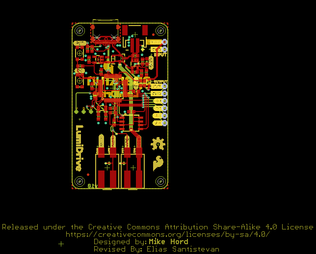
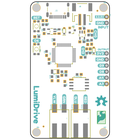
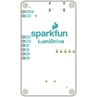
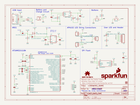
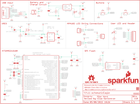
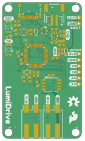
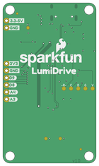

Contents
========

* [PRS14779 > LumiDrive](#prs14779--lumidrive)
	* [Schematic](#schematic)
	* [PCB](#pcb)
	* [Interactive BOM](#interactive-bom)
	* [OOMP Parts](#oomp-parts)
	* [Images](#images)
	* [Tags](#tags)
  
![][im]
# PRS14779 > LumiDrive

- ID: PROJ-SPAR-14779-STAN-01
- Hex ID: PRS14779
- Name: Sparkfun
- Description: Sparkfun
- Long Link: [http://oom.lt/PROJ-SPAR-14779-STAN-01](http://oom.lt/PROJ-SPAR-14779-STAN-01)
- Short Link: [http://oom.lt/PRS14779](http://oom.lt/PRS14779)

## Schematic
  

## PCB
  

## Interactive BOM

- Interactive BOM page: [ibom.html](https://htmlpreview.github.io/?https://github.com/oomlout/oomlout_OOMP_projects/blob/main/PROJ-SPAR-14779-STAN-01/kicad/bom/ibom.html)

## OOMP Parts
  

|OOMP ID|Name|Identifier|
| :---: | :---: | :---: |
|[CAPC-0603-X-UF47D-V10](https://github.com/oomlout/oomlout_OOMP_parts/tree/main/CAPC-0603-X-UF47D-V10/)|[SMD (0603) 4.7 uF Capacitor (Ceramic) 10v](https://github.com/oomlout/oomlout_OOMP_parts/tree/main/CAPC-0603-X-UF47D-V10/)|[C1, C3](https://github.com/oomlout/oomlout_OOMP_parts/tree/main/CAPC-0603-X-UF47D-V10/)|
|[CAPC-0603-X-NF100-V50](https://github.com/oomlout/oomlout_OOMP_parts/tree/main/CAPC-0603-X-NF100-V50/)|[SMD (0603) 100 nF Capacitor (Ceramic) 50v](https://github.com/oomlout/oomlout_OOMP_parts/tree/main/CAPC-0603-X-NF100-V50/)|[C2, C4, C5, C10, C12, C14](https://github.com/oomlout/oomlout_OOMP_parts/tree/main/CAPC-0603-X-NF100-V50/)|
|CAPC-0805-X-UNMATCHED-01||C8|
|[CAPC-0603-X-UF22D-V10](https://github.com/oomlout/oomlout_OOMP_parts/tree/main/CAPC-0603-X-UF22D-V10/)|[SMD (0603) 2.2 uF Capacitor (Ceramic) 10v](https://github.com/oomlout/oomlout_OOMP_parts/tree/main/CAPC-0603-X-UF22D-V10/)|[C9](https://github.com/oomlout/oomlout_OOMP_parts/tree/main/CAPC-0603-X-UF22D-V10/)|
|[CAPC-0603-X-PF15-V50](https://github.com/oomlout/oomlout_OOMP_parts/tree/main/CAPC-0603-X-PF15-V50/)|[SMD (0603) 15 pF Capacitor (Ceramic) 50v](https://github.com/oomlout/oomlout_OOMP_parts/tree/main/CAPC-0603-X-PF15-V50/)|[C15, C16](https://github.com/oomlout/oomlout_OOMP_parts/tree/main/CAPC-0603-X-PF15-V50/)|
|DIOD-S323-X-UNMATCHED-01||D1, D3|
|[LEDS-0603-Y-STAN-01](https://github.com/oomlout/oomlout_OOMP_parts/tree/main/LEDS-0603-Y-STAN-01/)|[SMD (0603) Yellow LED](https://github.com/oomlout/oomlout_OOMP_parts/tree/main/LEDS-0603-Y-STAN-01/)|[D2](https://github.com/oomlout/oomlout_OOMP_parts/tree/main/LEDS-0603-Y-STAN-01/)|
|[LEDS-0603-L-STAN-01](https://github.com/oomlout/oomlout_OOMP_parts/tree/main/LEDS-0603-L-STAN-01/)|[SMD (0603) Blue LED](https://github.com/oomlout/oomlout_OOMP_parts/tree/main/LEDS-0603-L-STAN-01/)|[D9](https://github.com/oomlout/oomlout_OOMP_parts/tree/main/LEDS-0603-L-STAN-01/)|
|FERB-0603-X-UNMATCHED-01||FB1|
|[HEAD-I01-X-PI02-01](https://github.com/oomlout/oomlout_OOMP_parts/tree/main/HEAD-I01-X-PI02-01/)|[2.54 mm 2 Pin Header](https://github.com/oomlout/oomlout_OOMP_parts/tree/main/HEAD-I01-X-PI02-01/)|[J1, J3, J4](https://github.com/oomlout/oomlout_OOMP_parts/tree/main/HEAD-I01-X-PI02-01/)|
|[HEAD-I01-X-PI06-01](https://github.com/oomlout/oomlout_OOMP_parts/tree/main/HEAD-I01-X-PI06-01/)|[2.54 mm 6 Pin Header](https://github.com/oomlout/oomlout_OOMP_parts/tree/main/HEAD-I01-X-PI06-01/)|[J5](https://github.com/oomlout/oomlout_OOMP_parts/tree/main/HEAD-I01-X-PI06-01/)|
|UNMATCHED-UNMATCHED-X-UNMATCHED-01||J6, J8, TP1, TP2, TP3, TP4, TP5, U2, U4, Y1|
|MOSP-SO23-X-UNMATCHED-01||Q1|
|[RESE-0603-X-O102-01](https://github.com/oomlout/oomlout_OOMP_parts/tree/main/RESE-0603-X-O102-01/)|[SMD (0603) 1k Ohm Resistor](https://github.com/oomlout/oomlout_OOMP_parts/tree/main/RESE-0603-X-O102-01/)|[R1, R2](https://github.com/oomlout/oomlout_OOMP_parts/tree/main/RESE-0603-X-O102-01/)|
|RESE-0603-X-UNMATCHED-01||R3|
|[RESE-0603-X-O103-01](https://github.com/oomlout/oomlout_OOMP_parts/tree/main/RESE-0603-X-O103-01/)|[SMD (0603) 10k Ohm Resistor](https://github.com/oomlout/oomlout_OOMP_parts/tree/main/RESE-0603-X-O103-01/)|[R4, R5, R10](https://github.com/oomlout/oomlout_OOMP_parts/tree/main/RESE-0603-X-O103-01/)|
|[RESE-0603-X-O472-01](https://github.com/oomlout/oomlout_OOMP_parts/tree/main/RESE-0603-X-O472-01/)|[SMD (0603) 4.7k Ohm Resistor](https://github.com/oomlout/oomlout_OOMP_parts/tree/main/RESE-0603-X-O472-01/)|[R6, R7](https://github.com/oomlout/oomlout_OOMP_parts/tree/main/RESE-0603-X-O472-01/)|
|UNMATCHED-4628-X-UNMATCHED-01||S1, S2|
|UNMATCHED-SO235-X-UNMATCHED-01||U1|
|[VREG-SO235-X-KAP2112K-V33D](https://github.com/oomlout/oomlout_OOMP_parts/tree/main/VREG-SO235-X-KAP2112K-V33D/)|[SMD (SOT-23-5) AP2112K Voltage Regulator 3.3v](https://github.com/oomlout/oomlout_OOMP_parts/tree/main/VREG-SO235-X-KAP2112K-V33D/)|[U3](https://github.com/oomlout/oomlout_OOMP_parts/tree/main/VREG-SO235-X-KAP2112K-V33D/)|

## Images
  
  

|bominteractivefront|bominteractiveback|kicadPcb3d|kicadPcb3dFront|kicadPcb3dBack|kicadSchem|eagleImage|eagleSchemImage|pcbdraw|pcbdrawback|
| :---: | :---: | :---: | :---: | :---: | :---: | :---: | :---: | :---: | :---: |
|||||||||||

## Tags

- hexID: PRS14779
- oompType: PROJ
- oompSize: SPAR
- oompColor: 14779
- oompDesc: STAN
- oompIndex: 01
- oompName: LumiDrive
- sources: All source files from https://github.com/sparkfun/LumiDrive (source licence details in srcLicense.md)
- linkBuyPage: https://www.sparkfun.com/products/14779
- oompID: PROJ-SPAR-14779-STAN-01
- oompParts: C1,CAPC-0603-X-UF47D-V10
- oompParts: C2,CAPC-0603-X-NF100-V50
- oompParts: C3,CAPC-0603-X-UF47D-V10
- oompParts: C4,CAPC-0603-X-NF100-V50
- oompParts: C5,CAPC-0603-X-NF100-V50
- oompParts: C8,CAPC-0805-X-UNMATCHED-01
- oompParts: C9,CAPC-0603-X-UF22D-V10
- oompParts: C10,CAPC-0603-X-NF100-V50
- oompParts: C12,CAPC-0603-X-NF100-V50
- oompParts: C14,CAPC-0603-X-NF100-V50
- oompParts: C15,CAPC-0603-X-PF15-V50
- oompParts: C16,CAPC-0603-X-PF15-V50
- oompParts: D1,DIOD-S323-X-UNMATCHED-01
- oompParts: D2,LEDS-0603-Y-STAN-01
- oompParts: D3,DIOD-S323-X-UNMATCHED-01
- oompParts: D9,LEDS-0603-L-STAN-01
- oompParts: FB1,FERB-0603-X-UNMATCHED-01
- oompParts: J1,HEAD-I01-X-PI02-01
- oompParts: J3,HEAD-I01-X-PI02-01
- oompParts: J4,HEAD-I01-X-PI02-01
- oompParts: J5,HEAD-I01-X-PI06-01
- oompParts: J6,UNMATCHED-UNMATCHED-X-UNMATCHED-01
- oompParts: J8,UNMATCHED-UNMATCHED-X-UNMATCHED-01
- oompParts: Q1,MOSP-SO23-X-UNMATCHED-01
- oompParts: R1,RESE-0603-X-O102-01
- oompParts: R2,RESE-0603-X-O102-01
- oompParts: R3,RESE-0603-X-UNMATCHED-01
- oompParts: R4,RESE-0603-X-O103-01
- oompParts: R5,RESE-0603-X-O103-01
- oompParts: R6,RESE-0603-X-O472-01
- oompParts: R7,RESE-0603-X-O472-01
- oompParts: R10,RESE-0603-X-O103-01
- oompParts: S1,UNMATCHED-4628-X-UNMATCHED-01
- oompParts: S2,UNMATCHED-4628-X-UNMATCHED-01
- oompParts: TP1,UNMATCHED-UNMATCHED-X-UNMATCHED-01
- oompParts: TP2,UNMATCHED-UNMATCHED-X-UNMATCHED-01
- oompParts: TP3,UNMATCHED-UNMATCHED-X-UNMATCHED-01
- oompParts: TP4,UNMATCHED-UNMATCHED-X-UNMATCHED-01
- oompParts: TP5,UNMATCHED-UNMATCHED-X-UNMATCHED-01
- oompParts: U1,UNMATCHED-SO235-X-UNMATCHED-01
- oompParts: U2,UNMATCHED-UNMATCHED-X-UNMATCHED-01
- oompParts: U3,VREG-SO235-X-KAP2112K-V33D
- oompParts: U4,UNMATCHED-UNMATCHED-X-UNMATCHED-01
- oompParts: Y1,UNMATCHED-UNMATCHED-X-UNMATCHED-01
- rawParts: C1,4.7uF,4.7UF-0603-6.3V-(10%),0603,4.7µF ceramic capacitors,,CAP-08280,,,4.7uF,
- rawParts: C2,0.1uF,0.1UF-0603-25V-(+80/-20%),0603,0.1µF ceramic capacitors,,CAP-00810,,,0.1uF,
- rawParts: C3,4.7uF,4.7UF-0603-6.3V-(10%),0603,4.7µF ceramic capacitors,,CAP-08280,,,4.7uF,
- rawParts: C4,0.1uF,0.1UF-0603-25V-(+80/-20%),0603,0.1µF ceramic capacitors,,CAP-00810,,,0.1uF,
- rawParts: C5,0.1uF,0.1UF-0603-25V-(+80/-20%),0603,0.1µF ceramic capacitors,,CAP-00810,,,0.1uF,
- rawParts: C8,1.0uF,1.0UF-0805-25V-10%,0805,1µF ceramic capacitors,,CAP-08064,,,1.0uF,
- rawParts: C9,2.2uF,2.2UF-0603-10V-20%,0603,2.2µF ceramic capacitors,,CAP-07888,,,2.2uF,
- rawParts: C10,0.1uF,0.1UF-0603-25V-(+80/-20%),0603,0.1µF ceramic capacitors,,CAP-00810,,,0.1uF,
- rawParts: C12,0.1uF,0.1UF-0603-25V-(+80/-20%),0603,0.1µF ceramic capacitors,,CAP-00810,,,0.1uF,
- rawParts: C14,0.1uF,0.1UF-0603-25V-(+80/-20%),0603,0.1µF ceramic capacitors,,CAP-00810,,,0.1uF,
- rawParts: C15,15pF,15PF-0603-50V-5%,0603,15pF ceramic capacitors,,CAP-07881,,,15pF,
- rawParts: C16,15pF,15PF-0603-50V-5%,0603,15pF ceramic capacitors,,CAP-07881,,,15pF,
- rawParts: D1,1A/23V/620mV,DIODE-SCHOTTKY-BAT20J,SOD-323,Schottky diode,,DIO-11623,,,1A/23V/620mV,
- rawParts: D2,Yellow,LED-YELLOW0603,LED-0603,Yellow SMD LED,,DIO-09003,,,Yellow,
- rawParts: D3,1A/23V/620mV,DIODE-SCHOTTKY-BAT20J,SOD-323,Schottky diode,,DIO-11623,,,1A/23V/620mV,
- rawParts: D9,BLUE,LED-BLUE0603,LED-0603,Blue SMD LED,,DIO-08575,,,BLUE,
- rawParts: FB1,30Ω/1.8A,INDUCTORFB-30OHM,0603,Inductors,,NDUC-07859,,,,
- rawParts: FD1,FIDUCIALUFIDUCIAL,FIDUCIALUFIDUCIAL,FIDUCIAL-MICRO,Fiducial Alignment Points,,,,,,
- rawParts: FD2,FIDUCIALUFIDUCIAL,FIDUCIALUFIDUCIAL,FIDUCIAL-MICRO,Fiducial Alignment Points,,,,,,
- rawParts: FD3,FIDUCIALUFIDUCIAL,FIDUCIALUFIDUCIAL,FIDUCIAL-MICRO,Fiducial Alignment Points,,,,,,
- rawParts: FD4,FIDUCIALUFIDUCIAL,FIDUCIALUFIDUCIAL,FIDUCIAL-MICRO,Fiducial Alignment Points,,,,,,
- rawParts: FRAME1,FRAME-LETTER,FRAME-LETTER,CREATIVE_COMMONS,Schematic Frame - Letter,,,,,,
- rawParts: H1,STAND-OFF,STAND-OFF,STAND-OFF,Stand Off,,,,,,
- rawParts: H2,STAND-OFF,STAND-OFF,STAND-OFF,Stand Off,,,,,,
- rawParts: H3,STAND-OFF,STAND-OFF,STAND-OFF,Stand Off,,,,,,
- rawParts: H4,STAND-OFF,STAND-OFF,STAND-OFF,Stand Off,,,,,,
- rawParts: J1,,CONN_021X02_NO_SILK,1X02_NO_SILK,Multi connection point. Often used as Generic Header-pin footprint for 0.1 inch spaced/style header connections,,,,,,
- rawParts: J3,,CONN_02SMALL_POKEHOME,1X02_POKEHOME,Multi connection point. Often used as Generic Header-pin footprint for 0.1 inch spaced/style header connections,,CONN-13512,,,,
- rawParts: J4,,CONN_02SMALL_POKEHOME,1X02_POKEHOME,Multi connection point. Often used as Generic Header-pin footprint for 0.1 inch spaced/style header connections,,CONN-13512,,,,
- rawParts: J5,,CONN_06NO_SILK_FEMALE_PTH,1X06_NO_SILK,Multi connection point. Often used as Generic Header-pin footprint for 0.1 inch spaced/style header connections,,CONN-08437,,,,
- rawParts: J6,,JST_2MM_MALE,JST-2-SMD,JST 2MM MALE RA CONNECTOR,,CONN-11443,,PRT-08612,,
- rawParts: J8,,USB_C16PIN,USB-C-16P,USB Type C 16Pin Connector,,CONN-14122,,,,
- rawParts: LOGO1,OSHW-LOGOM,OSHW-LOGOM,OSHW-LOGO-M,Open-Source Hardware (OSHW) Logo,,,,,,
- rawParts: LOGO3,SFE_LOGO_NAME_FLAME.2_INCH,SFE_LOGO_NAME_FLAME.2_INCH,SFE_LOGO_NAME_FLAME_.2,SparkFun Font Logo w/ Flame,,,,,,
- rawParts: Q1,2.5A/30V/105mΩ,MOSFET_PCH-DMG2307L,SOT23-3,P-channel MOSFETs,,TRANS-11308,,,2.5A/30V/105mΩ,
- rawParts: R1,1k,1KOHM-0603-1/10W-1%,0603,1kΩ resistor,,RES-07856,,,1k,
- rawParts: R2,1k,1KOHM-0603-1/10W-1%,0603,1kΩ resistor,,RES-07856,,,1k,
- rawParts: R3,2.0k,2.0KOHM-0603-1/10W-5%,0603,2kΩ resistor,,RES-08296,,,2.0k,
- rawParts: R4,10k,10KOHM-0603-1/10W-1%,0603,10kΩ resistor,,RES-00824,,,10k,
- rawParts: R5,10k,10KOHM-0603-1/10W-1%,0603,10kΩ resistor,,RES-00824,,,10k,
- rawParts: R6,5.1k,5.1KOHM5.1KOHM-0603-1/10W-1%,0603,,,RES-12083,,,5.1k,
- rawParts: R7,5.1k,5.1KOHM5.1KOHM-0603-1/10W-1%,0603,,,RES-12083,,,5.1k,
- rawParts: R10,10k,10KOHM-0603-1/10W-1%,0603,10kΩ resistor,,RES-00824,,,10k,
- rawParts: S1,RESET,MOMENTARY-SWITCH-SPST-2-SMD-4.6X2.8MM,TACTILE_SWITCH_SMD_4.6X2.8MM,Momentary Switch (Pushbutton) - SPST - Two Circuits,,SWCH-13065,,,,
- rawParts: S2,BTN2,MOMENTARY-SWITCH-SPST-2-SMD-4.6X2.8MM,TACTILE_SWITCH_SMD_4.6X2.8MM,Momentary Switch (Pushbutton) - SPST - Two Circuits,,SWCH-13065,,,,
- rawParts: TP1,TP-SWDIO,TEST-POINT3X5,PAD.03X.05,SparkFun Test Points,,,,,,
- rawParts: TP2,TP-SWCLK,TEST-POINT3X5,PAD.03X.05,SparkFun Test Points,,,,,,
- rawParts: TP3,TP-!RESET!,TEST-POINT3X5,PAD.03X.05,SparkFun Test Points,,,,,,
- rawParts: TP4,TP-3.3V,TEST-POINT3X5,PAD.03X.05,SparkFun Test Points,,,,,,
- rawParts: TP5,TP-GND,TEST-POINT3X5,PAD.03X.05,SparkFun Test Points,,,,,,
- rawParts: TP6,TEST-POINT3X4,TEST-POINT3X4,PAD.03X.04,SparkFun Test Points,,,,,,
- rawParts: TP7,TEST-POINT3X4,TEST-POINT3X4,PAD.03X.04,SparkFun Test Points,,,,,,
- rawParts: TP8,TEST-POINT3X4,TEST-POINT3X4,PAD.03X.04,SparkFun Test Points,,,,,,
- rawParts: U1,MCP73831,MCP73831,SOT23-5,MCP73831T Li-Ion, Li-Pol Controller,,IC-09995,,,,
- rawParts: U2,ATSAMD21G-A,ATSAMD21G-A,TQFP-48,Atmel SAMD21G SMART ARM-Based Microcontroller,,IC-13064,,,,
- rawParts: U3,3.3V,V_REG_AP2112K-3.3V,SOT23-5,AP2112 - 600mA CMOS LDO Regulator w/ Enable,,VREG-12457,,,3.3V,
- rawParts: U4,W25Q32FV,W25Q32FVSS,SOIC-8,W25Q32FV 32Mb (4MB) Serial Flash Memory,,IC-13229,,,W25Q32FV,
- rawParts: Y1,32.768kHz,CRYSTAL-32.768KHZSMD-3.2X1.5,CRYSTAL-SMD-3.2X1.5MM,32.768kHz Crystal,,XTAL-13062,,,32.768kHz,

[im]: kicadPcb3d_450.png
