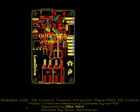
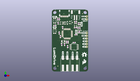
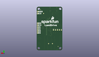
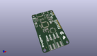

Contents
========

* [PROJ-SPAR-14779-STAN-01>LumiDrive](#proj-spar-14779-stan-01lumidrive)
	* [Images](#images)
	* [Interactive BOM](#interactive-bom)
	* [OOMP Parts](#oomp-parts)
	* [Tags](#tags)
  
![][im]
# PROJ-SPAR-14779-STAN-01>LumiDrive

- ID: PROJ-SPAR-14779-STAN-01
- Hex ID: PRS14779
- Name: LumiDrive
- Description: 

## Images
  
  

|eagleImage|kicadPcb3dFront|kicadPcb3dBack|kicadPcb3d|
| :---: | :---: | :---: | :---: |
|||||

## Interactive BOM

- Interactive BOM page: [ibom.html](kicad/bom/ibom.html)

## OOMP Parts
  

|OOMP Parts|
| :---: |
|CAPC-0603-X-UNMATCHED-01, C1, 21.59, 45.846999999999994, 0,C1, 4.7uF, 0603, SparkFun-Capacitors, (0.85, 1.805), R0|
|<table><tr><td></td><td> C2</td><td>[CAPC-0603-X-NF100-V50 SMD (0603) 100 nF Capacitor (Ceramic) 50v](https://github.com/oomlout/oomlout_OOMP_parts/tree/main/CAPC-0603-X-NF100-V50/)</td><td>[C6N100](https://github.com/oomlout/oomlout_OOMP_parts/tree/main/CAPC-0603-X-NF100-V50/)</td></tr></table>|
|CAPC-0603-X-UNMATCHED-01, C3, 21.462999999999997, 40.259, 0,C3, 4.7uF, 0603, SparkFun-Capacitors, (0.845, 1.585), R0|
|<table><tr><td></td><td> C4</td><td>[CAPC-0603-X-NF100-V50 SMD (0603) 100 nF Capacitor (Ceramic) 50v](https://github.com/oomlout/oomlout_OOMP_parts/tree/main/CAPC-0603-X-NF100-V50/)</td><td>[C6N100](https://github.com/oomlout/oomlout_OOMP_parts/tree/main/CAPC-0603-X-NF100-V50/)</td></tr></table>|
|<table><tr><td></td><td> C5</td><td>[CAPC-0603-X-NF100-V50 SMD (0603) 100 nF Capacitor (Ceramic) 50v](https://github.com/oomlout/oomlout_OOMP_parts/tree/main/CAPC-0603-X-NF100-V50/)</td><td>[C6N100](https://github.com/oomlout/oomlout_OOMP_parts/tree/main/CAPC-0603-X-NF100-V50/)</td></tr></table>|
|CAPC-0805-X-UNMATCHED-01, C8, 11.937999999999999, 44.577, 90,C8, 1.0uF, 0805, SparkFun-Capacitors, (0.47, 1.755), R90|
|CAPC-0603-X-UF22D-01, C9, 5.715, 44.577, 90,C9, 2.2uF, 0603, SparkFun-Capacitors, (0.225, 1.755), R90|
|<table><tr><td></td><td> C10</td><td>[CAPC-0603-X-NF100-V50 SMD (0603) 100 nF Capacitor (Ceramic) 50v](https://github.com/oomlout/oomlout_OOMP_parts/tree/main/CAPC-0603-X-NF100-V50/)</td><td>[C6N100](https://github.com/oomlout/oomlout_OOMP_parts/tree/main/CAPC-0603-X-NF100-V50/)</td></tr></table>|
|<table><tr><td></td><td> C12</td><td>[CAPC-0603-X-NF100-V50 SMD (0603) 100 nF Capacitor (Ceramic) 50v](https://github.com/oomlout/oomlout_OOMP_parts/tree/main/CAPC-0603-X-NF100-V50/)</td><td>[C6N100](https://github.com/oomlout/oomlout_OOMP_parts/tree/main/CAPC-0603-X-NF100-V50/)</td></tr></table>|
|<table><tr><td></td><td> C14</td><td>[CAPC-0603-X-NF100-V50 SMD (0603) 100 nF Capacitor (Ceramic) 50v](https://github.com/oomlout/oomlout_OOMP_parts/tree/main/CAPC-0603-X-NF100-V50/)</td><td>[C6N100](https://github.com/oomlout/oomlout_OOMP_parts/tree/main/CAPC-0603-X-NF100-V50/)</td></tr></table>|
|CAPC-0603-X-UNMATCHED-01, C15, 9.017, 24.892, 90,C15, 15pF, 0603, SparkFun-Capacitors, (0.355, 0.98), R90|
|CAPC-0603-X-UNMATCHED-01, C16, 11.557, 24.892, 90,C16, 15pF, 0603, SparkFun-Capacitors, (0.455, 0.98), R90|
|UNMATCHED-UNMATCHED-X-UNMATCHED-01, D1, 14.097000000000001, 44.830999999999996, 90,D1, 1A/23V/620mV, SOD-323, SparkFun-DiscreteSemi, (0.555, 1.765), R90|
|UNMATCHED-0603-X-UNMATCHED-01, D2, 25.654, 43.942, 270,D2, Yellow, LED-0603, SparkFun-LED, (1.01, 1.73), R270|
|UNMATCHED-UNMATCHED-X-UNMATCHED-01, D3, 26.416, 36.703, 90,D3, 1A/23V/620mV, SOD-323, SparkFun-DiscreteSemi, (1.04, 1.445), R90|
|UNMATCHED-0603-X-UNMATCHED-01, D9, 23.495, 36.449, 270,D9, BLUE, LED-0603, SparkFun-LED, (0.925, 1.435), R270|
|UNMATCHED-0603-X-UNMATCHED-01, FB1, 13.97, 26.288999999999998, 0,FB1, 30?/1.8A, 0603, SparkFun-Coils, (0.55, 1.035), R0|
|UNMATCHED-UNMATCHED-X-UNMATCHED-01, J1, 31.75, 50.673, 270,J1, 1X02_NO_SILK, SparkFun-Connectors, (1.25, 1.995), R270|
|UNMATCHED-UNMATCHED-X-UNMATCHED-01, J3, 12.065, 7.238999999999999, 90,J3, 1X02_POKEHOME, SparkFun-Connectors, (0.475, 0.285), R90|
|UNMATCHED-UNMATCHED-X-UNMATCHED-01, J4, 20.955, 7.238999999999999, 90,J4, 1X02_POKEHOME, SparkFun-Connectors, (0.825, 0.285), R90|
|UNMATCHED-UNMATCHED-X-UNMATCHED-01, J5, 31.75, 22.733, 90,J5, 1X06_NO_SILK, SparkFun-Connectors, (1.25, 0.895), R90|
|UNMATCHED-UNMATCHED-X-UNMATCHED-01, J6, 21.59, 53.213, 0,J6, JST-2-SMD, SparkFun-Connectors, (0.85, 2.095), R0|
|UNMATCHED-UNMATCHED-X-UNMATCHED-01, J8, 11.43, 50.673, 180,J8, USB-C-16P, SparkFun-Connectors, (0.45, 1.995), R180|
|UNMATCHED-UNMATCHED-X-UNMATCHED-01, Q1, 17.399, 45.084999999999994, 270,Q1, 2.5A/30V/105m?, SOT23-3, SparkFun-DiscreteSemi, (0.685, 1.775), R270|
|RESE-0603-X-UNMATCHED-01, R1, 24.892, 36.449, 270,R1, 1k, 0603, SparkFun-Resistors, (0.98, 1.435), R270|
|RESE-0603-X-UNMATCHED-01, R2, 24.256999999999998, 43.942, 270,R2, 1k, 0603, SparkFun-Resistors, (0.955, 1.73), R270|
|RESE-0603-X-UNMATCHED-01, R3, 23.875999999999998, 40.004999999999995, 90,R3, 2.0k, 0603, SparkFun-Resistors, (0.94, 1.575), R90|
|<table><tr><td></td><td> R4</td><td>[RESE-0603-X-O103-01 SMD (0603) 10k Ohm Resistor](https://github.com/oomlout/oomlout_OOMP_parts/tree/main/RESE-0603-X-O103-01/)</td><td>[R6103](https://github.com/oomlout/oomlout_OOMP_parts/tree/main/RESE-0603-X-O103-01/)</td></tr></table>|
|<table><tr><td></td><td> R5</td><td>[RESE-0603-X-O103-01 SMD (0603) 10k Ohm Resistor](https://github.com/oomlout/oomlout_OOMP_parts/tree/main/RESE-0603-X-O103-01/)</td><td>[R6103](https://github.com/oomlout/oomlout_OOMP_parts/tree/main/RESE-0603-X-O103-01/)</td></tr></table>|
|RESE-0603-X-UNMATCHED-01, R6, 6.731, 48.26, 270,R6, 5.1k, 0603, SparkFun-Resistors, (0.265, 1.9), R270|
|RESE-0603-X-UNMATCHED-01, R7, 5.206999999999999, 48.26, 270,R7, 5.1k, 0603, SparkFun-Resistors, (0.205, 1.9), R270|
|<table><tr><td></td><td> R10</td><td>[RESE-0603-X-O103-01 SMD (0603) 10k Ohm Resistor](https://github.com/oomlout/oomlout_OOMP_parts/tree/main/RESE-0603-X-O103-01/)</td><td>[R6103](https://github.com/oomlout/oomlout_OOMP_parts/tree/main/RESE-0603-X-O103-01/)</td></tr></table>|
|UNMATCHED-UNMATCHED-X-UNMATCHED-01, S1, 2.54, 46.736, 270,S1, RESET, TACTILE_SWITCH_SMD_4.6X2.8MM, SparkFun-Switches, (0.1, 1.84), R270|
|UNMATCHED-UNMATCHED-X-UNMATCHED-01, S2, 2.54, 37.211, 270,S2, BTN2, TACTILE_SWITCH_SMD_4.6X2.8MM, SparkFun-Switches, (0.1, 1.465), R270|
|UNMATCHED-UNMATCHED-X-UNMATCHED-01, U1, 21.59, 43.053, 180,U1, MCP73831, SOT23-5, SparkFun-IC-Power, (0.85, 1.695), R180|
|UNMATCHED-UNMATCHED-X-UNMATCHED-01, U2, 13.97, 34.671, 90,U2, ATSAMD21G-A, TQFP-48, SparkFun-IC-Microcontroller, (0.55, 1.365), R90|
|UNMATCHED-UNMATCHED-X-UNMATCHED-01, U3, 8.889999999999999, 44.577, 90,U3, 3.3V, SOT23-5, SparkFun-IC-Power, (0.35, 1.755), R90|
|UNMATCHED-UNMATCHED-X-UNMATCHED-01, U4, 20.32, 22.605999999999998, 270,U4, W25Q32FV, SOIC-8, SparkFun-IC-Memory, (0.8, 0.89), R270|
|UNMATCHED-UNMATCHED-X-UNMATCHED-01, Y1, 10.287, 27.813, 180,Y1, 32.768kHz, CRYSTAL-SMD-3.2X1.5MM, SparkFun-Clocks, (0.405, 1.095), R180|

## Tags

- hexID: PRS14779
- oompType: PROJ
- oompSize: SPAR
- oompColor: 14779
- oompDesc: STAN
- oompIndex: 01
- oompName: LumiDrive
- sources: All source files from https://github.com/sparkfun/LumiDrive (source licence details in srcLicense.md)
- linkBuyPage: https://www.sparkfun.com/products/14779
- oompPart: CAPC-0603-X-UNMATCHED-01, C1, 21.59, 45.846999999999994, 0
- oompPart: CAPC-0603-X-NF100-V50, C2, 13.97, 27.813, 180
- oompPart: CAPC-0603-X-UNMATCHED-01, C3, 21.462999999999997, 40.259, 0
- oompPart: CAPC-0603-X-NF100-V50, C4, 7.746999999999999, 32.13099999999999, 270
- oompPart: CAPC-0603-X-NF100-V50, C5, 6.731, 35.433, 90
- oompPart: CAPC-0805-X-UNMATCHED-01, C8, 11.937999999999999, 44.577, 90
- oompPart: CAPC-0603-X-UF22D-01, C9, 5.715, 44.577, 90
- oompPart: CAPC-0603-X-NF100-V50, C10, 9.906, 40.259, 90
- oompPart: CAPC-0603-X-NF100-V50, C12, 21.971, 33.782, 0
- oompPart: CAPC-0603-X-NF100-V50, C14, 20.32, 26.669999999999998, 180
- oompPart: CAPC-0603-X-UNMATCHED-01, C15, 9.017, 24.892, 90
- oompPart: CAPC-0603-X-UNMATCHED-01, C16, 11.557, 24.892, 90
- oompPart: UNMATCHED-UNMATCHED-X-UNMATCHED-01, D1, 14.097000000000001, 44.830999999999996, 90
- oompPart: UNMATCHED-0603-X-UNMATCHED-01, D2, 25.654, 43.942, 270
- oompPart: UNMATCHED-UNMATCHED-X-UNMATCHED-01, D3, 26.416, 36.703, 90
- oompPart: UNMATCHED-0603-X-UNMATCHED-01, D9, 23.495, 36.449, 270
- oompPart: UNMATCHED-0603-X-UNMATCHED-01, FB1, 13.97, 26.288999999999998, 0
- oompPart: SKIP-UNMATCHED-X-UNMATCHED-01, FD1, 27.94, 53.213, 0
- oompPart: SKIP-UNMATCHED-X-UNMATCHED-01, FD2, 5.460999999999999, 4.953, 0
- oompPart: SKIP-UNMATCHED-X-UNMATCHED-01, FD3, 27.94, 53.213, M0
- oompPart: SKIP-UNMATCHED-X-UNMATCHED-01, FD4, 5.460999999999999, 4.953, M0
- oompPart: UNMATCHED-UNMATCHED-X-UNMATCHED-01, J1, 31.75, 50.673, 270
- oompPart: UNMATCHED-UNMATCHED-X-UNMATCHED-01, J3, 12.065, 7.238999999999999, 90
- oompPart: UNMATCHED-UNMATCHED-X-UNMATCHED-01, J4, 20.955, 7.238999999999999, 90
- oompPart: UNMATCHED-UNMATCHED-X-UNMATCHED-01, J5, 31.75, 22.733, 90
- oompPart: UNMATCHED-UNMATCHED-X-UNMATCHED-01, J6, 21.59, 53.213, 0
- oompPart: UNMATCHED-UNMATCHED-X-UNMATCHED-01, J8, 11.43, 50.673, 180
- oompPart: UNMATCHED-UNMATCHED-X-UNMATCHED-01, Q1, 17.399, 45.084999999999994, 270
- oompPart: RESE-0603-X-UNMATCHED-01, R1, 24.892, 36.449, 270
- oompPart: RESE-0603-X-UNMATCHED-01, R2, 24.256999999999998, 43.942, 270
- oompPart: RESE-0603-X-UNMATCHED-01, R3, 23.875999999999998, 40.004999999999995, 90
- oompPart: RESE-0603-X-O103-01, R4, 25.526999999999997, 40.132, 90
- oompPart: RESE-0603-X-O103-01, R5, 14.350999999999997, 22.86, 270
- oompPart: RESE-0603-X-UNMATCHED-01, R6, 6.731, 48.26, 270
- oompPart: RESE-0603-X-UNMATCHED-01, R7, 5.206999999999999, 48.26, 270
- oompPart: RESE-0603-X-O103-01, R10, 2.667, 42.418, 0
- oompPart: UNMATCHED-UNMATCHED-X-UNMATCHED-01, S1, 2.54, 46.736, 270
- oompPart: UNMATCHED-UNMATCHED-X-UNMATCHED-01, S2, 2.54, 37.211, 270
- oompPart: SKIP-UNMATCHED-X-UNMATCHED-01, TP1, 6.35, 26.542999999999996, M0
- oompPart: SKIP-UNMATCHED-X-UNMATCHED-01, TP2, 8.889999999999999, 26.542999999999996, M0
- oompPart: SKIP-UNMATCHED-X-UNMATCHED-01, TP3, 11.43, 26.542999999999996, M0
- oompPart: SKIP-UNMATCHED-X-UNMATCHED-01, TP4, 1.27, 26.542999999999996, M0
- oompPart: SKIP-UNMATCHED-X-UNMATCHED-01, TP5, 3.8099999999999996, 26.542999999999996, M0
- oompPart: SKIP-UNMATCHED-X-UNMATCHED-01, TP6, 24.13, 48.132999999999996, M0
- oompPart: SKIP-UNMATCHED-X-UNMATCHED-01, TP7, 12.7, 8.762999999999998, M0
- oompPart: SKIP-UNMATCHED-X-UNMATCHED-01, TP8, 17.779999999999998, 8.762999999999998, M0
- oompPart: UNMATCHED-UNMATCHED-X-UNMATCHED-01, U1, 21.59, 43.053, 180
- oompPart: UNMATCHED-UNMATCHED-X-UNMATCHED-01, U2, 13.97, 34.671, 90
- oompPart: UNMATCHED-UNMATCHED-X-UNMATCHED-01, U3, 8.889999999999999, 44.577, 90
- oompPart: UNMATCHED-UNMATCHED-X-UNMATCHED-01, U4, 20.32, 22.605999999999998, 270
- oompPart: UNMATCHED-UNMATCHED-X-UNMATCHED-01, Y1, 10.287, 27.813, 180
- rawPart: C1, 4.7uF, 0603, SparkFun-Capacitors, (0.85, 1.805), R0
- rawPart: C2, 0.1uF, 0603, SparkFun-Capacitors, (0.55, 1.095), R180
- rawPart: C3, 4.7uF, 0603, SparkFun-Capacitors, (0.845, 1.585), R0
- rawPart: C4, 0.1uF, 0603, SparkFun-Capacitors, (0.305, 1.265), R270
- rawPart: C5, 0.1uF, 0603, SparkFun-Capacitors, (0.265, 1.395), R90
- rawPart: C8, 1.0uF, 0805, SparkFun-Capacitors, (0.47, 1.755), R90
- rawPart: C9, 2.2uF, 0603, SparkFun-Capacitors, (0.225, 1.755), R90
- rawPart: C10, 0.1uF, 0603, SparkFun-Capacitors, (0.39, 1.585), R90
- rawPart: C12, 0.1uF, 0603, SparkFun-Capacitors, (0.865, 1.33), R0
- rawPart: C14, 0.1uF, 0603, SparkFun-Capacitors, (0.8, 1.05), R180
- rawPart: C15, 15pF, 0603, SparkFun-Capacitors, (0.355, 0.98), R90
- rawPart: C16, 15pF, 0603, SparkFun-Capacitors, (0.455, 0.98), R90
- rawPart: D1, 1A/23V/620mV, SOD-323, SparkFun-DiscreteSemi, (0.555, 1.765), R90
- rawPart: D2, Yellow, LED-0603, SparkFun-LED, (1.01, 1.73), R270
- rawPart: D3, 1A/23V/620mV, SOD-323, SparkFun-DiscreteSemi, (1.04, 1.445), R90
- rawPart: D9, BLUE, LED-0603, SparkFun-LED, (0.925, 1.435), R270
- rawPart: FB1, 30?/1.8A, 0603, SparkFun-Coils, (0.55, 1.035), R0
- rawPart: FD1, FIDUCIALUFIDUCIAL, FIDUCIAL-MICRO, SparkFun-Aesthetics, (1.1, 2.095), R0
- rawPart: FD2, FIDUCIALUFIDUCIAL, FIDUCIAL-MICRO, SparkFun-Aesthetics, (0.215, 0.195), R0
- rawPart: FD3, FIDUCIALUFIDUCIAL, FIDUCIAL-MICRO, SparkFun-Aesthetics, (1.1, 2.095), MR0
- rawPart: FD4, FIDUCIALUFIDUCIAL, FIDUCIAL-MICRO, SparkFun-Aesthetics, (0.215, 0.195), MR0
- rawPart: J1, 1X02_NO_SILK, SparkFun-Connectors, (1.25, 1.995), R270
- rawPart: J3, 1X02_POKEHOME, SparkFun-Connectors, (0.475, 0.285), R90
- rawPart: J4, 1X02_POKEHOME, SparkFun-Connectors, (0.825, 0.285), R90
- rawPart: J5, 1X06_NO_SILK, SparkFun-Connectors, (1.25, 0.895), R90
- rawPart: J6, JST-2-SMD, SparkFun-Connectors, (0.85, 2.095), R0
- rawPart: J8, USB-C-16P, SparkFun-Connectors, (0.45, 1.995), R180
- rawPart: Q1, 2.5A/30V/105m?, SOT23-3, SparkFun-DiscreteSemi, (0.685, 1.775), R270
- rawPart: R1, 1k, 0603, SparkFun-Resistors, (0.98, 1.435), R270
- rawPart: R2, 1k, 0603, SparkFun-Resistors, (0.955, 1.73), R270
- rawPart: R3, 2.0k, 0603, SparkFun-Resistors, (0.94, 1.575), R90
- rawPart: R4, 10k, 0603, SparkFun-Resistors, (1.005, 1.58), R90
- rawPart: R5, 10k, 0603, SparkFun-Resistors, (0.565, 0.9), R270
- rawPart: R6, 5.1k, 0603, SparkFun-Resistors, (0.265, 1.9), R270
- rawPart: R7, 5.1k, 0603, SparkFun-Resistors, (0.205, 1.9), R270
- rawPart: R10, 10k, 0603, SparkFun-Resistors, (0.105, 1.67), R0
- rawPart: S1, RESET, TACTILE_SWITCH_SMD_4.6X2.8MM, SparkFun-Switches, (0.1, 1.84), R270
- rawPart: S2, BTN2, TACTILE_SWITCH_SMD_4.6X2.8MM, SparkFun-Switches, (0.1, 1.465), R270
- rawPart: TP1, TP-SWDIO, PAD.03X.05, SparkFun-Connectors, (0.25, 1.045), MR0
- rawPart: TP2, TP-SWCLK, PAD.03X.05, SparkFun-Connectors, (0.35, 1.045), MR0
- rawPart: TP3, TP-!RESET!, PAD.03X.05, SparkFun-Connectors, (0.45, 1.045), MR0
- rawPart: TP4, TP-3.3V, PAD.03X.05, SparkFun-Connectors, (0.05, 1.045), MR0
- rawPart: TP5, TP-GND, PAD.03X.05, SparkFun-Connectors, (0.15, 1.045), MR0
- rawPart: TP6, TEST-POINT3X4, PAD.03X.04, SparkFun-Connectors, (0.95, 1.895), MR0
- rawPart: TP7, TEST-POINT3X4, PAD.03X.04, SparkFun-Connectors, (0.5, 0.345), MR0
- rawPart: TP8, TEST-POINT3X4, PAD.03X.04, SparkFun-Connectors, (0.7, 0.345), MR0
- rawPart: U1, MCP73831, SOT23-5, SparkFun-IC-Power, (0.85, 1.695), R180
- rawPart: U2, ATSAMD21G-A, TQFP-48, SparkFun-IC-Microcontroller, (0.55, 1.365), R90
- rawPart: U3, 3.3V, SOT23-5, SparkFun-IC-Power, (0.35, 1.755), R90
- rawPart: U4, W25Q32FV, SOIC-8, SparkFun-IC-Memory, (0.8, 0.89), R270
- rawPart: Y1, 32.768kHz, CRYSTAL-SMD-3.2X1.5MM, SparkFun-Clocks, (0.405, 1.095), R180
- oompID: PROJ-SPAR-14779-STAN-01

[im]: kicadPcb3d_450.png
