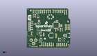
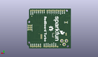
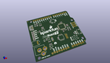

Contents
========

* [PROJ-SPAR-14812-STAN-01>RedBoard Turbo](#proj-spar-14812-stan-01redboard-turbo)
	* [Images](#images)
	* [Interactive BOM](#interactive-bom)
	* [OOMP Parts](#oomp-parts)
	* [Tags](#tags)
  
![][im]
# PROJ-SPAR-14812-STAN-01>RedBoard Turbo

- ID: PROJ-SPAR-14812-STAN-01
- Hex ID: PRS14812
- Name: RedBoard Turbo
- Description: 

## Images
  
  

|kicadPcb3dFront|kicadPcb3dBack|kicadPcb3d|
| :---: | :---: | :---: |
||||

## Interactive BOM

- Interactive BOM page: [ibom.html](kicad/bom/ibom.html)

## OOMP Parts
  

|OOMP Parts|
| :---: |
|CAPC-UNMATCHED-X-UF22D-01, C1, 11.43, 43.18, 270,C1, 2.2UF, 1206@1, SparkFun-Capacitors, (0.45, 1.7), R270|
|CAPC-0603-X-UNMATCHED-01, C2, 16.509999999999998, 19.685, 270,C2, 4.7uF, 0603-CAP, SparkFun-Capacitors, (0.65, 0.775), R270|
|CAPC-0805-X-UNMATCHED-01, C3, 18.160999999999998, 7.492999999999999, 0,C3, 1.0uF, 0805, SparkFun-Capacitors, (0.715, 0.295), R0|
|CAPC-0603-X-UNMATCHED-01, C4, 19.049999999999997, 16.002, 0,C4, 4.7uF, 0603-CAP, SparkFun-Capacitors, (0.75, 0.63), R0|
|CAPC-0603-X-UF22D-01, C5, 19.049999999999997, 12.7, 180,C5, 2.2uF, 0603-CAP, SparkFun-Capacitors, (0.75, 0.5), R180|
|<table><tr><td></td><td> C6</td><td>[CAPC-0603-X-NF100-V50 SMD (0603) 100 nF Capacitor (Ceramic) 50v](https://github.com/oomlout/oomlout_OOMP_parts/tree/main/CAPC-0603-X-NF100-V50/)</td><td>[C6N100](https://github.com/oomlout/oomlout_OOMP_parts/tree/main/CAPC-0603-X-NF100-V50/)</td></tr></table>|
|CAPC-0603-X-UNMATCHED-01, C7, 47.625, 23.368, 270,C7, 15pF, 0603-CAP, SparkFun-Capacitors, (1.875, 0.92), R270|
|<table><tr><td></td><td> C8</td><td>[CAPC-0603-X-NF100-V50 SMD (0603) 100 nF Capacitor (Ceramic) 50v](https://github.com/oomlout/oomlout_OOMP_parts/tree/main/CAPC-0603-X-NF100-V50/)</td><td>[C6N100](https://github.com/oomlout/oomlout_OOMP_parts/tree/main/CAPC-0603-X-NF100-V50/)</td></tr></table>|
|CAPC-0603-X-UNMATCHED-01, C9, 45.084999999999994, 23.368, 90,C9, 15pF, 0603-CAP, SparkFun-Capacitors, (1.775, 0.92), R90|
|<table><tr><td></td><td> C10</td><td>[CAPC-0603-X-NF100-V50 SMD (0603) 100 nF Capacitor (Ceramic) 50v](https://github.com/oomlout/oomlout_OOMP_parts/tree/main/CAPC-0603-X-NF100-V50/)</td><td>[C6N100](https://github.com/oomlout/oomlout_OOMP_parts/tree/main/CAPC-0603-X-NF100-V50/)</td></tr></table>|
|<table><tr><td></td><td> C11</td><td>[CAPC-0603-X-NF100-V50 SMD (0603) 100 nF Capacitor (Ceramic) 50v](https://github.com/oomlout/oomlout_OOMP_parts/tree/main/CAPC-0603-X-NF100-V50/)</td><td>[C6N100](https://github.com/oomlout/oomlout_OOMP_parts/tree/main/CAPC-0603-X-NF100-V50/)</td></tr></table>|
|<table><tr><td></td><td> C12</td><td>[CAPC-0603-X-NF100-V50 SMD (0603) 100 nF Capacitor (Ceramic) 50v](https://github.com/oomlout/oomlout_OOMP_parts/tree/main/CAPC-0603-X-NF100-V50/)</td><td>[C6N100](https://github.com/oomlout/oomlout_OOMP_parts/tree/main/CAPC-0603-X-NF100-V50/)</td></tr></table>|
|<table><tr><td></td><td> C13</td><td>[CAPC-0603-X-NF100-V50 SMD (0603) 100 nF Capacitor (Ceramic) 50v](https://github.com/oomlout/oomlout_OOMP_parts/tree/main/CAPC-0603-X-NF100-V50/)</td><td>[C6N100](https://github.com/oomlout/oomlout_OOMP_parts/tree/main/CAPC-0603-X-NF100-V50/)</td></tr></table>|
|<table><tr><td></td><td> C14</td><td>[CAPC-0603-X-NF100-V50 SMD (0603) 100 nF Capacitor (Ceramic) 50v](https://github.com/oomlout/oomlout_OOMP_parts/tree/main/CAPC-0603-X-NF100-V50/)</td><td>[C6N100](https://github.com/oomlout/oomlout_OOMP_parts/tree/main/CAPC-0603-X-NF100-V50/)</td></tr></table>|
|UNMATCHED-UNMATCHED-X-UNMATCHED-01, D1, 13.97, 19.049999999999997, 90,D1, BAT20J, SOD-323, SparkFun-DiscreteSemi, (0.55, 0.75), R90|
|UNMATCHED-0603-X-UNMATCHED-01, D2, 3.8099999999999996, 24.764999999999997, 0,D2, Yellow, LED-0603, SparkFun-LED, (0.15, 0.975), R0|
|UNMATCHED-0603-X-UNMATCHED-01, D3, 3.8099999999999996, 34.925, 0,D3, RED, LED-0603, SparkFun-LED, (0.15, 1.375), R0|
|UNMATCHED-0603-X-UNMATCHED-01, D4, 3.8099999999999996, 32.385, 0,D4, BLUE, LED-0603, SparkFun-LED, (0.15, 1.275), R0|
|UNMATCHED-0603-X-UNMATCHED-01, D5, 3.8099999999999996, 29.845, 0,D5, GREEN, LED-0603, SparkFun-LED, (0.15, 1.175), R0|
|UNMATCHED-0603-X-UNMATCHED-01, D6, 3.8099999999999996, 27.304999999999996, 0,D6, Yellow, LED-0603, SparkFun-LED, (0.15, 1.075), R0|
|UNMATCHED-UNMATCHED-X-UNMATCHED-01, D7, 31.75, 41.91, 90,D7, WS2812B, WS2812B, SparkFun-LED, (1.25, 1.65), R90|
|UNMATCHED-UNMATCHED-X-UNMATCHED-01, F1, 8.889999999999999, 43.18, 90,F1, 500mA, PTC-1206, SparkFun-PowerIC, (0.35, 1.7), R90|
|UNMATCHED-UNMATCHED-X-UNMATCHED-01, J1, 6.35, 19.049999999999997, 90,J1, JST-2-PTH, SparkFun-Connectors, (0.25, 0.75), R90|
|UNMATCHED-UNMATCHED-X-UNMATCHED-01, J2, 53.339999999999996, 16.509999999999998, 90,J2, 1X04_1MM_RA, SparkFun-Connectors, (2.1, 0.65), R90|
|UNMATCHED-UNMATCHED-X-UNMATCHED-01, J3, 5.08, 40.64, 270,J3, USB-MICROB-PTH-MILL, SparkFun-Connectors, (0.2, 1.6), R270|
|UNMATCHED-UNMATCHED-X-UNMATCHED-01, JP3, -1.651, 10.16, 270,JP3, POWER_JACKPTH, POWER_JACK_PTH, SparkFun-Connectors, (-0.065, 0.4), R270|
|UNMATCHED-UNMATCHED-X-UNMATCHED-01, JP6, 39.37, 15.875, 270,JP6, CORTEX_DEBUGPTH, 2X5-PTH-1.27MM, samd21-temp, (1.55, 0.625), R270|
|UNMATCHED-UNMATCHED-X-UNMATCHED-01, JP7, -10.16, 0.0, 0,JP7, ARDUINO_UNO_R3LOCK_HOLES, ARDUINO_R3_LOCK_HOLES, SparkFun-Boards, (-0.4, 0), R0|
|ERROR, L1 FB -, 0, 0, 0,L1, FB, -, 30Ohm, 0603, SparkFun-Passives, (1.855, 1.175), R90|
|UNMATCHED-UNMATCHED-X-UNMATCHED-01, Q1, 15.239999999999998, 43.18, 0,Q1, 2.5A/30V, SOT23-3, SparkFun-DiscreteSemi, (0.6, 1.7), R0|
|UNMATCHED-UNMATCHED-X-UNMATCHED-01, Q2, 9.652, 32.257999999999996, 90,Q2, 2N7002PW, SOT323, SparkFun-DiscreteSemi, (0.38, 1.27), R90|
|RESE-0603-X-UNMATCHED-01, R1, 22.86, 17.779999999999998, 90,R1, 3.9K, 0603, SparkFun-Resistors, (0.9, 0.7), R90|
|<table><tr><td></td><td> R2</td><td>[RESE-0603-X-O331-01 SMD (0603) 330 Ohm Resistor](https://github.com/oomlout/oomlout_OOMP_parts/tree/main/RESE-0603-X-O331-01/)</td><td>[R6331](https://github.com/oomlout/oomlout_OOMP_parts/tree/main/RESE-0603-X-O331-01/)</td></tr></table>|
|RESE-UNMATCHED-X-UNMATCHED-01, R3, 22.86, 17.779999999999998, 90,R3, PROG, 1/6W-RES, SparkFun-Passives, (0.9, 0.7), R90|
|<table><tr><td></td><td> R4</td><td>[RESE-0603-X-O104-01 SMD (0603) 100k Ohm Resistor](https://github.com/oomlout/oomlout_OOMP_parts/tree/main/RESE-0603-X-O104-01/)</td><td>[R6104](https://github.com/oomlout/oomlout_OOMP_parts/tree/main/RESE-0603-X-O104-01/)</td></tr></table>|
|<table><tr><td></td><td> R5</td><td>[RESE-0603-X-O473-01 SMD (0603) 47k Ohm Resistor](https://github.com/oomlout/oomlout_OOMP_parts/tree/main/RESE-0603-X-O473-01/)</td><td>[R6473](https://github.com/oomlout/oomlout_OOMP_parts/tree/main/RESE-0603-X-O473-01/)</td></tr></table>|
|<table><tr><td></td><td> R6</td><td>[RESE-0603-X-O331-01 SMD (0603) 330 Ohm Resistor](https://github.com/oomlout/oomlout_OOMP_parts/tree/main/RESE-0603-X-O331-01/)</td><td>[R6331](https://github.com/oomlout/oomlout_OOMP_parts/tree/main/RESE-0603-X-O331-01/)</td></tr></table>|
|<table><tr><td></td><td> R7</td><td>[RESE-0603-X-O331-01 SMD (0603) 330 Ohm Resistor](https://github.com/oomlout/oomlout_OOMP_parts/tree/main/RESE-0603-X-O331-01/)</td><td>[R6331](https://github.com/oomlout/oomlout_OOMP_parts/tree/main/RESE-0603-X-O331-01/)</td></tr></table>|
|<table><tr><td></td><td> R8</td><td>[RESE-0603-X-O331-01 SMD (0603) 330 Ohm Resistor](https://github.com/oomlout/oomlout_OOMP_parts/tree/main/RESE-0603-X-O331-01/)</td><td>[R6331](https://github.com/oomlout/oomlout_OOMP_parts/tree/main/RESE-0603-X-O331-01/)</td></tr></table>|
|<table><tr><td></td><td> R9</td><td>[RESE-0603-X-O331-01 SMD (0603) 330 Ohm Resistor](https://github.com/oomlout/oomlout_OOMP_parts/tree/main/RESE-0603-X-O331-01/)</td><td>[R6331](https://github.com/oomlout/oomlout_OOMP_parts/tree/main/RESE-0603-X-O331-01/)</td></tr></table>|
|<table><tr><td></td><td> R10</td><td>[RESE-0603-X-O331-01 SMD (0603) 330 Ohm Resistor](https://github.com/oomlout/oomlout_OOMP_parts/tree/main/RESE-0603-X-O331-01/)</td><td>[R6331](https://github.com/oomlout/oomlout_OOMP_parts/tree/main/RESE-0603-X-O331-01/)</td></tr></table>|
|<table><tr><td></td><td> R11</td><td>[RESE-0603-X-O103-01 SMD (0603) 10k Ohm Resistor](https://github.com/oomlout/oomlout_OOMP_parts/tree/main/RESE-0603-X-O103-01/)</td><td>[R6103](https://github.com/oomlout/oomlout_OOMP_parts/tree/main/RESE-0603-X-O103-01/)</td></tr></table>|
|<table><tr><td></td><td> R12</td><td>[RESE-0603-X-O104-01 SMD (0603) 100k Ohm Resistor](https://github.com/oomlout/oomlout_OOMP_parts/tree/main/RESE-0603-X-O104-01/)</td><td>[R6104](https://github.com/oomlout/oomlout_OOMP_parts/tree/main/RESE-0603-X-O104-01/)</td></tr></table>|
|UNMATCHED-UNMATCHED-X-UNMATCHED-01, S1, 47.879, 10.795, 0,S1, TACTILE_SWITCH_SMD_5.2MM, SparkFun-Switches, (1.885, 0.425), R0|
|UNMATCHED-UNMATCHED-X-UNMATCHED-01, U1, 19.049999999999997, 19.685, 180,U1, MCP73831, SOT23-5, SparkFun-PowerIC, (0.75, 0.775), R180|
|UNMATCHED-UNMATCHED-X-UNMATCHED-01, U2, 16.509999999999998, 33.019999999999996, 270,U2, 74AHC1G125, SOT23-5, SparkFun-DigitalIC, (0.65, 1.3), R270|
|UNMATCHED-UNMATCHED-X-UNMATCHED-01, U3, 19.049999999999997, 10.16, 270,U3, 3.3V, SOT23-5, SparkFun-PowerIC, (0.75, 0.4), R270|
|UNMATCHED-UNMATCHED-X-UNMATCHED-01, U4, 39.37, 30.479999999999997, 180,U4, ATSAMD21G-A, TQFP-48, samd21-temp, (1.55, 1.2), R180|
|UNMATCHED-UNMATCHED-X-UNMATCHED-01, U5, 33.019999999999996, 16.509999999999998, 0,U5, W25Q32FV, SOIC-8, SparkFun-IC-Memory, (1.3, 0.65), R0|
|UNMATCHED-UNMATCHED-X-UNMATCHED-01, Y1, 46.355, 26.034999999999997, 180,Y1, 32.768kHz, CRYSTAL-SMD-3.2X1.5MM, samd21-temp, (1.825, 1.025), R180|

## Tags

- hexID: PRS14812
- oompType: PROJ
- oompSize: SPAR
- oompColor: 14812
- oompDesc: STAN
- oompIndex: 01
- oompName: RedBoard Turbo
- sources: All source files from https://github.com/sparkfun/RedBoard_Turbo (source licence details in srcLicense.md)
- linkBuyPage: https://www.sparkfun.com/products/14812
- oompPart: CAPC-UNMATCHED-X-UF22D-01, C1, 11.43, 43.18, 270
- oompPart: CAPC-0603-X-UNMATCHED-01, C2, 16.509999999999998, 19.685, 270
- oompPart: CAPC-0805-X-UNMATCHED-01, C3, 18.160999999999998, 7.492999999999999, 0
- oompPart: CAPC-0603-X-UNMATCHED-01, C4, 19.049999999999997, 16.002, 0
- oompPart: CAPC-0603-X-UF22D-01, C5, 19.049999999999997, 12.7, 180
- oompPart: CAPC-0603-X-NF100-V50, C6, 45.846999999999994, 29.845, 270
- oompPart: CAPC-0603-X-UNMATCHED-01, C7, 47.625, 23.368, 270
- oompPart: CAPC-0603-X-NF100-V50, C8, 41.91, 24.13, 0
- oompPart: CAPC-0603-X-UNMATCHED-01, C9, 45.084999999999994, 23.368, 90
- oompPart: CAPC-0603-X-NF100-V50, C10, 38.73499999999999, 23.495, 90
- oompPart: CAPC-0603-X-NF100-V50, C11, 33.019999999999996, 26.669999999999998, 180
- oompPart: CAPC-0603-X-NF100-V50, C12, 40.894, 36.83, 180
- oompPart: CAPC-0603-X-NF100-V50, C13, 29.209999999999997, 16.509999999999998, 270
- oompPart: CAPC-0603-X-NF100-V50, C14, 27.94, 41.91, 90
- oompPart: UNMATCHED-UNMATCHED-X-UNMATCHED-01, D1, 13.97, 19.049999999999997, 90
- oompPart: UNMATCHED-0603-X-UNMATCHED-01, D2, 3.8099999999999996, 24.764999999999997, 0
- oompPart: UNMATCHED-0603-X-UNMATCHED-01, D3, 3.8099999999999996, 34.925, 0
- oompPart: UNMATCHED-0603-X-UNMATCHED-01, D4, 3.8099999999999996, 32.385, 0
- oompPart: UNMATCHED-0603-X-UNMATCHED-01, D5, 3.8099999999999996, 29.845, 0
- oompPart: UNMATCHED-0603-X-UNMATCHED-01, D6, 3.8099999999999996, 27.304999999999996, 0
- oompPart: UNMATCHED-UNMATCHED-X-UNMATCHED-01, D7, 31.75, 41.91, 90
- oompPart: UNMATCHED-UNMATCHED-X-UNMATCHED-01, F1, 8.889999999999999, 43.18, 90
- oompPart: SKIP-UNMATCHED-X-UNMATCHED-01, FID1, 1.27, 52.06999999999999, 0
- oompPart: SKIP-UNMATCHED-X-UNMATCHED-01, FID2, 55.88, 3.8099999999999996, 0
- oompPart: SKIP-UNMATCHED-X-UNMATCHED-01, FID3, 13.97, 5.08, M0
- oompPart: SKIP-UNMATCHED-X-UNMATCHED-01, FID4, 52.06999999999999, 43.18, M0
- oompPart: UNMATCHED-UNMATCHED-X-UNMATCHED-01, J1, 6.35, 19.049999999999997, 90
- oompPart: UNMATCHED-UNMATCHED-X-UNMATCHED-01, J2, 53.339999999999996, 16.509999999999998, 90
- oompPart: UNMATCHED-UNMATCHED-X-UNMATCHED-01, J3, 5.08, 40.64, 270
- oompPart: UNMATCHED-UNMATCHED-X-UNMATCHED-01, JP3, -1.651, 10.16, 270
- oompPart: UNMATCHED-UNMATCHED-X-UNMATCHED-01, JP6, 39.37, 15.875, 270
- oompPart: UNMATCHED-UNMATCHED-X-UNMATCHED-01, JP7, -10.16, 0.0, 0
- oompPart: ERROR, L1 FB -, 0, 0, 0
- oompPart: UNMATCHED-UNMATCHED-X-UNMATCHED-01, Q1, 15.239999999999998, 43.18, 0
- oompPart: UNMATCHED-UNMATCHED-X-UNMATCHED-01, Q2, 9.652, 32.257999999999996, 90
- oompPart: RESE-0603-X-UNMATCHED-01, R1, 22.86, 17.779999999999998, 90
- oompPart: RESE-0603-X-O331-01, R2, 16.509999999999998, 37.083999999999996, 180
- oompPart: RESE-UNMATCHED-X-UNMATCHED-01, R3, 22.86, 17.779999999999998, 90
- oompPart: RESE-0603-X-O104-01, R4, 16.509999999999998, 35.559999999999995, 0
- oompPart: RESE-0603-X-O473-01, R5, 15.239999999999998, 40.64, 0
- oompPart: RESE-0603-X-O331-01, R6, 3.8099999999999996, 23.495, 180
- oompPart: RESE-0603-X-O331-01, R7, 3.8099999999999996, 33.654999999999994, 0
- oompPart: RESE-0603-X-O331-01, R8, 3.8099999999999996, 31.115000000000002, 0
- oompPart: RESE-0603-X-O331-01, R9, 3.8099999999999996, 28.575, 0
- oompPart: RESE-0603-X-O331-01, R10, 3.8099999999999996, 26.034999999999997, 0
- oompPart: RESE-0603-X-O103-01, R11, 49.529999999999994, 16.509999999999998, 90
- oompPart: RESE-0603-X-O104-01, R12, 12.191999999999998, 32.257999999999996, 270
- oompPart: UNMATCHED-UNMATCHED-X-UNMATCHED-01, S1, 47.879, 10.795, 0
- oompPart: SKIP-UNMATCHED-X-UNMATCHED-01, SJ1, 6.35, 34.925, M180
- oompPart: SKIP-UNMATCHED-X-UNMATCHED-01, TP1, 42.545, 19.685, 0
- oompPart: UNMATCHED-UNMATCHED-X-UNMATCHED-01, U1, 19.049999999999997, 19.685, 180
- oompPart: UNMATCHED-UNMATCHED-X-UNMATCHED-01, U2, 16.509999999999998, 33.019999999999996, 270
- oompPart: UNMATCHED-UNMATCHED-X-UNMATCHED-01, U3, 19.049999999999997, 10.16, 270
- oompPart: UNMATCHED-UNMATCHED-X-UNMATCHED-01, U4, 39.37, 30.479999999999997, 180
- oompPart: UNMATCHED-UNMATCHED-X-UNMATCHED-01, U5, 33.019999999999996, 16.509999999999998, 0
- oompPart: UNMATCHED-UNMATCHED-X-UNMATCHED-01, Y1, 46.355, 26.034999999999997, 180
- rawPart: C1, 2.2UF, 1206@1, SparkFun-Capacitors, (0.45, 1.7), R270
- rawPart: C2, 4.7uF, 0603-CAP, SparkFun-Capacitors, (0.65, 0.775), R270
- rawPart: C3, 1.0uF, 0805, SparkFun-Capacitors, (0.715, 0.295), R0
- rawPart: C4, 4.7uF, 0603-CAP, SparkFun-Capacitors, (0.75, 0.63), R0
- rawPart: C5, 2.2uF, 0603-CAP, SparkFun-Capacitors, (0.75, 0.5), R180
- rawPart: C6, 0.1uF, 0603-CAP, SparkFun-Capacitors, (1.805, 1.175), R270
- rawPart: C7, 15pF, 0603-CAP, SparkFun-Capacitors, (1.875, 0.92), R270
- rawPart: C8, 0.1uF, 0603-CAP, SparkFun-Capacitors, (1.65, 0.95), R0
- rawPart: C9, 15pF, 0603-CAP, SparkFun-Capacitors, (1.775, 0.92), R90
- rawPart: C10, 0.1uF, 0603-CAP, SparkFun-Capacitors, (1.525, 0.925), R90
- rawPart: C11, 0.1uF, 0603-CAP, SparkFun-Capacitors, (1.3, 1.05), R180
- rawPart: C12, 0.1uF, 0603-CAP, SparkFun-Capacitors, (1.61, 1.45), R180
- rawPart: C13, 0.1uF, 0603-CAP, SparkFun-Capacitors, (1.15, 0.65), R270
- rawPart: C14, 0.1uF, 0603-CAP, SparkFun-Capacitors, (1.1, 1.65), R90
- rawPart: D1, BAT20J, SOD-323, SparkFun-DiscreteSemi, (0.55, 0.75), R90
- rawPart: D2, Yellow, LED-0603, SparkFun-LED, (0.15, 0.975), R0
- rawPart: D3, RED, LED-0603, SparkFun-LED, (0.15, 1.375), R0
- rawPart: D4, BLUE, LED-0603, SparkFun-LED, (0.15, 1.275), R0
- rawPart: D5, GREEN, LED-0603, SparkFun-LED, (0.15, 1.175), R0
- rawPart: D6, Yellow, LED-0603, SparkFun-LED, (0.15, 1.075), R0
- rawPart: D7, WS2812B, WS2812B, SparkFun-LED, (1.25, 1.65), R90
- rawPart: F1, 500mA, PTC-1206, SparkFun-PowerIC, (0.35, 1.7), R90
- rawPart: FID1, FIDUCIAL1X2, FIDUCIAL-1X2, SparkFun-Aesthetics, (0.05, 2.05), R0
- rawPart: FID2, FIDUCIAL1X2, FIDUCIAL-1X2, SparkFun-Aesthetics, (2.2, 0.15), R0
- rawPart: FID3, FIDUCIAL1X2, FIDUCIAL-1X2, SparkFun-Aesthetics, (0.55, 0.2), MR0
- rawPart: FID4, FIDUCIAL1X2, FIDUCIAL-1X2, SparkFun-Aesthetics, (2.05, 1.7), MR0
- rawPart: J1, JST-2-PTH, SparkFun-Connectors, (0.25, 0.75), R90
- rawPart: J2, 1X04_1MM_RA, SparkFun-Connectors, (2.1, 0.65), R90
- rawPart: J3, USB-MICROB-PTH-MILL, SparkFun-Connectors, (0.2, 1.6), R270
- rawPart: JP3, POWER_JACKPTH, POWER_JACK_PTH, SparkFun-Connectors, (-0.065, 0.4), R270
- rawPart: JP6, CORTEX_DEBUGPTH, 2X5-PTH-1.27MM, samd21-temp, (1.55, 0.625), R270
- rawPart: JP7, ARDUINO_UNO_R3LOCK_HOLES, ARDUINO_R3_LOCK_HOLES, SparkFun-Boards, (-0.4, 0), R0
- rawPart: L1, FB, -, 30Ohm, 0603, SparkFun-Passives, (1.855, 1.175), R90
- rawPart: Q1, 2.5A/30V, SOT23-3, SparkFun-DiscreteSemi, (0.6, 1.7), R0
- rawPart: Q2, 2N7002PW, SOT323, SparkFun-DiscreteSemi, (0.38, 1.27), R90
- rawPart: R1, 3.9K, 0603, SparkFun-Resistors, (0.9, 0.7), R90
- rawPart: R2, 330, 0603-RES, SparkFun-Resistors, (0.65, 1.46), R180
- rawPart: R3, PROG, 1/6W-RES, SparkFun-Passives, (0.9, 0.7), R90
- rawPart: R4, 100k, 0603-RES, SparkFun-Resistors, (0.65, 1.4), R0
- rawPart: R5, 47K, 0603-RES, SparkFun-Resistors, (0.6, 1.6), R0
- rawPart: R6, 330, 0603-RES, SparkFun-Resistors, (0.15, 0.925), R180
- rawPart: R7, 330, 0603-RES, SparkFun-Resistors, (0.15, 1.325), R0
- rawPart: R8, 330, 0603-RES, SparkFun-Resistors, (0.15, 1.225), R0
- rawPart: R9, 330, 0603-RES, SparkFun-Resistors, (0.15, 1.125), R0
- rawPart: R10, 330, 0603-RES, SparkFun-Resistors, (0.15, 1.025), R0
- rawPart: R11, 10K, 0603-RES, SparkFun-Resistors, (1.95, 0.65), R90
- rawPart: R12, 100k, 0603-RES, SparkFun-Resistors, (0.48, 1.27), R270
- rawPart: S1, TACTILE_SWITCH_SMD_5.2MM, SparkFun-Switches, (1.885, 0.425), R0
- rawPart: SJ1, PWR-LED, PAD-JUMPER-2-NC_BY_TRACE_NO_SILK, SparkFun-Passives, (0.25, 1.375), MR180
- rawPart: TP1, TEST-POINTTP_15TH_THRU, TP_15TH, SparkFun-Connectors, (1.675, 0.775), R0
- rawPart: U1, MCP73831, SOT23-5, SparkFun-PowerIC, (0.75, 0.775), R180
- rawPart: U2, 74AHC1G125, SOT23-5, SparkFun-DigitalIC, (0.65, 1.3), R270
- rawPart: U3, 3.3V, SOT23-5, SparkFun-PowerIC, (0.75, 0.4), R270
- rawPart: U4, ATSAMD21G-A, TQFP-48, samd21-temp, (1.55, 1.2), R180
- rawPart: U5, W25Q32FV, SOIC-8, SparkFun-IC-Memory, (1.3, 0.65), R0
- rawPart: Y1, 32.768kHz, CRYSTAL-SMD-3.2X1.5MM, samd21-temp, (1.825, 1.025), R180
- oompID: PROJ-SPAR-14812-STAN-01

[im]: kicadPcb3d_450.png
