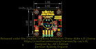
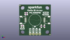
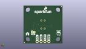
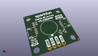

Contents
========

* [PROJ-SPAR-14843-STAN-01>Qwiic IR Array MLX90640](#proj-spar-14843-stan-01qwiic-ir-array-mlx90640)
	* [Images](#images)
	* [Interactive BOM](#interactive-bom)
	* [OOMP Parts](#oomp-parts)
	* [Tags](#tags)
  
![][im]
# PROJ-SPAR-14843-STAN-01>Qwiic IR Array MLX90640

- ID: PROJ-SPAR-14843-STAN-01
- Hex ID: PRS14843
- Name: Qwiic IR Array MLX90640
- Description: 

## Images
  
  

|eagleImage|kicadPcb3dFront|kicadPcb3dBack|kicadPcb3d|
| :---: | :---: | :---: | :---: |
|||||

## Interactive BOM

- Interactive BOM page: [ibom.html](kicad/bom/ibom.html)

## OOMP Parts
  

|OOMP Parts|
| :---: |
|<table><tr><td></td><td> C1</td><td>[CAPC-0603-X-NF100-V50 SMD (0603) 100 nF Capacitor (Ceramic) 50v](https://github.com/oomlout/oomlout_OOMP_parts/tree/main/CAPC-0603-X-NF100-V50/)</td><td>[C6N100](https://github.com/oomlout/oomlout_OOMP_parts/tree/main/CAPC-0603-X-NF100-V50/)</td></tr></table>|
|CAPC-0603-X-UNMATCHED-01, C2, 5.6514999999999995, 17.145, 180,C2, 1.0uF, 0603, SparkFun-Capacitors, (0.2225, 0.675), R180|
|UNMATCHED-0603-X-UNMATCHED-01, D1, 2.54, 6.9215, 0,D1, RED, LED-0603, SparkFun-LED, (0.1, 0.2725), R0|
|UNMATCHED-UNMATCHED-X-UNMATCHED-01, J2, 20.32, 12.7, 90,J2, JST04_1MM_RA, SparkFun-Connectors, (0.8, 0.5), R90|
|UNMATCHED-UNMATCHED-X-UNMATCHED-01, J3, 8.889999999999999, 1.27, 0,J3, PTH, 1X04_NO_SILK, SparkX, (0.35, 0.05), R0|
|UNMATCHED-UNMATCHED-X-UNMATCHED-01, J4, 5.08, 12.7, 270,J4, JST04_1MM_RA, SparkFun-Connectors, (0.2, 0.5), R270|
|UNMATCHED-UNMATCHED-X-UNMATCHED-01, JP1, 19.049999999999997, 7.619999999999999, M0,JP1, I2C, SMT-JUMPER_3_2-NC_TRACE_NO-SILK, SparkFun-Jumpers, (0.75, 0.3), MR0|
|RESE-0603-X-UNMATCHED-01, R1, 17.779999999999998, 7.619999999999999, 90,R1, 2.2k, 0603, SparkFun-Resistors, (0.7, 0.3), R90|
|RESE-0603-X-UNMATCHED-01, R2, 20.32, 7.619999999999999, 90,R2, 2.2k, 0603, SparkFun-Resistors, (0.8, 0.3), R90|
|RESE-0603-X-UNMATCHED-01, R3, 2.54, 8.254999999999999, 0,R3, 1k, 0603, SparkFun-Resistors, (0.1, 0.325), R0|
|UNMATCHED-UNMATCHED-X-UNMATCHED-01, U1, 12.7, 12.7, 0,U1, 110DEG, MLX90540_MLX90640, SparkFun-IC-Special-Function, (0.5, 0.5), R0|

## Tags

- hexID: PRS14843
- oompType: PROJ
- oompSize: SPAR
- oompColor: 14843
- oompDesc: STAN
- oompIndex: 01
- oompName: Qwiic IR Array MLX90640
- sources: All source files from https://github.com/sparkfun/Qwiic_IR_Array_MLX90640 (source licence details in srcLicense.md)
- linkBuyPage: https://www.sparkfun.com/products/14843
- oompPart: CAPC-0603-X-NF100-V50, C1, 5.6514999999999995, 18.6055, 180
- oompPart: CAPC-0603-X-UNMATCHED-01, C2, 5.6514999999999995, 17.145, 180
- oompPart: UNMATCHED-0603-X-UNMATCHED-01, D1, 2.54, 6.9215, 0
- oompPart: UNMATCHED-UNMATCHED-X-UNMATCHED-01, J2, 20.32, 12.7, 90
- oompPart: UNMATCHED-UNMATCHED-X-UNMATCHED-01, J3, 8.889999999999999, 1.27, 0
- oompPart: UNMATCHED-UNMATCHED-X-UNMATCHED-01, J4, 5.08, 12.7, 270
- oompPart: UNMATCHED-UNMATCHED-X-UNMATCHED-01, JP1, 19.049999999999997, 7.619999999999999, M0
- oompPart: SKIP-UNMATCHED-X-UNMATCHED-01, JP2, 24.764999999999997, 0.635, 0
- oompPart: SKIP-UNMATCHED-X-UNMATCHED-01, JP5, 0.635, 24.764999999999997, 0
- oompPart: SKIP-UNMATCHED-X-UNMATCHED-01, JP6, 24.764999999999997, 0.635, M0
- oompPart: SKIP-UNMATCHED-X-UNMATCHED-01, JP7, 0.635, 24.764999999999997, M0
- oompPart: RESE-0603-X-UNMATCHED-01, R1, 17.779999999999998, 7.619999999999999, 90
- oompPart: RESE-0603-X-UNMATCHED-01, R2, 20.32, 7.619999999999999, 90
- oompPart: RESE-0603-X-UNMATCHED-01, R3, 2.54, 8.254999999999999, 0
- oompPart: UNMATCHED-UNMATCHED-X-UNMATCHED-01, U1, 12.7, 12.7, 0
- rawPart: C1, 0.1uF, 0603, SparkFun-Capacitors, (0.2225, 0.7325), R180
- rawPart: C2, 1.0uF, 0603, SparkFun-Capacitors, (0.2225, 0.675), R180
- rawPart: D1, RED, LED-0603, SparkFun-LED, (0.1, 0.2725), R0
- rawPart: J2, JST04_1MM_RA, SparkFun-Connectors, (0.8, 0.5), R90
- rawPart: J3, PTH, 1X04_NO_SILK, SparkX, (0.35, 0.05), R0
- rawPart: J4, JST04_1MM_RA, SparkFun-Connectors, (0.2, 0.5), R270
- rawPart: JP1, I2C, SMT-JUMPER_3_2-NC_TRACE_NO-SILK, SparkFun-Jumpers, (0.75, 0.3), MR0
- rawPart: JP2, FIDUCIALUFIDUCIAL, MICRO-FIDUCIAL, SparkFun, (0.975, 0.025), R0
- rawPart: JP5, FIDUCIALUFIDUCIAL, MICRO-FIDUCIAL, SparkFun, (0.025, 0.975), R0
- rawPart: JP6, FIDUCIALUFIDUCIAL, MICRO-FIDUCIAL, SparkFun, (0.975, 0.025), MR0
- rawPart: JP7, FIDUCIALUFIDUCIAL, MICRO-FIDUCIAL, SparkFun, (0.025, 0.975), MR0
- rawPart: R1, 2.2k, 0603, SparkFun-Resistors, (0.7, 0.3), R90
- rawPart: R2, 2.2k, 0603, SparkFun-Resistors, (0.8, 0.3), R90
- rawPart: R3, 1k, 0603, SparkFun-Resistors, (0.1, 0.325), R0
- rawPart: U1, 110DEG, MLX90540_MLX90640, SparkFun-IC-Special-Function, (0.5, 0.5), R0
- oompID: PROJ-SPAR-14843-STAN-01

[im]: kicadPcb3d_450.png
