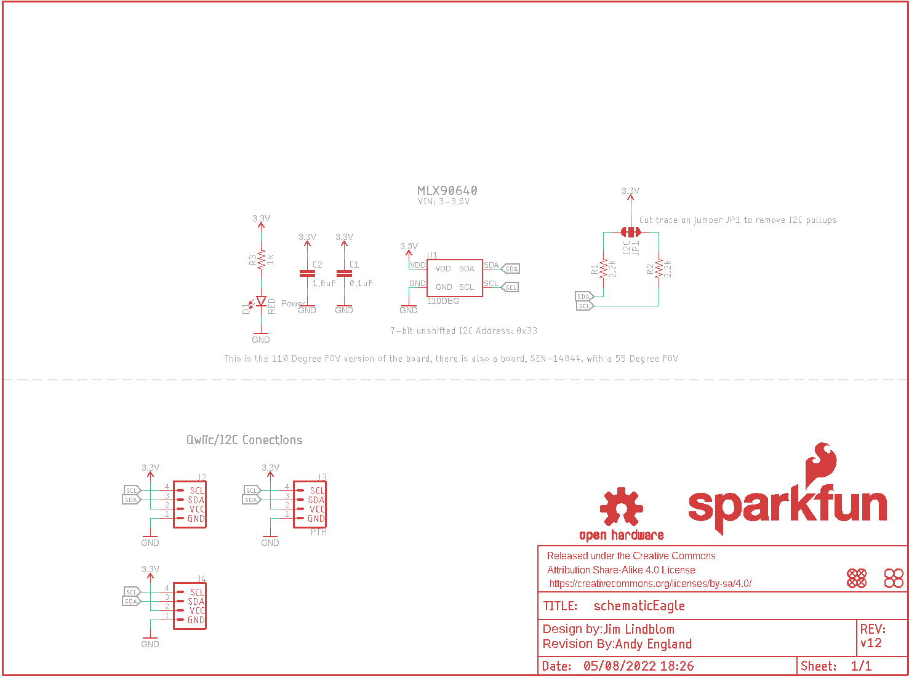
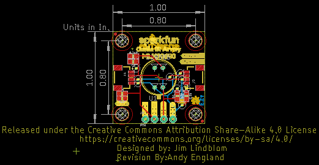

Contents
========

* [PRS14843 > Qwiic IR Array MLX90640](#prs14843--qwiic-ir-array-mlx90640)
	* [Schematic](#schematic)
	* [PCB](#pcb)
	* [Interactive BOM](#interactive-bom)
	* [OOMP Parts](#oomp-parts)
	* [Images](#images)
	* [Tags](#tags)
  
![][im]
# PRS14843 > Qwiic IR Array MLX90640

- ID: PROJ-SPAR-14843-STAN-01
- Hex ID: PRS14843
- Name: Sparkfun
- Description: Sparkfun
- Long Link: [http://oom.lt/PROJ-SPAR-14843-STAN-01](http://oom.lt/PROJ-SPAR-14843-STAN-01)
- Short Link: [http://oom.lt/PRS14843](http://oom.lt/PRS14843)

## Schematic
  

## PCB
  

## Interactive BOM

- Interactive BOM page: [ibom.html](https://htmlpreview.github.io/?https://github.com/oomlout/oomlout_OOMP_projects/blob/main/PROJ-SPAR-14843-STAN-01/kicad/bom/ibom.html)

## OOMP Parts
  

|OOMP Parts|
| :---: |
|CAPC-0603-X-UF1D-01 C1|
|[CAPC-0603-X-UF1-V25  SMD (0603) 1 uF Capacitor (Ceramic) 25v  C2](https://github.com/oomlout/oomlout_OOMP_parts/tree/main/CAPC-0603-X-UF1-V25/)|
|[LEDS-0603-R-STAN-01  SMD (0603) Red LED  D1](https://github.com/oomlout/oomlout_OOMP_parts/tree/main/LEDS-0603-R-STAN-01/)|
|UNMATCHED-UNMATCHED-X-UNMATCHED-01 J2, J4, JP1, U1|
|[HEAD-I01-X-PI04-01  2.54 mm 4 Pin Header  J3](https://github.com/oomlout/oomlout_OOMP_parts/tree/main/HEAD-I01-X-PI04-01/)|
|[RESE-0603-X-O222-01  SMD (0603) 2.2k Ohm Resistor  R1, R2](https://github.com/oomlout/oomlout_OOMP_parts/tree/main/RESE-0603-X-O222-01/)|
|[RESE-0603-X-O102-01  SMD (0603) 1k Ohm Resistor  R3](https://github.com/oomlout/oomlout_OOMP_parts/tree/main/RESE-0603-X-O102-01/)|

## Images
  
  

|kicadPcb3d|kicadPcb3dFront|kicadPcb3dBack|eagleImage|eagleSchemImage|
| :---: | :---: | :---: | :---: | :---: |
||||||

## Tags

- hexID: PRS14843
- oompType: PROJ
- oompSize: SPAR
- oompColor: 14843
- oompDesc: STAN
- oompIndex: 01
- oompName: Qwiic IR Array MLX90640
- sources: All source files from https://github.com/sparkfun/Qwiic_IR_Array_MLX90640 (source licence details in srcLicense.md)
- linkBuyPage: https://www.sparkfun.com/products/14843
- oompID: PROJ-SPAR-14843-STAN-01
- oompParts: C1,CAPC-0603-X-UF1D-01
- oompParts: C2,CAPC-0603-X-UF1-V25
- oompParts: D1,LEDS-0603-R-STAN-01
- oompParts: J2,UNMATCHED-UNMATCHED-X-UNMATCHED-01
- oompParts: J3,HEAD-I01-X-PI04-01
- oompParts: J4,UNMATCHED-UNMATCHED-X-UNMATCHED-01
- oompParts: JP1,UNMATCHED-UNMATCHED-X-UNMATCHED-01
- oompParts: R1,RESE-0603-X-O222-01
- oompParts: R2,RESE-0603-X-O222-01
- oompParts: R3,RESE-0603-X-O102-01
- oompParts: U1,UNMATCHED-UNMATCHED-X-UNMATCHED-01
- rawParts: C1,0.1uF,0.1UF-0603-25V-(+80/-20%),0603,0.1µF ceramic capacitors,,CAP-00810,,0.1uF,
- rawParts: C2,1.0uF,1.0UF-0603-16V-10%,0603,1µF ceramic capacitors,,CAP-00868,,1.0uF,
- rawParts: D1,RED,LED-RED0603,LED-0603,Red SMD LED,,DIO-00819,,RED,
- rawParts: FRAME1,FRAME-LETTER,FRAME-LETTER,CREATIVE_COMMONS,Schematic Frame - Letter,,,,,
- rawParts: J2,,QWIIC_CONNECTORJS-1MM,JST04_1MM_RA,SparkFun I2C Standard Qwiic Connector,,CONN-13694,,,
- rawParts: J3,PTH,I2C_STANDARD_NO_SILK,1X04_NO_SILK,SparkFun I2C Standard Pinout Header,,,,,
- rawParts: J4,,QWIIC_CONNECTORJS-1MM,JST04_1MM_RA,SparkFun I2C Standard Qwiic Connector,,CONN-13694,,,
- rawParts: JP1,I2C,JUMPER-SMT_3_2-NC_TRACE_NO-SILK,SMT-JUMPER_3_2-NC_TRACE_NO-SILK,Normally closed trace jumper (2 of 2 connections),,,,,
- rawParts: JP2,FIDUCIALUFIDUCIAL,FIDUCIALUFIDUCIAL,MICRO-FIDUCIAL,Fiducial Alignment Points,,,,,
- rawParts: JP3,STAND-OFF,STAND-OFF,STAND-OFF,Stand Off,,,,,
- rawParts: JP4,STAND-OFF,STAND-OFF,STAND-OFF,Stand Off,,,,,
- rawParts: JP5,FIDUCIALUFIDUCIAL,FIDUCIALUFIDUCIAL,MICRO-FIDUCIAL,Fiducial Alignment Points,,,,,
- rawParts: JP6,FIDUCIALUFIDUCIAL,FIDUCIALUFIDUCIAL,MICRO-FIDUCIAL,Fiducial Alignment Points,,,,,
- rawParts: JP7,FIDUCIALUFIDUCIAL,FIDUCIALUFIDUCIAL,MICRO-FIDUCIAL,Fiducial Alignment Points,,,,,
- rawParts: JP8,STAND-OFF,STAND-OFF,STAND-OFF,Stand Off,,,,,
- rawParts: JP9,STAND-OFF,STAND-OFF,STAND-OFF,Stand Off,,,,,
- rawParts: LOGO1,OSHW-LOGOMINI,OSHW-LOGOMINI,OSHW-LOGO-MINI,Open-Source Hardware (OSHW) Logo,,,,,
- rawParts: LOGO2,SFE_LOGO_NAME_FLAME.1_INCH,SFE_LOGO_NAME_FLAME.1_INCH,SFE_LOGO_NAME_FLAME_.1,SparkFun Font Logo w/ Flame,,,,,
- rawParts: LOGO3,SFE_LOGO_NAME.1_INCH,SFE_LOGO_NAME.1_INCH,SFE_LOGO_NAME_.1,SparkFun Font Logo,,,,,
- rawParts: LOGO4,REVISION,REVISION,REVISION,Revision By Text,,,,,
- rawParts: R1,2.2k,2.2KOHM-0603-1/10W-1%,0603,2.2kΩ resistor,,RES-08272,,2.2k,
- rawParts: R2,2.2k,2.2KOHM-0603-1/10W-1%,0603,2.2kΩ resistor,,RES-08272,,2.2k,
- rawParts: R3,1k,1KOHM-0603-1/10W-1%,0603,1kΩ resistor,,RES-07856,,1k,
- rawParts: U1,110DEG,MLX90540_MLX906404,MLX90540_MLX90640,Melexis MLX90640 Infrared Array,,IC-14041,,110DEG,

[im]: kicadPcb3d_450.png
