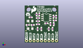
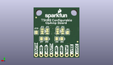
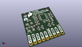

Contents
========

* [PROJ-SPAR-14874-STAN-01>TSH82 Configurable Op Amp Board](#proj-spar-14874-stan-01tsh82-configurable-op-amp-board)
	* [Images](#images)
	* [Interactive BOM](#interactive-bom)
	* [OOMP Parts](#oomp-parts)
	* [Tags](#tags)
  
![][im]
# PROJ-SPAR-14874-STAN-01>TSH82 Configurable Op Amp Board

- ID: PROJ-SPAR-14874-STAN-01
- Hex ID: PRS14874
- Name: TSH82 Configurable Op Amp Board
- Description: 

## Images
  
  

|eagleImage|kicadPcb3dFront|kicadPcb3dBack|kicadPcb3d|
| :---: | :---: | :---: | :---: |
|||||

## Interactive BOM

- Interactive BOM page: [ibom.html](kicad/bom/ibom.html)

## OOMP Parts
  

|OOMP Parts|
| :---: |
|CAPE-UNMATCHED-X-UNMATCHED-01, C1, 151.0, 580.0, 180,C1, 10uF, EIA3216, SparkFun-Capacitors, (151, 580), R180|
|CAPE-0603-X-NF100-01, C2, 161.0, 680.0, 0,C2, 0.1uF, 0603, SparkFun-Capacitors, (161, 680), R0|
|CAPE-UNMATCHED-X-UNMATCHED-01, C3, 151.0, 375.0, 180,C3, 10uF, EIA3216, SparkFun-Capacitors, (151, 375), R180|
|UNMATCHED-0603-X-UNMATCHED-01, C4, 319.0, 759.0, 90,C4, DNP, 0603, SparkFun-Capacitors, (319, 759), R90|
|UNMATCHED-0603-X-UNMATCHED-01, C5, 841.0, 696.0, 90,C5, DNP, 0603, SparkFun-Capacitors, (841, 696), R90|
|CAPE-0603-X-UNMATCHED-01, C6, 446.0, 365.0, 90,C6, 1.0uF, 0603, SparkFun-Capacitors, (446, 365), R90|
|CAPE-0603-X-UNMATCHED-01, C7, 346.0, 365.0, 90,C7, 1.0uF, 0603, SparkFun-Capacitors, (346, 365), R90|
|CAPE-0603-X-UNMATCHED-01, C8, 746.0, 365.0, 90,C8, 1.0uF, 0603, SparkFun-Capacitors, (746, 365), R90|
|CAPE-0603-X-UNMATCHED-01, C9, 646.0, 365.0, 90,C9, 1.0uF, 0603, SparkFun-Capacitors, (646, 365), R90|
|CAPE-0603-X-NF100-01, C10, 580.0, 521.0, 180,C10, 0.1uF, 0603, SparkFun-Capacitors, (580, 521), R180|
|UNMATCHED-UNMATCHED-X-UNMATCHED-01, FD1, 850.0, 800.0, 0,FD1, FIDUCIALUFIDUCIAL, FIDUCIAL-MICRO, SparkFun-Aesthetics, (850, 800), R0|
|UNMATCHED-UNMATCHED-X-UNMATCHED-01, FD2, 36.0, 316.0, 0,FD2, FIDUCIALUFIDUCIAL, FIDUCIAL-MICRO, SparkFun-Aesthetics, (36, 316), R0|
|UNMATCHED-UNMATCHED-X-UNMATCHED-01, FD3, 36.0, 316.0, M0,FD3, FIDUCIALUFIDUCIAL, FIDUCIAL-MICRO, SparkFun-Aesthetics, (36, 316), MR0|
|UNMATCHED-UNMATCHED-X-UNMATCHED-01, FD4, 850.0, 800.0, M0,FD4, FIDUCIALUFIDUCIAL, FIDUCIAL-MICRO, SparkFun-Aesthetics, (850, 800), MR0|
|UNMATCHED-UNMATCHED-X-UNMATCHED-01, J1, 50.0, 50.0, 0,J1, 1X09_NO_SILK, SparkFun-Connectors, (50, 50), R0|
|UNMATCHED-UNMATCHED-X-UNMATCHED-01, JP1, 430.0, 526.0, M270,JP1, JUMPER-SMT_3_1-NC_TRACE_SILK, SMT-JUMPER_3_1-NC_TRACE_SILK, SparkFun-Jumpers, (430, 526), MR270|
|UNMATCHED-UNMATCHED-X-UNMATCHED-01, JP2, 330.0, 526.0, M90,JP2, JUMPER-SMT_3_1-NC_TRACE_SILK, SMT-JUMPER_3_1-NC_TRACE_SILK, SparkFun-Jumpers, (330, 526), MR90|
|UNMATCHED-UNMATCHED-X-UNMATCHED-01, JP3, 730.0, 526.0, M270,JP3, JUMPER-SMT_3_1-NC_TRACE_SILK, SMT-JUMPER_3_1-NC_TRACE_SILK, SparkFun-Jumpers, (730, 526), MR270|
|UNMATCHED-UNMATCHED-X-UNMATCHED-01, JP4, 630.0, 526.0, M90,JP4, JUMPER-SMT_3_1-NC_TRACE_SILK, SMT-JUMPER_3_1-NC_TRACE_SILK, SparkFun-Jumpers, (630, 526), MR90|
|UNMATCHED-UNMATCHED-X-UNMATCHED-01, JP5, 446.0, 375.0, M270,JP5, JUMPER-SMT_2_NO_SILK, SMT-JUMPER_2_NO_SILK, SparkFun-Jumpers, (446, 375), MR270|
|UNMATCHED-UNMATCHED-X-UNMATCHED-01, JP6, 346.0, 375.0, M270,JP6, JUMPER-SMT_2_NO_SILK, SMT-JUMPER_2_NO_SILK, SparkFun-Jumpers, (346, 375), MR270|
|UNMATCHED-UNMATCHED-X-UNMATCHED-01, JP7, 746.0, 375.0, M270,JP7, JUMPER-SMT_2_NO_SILK, SMT-JUMPER_2_NO_SILK, SparkFun-Jumpers, (746, 375), MR270|
|UNMATCHED-UNMATCHED-X-UNMATCHED-01, JP8, 646.0, 375.0, M270,JP8, JUMPER-SMT_2_NO_SILK, SMT-JUMPER_2_NO_SILK, SparkFun-Jumpers, (646, 375), MR270|
|UNMATCHED-UNMATCHED-X-UNMATCHED-01, JP9, 231.0, 500.0, M90,JP9, JUMPER-SMT_2_NO_SILK, SMT-JUMPER_2_NO_SILK, SparkFun-Jumpers, (231, 500), MR90|
|UNMATCHED-UNMATCHED-X-UNMATCHED-01, JP10, 845.0, 501.0, M90,JP10, JUMPER-SMT_2_NO_SILK, SMT-JUMPER_2_NO_SILK, SparkFun-Jumpers, (845, 501), MR90|
|RESE-0603-X-UNMATCHED-01, R1, 83.0, 475.0, 180,R1, 2.2k, 0603, SparkFun-Resistors, (83, 475), R180|
|RESE-0603-X-UNMATCHED-01, R2, 214.0, 475.0, 180,R2, 2.2k, 0603, SparkFun-Resistors, (214, 475), R180|
|<table><tr><td></td><td> R3</td><td>[RESE-0603-X-O103-01 SMD (0603) 10k Ohm Resistor](https://github.com/oomlout/oomlout_OOMP_parts/tree/main/RESE-0603-X-O103-01/)</td><td>[R6103](https://github.com/oomlout/oomlout_OOMP_parts/tree/main/RESE-0603-X-O103-01/)</td></tr></table>|
|<table><tr><td></td><td> R4</td><td>[RESE-0603-X-O103-01 SMD (0603) 10k Ohm Resistor](https://github.com/oomlout/oomlout_OOMP_parts/tree/main/RESE-0603-X-O103-01/)</td><td>[R6103](https://github.com/oomlout/oomlout_OOMP_parts/tree/main/RESE-0603-X-O103-01/)</td></tr></table>|
|<table><tr><td></td><td> R5</td><td>[RESE-0603-X-O103-01 SMD (0603) 10k Ohm Resistor](https://github.com/oomlout/oomlout_OOMP_parts/tree/main/RESE-0603-X-O103-01/)</td><td>[R6103](https://github.com/oomlout/oomlout_OOMP_parts/tree/main/RESE-0603-X-O103-01/)</td></tr></table>|
|<table><tr><td></td><td> R6</td><td>[RESE-0603-X-O103-01 SMD (0603) 10k Ohm Resistor](https://github.com/oomlout/oomlout_OOMP_parts/tree/main/RESE-0603-X-O103-01/)</td><td>[R6103](https://github.com/oomlout/oomlout_OOMP_parts/tree/main/RESE-0603-X-O103-01/)</td></tr></table>|
|<table><tr><td></td><td> R7</td><td>[RESE-0603-X-O473-01 SMD (0603) 47k Ohm Resistor](https://github.com/oomlout/oomlout_OOMP_parts/tree/main/RESE-0603-X-O473-01/)</td><td>[R6473](https://github.com/oomlout/oomlout_OOMP_parts/tree/main/RESE-0603-X-O473-01/)</td></tr></table>|
|<table><tr><td></td><td> R8</td><td>[RESE-0603-X-O473-01 SMD (0603) 47k Ohm Resistor](https://github.com/oomlout/oomlout_OOMP_parts/tree/main/RESE-0603-X-O473-01/)</td><td>[R6473](https://github.com/oomlout/oomlout_OOMP_parts/tree/main/RESE-0603-X-O473-01/)</td></tr></table>|
|<table><tr><td></td><td> R9</td><td>[RESE-0603-X-O473-01 SMD (0603) 47k Ohm Resistor](https://github.com/oomlout/oomlout_OOMP_parts/tree/main/RESE-0603-X-O473-01/)</td><td>[R6473](https://github.com/oomlout/oomlout_OOMP_parts/tree/main/RESE-0603-X-O473-01/)</td></tr></table>|
|<table><tr><td></td><td> R10</td><td>[RESE-0603-X-O473-01 SMD (0603) 47k Ohm Resistor](https://github.com/oomlout/oomlout_OOMP_parts/tree/main/RESE-0603-X-O473-01/)</td><td>[R6473](https://github.com/oomlout/oomlout_OOMP_parts/tree/main/RESE-0603-X-O473-01/)</td></tr></table>|
|UNMATCHED-UNMATCHED-X-UNMATCHED-01, U1, 580.0, 676.0, 270,U1, TSH82, SO08, SparkFun-IC-Amplifiers, (580, 676), R270|

## Tags

- hexID: PRS14874
- oompType: PROJ
- oompSize: SPAR
- oompColor: 14874
- oompDesc: STAN
- oompIndex: 01
- oompName: TSH82 Configurable Op Amp Board
- sources: All source files from https://github.com/sparkfun/TSH82_Configurable_Op_Amp_Board (source licence details in srcLicense.md)
- linkBuyPage: https://www.sparkfun.com/products/14874
- oompPart: CAPE-UNMATCHED-X-UNMATCHED-01, C1, 151.0, 580.0, 180
- oompPart: CAPE-0603-X-NF100-01, C2, 161.0, 680.0, 0
- oompPart: CAPE-UNMATCHED-X-UNMATCHED-01, C3, 151.0, 375.0, 180
- oompPart: UNMATCHED-0603-X-UNMATCHED-01, C4, 319.0, 759.0, 90
- oompPart: UNMATCHED-0603-X-UNMATCHED-01, C5, 841.0, 696.0, 90
- oompPart: CAPE-0603-X-UNMATCHED-01, C6, 446.0, 365.0, 90
- oompPart: CAPE-0603-X-UNMATCHED-01, C7, 346.0, 365.0, 90
- oompPart: CAPE-0603-X-UNMATCHED-01, C8, 746.0, 365.0, 90
- oompPart: CAPE-0603-X-UNMATCHED-01, C9, 646.0, 365.0, 90
- oompPart: CAPE-0603-X-NF100-01, C10, 580.0, 521.0, 180
- oompPart: UNMATCHED-UNMATCHED-X-UNMATCHED-01, FD1, 850.0, 800.0, 0
- oompPart: UNMATCHED-UNMATCHED-X-UNMATCHED-01, FD2, 36.0, 316.0, 0
- oompPart: UNMATCHED-UNMATCHED-X-UNMATCHED-01, FD3, 36.0, 316.0, M0
- oompPart: UNMATCHED-UNMATCHED-X-UNMATCHED-01, FD4, 850.0, 800.0, M0
- oompPart: UNMATCHED-UNMATCHED-X-UNMATCHED-01, J1, 50.0, 50.0, 0
- oompPart: UNMATCHED-UNMATCHED-X-UNMATCHED-01, JP1, 430.0, 526.0, M270
- oompPart: UNMATCHED-UNMATCHED-X-UNMATCHED-01, JP2, 330.0, 526.0, M90
- oompPart: UNMATCHED-UNMATCHED-X-UNMATCHED-01, JP3, 730.0, 526.0, M270
- oompPart: UNMATCHED-UNMATCHED-X-UNMATCHED-01, JP4, 630.0, 526.0, M90
- oompPart: UNMATCHED-UNMATCHED-X-UNMATCHED-01, JP5, 446.0, 375.0, M270
- oompPart: UNMATCHED-UNMATCHED-X-UNMATCHED-01, JP6, 346.0, 375.0, M270
- oompPart: UNMATCHED-UNMATCHED-X-UNMATCHED-01, JP7, 746.0, 375.0, M270
- oompPart: UNMATCHED-UNMATCHED-X-UNMATCHED-01, JP8, 646.0, 375.0, M270
- oompPart: UNMATCHED-UNMATCHED-X-UNMATCHED-01, JP9, 231.0, 500.0, M90
- oompPart: UNMATCHED-UNMATCHED-X-UNMATCHED-01, JP10, 845.0, 501.0, M90
- oompPart: RESE-0603-X-UNMATCHED-01, R1, 83.0, 475.0, 180
- oompPart: RESE-0603-X-UNMATCHED-01, R2, 214.0, 475.0, 180
- oompPart: RESE-0603-X-O103-01, R3, 355.0, 661.0, 0
- oompPart: RESE-0603-X-O103-01, R4, 355.0, 576.0, 0
- oompPart: RESE-0603-X-O103-01, R5, 805.0, 598.0, 180
- oompPart: RESE-0603-X-O103-01, R6, 690.0, 501.0, 90
- oompPart: RESE-0603-X-O473-01, R7, 391.0, 759.0, 90
- oompPart: RESE-0603-X-O473-01, R8, 355.0, 491.0, 0
- oompPart: RESE-0603-X-O473-01, R9, 769.0, 696.0, 270
- oompPart: RESE-0603-X-O473-01, R10, 775.0, 496.0, 270
- oompPart: UNMATCHED-UNMATCHED-X-UNMATCHED-01, U1, 580.0, 676.0, 270
- rawPart: C1, 10uF, EIA3216, SparkFun-Capacitors, (151, 580), R180
- rawPart: C2, 0.1uF, 0603, SparkFun-Capacitors, (161, 680), R0
- rawPart: C3, 10uF, EIA3216, SparkFun-Capacitors, (151, 375), R180
- rawPart: C4, DNP, 0603, SparkFun-Capacitors, (319, 759), R90
- rawPart: C5, DNP, 0603, SparkFun-Capacitors, (841, 696), R90
- rawPart: C6, 1.0uF, 0603, SparkFun-Capacitors, (446, 365), R90
- rawPart: C7, 1.0uF, 0603, SparkFun-Capacitors, (346, 365), R90
- rawPart: C8, 1.0uF, 0603, SparkFun-Capacitors, (746, 365), R90
- rawPart: C9, 1.0uF, 0603, SparkFun-Capacitors, (646, 365), R90
- rawPart: C10, 0.1uF, 0603, SparkFun-Capacitors, (580, 521), R180
- rawPart: FD1, FIDUCIALUFIDUCIAL, FIDUCIAL-MICRO, SparkFun-Aesthetics, (850, 800), R0
- rawPart: FD2, FIDUCIALUFIDUCIAL, FIDUCIAL-MICRO, SparkFun-Aesthetics, (36, 316), R0
- rawPart: FD3, FIDUCIALUFIDUCIAL, FIDUCIAL-MICRO, SparkFun-Aesthetics, (36, 316), MR0
- rawPart: FD4, FIDUCIALUFIDUCIAL, FIDUCIAL-MICRO, SparkFun-Aesthetics, (850, 800), MR0
- rawPart: J1, 1X09_NO_SILK, SparkFun-Connectors, (50, 50), R0
- rawPart: JP1, JUMPER-SMT_3_1-NC_TRACE_SILK, SMT-JUMPER_3_1-NC_TRACE_SILK, SparkFun-Jumpers, (430, 526), MR270
- rawPart: JP2, JUMPER-SMT_3_1-NC_TRACE_SILK, SMT-JUMPER_3_1-NC_TRACE_SILK, SparkFun-Jumpers, (330, 526), MR90
- rawPart: JP3, JUMPER-SMT_3_1-NC_TRACE_SILK, SMT-JUMPER_3_1-NC_TRACE_SILK, SparkFun-Jumpers, (730, 526), MR270
- rawPart: JP4, JUMPER-SMT_3_1-NC_TRACE_SILK, SMT-JUMPER_3_1-NC_TRACE_SILK, SparkFun-Jumpers, (630, 526), MR90
- rawPart: JP5, JUMPER-SMT_2_NO_SILK, SMT-JUMPER_2_NO_SILK, SparkFun-Jumpers, (446, 375), MR270
- rawPart: JP6, JUMPER-SMT_2_NO_SILK, SMT-JUMPER_2_NO_SILK, SparkFun-Jumpers, (346, 375), MR270
- rawPart: JP7, JUMPER-SMT_2_NO_SILK, SMT-JUMPER_2_NO_SILK, SparkFun-Jumpers, (746, 375), MR270
- rawPart: JP8, JUMPER-SMT_2_NO_SILK, SMT-JUMPER_2_NO_SILK, SparkFun-Jumpers, (646, 375), MR270
- rawPart: JP9, JUMPER-SMT_2_NO_SILK, SMT-JUMPER_2_NO_SILK, SparkFun-Jumpers, (231, 500), MR90
- rawPart: JP10, JUMPER-SMT_2_NO_SILK, SMT-JUMPER_2_NO_SILK, SparkFun-Jumpers, (845, 501), MR90
- rawPart: R1, 2.2k, 0603, SparkFun-Resistors, (83, 475), R180
- rawPart: R2, 2.2k, 0603, SparkFun-Resistors, (214, 475), R180
- rawPart: R3, 10k, 0603, SparkFun-Resistors, (355, 661), R0
- rawPart: R4, 10k, 0603, SparkFun-Resistors, (355, 576), R0
- rawPart: R5, 10k, 0603, SparkFun-Resistors, (805, 598), R180
- rawPart: R6, 10k, 0603, SparkFun-Resistors, (690, 501), R90
- rawPart: R7, 47k, 0603, SparkFun-Resistors, (391, 759), R90
- rawPart: R8, 47k, 0603, SparkFun-Resistors, (355, 491), R0
- rawPart: R9, 47k, 0603, SparkFun-Resistors, (769, 696), R270
- rawPart: R10, 47k, 0603, SparkFun-Resistors, (775, 496), R270
- rawPart: U1, TSH82, SO08, SparkFun-IC-Amplifiers, (580, 676), R270

[im]: kicadPcb3d_450.png
