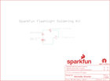

Contents
========

* [PRS14877 > Flashlight](#prs14877--flashlight)
	* [Schematic](#schematic)
	* [PCB](#pcb)
	* [Interactive BOM](#interactive-bom)
	* [OOMP Parts](#oomp-parts)
	* [Images](#images)
	* [Tags](#tags)
  
![][im]
# PRS14877 > Flashlight

- ID: PROJ-SPAR-14877-STAN-01
- Hex ID: PRS14877
- Name: Sparkfun
- Description: Sparkfun
- Long Link: [http://oom.lt/PROJ-SPAR-14877-STAN-01](http://oom.lt/PROJ-SPAR-14877-STAN-01)
- Short Link: [http://oom.lt/PRS14877](http://oom.lt/PRS14877)

## Schematic
  

## PCB
  

## Interactive BOM

- Interactive BOM page: [ibom.html](https://htmlpreview.github.io/?https://github.com/oomlout/oomlout_OOMP_projects/blob/main/PROJ-SPAR-14877-STAN-01/kicad/bom/ibom.html)

## OOMP Parts
  

|OOMP Parts|
| :---: |
|UNMATCHED-UNMATCHED-X-UNMATCHED-01 BT2, S2|
|LEDS-UNMATCHED-G-STAN-01 D1|
|RESE-UNMATCHED-X-O100-01 R1|

## Images
  
  

|kicadPcb3d|kicadPcb3dFront|kicadPcb3dBack|eagleImage|eagleSchemImage|
| :---: | :---: | :---: | :---: | :---: |
||||||

## Tags

- hexID: PRS14877
- oompType: PROJ
- oompSize: SPAR
- oompColor: 14877
- oompDesc: STAN
- oompIndex: 01
- oompName: Flashlight
- sources: All source files from https://github.com/sparkfun/Flashlight (source licence details in srcLicense.md)
- linkBuyPage: https://www.sparkfun.com/products/14877
- oompID: PROJ-SPAR-14877-STAN-01
- oompParts: BT2,UNMATCHED-UNMATCHED-X-UNMATCHED-01
- oompParts: D1,LEDS-UNMATCHED-G-STAN-01
- oompParts: R1,RESE-UNMATCHED-X-O100-01
- oompParts: S2,UNMATCHED-UNMATCHED-X-UNMATCHED-01
- rawParts: BT2,,BATTERY-20MM_PTH_KIT,BATTCOM_20MM_PTH_KIT,Battery - Single Cell,9031,,,
- rawParts: D1,,LED-5MM-KIT-NO-SILK,LED_5MM-KIT-NO-SILK,LED (Generic),9903,,,
- rawParts: FRAME1,FRAME-LETTER,FRAME-LETTER,CREATIVE_COMMONS,Schematic Frame - Letter,,,,
- rawParts: H1,STAND-OFF,STAND-OFF,STAND-OFF,Stand Off,,,,
- rawParts: H2,STAND-OFF,STAND-OFF,STAND-OFF,Stand Off,,,,
- rawParts: H3,STAND-OFF,STAND-OFF,STAND-OFF,Stand Off,,,,
- rawParts: H4,STAND-OFF,STAND-OFF,STAND-OFF,Stand Off,,,,
- rawParts: LOGO1,OSHW-LOGOS,OSHW-LOGOS,OSHW-LOGO-S,Open-Source Hardware (OSHW) Logo,,,,
- rawParts: LOGO2,SFE_LOGO_FLAME.1_INCH,SFE_LOGO_FLAME.1_INCH,SFE_LOGO_FLAME_.1,SparkFun Flame Logo,,,,
- rawParts: LOGO3,SFE_LOGO_NAME_FLAME.2_INCH,SFE_LOGO_NAME_FLAME.2_INCH,SFE_LOGO_NAME_FLAME_.2,SparkFun Font Logo w/ Flame,,,,
- rawParts: LOGO4,SFE_LOGO_NAME.2_INCH,SFE_LOGO_NAME.2_INCH,SFE_LOGO_NAME_.2,SparkFun Font Logo,,,,
- rawParts: R1,10,RESISTORAXIAL-0.3-KIT,AXIAL-0.3-KIT,Generic Resistor Package,8371,, ,
- rawParts: S2,,SWITCH-SPDT-PTH-11.6X4.0MM-KIT,SWITCH_SPDT_PTH_11.6X4.0MM_KIT,Single Pole, Double Throw (SPDT) Switch,SWCH-08261,COM-00102,,

[im]: kicadPcb3d_450.png
