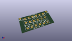
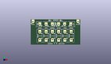
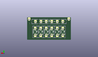
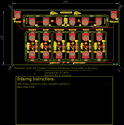

Contents
========

* [PRS14890 > Sparkfun](#prs14890--sparkfun)
	* [Images](#images)
	* [Tags](#tags)
  
![][im]
# PRS14890 > Sparkfun

- ID: PROJ-SPAR-14890-STAN-01
- Hex ID: PRS14890
- Name: Sparkfun
- Description: Sparkfun

## Images
  
  

|kicadPcb3d|kicadPcb3dFront|kicadPcb3dBack|eagleImage|eagleSchemImage|
| :---: | :---: | :---: | :---: | :---: |
||||||

## Tags

- hexID: PRS14890
- oompType: PROJ
- oompSize: SPAR
- oompColor: 14890
- oompDesc: STAN
- oompIndex: 01
- oompName: gator color
- sources: All source files from https://github.com/sparkfun/gator_color (source licence details in srcLicense.md)
- linkBuyPage: https://www.sparkfun.com/products/14890
- oompID: PROJ-SPAR-14890-STAN-01
- oompParts: D2,UNMATCHED-UNMATCHED-UNMATCHED-UNMATCHED-UNMATCHED
- oompParts: D3,UNMATCHED-UNMATCHED-UNMATCHED-UNMATCHED-UNMATCHED
- oompParts: D4,UNMATCHED-UNMATCHED-UNMATCHED-UNMATCHED-UNMATCHED
- oompParts: D5,UNMATCHED-UNMATCHED-UNMATCHED-UNMATCHED-UNMATCHED
- oompParts: D6,UNMATCHED-UNMATCHED-UNMATCHED-UNMATCHED-UNMATCHED
- oompParts: D9,UNMATCHED-UNMATCHED-UNMATCHED-UNMATCHED-UNMATCHED
- oompParts: FRAME1,UNMATCHED-UNMATCHED-UNMATCHED-UNMATCHED-UNMATCHED
- oompParts: LOGO1,UNMATCHED-UNMATCHED-UNMATCHED-UNMATCHED-UNMATCHED
- oompParts: LOGO2,UNMATCHED-UNMATCHED-UNMATCHED-UNMATCHED-UNMATCHED
- oompParts: LOGO8,UNMATCHED-UNMATCHED-UNMATCHED-UNMATCHED-UNMATCHED
- oompParts: LOGO15,UNMATCHED-UNMATCHED-UNMATCHED-UNMATCHED-UNMATCHED
- oompParts: LOGO16,UNMATCHED-UNMATCHED-UNMATCHED-UNMATCHED-UNMATCHED
- oompParts: R2,UNMATCHED-UNMATCHED-UNMATCHED-UNMATCHED-UNMATCHED
- oompParts: R3,UNMATCHED-UNMATCHED-UNMATCHED-UNMATCHED-UNMATCHED
- oompParts: R4,UNMATCHED-UNMATCHED-UNMATCHED-UNMATCHED-UNMATCHED
- oompParts: R5,UNMATCHED-UNMATCHED-UNMATCHED-UNMATCHED-UNMATCHED
- oompParts: R6,UNMATCHED-UNMATCHED-UNMATCHED-UNMATCHED-UNMATCHED
- oompParts: R7,UNMATCHED-UNMATCHED-UNMATCHED-UNMATCHED-UNMATCHED
- oompParts: U$1,UNMATCHED-UNMATCHED-UNMATCHED-UNMATCHED-UNMATCHED
- oompParts: U$2,UNMATCHED-UNMATCHED-UNMATCHED-UNMATCHED-UNMATCHED
- oompParts: U$3,UNMATCHED-UNMATCHED-UNMATCHED-UNMATCHED-UNMATCHED
- oompParts: U$6,UNMATCHED-UNMATCHED-UNMATCHED-UNMATCHED-UNMATCHED
- oompParts: U$7,UNMATCHED-UNMATCHED-UNMATCHED-UNMATCHED-UNMATCHED
- oompParts: U$8,UNMATCHED-UNMATCHED-UNMATCHED-UNMATCHED-UNMATCHED
- oompParts: U$10,UNMATCHED-UNMATCHED-UNMATCHED-UNMATCHED-UNMATCHED
- oompParts: U$11,UNMATCHED-UNMATCHED-UNMATCHED-UNMATCHED-UNMATCHED
- oompParts: U$13,UNMATCHED-UNMATCHED-UNMATCHED-UNMATCHED-UNMATCHED
- oompParts: U$16,UNMATCHED-UNMATCHED-UNMATCHED-UNMATCHED-UNMATCHED
- oompParts: U$18,UNMATCHED-UNMATCHED-UNMATCHED-UNMATCHED-UNMATCHED
- oompParts: U$19,UNMATCHED-UNMATCHED-UNMATCHED-UNMATCHED-UNMATCHED
- oompParts: U$20,UNMATCHED-UNMATCHED-UNMATCHED-UNMATCHED-UNMATCHED
- oompParts: U$21,UNMATCHED-UNMATCHED-UNMATCHED-UNMATCHED-UNMATCHED
- oompParts: U$28,UNMATCHED-UNMATCHED-UNMATCHED-UNMATCHED-UNMATCHED
- oompParts: U$30,UNMATCHED-UNMATCHED-UNMATCHED-UNMATCHED-UNMATCHED
- oompParts: U$32,UNMATCHED-UNMATCHED-UNMATCHED-UNMATCHED-UNMATCHED
- oompParts: U$33,UNMATCHED-UNMATCHED-UNMATCHED-UNMATCHED-UNMATCHED
- oompParts: U$34,UNMATCHED-UNMATCHED-UNMATCHED-UNMATCHED-UNMATCHED
- oompParts: U$38,UNMATCHED-UNMATCHED-UNMATCHED-UNMATCHED-UNMATCHED
- rawParts: D2,RED,LED-RED1206,LED-1206,Red SMD LED,DIO-09912,RED,
- rawParts: D3,WHITE,LED-WHITE1206,LED-1206,White SMD LED,DIO-09955,WHITE,
- rawParts: D4,BLUE,LED-BLUE1206,LED-1206,Blue SMD LED,DIO-09911,BLUE,
- rawParts: D5,Yellow,LED-YELLOWLILYPAD,LED-1206,Yellow SMD LED,DIO-09909,Yellow,
- rawParts: D6,GREEN,LED-GREEN1206,LED-1206,Green SMD LED,DIO-00862,GREEN,
- rawParts: D9,WHITE,LED-WHITE1206,LED-1206,White SMD LED,DIO-09955,WHITE,
- rawParts: FD1,FIDUCIALUFIDUCIAL,FIDUCIALUFIDUCIAL,FIDUCIAL-MICRO,Fiducial Alignment Points,,,
- rawParts: FD2,FIDUCIALUFIDUCIAL,FIDUCIALUFIDUCIAL,FIDUCIAL-MICRO,Fiducial Alignment Points,,,
- rawParts: FD3,FIDUCIALUFIDUCIAL,FIDUCIALUFIDUCIAL,FIDUCIAL-MICRO,Fiducial Alignment Points,,,
- rawParts: FD4,FIDUCIALUFIDUCIAL,FIDUCIALUFIDUCIAL,FIDUCIAL-MICRO,Fiducial Alignment Points,,,
- rawParts: FRAME1,FRAME-LETTER,FRAME-LETTER,CREATIVE_COMMONS,Schematic Frame - Letter,,,
- rawParts: LOGO1,SFE_LOGO_FLAME.1_INCH,SFE_LOGO_FLAME.1_INCH,SFE_LOGO_FLAME_.1,SparkFun Flame Logo,,,
- rawParts: LOGO2,OSHW-LOGOMINI,OSHW-LOGOMINI,OSHW-LOGO-MINI,Open-Source Hardware (OSHW) Logo,,,
- rawParts: LOGO8,REVISION,REVISION,REVISION,Revision By Text,,,
- rawParts: LOGO15,OSHW-LOGOMINI,OSHW-LOGOMINI,OSHW-LOGO-MINI,Open-Source Hardware (OSHW) Logo,,,
- rawParts: LOGO16,SFE_LOGO_NAME.1_INCH,SFE_LOGO_NAME.1_INCH,SFE_LOGO_NAME_.1,SparkFun Font Logo,,,
- rawParts: R2,330,330OHM-0603-1/10W-1%,0603,330Ω resistor,RES-00818,330,
- rawParts: R3,330,330OHM-0603-1/10W-1%,0603,330Ω resistor,RES-00818,330,
- rawParts: R4,150,150OHM-0603-1/10W-1%,0603,150Ω resistor,RES-11028,150,
- rawParts: R5,330,330OHM-0603-1/10W-1%,0603,330Ω resistor,RES-00818,330,
- rawParts: R6,150,150OHM-0603-1/10W-1%,0603,150Ω resistor,RES-11028,150,
- rawParts: R7,330,330OHM-0603-1/10W-1%,0603,330Ω resistor,RES-00818,330,
- rawParts: U$1,TAB_GATOR_MINI,TAB_GATOR_MINI,TAB_GATOR_MINI,,,,
- rawParts: U$2,TAB_GATOR_MINI,TAB_GATOR_MINI,TAB_GATOR_MINI,,,,
- rawParts: U$3,TAB_GATOR_MINI,TAB_GATOR_MINI,TAB_GATOR_MINI,,,,
- rawParts: U$6,TAB_GATOR_MINI,TAB_GATOR_MINI,TAB_GATOR_MINI,,,,
- rawParts: U$7,TAB_GATOR_MINI,TAB_GATOR_MINI,TAB_GATOR_MINI,,,,
- rawParts: U$8,TAB_GATOR_MINI,TAB_GATOR_MINI,TAB_GATOR_MINI,,,,
- rawParts: U$10,TAB_GATOR_MINI,TAB_GATOR_MINI,TAB_GATOR_MINI,,,,
- rawParts: U$11,TAB_GATOR_MINI,TAB_GATOR_MINI,TAB_GATOR_MINI,,,,
- rawParts: U$13,TAB_GATOR_MINI,TAB_GATOR_MINI,TAB_GATOR_MINI,,,,
- rawParts: U$16,TAB_GATOR_MINI,TAB_GATOR_MINI,TAB_GATOR_MINI,,,,
- rawParts: U$18,TAB_GATOR_MINI,TAB_GATOR_MINI,TAB_GATOR_MINI,,,,
- rawParts: U$19,TAB_GATOR_MINI,TAB_GATOR_MINI,TAB_GATOR_MINI,,,,
- rawParts: U$20,TAB_GATOR_MINI,TAB_GATOR_MINI,TAB_GATOR_MINI,,,,
- rawParts: U$21,TAB_GATOR_MINI,TAB_GATOR_MINI,TAB_GATOR_MINI,,,,
- rawParts: U$28,TAB_GATOR_MINI,TAB_GATOR_MINI,TAB_GATOR_MINI,,,,
- rawParts: U$30,TAB_GATOR_MINI,TAB_GATOR_MINI,TAB_GATOR_MINI,,,,
- rawParts: U$32,TAB_GATOR_MINI,TAB_GATOR_MINI,TAB_GATOR_MINI,,,,
- rawParts: U$33,TAB_GATOR_MINI,TAB_GATOR_MINI,TAB_GATOR_MINI,,,,
- rawParts: U$34,TAB_GATOR_MINI,TAB_GATOR_MINI,TAB_GATOR_MINI,,,,
- rawParts: U$38,TAB_GATOR_MINI,TAB_GATOR_MINI,TAB_GATOR_MINI,,,,

[im]: kicadPcb3d_450.png
