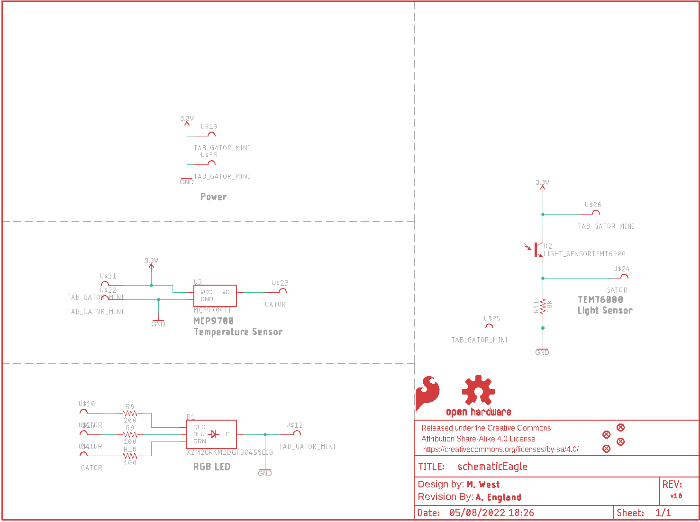
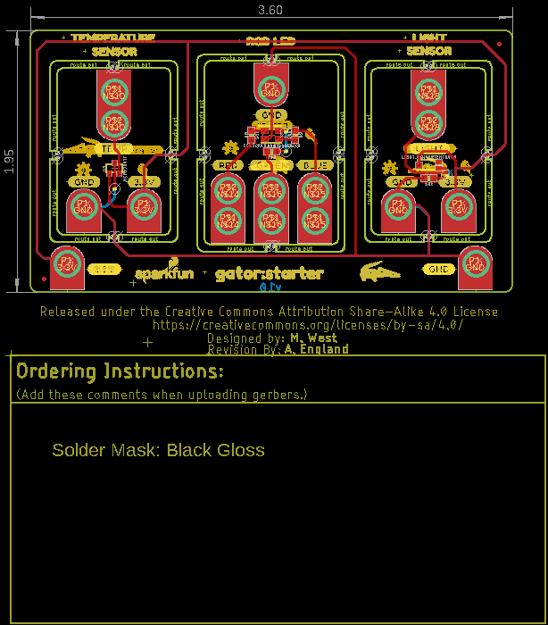
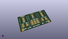
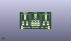
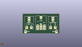
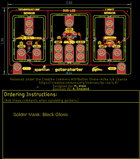
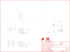

Contents
========

* [PRS14891 > gator starter](#prs14891--gator-starter)
	* [Schematic](#schematic)
	* [PCB](#pcb)
	* [Interactive BOM](#interactive-bom)
	* [OOMP Parts](#oomp-parts)
	* [Images](#images)
	* [Tags](#tags)
  
![][im]
# PRS14891 > gator starter

- ID: PROJ-SPAR-14891-STAN-01
- Hex ID: PRS14891
- Name: Sparkfun
- Description: Sparkfun
- Long Link: [http://oom.lt/PROJ-SPAR-14891-STAN-01](http://oom.lt/PROJ-SPAR-14891-STAN-01)
- Short Link: [http://oom.lt/PRS14891](http://oom.lt/PRS14891)

## Schematic
  

## PCB
  

## Interactive BOM

- Interactive BOM page: [ibom.html](https://htmlpreview.github.io/?https://github.com/oomlout/oomlout_OOMP_projects/blob/main/PROJ-SPAR-14891-STAN-01/kicad/bom/ibom.html)

## OOMP Parts
  

|OOMP Parts|
| :---: |
|LEDS-UNMATCHED-G-STAN-01 D1|
|[RESE-0603-X-O201-01  SMD (0603) 200 Ohm Resistor  R8](https://github.com/oomlout/oomlout_OOMP_parts/tree/main/RESE-0603-X-O201-01/)|
|[RESE-0603-X-O101-01  SMD (0603) 100 Ohm Resistor  R9, R10](https://github.com/oomlout/oomlout_OOMP_parts/tree/main/RESE-0603-X-O101-01/)|
|[RESE-0603-X-O103-01  SMD (0603) 10k Ohm Resistor  R11](https://github.com/oomlout/oomlout_OOMP_parts/tree/main/RESE-0603-X-O103-01/)|
|UNMATCHED-UNMATCHED-X-UNMATCHED-01 U2|
|UNMATCHED-SO23-X-UNMATCHED-01 U3|

## Images
  
  

|kicadPcb3d|kicadPcb3dFront|kicadPcb3dBack|eagleImage|eagleSchemImage|
| :---: | :---: | :---: | :---: | :---: |
||||||

## Tags

- hexID: PRS14891
- oompType: PROJ
- oompSize: SPAR
- oompColor: 14891
- oompDesc: STAN
- oompIndex: 01
- oompName: gator starter
- sources: All source files from https://github.com/sparkfun/gator_starter (source licence details in srcLicense.md)
- linkBuyPage: https://www.sparkfun.com/products/14891
- oompID: PROJ-SPAR-14891-STAN-01
- oompParts: D1,LEDS-UNMATCHED-G-STAN-01
- oompParts: R8,RESE-0603-X-O201-01
- oompParts: R9,RESE-0603-X-O101-01
- oompParts: R10,RESE-0603-X-O101-01
- oompParts: R11,RESE-0603-X-O103-01
- oompParts: U2,UNMATCHED-UNMATCHED-X-UNMATCHED-01
- oompParts: U3,UNMATCHED-SO23-X-UNMATCHED-01
- rawParts: D1,XZM2CRKM2DGFBB45SCCB,SUNLEDSMD1,PLCC4SMDLED,LED-RGB Common Cathode,DIO-13722,,XZM2CRKM2DGFBB45SCCB,
- rawParts: FD1,FIDUCIALUFIDUCIAL,FIDUCIALUFIDUCIAL,FIDUCIAL-MICRO,Fiducial Alignment Points,,,,
- rawParts: FD2,FIDUCIALUFIDUCIAL,FIDUCIALUFIDUCIAL,FIDUCIAL-MICRO,Fiducial Alignment Points,,,,
- rawParts: FD3,FIDUCIALUFIDUCIAL,FIDUCIALUFIDUCIAL,FIDUCIAL-MICRO,Fiducial Alignment Points,,,,
- rawParts: FD4,FIDUCIALUFIDUCIAL,FIDUCIALUFIDUCIAL,FIDUCIAL-MICRO,Fiducial Alignment Points,,,,
- rawParts: FRAME1,FRAME-LETTER,FRAME-LETTER,CREATIVE_COMMONS,Schematic Frame - Letter,,,,
- rawParts: LOGO1,SFE_LOGO_FLAME.1_INCH,SFE_LOGO_FLAME.1_INCH,SFE_LOGO_FLAME_.1,SparkFun Flame Logo,,,,
- rawParts: LOGO2,OSHW-LOGOS,OSHW-LOGOS,OSHW-LOGO-S,Open-Source Hardware (OSHW) Logo,,,,
- rawParts: LOGO7,REVISION,REVISION,REVISION,Revision By Text,,,,
- rawParts: R8,200,200OHM-0603-1/10W-1%,0603,200Ω resistor,RES-08220,,200,
- rawParts: R9,100,100OHM-0603-1/4W-5%,0603,100Ω resistor,RES-12438,,100,
- rawParts: R10,100,100OHM-0603-1/4W-5%,0603,100Ω resistor,RES-12438,,100,
- rawParts: R11,10k,10KOHM-0603-1/10W-1%,0603,10kΩ resistor,RES-00824,,10k,
- rawParts: U$10,GATOR,GATOR,GATOR,,,,,
- rawParts: U$11,TAB_GATOR_MINI,TAB_GATOR_MINI,TAB_GATOR_MINI,,,,,
- rawParts: U$12,TAB_GATOR_MINI,TAB_GATOR_MINI,TAB_GATOR_MINI,,,,,
- rawParts: U$14,GATOR,GATOR,GATOR,,,,,
- rawParts: U$15,GATOR,GATOR,GATOR,,,,,
- rawParts: U$19,TAB_GATOR_MINI,TAB_GATOR_MINI,TAB_GATOR_MINI,,,,,
- rawParts: U$22,TAB_GATOR_MINI,TAB_GATOR_MINI,TAB_GATOR_MINI,,,,,
- rawParts: U$23,GATOR,GATOR,GATOR,,,,,
- rawParts: U$24,GATOR,GATOR,GATOR,,,,,
- rawParts: U$25,TAB_GATOR_MINI,TAB_GATOR_MINI,TAB_GATOR_MINI,,,,,
- rawParts: U$26,TAB_GATOR_MINI,TAB_GATOR_MINI,TAB_GATOR_MINI,,,,,
- rawParts: U$35,TAB_GATOR_MINI,TAB_GATOR_MINI,TAB_GATOR_MINI,,,,,
- rawParts: U2,LIGHT_SENSORTEMT6000,LIGHT_SENSORTEMT6000,TEMT6000,Ambient Light Sensors - Phototransistors,COMP-08569,COM-08348,,
- rawParts: U3,MCP9700TT,MCP9700TT,SOT23-3,Microchip MCP9700 Analog-Output Temperature Sensor,IC-08917,,,

[im]: kicadPcb3d_450.png
