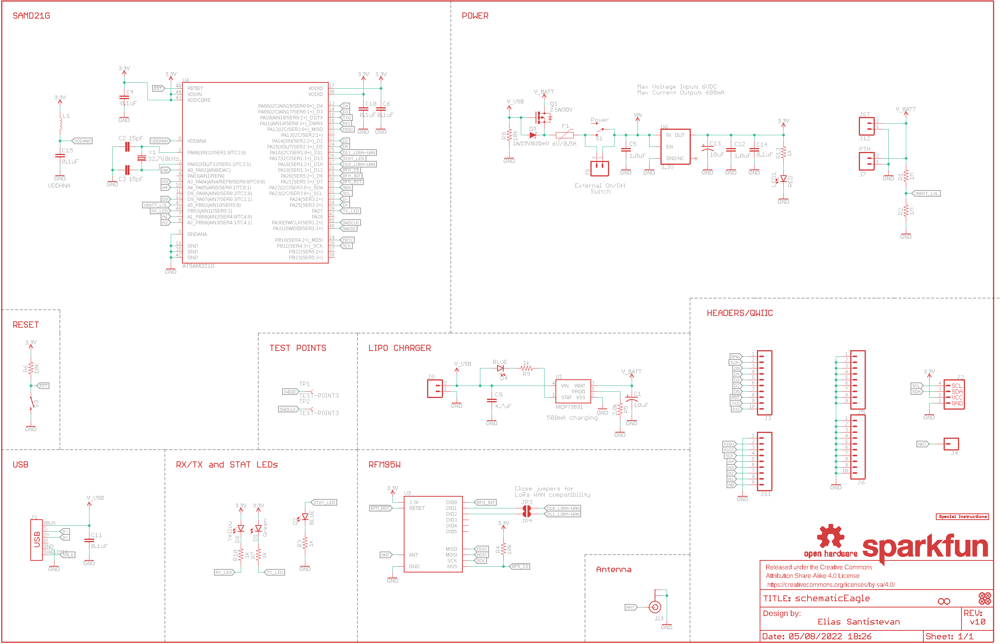
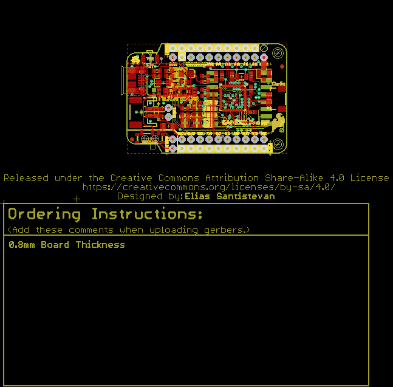
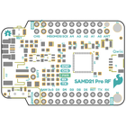
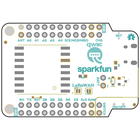
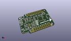
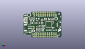
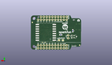
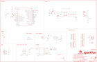
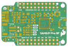
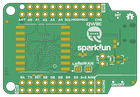

Contents
========

* [PRS14916 > SAMD21 Pro RF](#prs14916--samd21-pro-rf)
	* [Schematic](#schematic)
	* [PCB](#pcb)
	* [Interactive BOM](#interactive-bom)
	* [OOMP Parts](#oomp-parts)
	* [Images](#images)
	* [Tags](#tags)
  
![][im]
# PRS14916 > SAMD21 Pro RF

- ID: PROJ-SPAR-14916-STAN-01
- Hex ID: PRS14916
- Name: Sparkfun
- Description: Sparkfun
- Long Link: [http://oom.lt/PROJ-SPAR-14916-STAN-01](http://oom.lt/PROJ-SPAR-14916-STAN-01)
- Short Link: [http://oom.lt/PRS14916](http://oom.lt/PRS14916)

## Schematic
  

## PCB
  

## Interactive BOM

- Interactive BOM page: [ibom.html](https://htmlpreview.github.io/?https://github.com/oomlout/oomlout_OOMP_projects/blob/main/PROJ-SPAR-14916-STAN-01/kicad/bom/ibom.html)

## OOMP Parts
  

|OOMP Parts|
| :---: |
|CAPT-3216-X-UF10-01 C1, C13|
|[CAPC-0603-X-PF15-V50  SMD (0603) 15 pF Capacitor (Ceramic) 50v  C2, C3](https://github.com/oomlout/oomlout_OOMP_parts/tree/main/CAPC-0603-X-PF15-V50/)|
|[CAPC-0603-X-NF100-V50  SMD (0603) 100 nF Capacitor (Ceramic) 50v  C4, C6, C10, C11, C14, C15](https://github.com/oomlout/oomlout_OOMP_parts/tree/main/CAPC-0603-X-NF100-V50/)|
|CAPC-0603-X-UNMATCHED-01 C5, C12|
|[CAPC-0603-X-UF47D-V10  SMD (0603) 4.7 uF Capacitor (Ceramic) 10v  C9](https://github.com/oomlout/oomlout_OOMP_parts/tree/main/CAPC-0603-X-UF47D-V10/)|
|[LEDS-0603-G-STAN-01  SMD (0603) Green LED  D1](https://github.com/oomlout/oomlout_OOMP_parts/tree/main/LEDS-0603-G-STAN-01/)|
|[LEDS-0603-L-STAN-01  SMD (0603) Blue LED  D2, D4](https://github.com/oomlout/oomlout_OOMP_parts/tree/main/LEDS-0603-L-STAN-01/)|
|DIOD-S323-X-UNMATCHED-01 D3|
|[LEDS-0603-Y-STAN-01  SMD (0603) Yellow LED  D6](https://github.com/oomlout/oomlout_OOMP_parts/tree/main/LEDS-0603-Y-STAN-01/)|
|UNMATCHED-1206-X-UNMATCHED-01 F1|
|UNMATCHED-UNMATCHED-X-UNMATCHED-01 J1, J2, J13, JP3, JP4, S1, S3, U$26, U3, U4, Y1|
|[HEAD-I01-X-PI10-01  2.54 mm 10 Pin Header  J3, J6](https://github.com/oomlout/oomlout_OOMP_parts/tree/main/HEAD-I01-X-PI10-01/)|
|HEAD-I01-X-PI01-01 J4|
|[HEAD-I01-X-PI09-01  2.54 mm 9 Pin Header  J5, J11](https://github.com/oomlout/oomlout_OOMP_parts/tree/main/HEAD-I01-X-PI09-01/)|
|[HEAD-I01-X-PI02-01  2.54 mm 2 Pin Header  J7, J8, J9](https://github.com/oomlout/oomlout_OOMP_parts/tree/main/HEAD-I01-X-PI02-01/)|
|HEAD-I01-X-UNMATCHED-01 J12|
|UNMATCHED-0603-X-UNMATCHED-01 L1|
|[LEDS-0603-R-STAN-01  SMD (0603) Red LED  LED1](https://github.com/oomlout/oomlout_OOMP_parts/tree/main/LEDS-0603-R-STAN-01/)|
|UNMATCHED-SO23-X-UNMATCHED-01 Q1|
|[RESE-0603-X-O105-01  SMD (0603) 1M Ohm Resistor  R1, R2](https://github.com/oomlout/oomlout_OOMP_parts/tree/main/RESE-0603-X-O105-01/)|
|[RESE-0603-X-O102-01  SMD (0603) 1k Ohm Resistor  R3, R7, R9, R10, R13](https://github.com/oomlout/oomlout_OOMP_parts/tree/main/RESE-0603-X-O102-01/)|
|[RESE-0603-X-O103-01  SMD (0603) 10k Ohm Resistor  R4, R6, R8](https://github.com/oomlout/oomlout_OOMP_parts/tree/main/RESE-0603-X-O103-01/)|
|RESE-0603-X-UNMATCHED-01 R5|
|UNMATCHED-SO235-X-UNMATCHED-01 U1|
|VREG-SO235-X-KAP2112K-V33D U6|

## Images
  
  

|bominteractivefront|bominteractiveback|kicadPcb3d|kicadPcb3dFront|kicadPcb3dBack|eagleImage|eagleSchemImage|pcbdraw|pcbdrawback|
| :---: | :---: | :---: | :---: | :---: | :---: | :---: | :---: | :---: |
||||||||||

## Tags

- hexID: PRS14916
- oompType: PROJ
- oompSize: SPAR
- oompColor: 14916
- oompDesc: STAN
- oompIndex: 01
- oompName: SAMD21 Pro RF
- sources: All source files from https://github.com/sparkfun/SAMD21_Pro_RF (source licence details in srcLicense.md)
- linkBuyPage: https://www.sparkfun.com/products/14916
- oompID: PROJ-SPAR-14916-STAN-01
- oompParts: C1,CAPT-3216-X-UF10-01
- oompParts: C2,CAPC-0603-X-PF15-V50
- oompParts: C3,CAPC-0603-X-PF15-V50
- oompParts: C4,CAPC-0603-X-NF100-V50
- oompParts: C5,CAPC-0603-X-UNMATCHED-01
- oompParts: C6,CAPC-0603-X-NF100-V50
- oompParts: C9,CAPC-0603-X-UF47D-V10
- oompParts: C10,CAPC-0603-X-NF100-V50
- oompParts: C11,CAPC-0603-X-NF100-V50
- oompParts: C12,CAPC-0603-X-UNMATCHED-01
- oompParts: C13,CAPT-3216-X-UF10-01
- oompParts: C14,CAPC-0603-X-NF100-V50
- oompParts: C15,CAPC-0603-X-NF100-V50
- oompParts: D1,LEDS-0603-G-STAN-01
- oompParts: D2,LEDS-0603-L-STAN-01
- oompParts: D3,DIOD-S323-X-UNMATCHED-01
- oompParts: D4,LEDS-0603-L-STAN-01
- oompParts: D6,LEDS-0603-Y-STAN-01
- oompParts: F1,UNMATCHED-1206-X-UNMATCHED-01
- oompParts: J1,UNMATCHED-UNMATCHED-X-UNMATCHED-01
- oompParts: J2,UNMATCHED-UNMATCHED-X-UNMATCHED-01
- oompParts: J3,HEAD-I01-X-PI10-01
- oompParts: J4,HEAD-I01-X-PI01-01
- oompParts: J5,HEAD-I01-X-PI09-01
- oompParts: J6,HEAD-I01-X-PI10-01
- oompParts: J7,HEAD-I01-X-PI02-01
- oompParts: J8,HEAD-I01-X-PI02-01
- oompParts: J9,HEAD-I01-X-PI02-01
- oompParts: J11,HEAD-I01-X-PI09-01
- oompParts: J12,HEAD-I01-X-UNMATCHED-01
- oompParts: J13,UNMATCHED-UNMATCHED-X-UNMATCHED-01
- oompParts: JP3,UNMATCHED-UNMATCHED-X-UNMATCHED-01
- oompParts: JP4,UNMATCHED-UNMATCHED-X-UNMATCHED-01
- oompParts: L1,UNMATCHED-0603-X-UNMATCHED-01
- oompParts: LED1,LEDS-0603-R-STAN-01
- oompParts: Q1,UNMATCHED-SO23-X-UNMATCHED-01
- oompParts: R1,RESE-0603-X-O105-01
- oompParts: R2,RESE-0603-X-O105-01
- oompParts: R3,RESE-0603-X-O102-01
- oompParts: R4,RESE-0603-X-O103-01
- oompParts: R5,RESE-0603-X-UNMATCHED-01
- oompParts: R6,RESE-0603-X-O103-01
- oompParts: R7,RESE-0603-X-O102-01
- oompParts: R8,RESE-0603-X-O103-01
- oompParts: R9,RESE-0603-X-O102-01
- oompParts: R10,RESE-0603-X-O102-01
- oompParts: R13,RESE-0603-X-O102-01
- oompParts: S1,UNMATCHED-UNMATCHED-X-UNMATCHED-01
- oompParts: S3,UNMATCHED-UNMATCHED-X-UNMATCHED-01
- oompParts: U$26,UNMATCHED-UNMATCHED-X-UNMATCHED-01
- oompParts: U1,UNMATCHED-SO235-X-UNMATCHED-01
- oompParts: U3,UNMATCHED-UNMATCHED-X-UNMATCHED-01
- oompParts: U4,UNMATCHED-UNMATCHED-X-UNMATCHED-01
- oompParts: U6,VREG-SO235-X-KAP2112K-V33D
- oompParts: Y1,UNMATCHED-UNMATCHED-X-UNMATCHED-01
- rawParts: C1,10uF,10UF-POLAR-EIA3216-16V-10%(TANT),EIA3216,10.0µF polarized capacitors,CAP-00811,,,10uF,
- rawParts: C2,15pF,15PF-0603-50V-5%,0603,15pF ceramic capacitors,CAP-07881,,,15pF,
- rawParts: C3,15pF,15PF-0603-50V-5%,0603,15pF ceramic capacitors,CAP-07881,,,15pF,
- rawParts: C4,0.1uF,0.1UF-0603-25V-(+80/-20%),0603,0.1µF ceramic capacitors,CAP-00810,,,0.1uF,
- rawParts: C5,1.0uF,1.0UF-0603-16V-10%,0603,1µF ceramic capacitors,CAP-00868,,,1.0uF,
- rawParts: C6,0.1uF,0.1UF-0603-25V-(+80/-20%),0603,0.1µF ceramic capacitors,CAP-00810,,,0.1uF,
- rawParts: C9,4.7uF,4.7UF-0603-6.3V-(10%),0603,4.7µF ceramic capacitors,CAP-08280,,,4.7uF,
- rawParts: C10,0.1uF,0.1UF-0603-25V-(+80/-20%),0603,0.1µF ceramic capacitors,CAP-00810,,,0.1uF,
- rawParts: C11,0.1uF,0.1UF-0603-25V-(+80/-20%),0603,0.1µF ceramic capacitors,CAP-00810,,,0.1uF,
- rawParts: C12,1.0uF,1.0UF-0603-16V-10%,0603,1µF ceramic capacitors,CAP-00868,,,1.0uF,
- rawParts: C13,10uF,10UF-POLAR-EIA3216-16V-10%(TANT),EIA3216,10.0µF polarized capacitors,CAP-00811,,,10uF,
- rawParts: C14,0.1uF,0.1UF-0603-25V-(+80/-20%),0603,0.1µF ceramic capacitors,CAP-00810,,,0.1uF,
- rawParts: C15,0.1uF,0.1UF-0603-25V-(+80/-20%),0603,0.1µF ceramic capacitors,CAP-00810,,,0.1uF,
- rawParts: D1,Green,LED-GREEN0603,LED-0603,Green SMD LED,DIO-00821,,,GREEN,
- rawParts: D2,BLUE,LED-BLUE0603,LED-0603,Blue SMD LED,DIO-08575,,,BLUE,
- rawParts: D3,1A/23V/620mV,DIODE-SCHOTTKY-BAT20J,SOD-323,Schottky diode,DIO-11623,,,1A/23V/620mV,
- rawParts: D4,BLUE,LED-BLUE0603,LED-0603,Blue SMD LED,DIO-08575,,,BLUE,
- rawParts: D6,Yellow,LED-YELLOW0603,LED-0603,Yellow SMD LED,DIO-09003,,,Yellow,
- rawParts: F1,6V/0.5A,PPTC_HALF-AMP,1206,Resettable Fuse PPTC,RES-08585,,,6V/0.5A,
- rawParts: FD1,FIDUCIAL1X2,FIDUCIAL1X2,FIDUCIAL-1X2,Fiducial Alignment Points,,,,,
- rawParts: FD2,FIDUCIAL1X2,FIDUCIAL1X2,FIDUCIAL-1X2,Fiducial Alignment Points,,,,,
- rawParts: FD3,FIDUCIAL1X2,FIDUCIAL1X2,FIDUCIAL-1X2,Fiducial Alignment Points,,,,,
- rawParts: FD4,FIDUCIAL1X2,FIDUCIAL1X2,FIDUCIAL-1X2,Fiducial Alignment Points,,,,,
- rawParts: FRAME2,FRAME-LEDGER,FRAME-LEDGER,CREATIVE_COMMONS,Schematic Frame - Ledger,,,,,
- rawParts: H1,STAND-OFFTIGHT,STAND-OFFTIGHT,STAND-OFF-TIGHT,Stand Off,,,,,
- rawParts: H2,STAND-OFFTIGHT,STAND-OFFTIGHT,STAND-OFF-TIGHT,Stand Off,,,,,
- rawParts: J1,,USB_MICRO-B_HALF_PTH_MILL,USB-MICROB-PTH-MILL,USB Type Micro-B Connector,CONN-13711,,,,
- rawParts: J2,,QWIIC_CONNECTORJS-1MM,1X04_1MM_RA,SparkFun I2C Standard Qwiic Connector,CONN-13694,,,,
- rawParts: J3,,CONN_10NO_SILK_PTH_FEMALE,1X10_NO_SILK,Multi connection point. Often used as Generic Header-pin footprint for 0.1 inch spaced/style header connections,CONN-11563,,,,
- rawParts: J4,,CONN_01PTH_NO_SILK_YES_STOP,1X01_NO_SILK,Single connection point. Often used as Generic Header-pin footprint for 0.1 inch spaced/style header connections,,,,,
- rawParts: J5,,CONN_09NO_SILK,1X09_NO_SILK,Multi connection point. Often used as Generic Header-pin footprint for 0.1 inch spaced/style header connections,,,,,
- rawParts: J6,,CONN_10NO_SILK_PTH_FEMALE,1X10_NO_SILK,Multi connection point. Often used as Generic Header-pin footprint for 0.1 inch spaced/style header connections,CONN-11563,,,,
- rawParts: J7,PTH,CONN_021X02_NO_SILK,1X02_NO_SILK,Multi connection point. Often used as Generic Header-pin footprint for 0.1 inch spaced/style header connections,,,,,
- rawParts: J8,,CONN_021X02_NO_SILK,1X02_NO_SILK,Multi connection point. Often used as Generic Header-pin footprint for 0.1 inch spaced/style header connections,,,,,
- rawParts: J9,External On/Off,CONN_021X02_NO_SILK,1X02_NO_SILK,Multi connection point. Often used as Generic Header-pin footprint for 0.1 inch spaced/style header connections,,,,,
- rawParts: J11,,CONN_09NO_SILK,1X09_NO_SILK,Multi connection point. Often used as Generic Header-pin footprint for 0.1 inch spaced/style header connections,,,,,
- rawParts: J12,JST,CONN_02-JST-2MM-SMT,JST-2-SMD,Multi connection point. Often used as Generic Header-pin footprint for 0.1 inch spaced/style header connections,CONN-11443,,,,
- rawParts: J13,U.FL,U.FL,U.FL,SMD Antenna Connector - U.FL,CONN-09193,WRL-09144,,U.FL,
- rawParts: JP3,,JUMPER-SMT_2_NO_SILK,SMT-JUMPER_2_NO_SILK,Normally open jumper,,,,,
- rawParts: JP4,,JUMPER-SMT_2_NO_SILK,SMT-JUMPER_2_NO_SILK,Normally open jumper,,,,,
- rawParts: L1,,INDUCTORFB-30OHM,0603,Inductors,NDUC-07859,,,,
- rawParts: LED1,RED,LED-RED0603,LED-0603,Red SMD LED,DIO-00819,,,RED,
- rawParts: LOGO1,OSHW-LOGOMINI,OSHW-LOGOMINI,OSHW-LOGO-MINI,Open-Source Hardware (OSHW) Logo,,,,,
- rawParts: LOGO2,SFE_LOGO_NAME.1_INCH,SFE_LOGO_NAME.1_INCH,SFE_LOGO_NAME_.1,SparkFun Font Logo,,,,,
- rawParts: Q1,2.5A/30V,MOSFET-PCHANNELDMG2307L,SOT23-3@1,Generic PMOSFET,TRANS-11308,,,2.5A/30V,
- rawParts: R1,1M,1MOHM-0603-1/4W-5%,0603,1MΩ resistor,RES-07868,,,1M,
- rawParts: R2,1M,1MOHM-0603-1/4W-5%,0603,1MΩ resistor,RES-07868,,,1M,
- rawParts: R3,1k,1KOHM-0603-1/10W-1%,0603,1kΩ resistor,RES-07856,,,1k,
- rawParts: R4,10k,10KOHM-0603-1/10W-1%,0603,10kΩ resistor,RES-00824,,,10k,
- rawParts: R5,2.0k,2.0KOHM-0603-1/10W-5%,0603,2kΩ resistor,RES-08296,,,2.0k,
- rawParts: R6,10k,10KOHM-0603-1/10W-1%,0603,10kΩ resistor,RES-00824,,,10k,
- rawParts: R7,1k,1KOHM-0603-1/10W-1%,0603,1kΩ resistor,RES-07856,,,1k,
- rawParts: R8,10k,10KOHM-0603-1/10W-1%,0603,10kΩ resistor,RES-00824,,,10k,
- rawParts: R9,1k,1KOHM-0603-1/10W-1%,0603,1kΩ resistor,RES-07856,,,1k,
- rawParts: R10,1k,1KOHM-0603-1/10W-1%,0603,1kΩ resistor,RES-07856,,,1k,
- rawParts: R13,1k,1KOHM-0603-1/10W-1%,0603,1kΩ resistor,RES-07856,,,1k,
- rawParts: S1,Power,SWITCH-SPDT-SMD-RIGHT-ANGLE,SWITCH_SPST_SMD_A,Single Pole, Double Throw (SPDT) Switch,SWCH-10651,,COM-10860,,
- rawParts: S3,,MOMENTARY-SWITCH-SPST-SMD-RIGHT-ANGLE,TACTILE_SWITCH_SMD_RIGHT_ANGLE,Momentary Switch (Pushbutton) - SPST,COMP-12265,,,,
- rawParts: TP1,TEST-POINT3,TEST-POINT3,PAD.03X.03,SparkFun Test Points,,,,,
- rawParts: TP2,TEST-POINT3,TEST-POINT3,PAD.03X.03,SparkFun Test Points,,,,,
- rawParts: U$26,SPECIAL_INSTRUCTIONS-ORDERING,SPECIAL_INSTRUCTIONS-ORDERING,ORDERING_INSTRUCTIONS,Special Ordering/Production Instructions Alert,,,,,
- rawParts: U1,MCP73831,MCP73831,SOT23-5,MCP73831T Li-Ion, Li-Pol Controller,IC-09995,,,,
- rawParts: U3,RFM95W,RFM95W,RFM95/96/97/98W,RFM95/96/97/98,IC-13959,,,,
- rawParts: U4,ATSAMD21G,ATSAMD21G,QFN-48_NO_EXPOSED_PAD,Atmel SAMD21G SMART ARM-Based Microcontroller,IC-14066,,,,
- rawParts: U6,3.3V,V_REG_AP2112K-3.3V,SOT23-5,AP2112 - 600mA CMOS LDO Regulator w/ Enable,VREG-12457,,,3.3V,
- rawParts: Y1,32.768kHz,CRYSTAL-32.768KHZSMD-3.2X1.5,CRYSTAL-SMD-3.2X1.5MM,32.768kHz Crystal,XTAL-13062,,,32.768kHz,

[im]: kicadPcb3d_450.png
