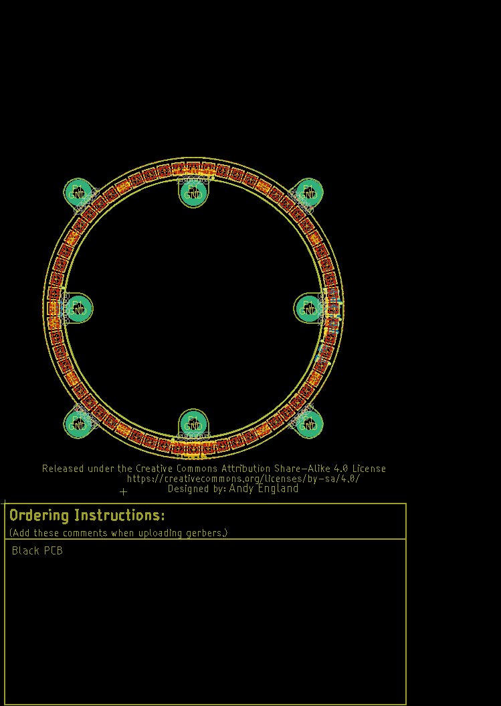
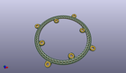
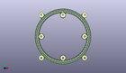
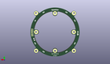
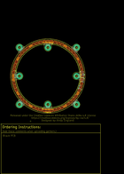
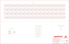

Contents
========

* [PRS14965 > LuMini 3 Inch](#prs14965--lumini-3-inch)
	* [Schematic](#schematic)
	* [PCB](#pcb)
	* [Interactive BOM](#interactive-bom)
	* [OOMP Parts](#oomp-parts)
	* [Images](#images)
	* [Tags](#tags)
  
![][im]
# PRS14965 > LuMini 3 Inch

- ID: PROJ-SPAR-14965-STAN-01
- Hex ID: PRS14965
- Name: Sparkfun
- Description: Sparkfun
- Long Link: [http://oom.lt/PROJ-SPAR-14965-STAN-01](http://oom.lt/PROJ-SPAR-14965-STAN-01)
- Short Link: [http://oom.lt/PRS14965](http://oom.lt/PRS14965)

## Schematic
  

## PCB
  

## Interactive BOM

- Interactive BOM page: [ibom.html](https://htmlpreview.github.io/?https://github.com/oomlout/oomlout_OOMP_projects/blob/main/PROJ-SPAR-14965-STAN-01/kicad/bom/ibom.html)

## OOMP Parts
  

|OOMP Parts|
| :---: |
|[D1 LEDS-2020-RGB-K102-01 SMD (2020) Smart Controller (APA102) RGB LED](https://github.com/oomlout/oomlout_OOMP_parts/tree/main/LEDS-2020-RGB-K102-01/)|
|[D2 LEDS-2020-RGB-K102-01 SMD (2020) Smart Controller (APA102) RGB LED](https://github.com/oomlout/oomlout_OOMP_parts/tree/main/LEDS-2020-RGB-K102-01/)|
|[D3 LEDS-2020-RGB-K102-01 SMD (2020) Smart Controller (APA102) RGB LED](https://github.com/oomlout/oomlout_OOMP_parts/tree/main/LEDS-2020-RGB-K102-01/)|
|[D4 LEDS-2020-RGB-K102-01 SMD (2020) Smart Controller (APA102) RGB LED](https://github.com/oomlout/oomlout_OOMP_parts/tree/main/LEDS-2020-RGB-K102-01/)|
|[D5 LEDS-2020-RGB-K102-01 SMD (2020) Smart Controller (APA102) RGB LED](https://github.com/oomlout/oomlout_OOMP_parts/tree/main/LEDS-2020-RGB-K102-01/)|
|[D6 LEDS-2020-RGB-K102-01 SMD (2020) Smart Controller (APA102) RGB LED](https://github.com/oomlout/oomlout_OOMP_parts/tree/main/LEDS-2020-RGB-K102-01/)|
|[D7 LEDS-2020-RGB-K102-01 SMD (2020) Smart Controller (APA102) RGB LED](https://github.com/oomlout/oomlout_OOMP_parts/tree/main/LEDS-2020-RGB-K102-01/)|
|[D8 LEDS-2020-RGB-K102-01 SMD (2020) Smart Controller (APA102) RGB LED](https://github.com/oomlout/oomlout_OOMP_parts/tree/main/LEDS-2020-RGB-K102-01/)|
|[D9 LEDS-2020-RGB-K102-01 SMD (2020) Smart Controller (APA102) RGB LED](https://github.com/oomlout/oomlout_OOMP_parts/tree/main/LEDS-2020-RGB-K102-01/)|
|[D10 LEDS-2020-RGB-K102-01 SMD (2020) Smart Controller (APA102) RGB LED](https://github.com/oomlout/oomlout_OOMP_parts/tree/main/LEDS-2020-RGB-K102-01/)|
|[D11 LEDS-2020-RGB-K102-01 SMD (2020) Smart Controller (APA102) RGB LED](https://github.com/oomlout/oomlout_OOMP_parts/tree/main/LEDS-2020-RGB-K102-01/)|
|[D12 LEDS-2020-RGB-K102-01 SMD (2020) Smart Controller (APA102) RGB LED](https://github.com/oomlout/oomlout_OOMP_parts/tree/main/LEDS-2020-RGB-K102-01/)|
|[D13 LEDS-2020-RGB-K102-01 SMD (2020) Smart Controller (APA102) RGB LED](https://github.com/oomlout/oomlout_OOMP_parts/tree/main/LEDS-2020-RGB-K102-01/)|
|[D14 LEDS-2020-RGB-K102-01 SMD (2020) Smart Controller (APA102) RGB LED](https://github.com/oomlout/oomlout_OOMP_parts/tree/main/LEDS-2020-RGB-K102-01/)|
|[D15 LEDS-2020-RGB-K102-01 SMD (2020) Smart Controller (APA102) RGB LED](https://github.com/oomlout/oomlout_OOMP_parts/tree/main/LEDS-2020-RGB-K102-01/)|
|[D16 LEDS-2020-RGB-K102-01 SMD (2020) Smart Controller (APA102) RGB LED](https://github.com/oomlout/oomlout_OOMP_parts/tree/main/LEDS-2020-RGB-K102-01/)|
|[D17 LEDS-2020-RGB-K102-01 SMD (2020) Smart Controller (APA102) RGB LED](https://github.com/oomlout/oomlout_OOMP_parts/tree/main/LEDS-2020-RGB-K102-01/)|
|[D18 LEDS-2020-RGB-K102-01 SMD (2020) Smart Controller (APA102) RGB LED](https://github.com/oomlout/oomlout_OOMP_parts/tree/main/LEDS-2020-RGB-K102-01/)|
|[D19 LEDS-2020-RGB-K102-01 SMD (2020) Smart Controller (APA102) RGB LED](https://github.com/oomlout/oomlout_OOMP_parts/tree/main/LEDS-2020-RGB-K102-01/)|
|[D20 LEDS-2020-RGB-K102-01 SMD (2020) Smart Controller (APA102) RGB LED](https://github.com/oomlout/oomlout_OOMP_parts/tree/main/LEDS-2020-RGB-K102-01/)|
|[D21 LEDS-2020-RGB-K102-01 SMD (2020) Smart Controller (APA102) RGB LED](https://github.com/oomlout/oomlout_OOMP_parts/tree/main/LEDS-2020-RGB-K102-01/)|
|[D22 LEDS-2020-RGB-K102-01 SMD (2020) Smart Controller (APA102) RGB LED](https://github.com/oomlout/oomlout_OOMP_parts/tree/main/LEDS-2020-RGB-K102-01/)|
|[D23 LEDS-2020-RGB-K102-01 SMD (2020) Smart Controller (APA102) RGB LED](https://github.com/oomlout/oomlout_OOMP_parts/tree/main/LEDS-2020-RGB-K102-01/)|
|[D24 LEDS-2020-RGB-K102-01 SMD (2020) Smart Controller (APA102) RGB LED](https://github.com/oomlout/oomlout_OOMP_parts/tree/main/LEDS-2020-RGB-K102-01/)|
|[D25 LEDS-2020-RGB-K102-01 SMD (2020) Smart Controller (APA102) RGB LED](https://github.com/oomlout/oomlout_OOMP_parts/tree/main/LEDS-2020-RGB-K102-01/)|
|[D26 LEDS-2020-RGB-K102-01 SMD (2020) Smart Controller (APA102) RGB LED](https://github.com/oomlout/oomlout_OOMP_parts/tree/main/LEDS-2020-RGB-K102-01/)|
|[D27 LEDS-2020-RGB-K102-01 SMD (2020) Smart Controller (APA102) RGB LED](https://github.com/oomlout/oomlout_OOMP_parts/tree/main/LEDS-2020-RGB-K102-01/)|
|[D28 LEDS-2020-RGB-K102-01 SMD (2020) Smart Controller (APA102) RGB LED](https://github.com/oomlout/oomlout_OOMP_parts/tree/main/LEDS-2020-RGB-K102-01/)|
|[D29 LEDS-2020-RGB-K102-01 SMD (2020) Smart Controller (APA102) RGB LED](https://github.com/oomlout/oomlout_OOMP_parts/tree/main/LEDS-2020-RGB-K102-01/)|
|[D30 LEDS-2020-RGB-K102-01 SMD (2020) Smart Controller (APA102) RGB LED](https://github.com/oomlout/oomlout_OOMP_parts/tree/main/LEDS-2020-RGB-K102-01/)|
|[D31 LEDS-2020-RGB-K102-01 SMD (2020) Smart Controller (APA102) RGB LED](https://github.com/oomlout/oomlout_OOMP_parts/tree/main/LEDS-2020-RGB-K102-01/)|
|[D32 LEDS-2020-RGB-K102-01 SMD (2020) Smart Controller (APA102) RGB LED](https://github.com/oomlout/oomlout_OOMP_parts/tree/main/LEDS-2020-RGB-K102-01/)|
|[D33 LEDS-2020-RGB-K102-01 SMD (2020) Smart Controller (APA102) RGB LED](https://github.com/oomlout/oomlout_OOMP_parts/tree/main/LEDS-2020-RGB-K102-01/)|
|[D34 LEDS-2020-RGB-K102-01 SMD (2020) Smart Controller (APA102) RGB LED](https://github.com/oomlout/oomlout_OOMP_parts/tree/main/LEDS-2020-RGB-K102-01/)|
|[D35 LEDS-2020-RGB-K102-01 SMD (2020) Smart Controller (APA102) RGB LED](https://github.com/oomlout/oomlout_OOMP_parts/tree/main/LEDS-2020-RGB-K102-01/)|
|[D36 LEDS-2020-RGB-K102-01 SMD (2020) Smart Controller (APA102) RGB LED](https://github.com/oomlout/oomlout_OOMP_parts/tree/main/LEDS-2020-RGB-K102-01/)|
|[D37 LEDS-2020-RGB-K102-01 SMD (2020) Smart Controller (APA102) RGB LED](https://github.com/oomlout/oomlout_OOMP_parts/tree/main/LEDS-2020-RGB-K102-01/)|
|[D38 LEDS-2020-RGB-K102-01 SMD (2020) Smart Controller (APA102) RGB LED](https://github.com/oomlout/oomlout_OOMP_parts/tree/main/LEDS-2020-RGB-K102-01/)|
|[D39 LEDS-2020-RGB-K102-01 SMD (2020) Smart Controller (APA102) RGB LED](https://github.com/oomlout/oomlout_OOMP_parts/tree/main/LEDS-2020-RGB-K102-01/)|
|[D40 LEDS-2020-RGB-K102-01 SMD (2020) Smart Controller (APA102) RGB LED](https://github.com/oomlout/oomlout_OOMP_parts/tree/main/LEDS-2020-RGB-K102-01/)|
|[D41 LEDS-2020-RGB-K102-01 SMD (2020) Smart Controller (APA102) RGB LED](https://github.com/oomlout/oomlout_OOMP_parts/tree/main/LEDS-2020-RGB-K102-01/)|
|[D42 LEDS-2020-RGB-K102-01 SMD (2020) Smart Controller (APA102) RGB LED](https://github.com/oomlout/oomlout_OOMP_parts/tree/main/LEDS-2020-RGB-K102-01/)|
|[D43 LEDS-2020-RGB-K102-01 SMD (2020) Smart Controller (APA102) RGB LED](https://github.com/oomlout/oomlout_OOMP_parts/tree/main/LEDS-2020-RGB-K102-01/)|
|[D44 LEDS-2020-RGB-K102-01 SMD (2020) Smart Controller (APA102) RGB LED](https://github.com/oomlout/oomlout_OOMP_parts/tree/main/LEDS-2020-RGB-K102-01/)|
|[D45 LEDS-2020-RGB-K102-01 SMD (2020) Smart Controller (APA102) RGB LED](https://github.com/oomlout/oomlout_OOMP_parts/tree/main/LEDS-2020-RGB-K102-01/)|
|[D46 LEDS-2020-RGB-K102-01 SMD (2020) Smart Controller (APA102) RGB LED](https://github.com/oomlout/oomlout_OOMP_parts/tree/main/LEDS-2020-RGB-K102-01/)|
|[D47 LEDS-2020-RGB-K102-01 SMD (2020) Smart Controller (APA102) RGB LED](https://github.com/oomlout/oomlout_OOMP_parts/tree/main/LEDS-2020-RGB-K102-01/)|
|[D48 LEDS-2020-RGB-K102-01 SMD (2020) Smart Controller (APA102) RGB LED](https://github.com/oomlout/oomlout_OOMP_parts/tree/main/LEDS-2020-RGB-K102-01/)|
|[D49 LEDS-2020-RGB-K102-01 SMD (2020) Smart Controller (APA102) RGB LED](https://github.com/oomlout/oomlout_OOMP_parts/tree/main/LEDS-2020-RGB-K102-01/)|
|[D50 LEDS-2020-RGB-K102-01 SMD (2020) Smart Controller (APA102) RGB LED](https://github.com/oomlout/oomlout_OOMP_parts/tree/main/LEDS-2020-RGB-K102-01/)|
|[D51 LEDS-2020-RGB-K102-01 SMD (2020) Smart Controller (APA102) RGB LED](https://github.com/oomlout/oomlout_OOMP_parts/tree/main/LEDS-2020-RGB-K102-01/)|
|[D52 LEDS-2020-RGB-K102-01 SMD (2020) Smart Controller (APA102) RGB LED](https://github.com/oomlout/oomlout_OOMP_parts/tree/main/LEDS-2020-RGB-K102-01/)|
|[D53 LEDS-2020-RGB-K102-01 SMD (2020) Smart Controller (APA102) RGB LED](https://github.com/oomlout/oomlout_OOMP_parts/tree/main/LEDS-2020-RGB-K102-01/)|
|[D54 LEDS-2020-RGB-K102-01 SMD (2020) Smart Controller (APA102) RGB LED](https://github.com/oomlout/oomlout_OOMP_parts/tree/main/LEDS-2020-RGB-K102-01/)|
|[D55 LEDS-2020-RGB-K102-01 SMD (2020) Smart Controller (APA102) RGB LED](https://github.com/oomlout/oomlout_OOMP_parts/tree/main/LEDS-2020-RGB-K102-01/)|
|[D56 LEDS-2020-RGB-K102-01 SMD (2020) Smart Controller (APA102) RGB LED](https://github.com/oomlout/oomlout_OOMP_parts/tree/main/LEDS-2020-RGB-K102-01/)|
|[D57 LEDS-2020-RGB-K102-01 SMD (2020) Smart Controller (APA102) RGB LED](https://github.com/oomlout/oomlout_OOMP_parts/tree/main/LEDS-2020-RGB-K102-01/)|
|[D58 LEDS-2020-RGB-K102-01 SMD (2020) Smart Controller (APA102) RGB LED](https://github.com/oomlout/oomlout_OOMP_parts/tree/main/LEDS-2020-RGB-K102-01/)|
|[D59 LEDS-2020-RGB-K102-01 SMD (2020) Smart Controller (APA102) RGB LED](https://github.com/oomlout/oomlout_OOMP_parts/tree/main/LEDS-2020-RGB-K102-01/)|
|[D60 LEDS-2020-RGB-K102-01 SMD (2020) Smart Controller (APA102) RGB LED](https://github.com/oomlout/oomlout_OOMP_parts/tree/main/LEDS-2020-RGB-K102-01/)|

## Images
  
  

|kicadPcb3d|kicadPcb3dFront|kicadPcb3dBack|eagleImage|eagleSchemImage|
| :---: | :---: | :---: | :---: | :---: |
||||||

## Tags

- hexID: PRS14965
- oompType: PROJ
- oompSize: SPAR
- oompColor: 14965
- oompDesc: STAN
- oompIndex: 01
- oompName: LuMini 3 Inch
- sources: All source files from https://github.com/sparkfun/LuMini_3_Inch (source licence details in srcLicense.md)
- linkBuyPage: https://www.sparkfun.com/products/14965
- oompID: PROJ-SPAR-14965-STAN-01
- oompParts: D1,LEDS-2020-RGB-K102-01
- oompParts: D2,LEDS-2020-RGB-K102-01
- oompParts: D3,LEDS-2020-RGB-K102-01
- oompParts: D4,LEDS-2020-RGB-K102-01
- oompParts: D5,LEDS-2020-RGB-K102-01
- oompParts: D6,LEDS-2020-RGB-K102-01
- oompParts: D7,LEDS-2020-RGB-K102-01
- oompParts: D8,LEDS-2020-RGB-K102-01
- oompParts: D9,LEDS-2020-RGB-K102-01
- oompParts: D10,LEDS-2020-RGB-K102-01
- oompParts: D11,LEDS-2020-RGB-K102-01
- oompParts: D12,LEDS-2020-RGB-K102-01
- oompParts: D13,LEDS-2020-RGB-K102-01
- oompParts: D14,LEDS-2020-RGB-K102-01
- oompParts: D15,LEDS-2020-RGB-K102-01
- oompParts: D16,LEDS-2020-RGB-K102-01
- oompParts: D17,LEDS-2020-RGB-K102-01
- oompParts: D18,LEDS-2020-RGB-K102-01
- oompParts: D19,LEDS-2020-RGB-K102-01
- oompParts: D20,LEDS-2020-RGB-K102-01
- oompParts: D21,LEDS-2020-RGB-K102-01
- oompParts: D22,LEDS-2020-RGB-K102-01
- oompParts: D23,LEDS-2020-RGB-K102-01
- oompParts: D24,LEDS-2020-RGB-K102-01
- oompParts: D25,LEDS-2020-RGB-K102-01
- oompParts: D26,LEDS-2020-RGB-K102-01
- oompParts: D27,LEDS-2020-RGB-K102-01
- oompParts: D28,LEDS-2020-RGB-K102-01
- oompParts: D29,LEDS-2020-RGB-K102-01
- oompParts: D30,LEDS-2020-RGB-K102-01
- oompParts: D31,LEDS-2020-RGB-K102-01
- oompParts: D32,LEDS-2020-RGB-K102-01
- oompParts: D33,LEDS-2020-RGB-K102-01
- oompParts: D34,LEDS-2020-RGB-K102-01
- oompParts: D35,LEDS-2020-RGB-K102-01
- oompParts: D36,LEDS-2020-RGB-K102-01
- oompParts: D37,LEDS-2020-RGB-K102-01
- oompParts: D38,LEDS-2020-RGB-K102-01
- oompParts: D39,LEDS-2020-RGB-K102-01
- oompParts: D40,LEDS-2020-RGB-K102-01
- oompParts: D41,LEDS-2020-RGB-K102-01
- oompParts: D42,LEDS-2020-RGB-K102-01
- oompParts: D43,LEDS-2020-RGB-K102-01
- oompParts: D44,LEDS-2020-RGB-K102-01
- oompParts: D45,LEDS-2020-RGB-K102-01
- oompParts: D46,LEDS-2020-RGB-K102-01
- oompParts: D47,LEDS-2020-RGB-K102-01
- oompParts: D48,LEDS-2020-RGB-K102-01
- oompParts: D49,LEDS-2020-RGB-K102-01
- oompParts: D50,LEDS-2020-RGB-K102-01
- oompParts: D51,LEDS-2020-RGB-K102-01
- oompParts: D52,LEDS-2020-RGB-K102-01
- oompParts: D53,LEDS-2020-RGB-K102-01
- oompParts: D54,LEDS-2020-RGB-K102-01
- oompParts: D55,LEDS-2020-RGB-K102-01
- oompParts: D56,LEDS-2020-RGB-K102-01
- oompParts: D57,LEDS-2020-RGB-K102-01
- oompParts: D58,LEDS-2020-RGB-K102-01
- oompParts: D59,LEDS-2020-RGB-K102-01
- oompParts: D60,LEDS-2020-RGB-K102-01
- rawParts: C1,DNP,4.7UF-1206-16V-(+80/-20%),1206,4.7µF ceramic capacitors,,CAP-10300,,4.7uF,
- rawParts: D1,APA102-2020,APA102-2020,APA102-2020,APA102 Addressable RGB LED,,DIO-13883,,,
- rawParts: D2,APA102-2020,APA102-2020,APA102-2020,APA102 Addressable RGB LED,,DIO-13883,,,
- rawParts: D3,APA102-2020,APA102-2020,APA102-2020,APA102 Addressable RGB LED,,DIO-13883,,,
- rawParts: D4,APA102-2020,APA102-2020,APA102-2020,APA102 Addressable RGB LED,,DIO-13883,,,
- rawParts: D5,APA102-2020,APA102-2020,APA102-2020,APA102 Addressable RGB LED,,DIO-13883,,,
- rawParts: D6,APA102-2020,APA102-2020,APA102-2020,APA102 Addressable RGB LED,,DIO-13883,,,
- rawParts: D7,APA102-2020,APA102-2020,APA102-2020,APA102 Addressable RGB LED,,DIO-13883,,,
- rawParts: D8,APA102-2020,APA102-2020,APA102-2020,APA102 Addressable RGB LED,,DIO-13883,,,
- rawParts: D9,APA102-2020,APA102-2020,APA102-2020,APA102 Addressable RGB LED,,DIO-13883,,,
- rawParts: D10,APA102-2020,APA102-2020,APA102-2020,APA102 Addressable RGB LED,,DIO-13883,,,
- rawParts: D11,APA102-2020,APA102-2020,APA102-2020,APA102 Addressable RGB LED,,DIO-13883,,,
- rawParts: D12,APA102-2020,APA102-2020,APA102-2020,APA102 Addressable RGB LED,,DIO-13883,,,
- rawParts: D13,APA102-2020,APA102-2020,APA102-2020,APA102 Addressable RGB LED,,DIO-13883,,,
- rawParts: D14,APA102-2020,APA102-2020,APA102-2020,APA102 Addressable RGB LED,,DIO-13883,,,
- rawParts: D15,APA102-2020,APA102-2020,APA102-2020,APA102 Addressable RGB LED,,DIO-13883,,,
- rawParts: D16,APA102-2020,APA102-2020,APA102-2020,APA102 Addressable RGB LED,,DIO-13883,,,
- rawParts: D17,APA102-2020,APA102-2020,APA102-2020,APA102 Addressable RGB LED,,DIO-13883,,,
- rawParts: D18,APA102-2020,APA102-2020,APA102-2020,APA102 Addressable RGB LED,,DIO-13883,,,
- rawParts: D19,APA102-2020,APA102-2020,APA102-2020,APA102 Addressable RGB LED,,DIO-13883,,,
- rawParts: D20,APA102-2020,APA102-2020,APA102-2020,APA102 Addressable RGB LED,,DIO-13883,,,
- rawParts: D21,APA102-2020,APA102-2020,APA102-2020,APA102 Addressable RGB LED,,DIO-13883,,,
- rawParts: D22,APA102-2020,APA102-2020,APA102-2020,APA102 Addressable RGB LED,,DIO-13883,,,
- rawParts: D23,APA102-2020,APA102-2020,APA102-2020,APA102 Addressable RGB LED,,DIO-13883,,,
- rawParts: D24,APA102-2020,APA102-2020,APA102-2020,APA102 Addressable RGB LED,,DIO-13883,,,
- rawParts: D25,APA102-2020,APA102-2020,APA102-2020,APA102 Addressable RGB LED,,DIO-13883,,,
- rawParts: D26,APA102-2020,APA102-2020,APA102-2020,APA102 Addressable RGB LED,,DIO-13883,,,
- rawParts: D27,APA102-2020,APA102-2020,APA102-2020,APA102 Addressable RGB LED,,DIO-13883,,,
- rawParts: D28,APA102-2020,APA102-2020,APA102-2020,APA102 Addressable RGB LED,,DIO-13883,,,
- rawParts: D29,APA102-2020,APA102-2020,APA102-2020,APA102 Addressable RGB LED,,DIO-13883,,,
- rawParts: D30,APA102-2020,APA102-2020,APA102-2020,APA102 Addressable RGB LED,,DIO-13883,,,
- rawParts: D31,APA102-2020,APA102-2020,APA102-2020,APA102 Addressable RGB LED,,DIO-13883,,,
- rawParts: D32,APA102-2020,APA102-2020,APA102-2020,APA102 Addressable RGB LED,,DIO-13883,,,
- rawParts: D33,APA102-2020,APA102-2020,APA102-2020,APA102 Addressable RGB LED,,DIO-13883,,,
- rawParts: D34,APA102-2020,APA102-2020,APA102-2020,APA102 Addressable RGB LED,,DIO-13883,,,
- rawParts: D35,APA102-2020,APA102-2020,APA102-2020,APA102 Addressable RGB LED,,DIO-13883,,,
- rawParts: D36,APA102-2020,APA102-2020,APA102-2020,APA102 Addressable RGB LED,,DIO-13883,,,
- rawParts: D37,APA102-2020,APA102-2020,APA102-2020,APA102 Addressable RGB LED,,DIO-13883,,,
- rawParts: D38,APA102-2020,APA102-2020,APA102-2020,APA102 Addressable RGB LED,,DIO-13883,,,
- rawParts: D39,APA102-2020,APA102-2020,APA102-2020,APA102 Addressable RGB LED,,DIO-13883,,,
- rawParts: D40,APA102-2020,APA102-2020,APA102-2020,APA102 Addressable RGB LED,,DIO-13883,,,
- rawParts: D41,APA102-2020,APA102-2020,APA102-2020,APA102 Addressable RGB LED,,DIO-13883,,,
- rawParts: D42,APA102-2020,APA102-2020,APA102-2020,APA102 Addressable RGB LED,,DIO-13883,,,
- rawParts: D43,APA102-2020,APA102-2020,APA102-2020,APA102 Addressable RGB LED,,DIO-13883,,,
- rawParts: D44,APA102-2020,APA102-2020,APA102-2020,APA102 Addressable RGB LED,,DIO-13883,,,
- rawParts: D45,APA102-2020,APA102-2020,APA102-2020,APA102 Addressable RGB LED,,DIO-13883,,,
- rawParts: D46,APA102-2020,APA102-2020,APA102-2020,APA102 Addressable RGB LED,,DIO-13883,,,
- rawParts: D47,APA102-2020,APA102-2020,APA102-2020,APA102 Addressable RGB LED,,DIO-13883,,,
- rawParts: D48,APA102-2020,APA102-2020,APA102-2020,APA102 Addressable RGB LED,,DIO-13883,,,
- rawParts: D49,APA102-2020,APA102-2020,APA102-2020,APA102 Addressable RGB LED,,DIO-13883,,,
- rawParts: D50,APA102-2020,APA102-2020,APA102-2020,APA102 Addressable RGB LED,,DIO-13883,,,
- rawParts: D51,APA102-2020,APA102-2020,APA102-2020,APA102 Addressable RGB LED,,DIO-13883,,,
- rawParts: D52,APA102-2020,APA102-2020,APA102-2020,APA102 Addressable RGB LED,,DIO-13883,,,
- rawParts: D53,APA102-2020,APA102-2020,APA102-2020,APA102 Addressable RGB LED,,DIO-13883,,,
- rawParts: D54,APA102-2020,APA102-2020,APA102-2020,APA102 Addressable RGB LED,,DIO-13883,,,
- rawParts: D55,APA102-2020,APA102-2020,APA102-2020,APA102 Addressable RGB LED,,DIO-13883,,,
- rawParts: D56,APA102-2020,APA102-2020,APA102-2020,APA102 Addressable RGB LED,,DIO-13883,,,
- rawParts: D57,APA102-2020,APA102-2020,APA102-2020,APA102 Addressable RGB LED,,DIO-13883,,,
- rawParts: D58,APA102-2020,APA102-2020,APA102-2020,APA102 Addressable RGB LED,,DIO-13883,,,
- rawParts: D59,APA102-2020,APA102-2020,APA102-2020,APA102 Addressable RGB LED,,DIO-13883,,,
- rawParts: D60,APA102-2020,APA102-2020,APA102-2020,APA102 Addressable RGB LED,,DIO-13883,,,
- rawParts: FD1,FIDUCIALUFIDUCIAL,FIDUCIALUFIDUCIAL,FIDUCIAL-MICRO,Fiducial Alignment Points,,,,,
- rawParts: FD2,FIDUCIALUFIDUCIAL,FIDUCIALUFIDUCIAL,FIDUCIAL-MICRO,Fiducial Alignment Points,,,,,
- rawParts: FD3,FIDUCIALUFIDUCIAL,FIDUCIALUFIDUCIAL,FIDUCIAL-MICRO,Fiducial Alignment Points,,,,,
- rawParts: FD4,FIDUCIALUFIDUCIAL,FIDUCIALUFIDUCIAL,FIDUCIAL-MICRO,Fiducial Alignment Points,,,,,
- rawParts: FRAME1,FRAME-LEDGER,FRAME-LEDGER,CREATIVE_COMMONS,Schematic Frame - Ledger,,,,,
- rawParts: H1,STANDOFF_ELECTRICAL-NOTHERMALS,STANDOFF_ELECTRICAL-NOTHERMALS,STANDOFF-ELECTRICAL-NOTHERMALS,Stand Off,,,,,
- rawParts: H2,STANDOFF_ELECTRICAL-NOTHERMALS,STANDOFF_ELECTRICAL-NOTHERMALS,STANDOFF-ELECTRICAL-NOTHERMALS,Stand Off,,,,,
- rawParts: H3,STANDOFF_ELECTRICAL-NOTHERMALS,STANDOFF_ELECTRICAL-NOTHERMALS,STANDOFF-ELECTRICAL-NOTHERMALS,Stand Off,,,,,
- rawParts: H4,STANDOFF_ELECTRICAL-NOTHERMALS,STANDOFF_ELECTRICAL-NOTHERMALS,STANDOFF-ELECTRICAL-NOTHERMALS,Stand Off,,,,,
- rawParts: H5,STANDOFF_ELECTRICAL-NOTHERMALS,STANDOFF_ELECTRICAL-NOTHERMALS,STANDOFF-ELECTRICAL-NOTHERMALS,Stand Off,,,,,
- rawParts: H6,STANDOFF_ELECTRICAL-NOTHERMALS,STANDOFF_ELECTRICAL-NOTHERMALS,STANDOFF-ELECTRICAL-NOTHERMALS,Stand Off,,,,,
- rawParts: H7,STANDOFF_ELECTRICAL-NOTHERMALS,STANDOFF_ELECTRICAL-NOTHERMALS,STANDOFF-ELECTRICAL-NOTHERMALS,Stand Off,,,,,
- rawParts: H8,STANDOFF_ELECTRICAL-NOTHERMALS,STANDOFF_ELECTRICAL-NOTHERMALS,STANDOFF-ELECTRICAL-NOTHERMALS,Stand Off,,,,,
- rawParts: J1,SOLDER_PAD_2,SOLDER_PAD_2,SOLDER_PAD_2,Solder Pad for LuMini Rings,,,,,
- rawParts: J2,SOLDER_PAD_2,SOLDER_PAD_2,SOLDER_PAD_2,Solder Pad for LuMini Rings,,,,,
- rawParts: J3,SOLDER_PAD_2,SOLDER_PAD_2,SOLDER_PAD_2,Solder Pad for LuMini Rings,,,,,
- rawParts: LOGO1,OSHW-LOGOS,OSHW-LOGOS,OSHW-LOGO-S,Open-Source Hardware (OSHW) Logo,,,,,
- rawParts: LOGO2,SFE_LOGO_NAME.1_INCH,SFE_LOGO_NAME.1_INCH,SFE_LOGO_NAME_.1,SparkFun Font Logo,,,,,

[im]: kicadPcb3d_450.png
