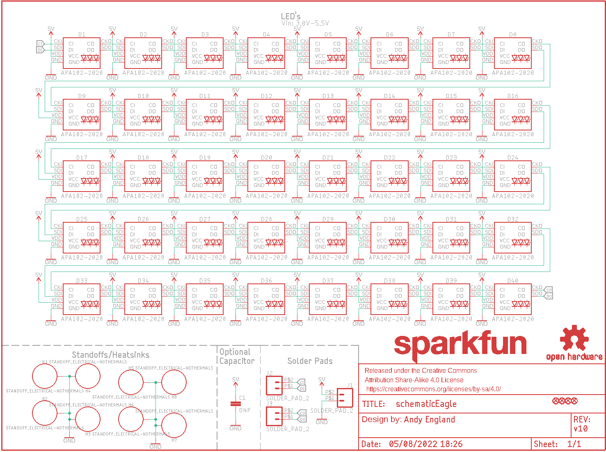
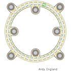
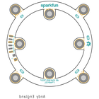
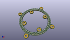
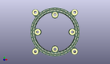
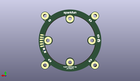
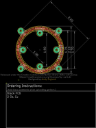
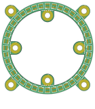
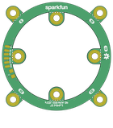

Contents
========

* [PRS14966 > LuMini 2 Inch](#prs14966--lumini-2-inch)
	* [Schematic](#schematic)
	* [PCB](#pcb)
	* [Interactive BOM](#interactive-bom)
	* [OOMP Parts](#oomp-parts)
	* [Images](#images)
	* [Tags](#tags)
  
![][im]
# PRS14966 > LuMini 2 Inch

- ID: PROJ-SPAR-14966-STAN-01
- Hex ID: PRS14966
- Name: Sparkfun
- Description: Sparkfun
- Long Link: [http://oom.lt/PROJ-SPAR-14966-STAN-01](http://oom.lt/PROJ-SPAR-14966-STAN-01)
- Short Link: [http://oom.lt/PRS14966](http://oom.lt/PRS14966)

## Schematic
  

## PCB
  

## Interactive BOM

- Interactive BOM page: [ibom.html](https://htmlpreview.github.io/?https://github.com/oomlout/oomlout_OOMP_projects/blob/main/PROJ-SPAR-14966-STAN-01/kicad/bom/ibom.html)

## OOMP Parts
  

|OOMP Parts|
| :---: |
|[LEDS-2020-RGB-K102-01  SMD (2020) Smart Controller (APA102) RGB LED  D1, D2, D3, D4, D5, D6, D7, D8, D9, D10, D11, D12, D13, D14, D15, D16, D17, D18, D19, D20, D21, D22, D23, D24, D25, D26, D27, D28, D29, D30, D31, D32, D33, D34, D35, D36, D37, D38, D39, D40](https://github.com/oomlout/oomlout_OOMP_parts/tree/main/LEDS-2020-RGB-K102-01/)|

## Images
  
  

|bominteractivefront|bominteractiveback|kicadPcb3d|kicadPcb3dFront|kicadPcb3dBack|eagleImage|eagleSchemImage|pcbdraw|pcbdrawback|
| :---: | :---: | :---: | :---: | :---: | :---: | :---: | :---: | :---: |
||||||||||

## Tags

- hexID: PRS14966
- oompType: PROJ
- oompSize: SPAR
- oompColor: 14966
- oompDesc: STAN
- oompIndex: 01
- oompName: LuMini 2 Inch
- sources: All source files from https://github.com/sparkfun/LuMini_2_Inch (source licence details in srcLicense.md)
- linkBuyPage: https://www.sparkfun.com/products/14966
- oompID: PROJ-SPAR-14966-STAN-01
- oompParts: D1,LEDS-2020-RGB-K102-01
- oompParts: D2,LEDS-2020-RGB-K102-01
- oompParts: D3,LEDS-2020-RGB-K102-01
- oompParts: D4,LEDS-2020-RGB-K102-01
- oompParts: D5,LEDS-2020-RGB-K102-01
- oompParts: D6,LEDS-2020-RGB-K102-01
- oompParts: D7,LEDS-2020-RGB-K102-01
- oompParts: D8,LEDS-2020-RGB-K102-01
- oompParts: D9,LEDS-2020-RGB-K102-01
- oompParts: D10,LEDS-2020-RGB-K102-01
- oompParts: D11,LEDS-2020-RGB-K102-01
- oompParts: D12,LEDS-2020-RGB-K102-01
- oompParts: D13,LEDS-2020-RGB-K102-01
- oompParts: D14,LEDS-2020-RGB-K102-01
- oompParts: D15,LEDS-2020-RGB-K102-01
- oompParts: D16,LEDS-2020-RGB-K102-01
- oompParts: D17,LEDS-2020-RGB-K102-01
- oompParts: D18,LEDS-2020-RGB-K102-01
- oompParts: D19,LEDS-2020-RGB-K102-01
- oompParts: D20,LEDS-2020-RGB-K102-01
- oompParts: D21,LEDS-2020-RGB-K102-01
- oompParts: D22,LEDS-2020-RGB-K102-01
- oompParts: D23,LEDS-2020-RGB-K102-01
- oompParts: D24,LEDS-2020-RGB-K102-01
- oompParts: D25,LEDS-2020-RGB-K102-01
- oompParts: D26,LEDS-2020-RGB-K102-01
- oompParts: D27,LEDS-2020-RGB-K102-01
- oompParts: D28,LEDS-2020-RGB-K102-01
- oompParts: D29,LEDS-2020-RGB-K102-01
- oompParts: D30,LEDS-2020-RGB-K102-01
- oompParts: D31,LEDS-2020-RGB-K102-01
- oompParts: D32,LEDS-2020-RGB-K102-01
- oompParts: D33,LEDS-2020-RGB-K102-01
- oompParts: D34,LEDS-2020-RGB-K102-01
- oompParts: D35,LEDS-2020-RGB-K102-01
- oompParts: D36,LEDS-2020-RGB-K102-01
- oompParts: D37,LEDS-2020-RGB-K102-01
- oompParts: D38,LEDS-2020-RGB-K102-01
- oompParts: D39,LEDS-2020-RGB-K102-01
- oompParts: D40,LEDS-2020-RGB-K102-01
- rawParts: C1,DNP,4.7UF-1206-16V-(+80/-20%),1206,4.7µF ceramic capacitors,CAP-10300,4.7uF,
- rawParts: D1,APA102-2020,APA102-2020,APA102-2020,APA102 Addressable RGB LED,DIO-13883,,
- rawParts: D2,APA102-2020,APA102-2020,APA102-2020,APA102 Addressable RGB LED,DIO-13883,,
- rawParts: D3,APA102-2020,APA102-2020,APA102-2020,APA102 Addressable RGB LED,DIO-13883,,
- rawParts: D4,APA102-2020,APA102-2020,APA102-2020,APA102 Addressable RGB LED,DIO-13883,,
- rawParts: D5,APA102-2020,APA102-2020,APA102-2020,APA102 Addressable RGB LED,DIO-13883,,
- rawParts: D6,APA102-2020,APA102-2020,APA102-2020,APA102 Addressable RGB LED,DIO-13883,,
- rawParts: D7,APA102-2020,APA102-2020,APA102-2020,APA102 Addressable RGB LED,DIO-13883,,
- rawParts: D8,APA102-2020,APA102-2020,APA102-2020,APA102 Addressable RGB LED,DIO-13883,,
- rawParts: D9,APA102-2020,APA102-2020,APA102-2020,APA102 Addressable RGB LED,DIO-13883,,
- rawParts: D10,APA102-2020,APA102-2020,APA102-2020,APA102 Addressable RGB LED,DIO-13883,,
- rawParts: D11,APA102-2020,APA102-2020,APA102-2020,APA102 Addressable RGB LED,DIO-13883,,
- rawParts: D12,APA102-2020,APA102-2020,APA102-2020,APA102 Addressable RGB LED,DIO-13883,,
- rawParts: D13,APA102-2020,APA102-2020,APA102-2020,APA102 Addressable RGB LED,DIO-13883,,
- rawParts: D14,APA102-2020,APA102-2020,APA102-2020,APA102 Addressable RGB LED,DIO-13883,,
- rawParts: D15,APA102-2020,APA102-2020,APA102-2020,APA102 Addressable RGB LED,DIO-13883,,
- rawParts: D16,APA102-2020,APA102-2020,APA102-2020,APA102 Addressable RGB LED,DIO-13883,,
- rawParts: D17,APA102-2020,APA102-2020,APA102-2020,APA102 Addressable RGB LED,DIO-13883,,
- rawParts: D18,APA102-2020,APA102-2020,APA102-2020,APA102 Addressable RGB LED,DIO-13883,,
- rawParts: D19,APA102-2020,APA102-2020,APA102-2020,APA102 Addressable RGB LED,DIO-13883,,
- rawParts: D20,APA102-2020,APA102-2020,APA102-2020,APA102 Addressable RGB LED,DIO-13883,,
- rawParts: D21,APA102-2020,APA102-2020,APA102-2020,APA102 Addressable RGB LED,DIO-13883,,
- rawParts: D22,APA102-2020,APA102-2020,APA102-2020,APA102 Addressable RGB LED,DIO-13883,,
- rawParts: D23,APA102-2020,APA102-2020,APA102-2020,APA102 Addressable RGB LED,DIO-13883,,
- rawParts: D24,APA102-2020,APA102-2020,APA102-2020,APA102 Addressable RGB LED,DIO-13883,,
- rawParts: D25,APA102-2020,APA102-2020,APA102-2020,APA102 Addressable RGB LED,DIO-13883,,
- rawParts: D26,APA102-2020,APA102-2020,APA102-2020,APA102 Addressable RGB LED,DIO-13883,,
- rawParts: D27,APA102-2020,APA102-2020,APA102-2020,APA102 Addressable RGB LED,DIO-13883,,
- rawParts: D28,APA102-2020,APA102-2020,APA102-2020,APA102 Addressable RGB LED,DIO-13883,,
- rawParts: D29,APA102-2020,APA102-2020,APA102-2020,APA102 Addressable RGB LED,DIO-13883,,
- rawParts: D30,APA102-2020,APA102-2020,APA102-2020,APA102 Addressable RGB LED,DIO-13883,,
- rawParts: D31,APA102-2020,APA102-2020,APA102-2020,APA102 Addressable RGB LED,DIO-13883,,
- rawParts: D32,APA102-2020,APA102-2020,APA102-2020,APA102 Addressable RGB LED,DIO-13883,,
- rawParts: D33,APA102-2020,APA102-2020,APA102-2020,APA102 Addressable RGB LED,DIO-13883,,
- rawParts: D34,APA102-2020,APA102-2020,APA102-2020,APA102 Addressable RGB LED,DIO-13883,,
- rawParts: D35,APA102-2020,APA102-2020,APA102-2020,APA102 Addressable RGB LED,DIO-13883,,
- rawParts: D36,APA102-2020,APA102-2020,APA102-2020,APA102 Addressable RGB LED,DIO-13883,,
- rawParts: D37,APA102-2020,APA102-2020,APA102-2020,APA102 Addressable RGB LED,DIO-13883,,
- rawParts: D38,APA102-2020,APA102-2020,APA102-2020,APA102 Addressable RGB LED,DIO-13883,,
- rawParts: D39,APA102-2020,APA102-2020,APA102-2020,APA102 Addressable RGB LED,DIO-13883,,
- rawParts: D40,APA102-2020,APA102-2020,APA102-2020,APA102 Addressable RGB LED,DIO-13883,,
- rawParts: FD1,FIDUCIALUFIDUCIAL,FIDUCIALUFIDUCIAL,FIDUCIAL-MICRO,Fiducial Alignment Points,,,
- rawParts: FD2,FIDUCIALUFIDUCIAL,FIDUCIALUFIDUCIAL,FIDUCIAL-MICRO,Fiducial Alignment Points,,,
- rawParts: FD3,FIDUCIALUFIDUCIAL,FIDUCIALUFIDUCIAL,FIDUCIAL-MICRO,Fiducial Alignment Points,,,
- rawParts: FD4,FIDUCIALUFIDUCIAL,FIDUCIALUFIDUCIAL,FIDUCIAL-MICRO,Fiducial Alignment Points,,,
- rawParts: FRAME1,FRAME-LETTER,FRAME-LETTER,CREATIVE_COMMONS,Schematic Frame - Letter,,,
- rawParts: H1,STANDOFF_ELECTRICAL-NOTHERMALS,STANDOFF_ELECTRICAL-NOTHERMALS,STANDOFF-ELECTRICAL-NOTHERMALS,Stand Off,,,
- rawParts: H2,STANDOFF_ELECTRICAL-NOTHERMALS,STANDOFF_ELECTRICAL-NOTHERMALS,STANDOFF-ELECTRICAL-NOTHERMALS,Stand Off,,,
- rawParts: H3,STANDOFF_ELECTRICAL-NOTHERMALS,STANDOFF_ELECTRICAL-NOTHERMALS,STANDOFF-ELECTRICAL-NOTHERMALS,Stand Off,,,
- rawParts: H4,STANDOFF_ELECTRICAL-NOTHERMALS,STANDOFF_ELECTRICAL-NOTHERMALS,STANDOFF-ELECTRICAL-NOTHERMALS,Stand Off,,,
- rawParts: H5,STANDOFF_ELECTRICAL-NOTHERMALS,STANDOFF_ELECTRICAL-NOTHERMALS,STANDOFF-ELECTRICAL-NOTHERMALS,Stand Off,,,
- rawParts: H6,STANDOFF_ELECTRICAL-NOTHERMALS,STANDOFF_ELECTRICAL-NOTHERMALS,STANDOFF-ELECTRICAL-NOTHERMALS,Stand Off,,,
- rawParts: H7,STANDOFF_ELECTRICAL-NOTHERMALS,STANDOFF_ELECTRICAL-NOTHERMALS,STANDOFF-ELECTRICAL-NOTHERMALS,Stand Off,,,
- rawParts: H8,STANDOFF_ELECTRICAL-NOTHERMALS,STANDOFF_ELECTRICAL-NOTHERMALS,STANDOFF-ELECTRICAL-NOTHERMALS,Stand Off,,,
- rawParts: J1,SOLDER_PAD_2,SOLDER_PAD_2,SOLDER_PAD_2,Solder Pad for LuMini Rings,,,
- rawParts: J2,SOLDER_PAD_2,SOLDER_PAD_2,SOLDER_PAD_2,Solder Pad for LuMini Rings,,,
- rawParts: J3,SOLDER_PAD_2,SOLDER_PAD_2,SOLDER_PAD_2,Solder Pad for LuMini Rings,,,
- rawParts: LOGO1,OSHW-LOGOS,OSHW-LOGOS,OSHW-LOGO-S,Open-Source Hardware (OSHW) Logo,,,
- rawParts: LOGO2,SFE_LOGO_NAME.1_INCH,SFE_LOGO_NAME.1_INCH,SFE_LOGO_NAME_.1,SparkFun Font Logo,,,

[im]: kicadPcb3d_450.png
