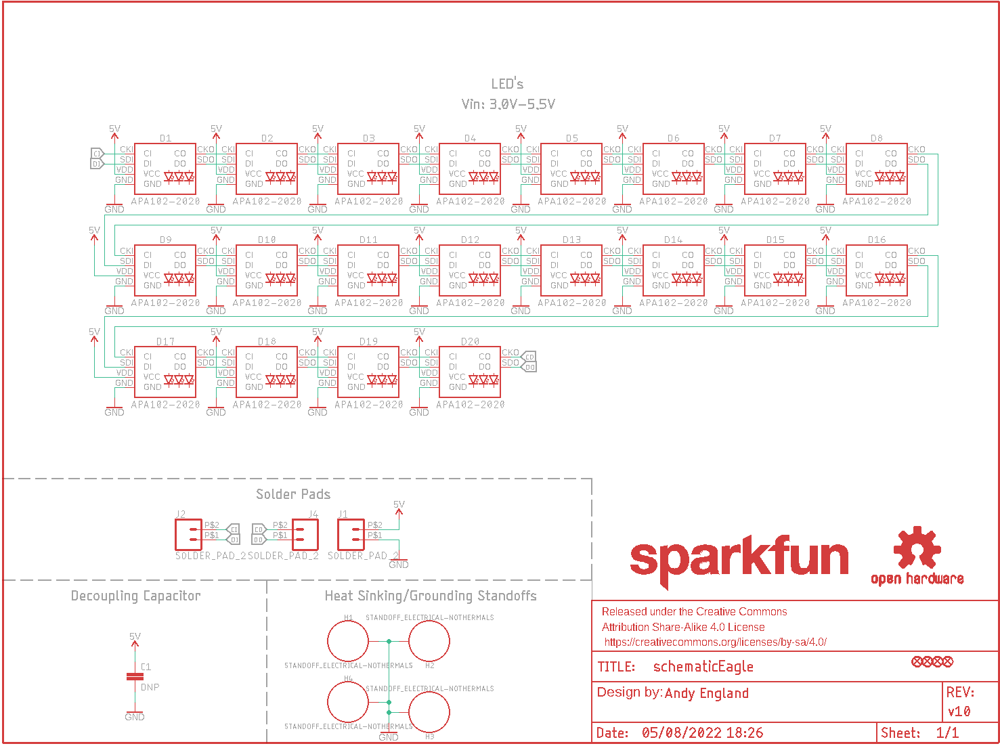
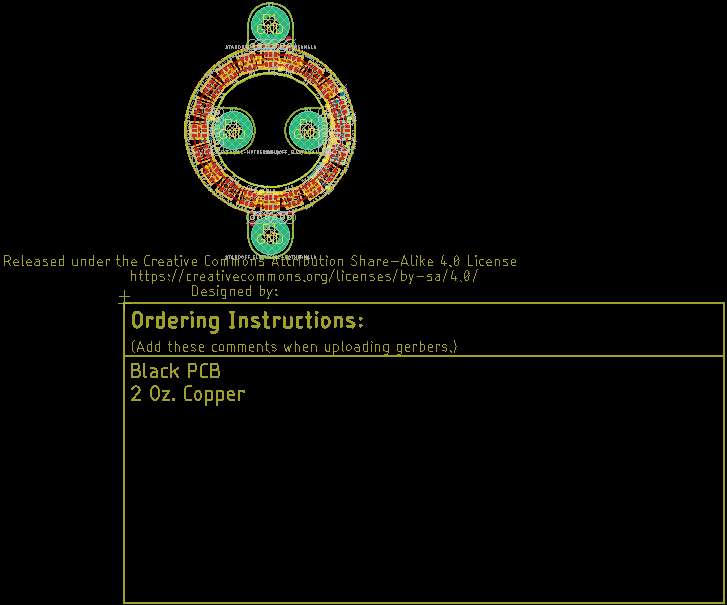
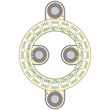
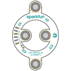
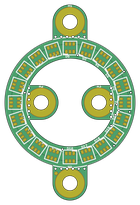
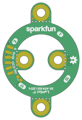

Contents
========

* [PRS14967 > LuMini 1 Inch](#prs14967--lumini-1-inch)
	* [Schematic](#schematic)
	* [PCB](#pcb)
	* [Interactive BOM](#interactive-bom)
	* [OOMP Parts](#oomp-parts)
	* [Images](#images)
	* [Tags](#tags)
  
![][im]
# PRS14967 > LuMini 1 Inch

- ID: PROJ-SPAR-14967-STAN-01
- Hex ID: PRS14967
- Name: Sparkfun
- Description: Sparkfun
- Long Link: [http://oom.lt/PROJ-SPAR-14967-STAN-01](http://oom.lt/PROJ-SPAR-14967-STAN-01)
- Short Link: [http://oom.lt/PRS14967](http://oom.lt/PRS14967)

## Schematic
  

## PCB
  

## Interactive BOM

- Interactive BOM page: [ibom.html](https://htmlpreview.github.io/?https://github.com/oomlout/oomlout_OOMP_projects/blob/main/PROJ-SPAR-14967-STAN-01/kicad/bom/ibom.html)

## OOMP Parts
  

|OOMP ID|Name|Identifier|
| :---: | :---: | :---: |
|[LEDS-2020-RGB-K102-01](https://github.com/oomlout/oomlout_OOMP_parts/tree/main/LEDS-2020-RGB-K102-01/)|[SMD (2020) Smart Controller (APA102) RGB LED](https://github.com/oomlout/oomlout_OOMP_parts/tree/main/LEDS-2020-RGB-K102-01/)|[D1, D2, D3, D4, D5, D6, D7, D8, D9, D10, D11, D12, D13, D14, D15, D16, D17, D18, D19, D20](https://github.com/oomlout/oomlout_OOMP_parts/tree/main/LEDS-2020-RGB-K102-01/)|

## Images
  
  

|bominteractivefront|bominteractiveback|kicadPcb3d|kicadPcb3dFront|kicadPcb3dBack|eagleImage|eagleSchemImage|pcbdraw|pcbdrawback|
| :---: | :---: | :---: | :---: | :---: | :---: | :---: | :---: | :---: |
||||||||||

## Tags

- hexID: PRS14967
- oompType: PROJ
- oompSize: SPAR
- oompColor: 14967
- oompDesc: STAN
- oompIndex: 01
- oompName: LuMini 1 Inch
- sources: All source files from https://github.com/sparkfun/LuMini_1_Inch (source licence details in srcLicense.md)
- linkBuyPage: https://www.sparkfun.com/products/14967
- oompID: PROJ-SPAR-14967-STAN-01
- oompParts: D1,LEDS-2020-RGB-K102-01
- oompParts: D2,LEDS-2020-RGB-K102-01
- oompParts: D3,LEDS-2020-RGB-K102-01
- oompParts: D4,LEDS-2020-RGB-K102-01
- oompParts: D5,LEDS-2020-RGB-K102-01
- oompParts: D6,LEDS-2020-RGB-K102-01
- oompParts: D7,LEDS-2020-RGB-K102-01
- oompParts: D8,LEDS-2020-RGB-K102-01
- oompParts: D9,LEDS-2020-RGB-K102-01
- oompParts: D10,LEDS-2020-RGB-K102-01
- oompParts: D11,LEDS-2020-RGB-K102-01
- oompParts: D12,LEDS-2020-RGB-K102-01
- oompParts: D13,LEDS-2020-RGB-K102-01
- oompParts: D14,LEDS-2020-RGB-K102-01
- oompParts: D15,LEDS-2020-RGB-K102-01
- oompParts: D16,LEDS-2020-RGB-K102-01
- oompParts: D17,LEDS-2020-RGB-K102-01
- oompParts: D18,LEDS-2020-RGB-K102-01
- oompParts: D19,LEDS-2020-RGB-K102-01
- oompParts: D20,LEDS-2020-RGB-K102-01
- rawParts: C1,DNP,4.7UF-0603-6.3V-(10%),0603,4.7µF ceramic capacitors,CAP-08280,4.7uF,
- rawParts: D1,APA102-2020,APA102-2020,APA102-2020,APA102 Addressable RGB LED,DIO-13883,,
- rawParts: D2,APA102-2020,APA102-2020,APA102-2020,APA102 Addressable RGB LED,DIO-13883,,
- rawParts: D3,APA102-2020,APA102-2020,APA102-2020,APA102 Addressable RGB LED,DIO-13883,,
- rawParts: D4,APA102-2020,APA102-2020,APA102-2020,APA102 Addressable RGB LED,DIO-13883,,
- rawParts: D5,APA102-2020,APA102-2020,APA102-2020,APA102 Addressable RGB LED,DIO-13883,,
- rawParts: D6,APA102-2020,APA102-2020,APA102-2020,APA102 Addressable RGB LED,DIO-13883,,
- rawParts: D7,APA102-2020,APA102-2020,APA102-2020,APA102 Addressable RGB LED,DIO-13883,,
- rawParts: D8,APA102-2020,APA102-2020,APA102-2020,APA102 Addressable RGB LED,DIO-13883,,
- rawParts: D9,APA102-2020,APA102-2020,APA102-2020,APA102 Addressable RGB LED,DIO-13883,,
- rawParts: D10,APA102-2020,APA102-2020,APA102-2020,APA102 Addressable RGB LED,DIO-13883,,
- rawParts: D11,APA102-2020,APA102-2020,APA102-2020,APA102 Addressable RGB LED,DIO-13883,,
- rawParts: D12,APA102-2020,APA102-2020,APA102-2020,APA102 Addressable RGB LED,DIO-13883,,
- rawParts: D13,APA102-2020,APA102-2020,APA102-2020,APA102 Addressable RGB LED,DIO-13883,,
- rawParts: D14,APA102-2020,APA102-2020,APA102-2020,APA102 Addressable RGB LED,DIO-13883,,
- rawParts: D15,APA102-2020,APA102-2020,APA102-2020,APA102 Addressable RGB LED,DIO-13883,,
- rawParts: D16,APA102-2020,APA102-2020,APA102-2020,APA102 Addressable RGB LED,DIO-13883,,
- rawParts: D17,APA102-2020,APA102-2020,APA102-2020,APA102 Addressable RGB LED,DIO-13883,,
- rawParts: D18,APA102-2020,APA102-2020,APA102-2020,APA102 Addressable RGB LED,DIO-13883,,
- rawParts: D19,APA102-2020,APA102-2020,APA102-2020,APA102 Addressable RGB LED,DIO-13883,,
- rawParts: D20,APA102-2020,APA102-2020,APA102-2020,APA102 Addressable RGB LED,DIO-13883,,
- rawParts: FD1,FIDUCIALUFIDUCIAL,FIDUCIALUFIDUCIAL,FIDUCIAL-MICRO,Fiducial Alignment Points,,,
- rawParts: FD2,FIDUCIALUFIDUCIAL,FIDUCIALUFIDUCIAL,FIDUCIAL-MICRO,Fiducial Alignment Points,,,
- rawParts: FD3,FIDUCIALUFIDUCIAL,FIDUCIALUFIDUCIAL,FIDUCIAL-MICRO,Fiducial Alignment Points,,,
- rawParts: FD4,FIDUCIALUFIDUCIAL,FIDUCIALUFIDUCIAL,FIDUCIAL-MICRO,Fiducial Alignment Points,,,
- rawParts: FRAME1,FRAME-LETTER,FRAME-LETTER,CREATIVE_COMMONS,Schematic Frame - Letter,,,
- rawParts: H1,STANDOFF_ELECTRICAL-NOTHERMALS,STANDOFF_ELECTRICAL-NOTHERMALS,STANDOFF-ELECTRICAL-NOTHERMALS,Stand Off,,,
- rawParts: H2,STANDOFF_ELECTRICAL-NOTHERMALS,STANDOFF_ELECTRICAL-NOTHERMALS,STANDOFF-ELECTRICAL-NOTHERMALS,Stand Off,,,
- rawParts: H3,STANDOFF_ELECTRICAL-NOTHERMALS,STANDOFF_ELECTRICAL-NOTHERMALS,STANDOFF-ELECTRICAL-NOTHERMALS,Stand Off,,,
- rawParts: H4,STANDOFF_ELECTRICAL-NOTHERMALS,STANDOFF_ELECTRICAL-NOTHERMALS,STANDOFF-ELECTRICAL-NOTHERMALS,Stand Off,,,
- rawParts: J1,SOLDER_PAD_2,SOLDER_PAD_2,SOLDER_PAD_2,Solder Pad for LuMini Rings,,,
- rawParts: J2,SOLDER_PAD_2,SOLDER_PAD_2,SOLDER_PAD_2,Solder Pad for LuMini Rings,,,
- rawParts: J4,SOLDER_PAD_2,SOLDER_PAD_2,SOLDER_PAD_2,Solder Pad for LuMini Rings,,,
- rawParts: LOGO1,SFE_LOGO_NAME.1_INCH,SFE_LOGO_NAME.1_INCH,SFE_LOGO_NAME_.1,SparkFun Font Logo,,,
- rawParts: LOGO2,OSHW-LOGOS,OSHW-LOGOS,OSHW-LOGO-S,Open-Source Hardware (OSHW) Logo,,,

[im]: kicadPcb3d_450.png
