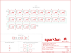

Contents
========

* [PRS14967 > Sparkfun](#prs14967--sparkfun)
	* [Schematic](#schematic)
	* [Interactive BOM](#interactive-bom)
	* [OOMP Parts](#oomp-parts)
	* [Images](#images)
	* [Tags](#tags)
  
![][im]
# PRS14967 > Sparkfun

- ID: PROJ-SPAR-14967-STAN-01
- Hex ID: PRS14967
- Name: Sparkfun
- Description: Sparkfun
- Long Link: [http://oom.lt/PROJ-SPAR-14967-STAN-01](http://oom.lt/PROJ-SPAR-14967-STAN-01)
- Long Link: [http://oom.lt/PRS14967](http://oom.lt/PRS14967)

## Schematic
  
![][schem]
## Interactive BOM

- Interactive BOM page: [ibom.html](https://htmlpreview.github.io/?https://github.com/oomlout/oomlout_OOMP_projects/blob/main/PROJ-SPAR-14967-STAN-01/kicad/bom/ibom.html)

## OOMP Parts
  

|OOMP Parts|
| :---: |
|C1,UNMATCHED-UNMATCHED-UNMATCHED-UNMATCHED-UNMATCHED,C1,DNP,4.7UF-0603-6.3V-(10%),0603,4.7µF ceramic capacitors,CAP-08280,4.7uF,|
|D1,UNMATCHED-UNMATCHED-UNMATCHED-UNMATCHED-UNMATCHED,D1,APA102-2020,APA102-2020,APA102-2020,APA102 Addressable RGB LED,DIO-13883,,|
|D2,UNMATCHED-UNMATCHED-UNMATCHED-UNMATCHED-UNMATCHED,D2,APA102-2020,APA102-2020,APA102-2020,APA102 Addressable RGB LED,DIO-13883,,|
|D3,UNMATCHED-UNMATCHED-UNMATCHED-UNMATCHED-UNMATCHED,D3,APA102-2020,APA102-2020,APA102-2020,APA102 Addressable RGB LED,DIO-13883,,|
|D4,UNMATCHED-UNMATCHED-UNMATCHED-UNMATCHED-UNMATCHED,D4,APA102-2020,APA102-2020,APA102-2020,APA102 Addressable RGB LED,DIO-13883,,|
|D5,UNMATCHED-UNMATCHED-UNMATCHED-UNMATCHED-UNMATCHED,D5,APA102-2020,APA102-2020,APA102-2020,APA102 Addressable RGB LED,DIO-13883,,|
|D6,UNMATCHED-UNMATCHED-UNMATCHED-UNMATCHED-UNMATCHED,D6,APA102-2020,APA102-2020,APA102-2020,APA102 Addressable RGB LED,DIO-13883,,|
|D7,UNMATCHED-UNMATCHED-UNMATCHED-UNMATCHED-UNMATCHED,D7,APA102-2020,APA102-2020,APA102-2020,APA102 Addressable RGB LED,DIO-13883,,|
|D8,UNMATCHED-UNMATCHED-UNMATCHED-UNMATCHED-UNMATCHED,D8,APA102-2020,APA102-2020,APA102-2020,APA102 Addressable RGB LED,DIO-13883,,|
|D9,UNMATCHED-UNMATCHED-UNMATCHED-UNMATCHED-UNMATCHED,D9,APA102-2020,APA102-2020,APA102-2020,APA102 Addressable RGB LED,DIO-13883,,|
|D10,UNMATCHED-UNMATCHED-UNMATCHED-UNMATCHED-UNMATCHED,D10,APA102-2020,APA102-2020,APA102-2020,APA102 Addressable RGB LED,DIO-13883,,|
|D11,UNMATCHED-UNMATCHED-UNMATCHED-UNMATCHED-UNMATCHED,D11,APA102-2020,APA102-2020,APA102-2020,APA102 Addressable RGB LED,DIO-13883,,|
|D12,UNMATCHED-UNMATCHED-UNMATCHED-UNMATCHED-UNMATCHED,D12,APA102-2020,APA102-2020,APA102-2020,APA102 Addressable RGB LED,DIO-13883,,|
|D13,UNMATCHED-UNMATCHED-UNMATCHED-UNMATCHED-UNMATCHED,D13,APA102-2020,APA102-2020,APA102-2020,APA102 Addressable RGB LED,DIO-13883,,|
|D14,UNMATCHED-UNMATCHED-UNMATCHED-UNMATCHED-UNMATCHED,D14,APA102-2020,APA102-2020,APA102-2020,APA102 Addressable RGB LED,DIO-13883,,|
|D15,UNMATCHED-UNMATCHED-UNMATCHED-UNMATCHED-UNMATCHED,D15,APA102-2020,APA102-2020,APA102-2020,APA102 Addressable RGB LED,DIO-13883,,|
|D16,UNMATCHED-UNMATCHED-UNMATCHED-UNMATCHED-UNMATCHED,D16,APA102-2020,APA102-2020,APA102-2020,APA102 Addressable RGB LED,DIO-13883,,|
|D17,UNMATCHED-UNMATCHED-UNMATCHED-UNMATCHED-UNMATCHED,D17,APA102-2020,APA102-2020,APA102-2020,APA102 Addressable RGB LED,DIO-13883,,|
|D18,UNMATCHED-UNMATCHED-UNMATCHED-UNMATCHED-UNMATCHED,D18,APA102-2020,APA102-2020,APA102-2020,APA102 Addressable RGB LED,DIO-13883,,|
|D19,UNMATCHED-UNMATCHED-UNMATCHED-UNMATCHED-UNMATCHED,D19,APA102-2020,APA102-2020,APA102-2020,APA102 Addressable RGB LED,DIO-13883,,|
|D20,UNMATCHED-UNMATCHED-UNMATCHED-UNMATCHED-UNMATCHED,D20,APA102-2020,APA102-2020,APA102-2020,APA102 Addressable RGB LED,DIO-13883,,|
|FRAME1,UNMATCHED-UNMATCHED-UNMATCHED-UNMATCHED-UNMATCHED,FD1,FIDUCIALUFIDUCIAL,FIDUCIALUFIDUCIAL,FIDUCIAL-MICRO,Fiducial Alignment Points,,,|
|H1,UNMATCHED-UNMATCHED-UNMATCHED-UNMATCHED-UNMATCHED,FD2,FIDUCIALUFIDUCIAL,FIDUCIALUFIDUCIAL,FIDUCIAL-MICRO,Fiducial Alignment Points,,,|
|H2,UNMATCHED-UNMATCHED-UNMATCHED-UNMATCHED-UNMATCHED,FD3,FIDUCIALUFIDUCIAL,FIDUCIALUFIDUCIAL,FIDUCIAL-MICRO,Fiducial Alignment Points,,,|
|H3,UNMATCHED-UNMATCHED-UNMATCHED-UNMATCHED-UNMATCHED,FD4,FIDUCIALUFIDUCIAL,FIDUCIALUFIDUCIAL,FIDUCIAL-MICRO,Fiducial Alignment Points,,,|
|H4,UNMATCHED-UNMATCHED-UNMATCHED-UNMATCHED-UNMATCHED,FRAME1,FRAME-LETTER,FRAME-LETTER,CREATIVE_COMMONS,Schematic Frame - Letter,,,|
|J1,UNMATCHED-UNMATCHED-UNMATCHED-UNMATCHED-UNMATCHED,H1,STANDOFF_ELECTRICAL-NOTHERMALS,STANDOFF_ELECTRICAL-NOTHERMALS,STANDOFF-ELECTRICAL-NOTHERMALS,Stand Off,,,|
|J2,UNMATCHED-UNMATCHED-UNMATCHED-UNMATCHED-UNMATCHED,H2,STANDOFF_ELECTRICAL-NOTHERMALS,STANDOFF_ELECTRICAL-NOTHERMALS,STANDOFF-ELECTRICAL-NOTHERMALS,Stand Off,,,|
|J4,UNMATCHED-UNMATCHED-UNMATCHED-UNMATCHED-UNMATCHED,H3,STANDOFF_ELECTRICAL-NOTHERMALS,STANDOFF_ELECTRICAL-NOTHERMALS,STANDOFF-ELECTRICAL-NOTHERMALS,Stand Off,,,|
|LOGO1,UNMATCHED-UNMATCHED-UNMATCHED-UNMATCHED-UNMATCHED,H4,STANDOFF_ELECTRICAL-NOTHERMALS,STANDOFF_ELECTRICAL-NOTHERMALS,STANDOFF-ELECTRICAL-NOTHERMALS,Stand Off,,,|
|LOGO2,UNMATCHED-UNMATCHED-UNMATCHED-UNMATCHED-UNMATCHED,J1,SOLDER_PAD_2,SOLDER_PAD_2,SOLDER_PAD_2,Solder Pad for LuMini Rings,,,|

## Images
  
  

|kicadPcb3d|kicadPcb3dFront|kicadPcb3dBack|eagleImage|eagleSchemImage|
| :---: | :---: | :---: | :---: | :---: |
||||||

## Tags

- hexID: PRS14967
- oompType: PROJ
- oompSize: SPAR
- oompColor: 14967
- oompDesc: STAN
- oompIndex: 01
- oompName: LuMini 1 Inch
- sources: All source files from https://github.com/sparkfun/LuMini_1_Inch (source licence details in srcLicense.md)
- linkBuyPage: https://www.sparkfun.com/products/14967
- oompID: PROJ-SPAR-14967-STAN-01
- oompParts: C1,UNMATCHED-UNMATCHED-UNMATCHED-UNMATCHED-UNMATCHED
- oompParts: D1,UNMATCHED-UNMATCHED-UNMATCHED-UNMATCHED-UNMATCHED
- oompParts: D2,UNMATCHED-UNMATCHED-UNMATCHED-UNMATCHED-UNMATCHED
- oompParts: D3,UNMATCHED-UNMATCHED-UNMATCHED-UNMATCHED-UNMATCHED
- oompParts: D4,UNMATCHED-UNMATCHED-UNMATCHED-UNMATCHED-UNMATCHED
- oompParts: D5,UNMATCHED-UNMATCHED-UNMATCHED-UNMATCHED-UNMATCHED
- oompParts: D6,UNMATCHED-UNMATCHED-UNMATCHED-UNMATCHED-UNMATCHED
- oompParts: D7,UNMATCHED-UNMATCHED-UNMATCHED-UNMATCHED-UNMATCHED
- oompParts: D8,UNMATCHED-UNMATCHED-UNMATCHED-UNMATCHED-UNMATCHED
- oompParts: D9,UNMATCHED-UNMATCHED-UNMATCHED-UNMATCHED-UNMATCHED
- oompParts: D10,UNMATCHED-UNMATCHED-UNMATCHED-UNMATCHED-UNMATCHED
- oompParts: D11,UNMATCHED-UNMATCHED-UNMATCHED-UNMATCHED-UNMATCHED
- oompParts: D12,UNMATCHED-UNMATCHED-UNMATCHED-UNMATCHED-UNMATCHED
- oompParts: D13,UNMATCHED-UNMATCHED-UNMATCHED-UNMATCHED-UNMATCHED
- oompParts: D14,UNMATCHED-UNMATCHED-UNMATCHED-UNMATCHED-UNMATCHED
- oompParts: D15,UNMATCHED-UNMATCHED-UNMATCHED-UNMATCHED-UNMATCHED
- oompParts: D16,UNMATCHED-UNMATCHED-UNMATCHED-UNMATCHED-UNMATCHED
- oompParts: D17,UNMATCHED-UNMATCHED-UNMATCHED-UNMATCHED-UNMATCHED
- oompParts: D18,UNMATCHED-UNMATCHED-UNMATCHED-UNMATCHED-UNMATCHED
- oompParts: D19,UNMATCHED-UNMATCHED-UNMATCHED-UNMATCHED-UNMATCHED
- oompParts: D20,UNMATCHED-UNMATCHED-UNMATCHED-UNMATCHED-UNMATCHED
- oompParts: FRAME1,UNMATCHED-UNMATCHED-UNMATCHED-UNMATCHED-UNMATCHED
- oompParts: H1,UNMATCHED-UNMATCHED-UNMATCHED-UNMATCHED-UNMATCHED
- oompParts: H2,UNMATCHED-UNMATCHED-UNMATCHED-UNMATCHED-UNMATCHED
- oompParts: H3,UNMATCHED-UNMATCHED-UNMATCHED-UNMATCHED-UNMATCHED
- oompParts: H4,UNMATCHED-UNMATCHED-UNMATCHED-UNMATCHED-UNMATCHED
- oompParts: J1,UNMATCHED-UNMATCHED-UNMATCHED-UNMATCHED-UNMATCHED
- oompParts: J2,UNMATCHED-UNMATCHED-UNMATCHED-UNMATCHED-UNMATCHED
- oompParts: J4,UNMATCHED-UNMATCHED-UNMATCHED-UNMATCHED-UNMATCHED
- oompParts: LOGO1,UNMATCHED-UNMATCHED-UNMATCHED-UNMATCHED-UNMATCHED
- oompParts: LOGO2,UNMATCHED-UNMATCHED-UNMATCHED-UNMATCHED-UNMATCHED
- rawParts: C1,DNP,4.7UF-0603-6.3V-(10%),0603,4.7µF ceramic capacitors,CAP-08280,4.7uF,
- rawParts: D1,APA102-2020,APA102-2020,APA102-2020,APA102 Addressable RGB LED,DIO-13883,,
- rawParts: D2,APA102-2020,APA102-2020,APA102-2020,APA102 Addressable RGB LED,DIO-13883,,
- rawParts: D3,APA102-2020,APA102-2020,APA102-2020,APA102 Addressable RGB LED,DIO-13883,,
- rawParts: D4,APA102-2020,APA102-2020,APA102-2020,APA102 Addressable RGB LED,DIO-13883,,
- rawParts: D5,APA102-2020,APA102-2020,APA102-2020,APA102 Addressable RGB LED,DIO-13883,,
- rawParts: D6,APA102-2020,APA102-2020,APA102-2020,APA102 Addressable RGB LED,DIO-13883,,
- rawParts: D7,APA102-2020,APA102-2020,APA102-2020,APA102 Addressable RGB LED,DIO-13883,,
- rawParts: D8,APA102-2020,APA102-2020,APA102-2020,APA102 Addressable RGB LED,DIO-13883,,
- rawParts: D9,APA102-2020,APA102-2020,APA102-2020,APA102 Addressable RGB LED,DIO-13883,,
- rawParts: D10,APA102-2020,APA102-2020,APA102-2020,APA102 Addressable RGB LED,DIO-13883,,
- rawParts: D11,APA102-2020,APA102-2020,APA102-2020,APA102 Addressable RGB LED,DIO-13883,,
- rawParts: D12,APA102-2020,APA102-2020,APA102-2020,APA102 Addressable RGB LED,DIO-13883,,
- rawParts: D13,APA102-2020,APA102-2020,APA102-2020,APA102 Addressable RGB LED,DIO-13883,,
- rawParts: D14,APA102-2020,APA102-2020,APA102-2020,APA102 Addressable RGB LED,DIO-13883,,
- rawParts: D15,APA102-2020,APA102-2020,APA102-2020,APA102 Addressable RGB LED,DIO-13883,,
- rawParts: D16,APA102-2020,APA102-2020,APA102-2020,APA102 Addressable RGB LED,DIO-13883,,
- rawParts: D17,APA102-2020,APA102-2020,APA102-2020,APA102 Addressable RGB LED,DIO-13883,,
- rawParts: D18,APA102-2020,APA102-2020,APA102-2020,APA102 Addressable RGB LED,DIO-13883,,
- rawParts: D19,APA102-2020,APA102-2020,APA102-2020,APA102 Addressable RGB LED,DIO-13883,,
- rawParts: D20,APA102-2020,APA102-2020,APA102-2020,APA102 Addressable RGB LED,DIO-13883,,
- rawParts: FD1,FIDUCIALUFIDUCIAL,FIDUCIALUFIDUCIAL,FIDUCIAL-MICRO,Fiducial Alignment Points,,,
- rawParts: FD2,FIDUCIALUFIDUCIAL,FIDUCIALUFIDUCIAL,FIDUCIAL-MICRO,Fiducial Alignment Points,,,
- rawParts: FD3,FIDUCIALUFIDUCIAL,FIDUCIALUFIDUCIAL,FIDUCIAL-MICRO,Fiducial Alignment Points,,,
- rawParts: FD4,FIDUCIALUFIDUCIAL,FIDUCIALUFIDUCIAL,FIDUCIAL-MICRO,Fiducial Alignment Points,,,
- rawParts: FRAME1,FRAME-LETTER,FRAME-LETTER,CREATIVE_COMMONS,Schematic Frame - Letter,,,
- rawParts: H1,STANDOFF_ELECTRICAL-NOTHERMALS,STANDOFF_ELECTRICAL-NOTHERMALS,STANDOFF-ELECTRICAL-NOTHERMALS,Stand Off,,,
- rawParts: H2,STANDOFF_ELECTRICAL-NOTHERMALS,STANDOFF_ELECTRICAL-NOTHERMALS,STANDOFF-ELECTRICAL-NOTHERMALS,Stand Off,,,
- rawParts: H3,STANDOFF_ELECTRICAL-NOTHERMALS,STANDOFF_ELECTRICAL-NOTHERMALS,STANDOFF-ELECTRICAL-NOTHERMALS,Stand Off,,,
- rawParts: H4,STANDOFF_ELECTRICAL-NOTHERMALS,STANDOFF_ELECTRICAL-NOTHERMALS,STANDOFF-ELECTRICAL-NOTHERMALS,Stand Off,,,
- rawParts: J1,SOLDER_PAD_2,SOLDER_PAD_2,SOLDER_PAD_2,Solder Pad for LuMini Rings,,,
- rawParts: J2,SOLDER_PAD_2,SOLDER_PAD_2,SOLDER_PAD_2,Solder Pad for LuMini Rings,,,
- rawParts: J4,SOLDER_PAD_2,SOLDER_PAD_2,SOLDER_PAD_2,Solder Pad for LuMini Rings,,,
- rawParts: LOGO1,SFE_LOGO_NAME.1_INCH,SFE_LOGO_NAME.1_INCH,SFE_LOGO_NAME_.1,SparkFun Font Logo,,,
- rawParts: LOGO2,OSHW-LOGOS,OSHW-LOGOS,OSHW-LOGO-S,Open-Source Hardware (OSHW) Logo,,,

[im]: kicadPcb3d_450.png
[schem]: eagleSchemImage.png
