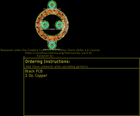
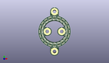
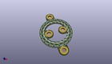

Contents
========

* [PROJ-SPAR-14967-STAN-01>LuMini 1 Inch](#proj-spar-14967-stan-01lumini-1-inch)
	* [Images](#images)
	* [Interactive BOM](#interactive-bom)
	* [OOMP Parts](#oomp-parts)
	* [Tags](#tags)
  
![][im]
# PROJ-SPAR-14967-STAN-01>LuMini 1 Inch

- ID: PROJ-SPAR-14967-STAN-01
- Hex ID: PRS14967
- Name: LuMini 1 Inch
- Description: 

## Images
  
  

|eagleImage|kicadPcb3dFront|kicadPcb3dBack|kicadPcb3d|
| :---: | :---: | :---: | :---: |
|||||

## Interactive BOM

- Interactive BOM page: [ibom.html](kicad/bom/ibom.html)

## OOMP Parts
  

|OOMP Parts|
| :---: |
|UNMATCHED-0603-X-UNMATCHED-01, C1, 22.733, 14.604999999999999, M130,C1, DNP, 0603, SparkFun-Capacitors, (0.895, 0.575), MR130|
|UNMATCHED-UNMATCHED-X-UNMATCHED-01, D1, 26.669999999999998, 21.59, 90,D1, APA102-2020, APA102-2020, SparkFun-LED, (1.05, 0.85), R90|
|UNMATCHED-UNMATCHED-X-UNMATCHED-01, D2, 26.085799999999995, 25.3238, 108,D2, APA102-2020, APA102-2020, SparkFun-LED, (1.027, 0.997), R108|
|UNMATCHED-UNMATCHED-X-UNMATCHED-01, D3, 24.3586, 28.676599999999997, 126,D3, APA102-2020, APA102-2020, SparkFun-LED, (0.959, 1.129), R126|
|UNMATCHED-UNMATCHED-X-UNMATCHED-01, D4, 21.691599999999998, 31.3436, 144,D4, APA102-2020, APA102-2020, SparkFun-LED, (0.854, 1.234), R144|
|UNMATCHED-UNMATCHED-X-UNMATCHED-01, D5, 18.3388, 33.0708, 162,D5, APA102-2020, APA102-2020, SparkFun-LED, (0.722, 1.302), R162|
|UNMATCHED-UNMATCHED-X-UNMATCHED-01, D6, 14.604999999999999, 33.654999999999994, 180,D6, APA102-2020, APA102-2020, SparkFun-LED, (0.575, 1.325), R180|
|UNMATCHED-UNMATCHED-X-UNMATCHED-01, D7, 10.8712, 33.0708, 198,D7, APA102-2020, APA102-2020, SparkFun-LED, (0.428, 1.302), R198|
|UNMATCHED-UNMATCHED-X-UNMATCHED-01, D8, 7.518399999999999, 31.3436, 216,D8, APA102-2020, APA102-2020, SparkFun-LED, (0.296, 1.234), R216|
|UNMATCHED-UNMATCHED-X-UNMATCHED-01, D9, 4.8514, 28.676599999999997, 234,D9, APA102-2020, APA102-2020, SparkFun-LED, (0.191, 1.129), R234|
|UNMATCHED-UNMATCHED-X-UNMATCHED-01, D10, 3.1241999999999996, 25.3238, 252,D10, APA102-2020, APA102-2020, SparkFun-LED, (0.123, 0.997), R252|
|UNMATCHED-UNMATCHED-X-UNMATCHED-01, D11, 2.54, 21.59, 270,D11, APA102-2020, APA102-2020, SparkFun-LED, (0.1, 0.85), R270|
|UNMATCHED-UNMATCHED-X-UNMATCHED-01, D12, 3.1241999999999996, 17.856199999999998, 288,D12, APA102-2020, APA102-2020, SparkFun-LED, (0.123, 0.703), R288|
|UNMATCHED-UNMATCHED-X-UNMATCHED-01, D13, 4.8514, 14.503399999999997, 306,D13, APA102-2020, APA102-2020, SparkFun-LED, (0.191, 0.571), R306|
|UNMATCHED-UNMATCHED-X-UNMATCHED-01, D14, 7.518399999999999, 11.8364, 324,D14, APA102-2020, APA102-2020, SparkFun-LED, (0.296, 0.466), R324|
|UNMATCHED-UNMATCHED-X-UNMATCHED-01, D15, 10.8712, 10.1092, 342,D15, APA102-2020, APA102-2020, SparkFun-LED, (0.428, 0.398), R342|
|UNMATCHED-UNMATCHED-X-UNMATCHED-01, D16, 14.604999999999999, 9.524999999999999, 0,D16, APA102-2020, APA102-2020, SparkFun-LED, (0.575, 0.375), R0|
|UNMATCHED-UNMATCHED-X-UNMATCHED-01, D17, 18.3388, 10.1092, 18,D17, APA102-2020, APA102-2020, SparkFun-LED, (0.722, 0.398), R18|
|UNMATCHED-UNMATCHED-X-UNMATCHED-01, D18, 21.691599999999998, 11.8364, 36,D18, APA102-2020, APA102-2020, SparkFun-LED, (0.854, 0.466), R36|
|UNMATCHED-UNMATCHED-X-UNMATCHED-01, D19, 24.3586, 14.503399999999997, 54,D19, APA102-2020, APA102-2020, SparkFun-LED, (0.959, 0.571), R54|
|UNMATCHED-UNMATCHED-X-UNMATCHED-01, D20, 26.085799999999995, 17.856199999999998, 72,D20, APA102-2020, APA102-2020, SparkFun-LED, (1.027, 0.703), R72|
|UNMATCHED-UNMATCHED-X-UNMATCHED-01, H1, 14.604999999999999, 39.37, 0,H1, STANDOFF_ELECTRICAL-NOTHERMALS, STANDOFF-ELECTRICAL-NOTHERMALS, SparkFun-Hardware, (0.575, 1.55), R0|
|UNMATCHED-UNMATCHED-X-UNMATCHED-01, H2, 8.254999999999999, 21.59, 0,H2, STANDOFF_ELECTRICAL-NOTHERMALS, STANDOFF-ELECTRICAL-NOTHERMALS, SparkFun-Hardware, (0.325, 0.85), R0|
|UNMATCHED-UNMATCHED-X-UNMATCHED-01, H3, 20.955, 21.59, 0,H3, STANDOFF_ELECTRICAL-NOTHERMALS, STANDOFF-ELECTRICAL-NOTHERMALS, SparkFun-Hardware, (0.825, 0.85), R0|
|UNMATCHED-UNMATCHED-X-UNMATCHED-01, H4, 14.5923, 3.8099999999999996, 0,H4, STANDOFF_ELECTRICAL-NOTHERMALS, STANDOFF-ELECTRICAL-NOTHERMALS, SparkFun-Hardware, (0.5745, 0.15), R0|

## Tags

- hexID: PRS14967
- oompType: PROJ
- oompSize: SPAR
- oompColor: 14967
- oompDesc: STAN
- oompIndex: 01
- oompName: LuMini 1 Inch
- sources: All source files from https://github.com/sparkfun/LuMini_1_Inch (source licence details in srcLicense.md)
- linkBuyPage: https://www.sparkfun.com/products/14967
- oompID: PROJ-SPAR-14967-STAN-01
- oompPart: UNMATCHED-0603-X-UNMATCHED-01, C1, 22.733, 14.604999999999999, M130
- oompPart: UNMATCHED-UNMATCHED-X-UNMATCHED-01, D1, 26.669999999999998, 21.59, 90
- oompPart: UNMATCHED-UNMATCHED-X-UNMATCHED-01, D2, 26.085799999999995, 25.3238, 108
- oompPart: UNMATCHED-UNMATCHED-X-UNMATCHED-01, D3, 24.3586, 28.676599999999997, 126
- oompPart: UNMATCHED-UNMATCHED-X-UNMATCHED-01, D4, 21.691599999999998, 31.3436, 144
- oompPart: UNMATCHED-UNMATCHED-X-UNMATCHED-01, D5, 18.3388, 33.0708, 162
- oompPart: UNMATCHED-UNMATCHED-X-UNMATCHED-01, D6, 14.604999999999999, 33.654999999999994, 180
- oompPart: UNMATCHED-UNMATCHED-X-UNMATCHED-01, D7, 10.8712, 33.0708, 198
- oompPart: UNMATCHED-UNMATCHED-X-UNMATCHED-01, D8, 7.518399999999999, 31.3436, 216
- oompPart: UNMATCHED-UNMATCHED-X-UNMATCHED-01, D9, 4.8514, 28.676599999999997, 234
- oompPart: UNMATCHED-UNMATCHED-X-UNMATCHED-01, D10, 3.1241999999999996, 25.3238, 252
- oompPart: UNMATCHED-UNMATCHED-X-UNMATCHED-01, D11, 2.54, 21.59, 270
- oompPart: UNMATCHED-UNMATCHED-X-UNMATCHED-01, D12, 3.1241999999999996, 17.856199999999998, 288
- oompPart: UNMATCHED-UNMATCHED-X-UNMATCHED-01, D13, 4.8514, 14.503399999999997, 306
- oompPart: UNMATCHED-UNMATCHED-X-UNMATCHED-01, D14, 7.518399999999999, 11.8364, 324
- oompPart: UNMATCHED-UNMATCHED-X-UNMATCHED-01, D15, 10.8712, 10.1092, 342
- oompPart: UNMATCHED-UNMATCHED-X-UNMATCHED-01, D16, 14.604999999999999, 9.524999999999999, 0
- oompPart: UNMATCHED-UNMATCHED-X-UNMATCHED-01, D17, 18.3388, 10.1092, 18
- oompPart: UNMATCHED-UNMATCHED-X-UNMATCHED-01, D18, 21.691599999999998, 11.8364, 36
- oompPart: UNMATCHED-UNMATCHED-X-UNMATCHED-01, D19, 24.3586, 14.503399999999997, 54
- oompPart: UNMATCHED-UNMATCHED-X-UNMATCHED-01, D20, 26.085799999999995, 17.856199999999998, 72
- oompPart: SKIP-UNMATCHED-X-UNMATCHED-01, FD1, 11.557, 5.968999999999999, 0
- oompPart: SKIP-UNMATCHED-X-UNMATCHED-01, FD2, 11.557, 5.968999999999999, M0
- oompPart: SKIP-UNMATCHED-X-UNMATCHED-01, FD3, 17.653, 37.211, 0
- oompPart: SKIP-UNMATCHED-X-UNMATCHED-01, FD4, 17.653, 37.211, M0
- oompPart: UNMATCHED-UNMATCHED-X-UNMATCHED-01, H1, 14.604999999999999, 39.37, 0
- oompPart: UNMATCHED-UNMATCHED-X-UNMATCHED-01, H2, 8.254999999999999, 21.59, 0
- oompPart: UNMATCHED-UNMATCHED-X-UNMATCHED-01, H3, 20.955, 21.59, 0
- oompPart: UNMATCHED-UNMATCHED-X-UNMATCHED-01, H4, 14.5923, 3.8099999999999996, 0
- oompPart: SKIP-UNMATCHED-X-UNMATCHED-01, J1, 26.441399999999998, 25.450799999999997, M252
- oompPart: SKIP-UNMATCHED-X-UNMATCHED-01, J2, 26.924, 21.6027, M270
- oompPart: SKIP-UNMATCHED-X-UNMATCHED-01, J4, 26.3525, 17.627599999999997, M108
- rawPart: C1, DNP, 0603, SparkFun-Capacitors, (0.895, 0.575), MR130
- rawPart: D1, APA102-2020, APA102-2020, SparkFun-LED, (1.05, 0.85), R90
- rawPart: D2, APA102-2020, APA102-2020, SparkFun-LED, (1.027, 0.997), R108
- rawPart: D3, APA102-2020, APA102-2020, SparkFun-LED, (0.959, 1.129), R126
- rawPart: D4, APA102-2020, APA102-2020, SparkFun-LED, (0.854, 1.234), R144
- rawPart: D5, APA102-2020, APA102-2020, SparkFun-LED, (0.722, 1.302), R162
- rawPart: D6, APA102-2020, APA102-2020, SparkFun-LED, (0.575, 1.325), R180
- rawPart: D7, APA102-2020, APA102-2020, SparkFun-LED, (0.428, 1.302), R198
- rawPart: D8, APA102-2020, APA102-2020, SparkFun-LED, (0.296, 1.234), R216
- rawPart: D9, APA102-2020, APA102-2020, SparkFun-LED, (0.191, 1.129), R234
- rawPart: D10, APA102-2020, APA102-2020, SparkFun-LED, (0.123, 0.997), R252
- rawPart: D11, APA102-2020, APA102-2020, SparkFun-LED, (0.1, 0.85), R270
- rawPart: D12, APA102-2020, APA102-2020, SparkFun-LED, (0.123, 0.703), R288
- rawPart: D13, APA102-2020, APA102-2020, SparkFun-LED, (0.191, 0.571), R306
- rawPart: D14, APA102-2020, APA102-2020, SparkFun-LED, (0.296, 0.466), R324
- rawPart: D15, APA102-2020, APA102-2020, SparkFun-LED, (0.428, 0.398), R342
- rawPart: D16, APA102-2020, APA102-2020, SparkFun-LED, (0.575, 0.375), R0
- rawPart: D17, APA102-2020, APA102-2020, SparkFun-LED, (0.722, 0.398), R18
- rawPart: D18, APA102-2020, APA102-2020, SparkFun-LED, (0.854, 0.466), R36
- rawPart: D19, APA102-2020, APA102-2020, SparkFun-LED, (0.959, 0.571), R54
- rawPart: D20, APA102-2020, APA102-2020, SparkFun-LED, (1.027, 0.703), R72
- rawPart: FD1, FIDUCIALUFIDUCIAL, FIDUCIAL-MICRO, SparkFun-Aesthetics, (0.455, 0.235), R0
- rawPart: FD2, FIDUCIALUFIDUCIAL, FIDUCIAL-MICRO, SparkFun-Aesthetics, (0.455, 0.235), MR0
- rawPart: FD3, FIDUCIALUFIDUCIAL, FIDUCIAL-MICRO, SparkFun-Aesthetics, (0.695, 1.465), R0
- rawPart: FD4, FIDUCIALUFIDUCIAL, FIDUCIAL-MICRO, SparkFun-Aesthetics, (0.695, 1.465), MR0
- rawPart: H1, STANDOFF_ELECTRICAL-NOTHERMALS, STANDOFF-ELECTRICAL-NOTHERMALS, SparkFun-Hardware, (0.575, 1.55), R0
- rawPart: H2, STANDOFF_ELECTRICAL-NOTHERMALS, STANDOFF-ELECTRICAL-NOTHERMALS, SparkFun-Hardware, (0.325, 0.85), R0
- rawPart: H3, STANDOFF_ELECTRICAL-NOTHERMALS, STANDOFF-ELECTRICAL-NOTHERMALS, SparkFun-Hardware, (0.825, 0.85), R0
- rawPart: H4, STANDOFF_ELECTRICAL-NOTHERMALS, STANDOFF-ELECTRICAL-NOTHERMALS, SparkFun-Hardware, (0.5745, 0.15), R0
- rawPart: J1, SOLDER_PAD_2, SOLDER_PAD_2, SparkFun-Connectors, (1.041, 1.002), MR252
- rawPart: J2, SOLDER_PAD_2, SOLDER_PAD_2, SparkFun-Connectors, (1.06, 0.8505), MR270
- rawPart: J4, SOLDER_PAD_2, SOLDER_PAD_2, SparkFun-Connectors, (1.0375, 0.694), MR108

[im]: kicadPcb3d_450.png
