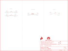

Contents
========

* [PRS14968 > Sparkfun](#prs14968--sparkfun)
	* [Schematic](#schematic)
	* [Interactive BOM](#interactive-bom)
	* [OOMP Parts](#oomp-parts)
	* [Images](#images)
	* [Tags](#tags)
  
![][im]
# PRS14968 > Sparkfun

- ID: PROJ-SPAR-14968-STAN-01
- Hex ID: PRS14968
- Name: Sparkfun
- Description: Sparkfun
- Long Link: [http://oom.lt/PROJ-SPAR-14968-STAN-01](http://oom.lt/PROJ-SPAR-14968-STAN-01)
- Short Link: [http://oom.lt/PRS14968](http://oom.lt/PRS14968)

## Schematic
  

## Interactive BOM

- Interactive BOM page: [ibom.html](https://htmlpreview.github.io/?https://github.com/oomlout/oomlout_OOMP_projects/blob/main/PROJ-SPAR-14968-STAN-01/kicad/bom/ibom.html)

## OOMP Parts
  

|OOMP Parts|
| :---: |
|LOGO9,UNMATCHED-UNMATCHED-X-UNMATCHED-01,FD1,FIDUCIALUFIDUCIAL,FIDUCIALUFIDUCIAL,FIDUCIAL-MICRO,Fiducial Alignment Points,,,,|
|S1,UNMATCHED-UNMATCHED-X-UNMATCHED-01,FD2,FIDUCIALUFIDUCIAL,FIDUCIALUFIDUCIAL,FIDUCIAL-MICRO,Fiducial Alignment Points,,,,|
|S2,UNMATCHED-UNMATCHED-X-UNMATCHED-01,FD3,FIDUCIALUFIDUCIAL,FIDUCIALUFIDUCIAL,FIDUCIAL-MICRO,Fiducial Alignment Points,,,,|
|S3,UNMATCHED-UNMATCHED-X-UNMATCHED-01,FD4,FIDUCIALUFIDUCIAL,FIDUCIALUFIDUCIAL,FIDUCIAL-MICRO,Fiducial Alignment Points,,,,|
|S4,UNMATCHED-UNMATCHED-X-UNMATCHED-01,FRAME1,FRAME-LETTER,FRAME-LETTER,CREATIVE_COMMONS,Schematic Frame - Letter,,,,|
|U$10,UNMATCHED-UNMATCHED-X-UNMATCHED-01,LOGO1,SFE_LOGO_FLAME.1_INCH,SFE_LOGO_FLAME.1_INCH,SFE_LOGO_FLAME_.1,SparkFun Flame Logo,,,,|
|U$11,UNMATCHED-UNMATCHED-X-UNMATCHED-01,LOGO2,OSHW-LOGOS,OSHW-LOGOS,OSHW-LOGO-S,Open-Source Hardware (OSHW) Logo,,,,|
|U$12,UNMATCHED-UNMATCHED-X-UNMATCHED-01,LOGO9,REVISION,REVISION,REVISION,Revision By Text,,,,|
|U$14,UNMATCHED-UNMATCHED-X-UNMATCHED-01,S1,MOMENTARY-SWITCH-SPST-SMD-12MM,MOMENTARY-SWITCH-SPST-SMD-12MM,TACTILE_SWITCH_SMD_12MM,Momentary Switch (Pushbutton) - SPST,SWCH-11967,,COM-12993,|
|U$15,UNMATCHED-UNMATCHED-X-UNMATCHED-01,S2,REED_SWITCH-PTH-INSULATED,REED_SWITCH-PTH-INSULATED,REED_SWITCH_PLASTIC,Reed Switch,SWCH-10467,,COM-10601,|
|U$16,UNMATCHED-UNMATCHED-X-UNMATCHED-01,S3,,SWITCH-SPDT-SMD-AYZ0202,SWITCH_DPDT_SMD_AYZ0202,Single Pole, Double Throw (SPDT) Switch,SWCH-08179,COM-00597,,|
|U$17,UNMATCHED-UNMATCHED-X-UNMATCHED-01,S4,MOMENTARY-SWITCH-SPST-SMD-12MM,MOMENTARY-SWITCH-SPST-SMD-12MM,TACTILE_SWITCH_SMD_12MM,Momentary Switch (Pushbutton) - SPST,SWCH-11967,,COM-12993,|
|U$19,UNMATCHED-UNMATCHED-X-UNMATCHED-01,U$10,GATOR,GATOR,GATOR,,,,,|

## Images
  
  

|kicadPcb3d|kicadPcb3dFront|kicadPcb3dBack|eagleImage|eagleSchemImage|
| :---: | :---: | :---: | :---: | :---: |
||||||

## Tags

- hexID: PRS14968
- oompType: PROJ
- oompSize: SPAR
- oompColor: 14968
- oompDesc: STAN
- oompIndex: 01
- oompName: gator control
- sources: All source files from https://github.com/sparkfun/gator_control (source licence details in srcLicense.md)
- linkBuyPage: https://www.sparkfun.com/products/14968
- oompID: PROJ-SPAR-14968-STAN-01
- oompParts: LOGO9,UNMATCHED-UNMATCHED-X-UNMATCHED-01
- oompParts: S1,UNMATCHED-UNMATCHED-X-UNMATCHED-01
- oompParts: S2,UNMATCHED-UNMATCHED-X-UNMATCHED-01
- oompParts: S3,UNMATCHED-UNMATCHED-X-UNMATCHED-01
- oompParts: S4,UNMATCHED-UNMATCHED-X-UNMATCHED-01
- oompParts: U$10,UNMATCHED-UNMATCHED-X-UNMATCHED-01
- oompParts: U$11,UNMATCHED-UNMATCHED-X-UNMATCHED-01
- oompParts: U$12,UNMATCHED-UNMATCHED-X-UNMATCHED-01
- oompParts: U$14,UNMATCHED-UNMATCHED-X-UNMATCHED-01
- oompParts: U$15,UNMATCHED-UNMATCHED-X-UNMATCHED-01
- oompParts: U$16,UNMATCHED-UNMATCHED-X-UNMATCHED-01
- oompParts: U$17,UNMATCHED-UNMATCHED-X-UNMATCHED-01
- oompParts: U$19,UNMATCHED-UNMATCHED-X-UNMATCHED-01
- rawParts: FD1,FIDUCIALUFIDUCIAL,FIDUCIALUFIDUCIAL,FIDUCIAL-MICRO,Fiducial Alignment Points,,,,
- rawParts: FD2,FIDUCIALUFIDUCIAL,FIDUCIALUFIDUCIAL,FIDUCIAL-MICRO,Fiducial Alignment Points,,,,
- rawParts: FD3,FIDUCIALUFIDUCIAL,FIDUCIALUFIDUCIAL,FIDUCIAL-MICRO,Fiducial Alignment Points,,,,
- rawParts: FD4,FIDUCIALUFIDUCIAL,FIDUCIALUFIDUCIAL,FIDUCIAL-MICRO,Fiducial Alignment Points,,,,
- rawParts: FRAME1,FRAME-LETTER,FRAME-LETTER,CREATIVE_COMMONS,Schematic Frame - Letter,,,,
- rawParts: LOGO1,SFE_LOGO_FLAME.1_INCH,SFE_LOGO_FLAME.1_INCH,SFE_LOGO_FLAME_.1,SparkFun Flame Logo,,,,
- rawParts: LOGO2,OSHW-LOGOS,OSHW-LOGOS,OSHW-LOGO-S,Open-Source Hardware (OSHW) Logo,,,,
- rawParts: LOGO9,REVISION,REVISION,REVISION,Revision By Text,,,,
- rawParts: S1,MOMENTARY-SWITCH-SPST-SMD-12MM,MOMENTARY-SWITCH-SPST-SMD-12MM,TACTILE_SWITCH_SMD_12MM,Momentary Switch (Pushbutton) - SPST,SWCH-11967,,COM-12993,
- rawParts: S2,REED_SWITCH-PTH-INSULATED,REED_SWITCH-PTH-INSULATED,REED_SWITCH_PLASTIC,Reed Switch,SWCH-10467,,COM-10601,
- rawParts: S3,,SWITCH-SPDT-SMD-AYZ0202,SWITCH_DPDT_SMD_AYZ0202,Single Pole, Double Throw (SPDT) Switch,SWCH-08179,COM-00597,,
- rawParts: S4,MOMENTARY-SWITCH-SPST-SMD-12MM,MOMENTARY-SWITCH-SPST-SMD-12MM,TACTILE_SWITCH_SMD_12MM,Momentary Switch (Pushbutton) - SPST,SWCH-11967,,COM-12993,
- rawParts: U$10,GATOR,GATOR,GATOR,,,,,
- rawParts: U$11,GATOR,GATOR,GATOR,,,,,
- rawParts: U$12,GATOR,GATOR,GATOR,,,,,
- rawParts: U$14,GATOR,GATOR,GATOR,,,,,
- rawParts: U$15,GATOR,GATOR,GATOR,,,,,
- rawParts: U$16,GATOR,GATOR,GATOR,,,,,
- rawParts: U$17,GATOR,GATOR,GATOR,,,,,
- rawParts: U$19,GATOR,GATOR,GATOR,,,,,

[im]: kicadPcb3d_450.png
